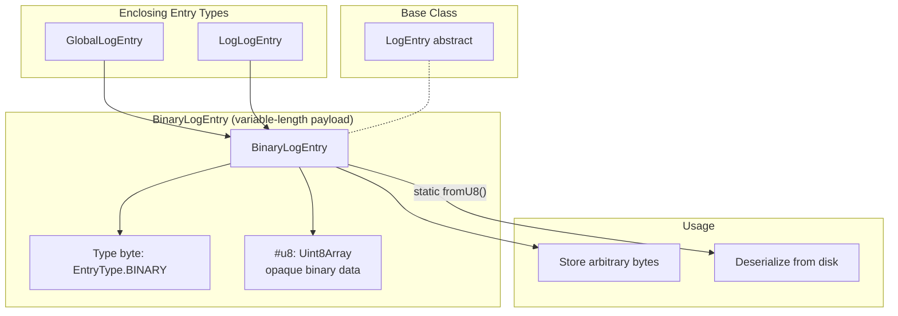
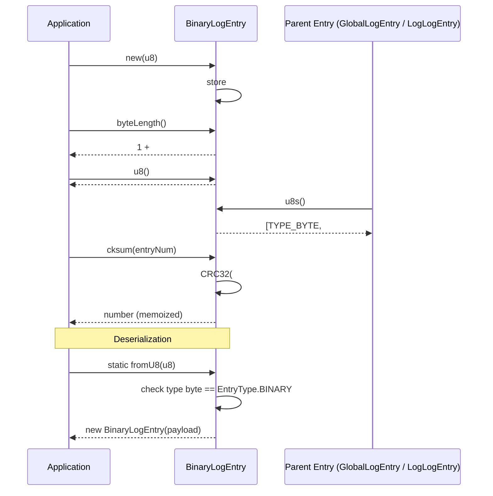

# BinaryLogEntry Specification

**Module: Entry Types**

## 1. Overview

`BinaryLogEntry` is the simplest payload entry: it wraps an opaque `Uint8Array` as the log entry content. It prepends a single type byte (`EntryType.BINARY`) and computes a CRC32 checksum over the type byte, entry number, and raw binary data. It is used for arbitrary binary data that does not need structured JSON serialization.

## 2. Component Specifications (TypeScript Declarations)

```typescript
class BinaryLogEntry extends LogEntry {
  // ── Private fields ─────────────────────────────────────────
  #u8: Uint8Array               // Raw binary payload

  // ── Constructor ────────────────────────────────────────────
  constructor(u8: Uint8Array)

  // ── Methods ────────────────────────────────────────────────
  byteLength(): number          // 1 (type byte) + #u8.byteLength
  cksum(entryNum: number): number  // CRC32(#u8, CRC32(TYPE_BYTE, entryNum)); memoized
  u8(): Uint8Array              // Returns the raw payload (#u8)
  u8s(): Uint8Array[]           // [TYPE_BYTE, #u8]
  static fromU8(u8: Uint8Array): BinaryLogEntry  // Deserialize from raw bytes
}
```

**Binary layout** (variable length):

| Offset | Size | Field            |
|--------|------|------------------|
| 0      | 1    | EntryType.BINARY (5) |
| 1      | var  | Binary payload |

## 3. System Architecture (Mermaid graph TB)



## 4. Detailed Data Flow (Mermaid sequenceDiagram)



## 5. Visualization (self-contained D3 HTML)

```html
<!DOCTYPE html>
<html>
<head>
<meta charset="utf-8">
<title>BinaryLogEntry Animation</title>
<style>
  body { font-family: system-ui, sans-serif; background: #0d1117; display: flex; flex-direction: column; align-items: center; padding: 2rem; }
  #container { max-width: 960px; width: 100%; }
  svg { display: block; margin: 0 auto; background: #161b22; border-radius: 8px; box-shadow: 0 4px 24px rgba(0,0,0,0.4); }
  .controls { display: flex; gap: 12px; align-items: center; margin-top: 1rem; flex-wrap: wrap; justify-content: center; }
  button { background: #238636; color: #fff; border: none; border-radius: 6px; padding: 8px 20px; font-size: 14px; cursor: pointer; }
  button:hover { background: #2ea043; }
  button:disabled { opacity: 0.5; cursor: not-allowed; }
  label { color: #c9d1d9; font-size: 13px; }
  input[type="range"] { width: 240px; accent-color: #238636; }
  .stats { color: #8b949e; font-size: 12px; margin-top: 0.5rem; display: flex; gap: 1rem; flex-wrap: wrap; justify-content: center; }
  .byte-legend { display: flex; gap: 2px; justify-content: center; flex-wrap: wrap; margin: 0.5rem 0; }
  .legend-item { display: flex; align-items: center; gap: 4px; font-size: 11px; color: #c9d1d9; }
  .legend-swatch { width: 14px; height: 14px; border-radius: 3px; border: 1px solid #30363d; }
  #kf-total { color: #58a6ff; font-weight: 600; }
</style>
</head>
<body>
<div id="container">
  <svg id="vis" width="900" height="400"></svg>
  <div class="controls">
    <button id="play-pause" data-testid="play-pause">▶ Play</button>
    <button id="reset">↺ Reset</button>
    <label>Keyframe <span id="kf-current">0</span>/<span id="kf-total">0</span>
      <input type="range" id="kf-slider" min="0" max="0" value="0" step="1">
    </label>
  </div>
  <div class="stats">
    <span>State: <span id="state-value">idle</span></span>
    <span>Phase: <span id="phase-value">—</span></span>
  </div>
  <div class="byte-legend" id="legend"></div>
</div>

<script src="https://d3js.org/d3.v7.min.js"></script>
<script>
(function() {
  const ANIMATION_DURATION_MS = 800;
  const ANIMATION_KEYFRAMES = [
    { label: "Construct with Uint8Array", phase: "init", desc: "new BinaryLogEntry(u8) stores raw payload" },
    { label: "u8() returns payload", phase: "access", desc: "Direct reference to #u8, no copy" },
    { label: "u8s() = [TYPE_BYTE, payload]", phase: "serialize", desc: "TYPE_BYTE (0x05) followed by raw bytes" },
    { label: "cksum(entryNum)", phase: "checksum", desc: "CRC32(payload, CRC32(TYPE_BYTE, entryNum))" },
    { label: "byteLength() = 1 + payload.len", phase: "measure", desc: "Returns type byte + payload size" },
    { label: "Deserialize: fromU8()", phase: "read", desc: "Static factory strips type byte, wraps remainder" },
  ];
  const ANIMATION_VERIFICATION = [
    "u8() returns the same reference as constructor argument",
    "byteLength() must equal 1 + u8().byteLength",
    "cksum() computes CRC32(#u8, CRC32(TYPE_BYTE, entryNum)) and memoizes",
    "u8s() returns exactly [TYPE_BYTE, #u8] as a 2-element array",
    "fromU8() throws if entryType does not match EntryType.BINARY",
    "fromU8() correctly strips first byte and wraps the rest",
    "Round-trip: u8 → u8s() → fromU8() → u8() matches original",
    "TYPE_BYTE must be Uint8Array([EntryType.BINARY]) i.e. [5]",
  ];

  const LEGEND = [
    { label: "Type byte (1B)", color: "#f781bf" },
    { label: "Binary payload (variable)", color: "#cab2d6" },
  ];

  const legendEl = document.getElementById("legend");
  LEGEND.forEach(l => {
    const item = document.createElement("span");
    item.className = "legend-item";
    item.innerHTML = `<span class="legend-swatch" style="background:${l.color}"></span>${l.label}`;
    legendEl.appendChild(item);
  });

  const TOTAL_KF = ANIMATION_KEYFRAMES.length;
  document.getElementById("kf-total").textContent = TOTAL_KF;

  const width = 900, height = 400;
  const svg = d3.select("#vis");

  const byteCells = [
    ...Array(1).fill().map((_,i) => ({color:"#f781bf", label:"T", offset:i})),
    ...Array(16).fill().map((_,i) => ({color:"#cab2d6", label:"B", offset:1+i})),
  ];

  const cellW = 22, cellH = 22, gap = 1;
  const totalW = byteCells.length * (cellW + gap);
  const startX = (width - totalW) / 2;
  const infoY = 60;

  svg.append("text")
    .attr("x", width / 2).attr("y", 30)
    .attr("text-anchor", "middle").attr("fill", "#58a6ff")
    .attr("font-size", "18").attr("font-weight", "bold")
    .text("BinaryLogEntry Binary Layout");

  svg.append("text")
    .attr("id", "phase-label")
    .attr("x", width / 2).attr("y", infoY)
    .attr("text-anchor", "middle").attr("fill", "#8b949e").attr("font-size", "13")
    .text("Click Play to animate");

  svg.append("text")
    .attr("id", "desc-label")
    .attr("x", width / 2).attr("y", infoY + 20)
    .attr("text-anchor", "middle").attr("fill", "#c9d1d9").attr("font-size", "12")
    .text("");

  const byteRects = svg.selectAll("rect.byte")
    .data(byteCells).join("rect").attr("class", "byte")
    .attr("x", (d,i) => startX + i*(cellW+gap)).attr("y", infoY+40)
    .attr("width", cellW).attr("height", cellH).attr("rx",3).attr("ry",3)
    .attr("fill", d => d.color).attr("stroke","#30363d").attr("stroke-width",1)
    .attr("opacity", 0.15);

  const byteLabels = svg.selectAll("text.bytelen")
    .data(byteCells).join("text").attr("class","bytelen")
    .attr("x", (d,i) => startX + i*(cellW+gap) + cellW/2)
    .attr("y", infoY+40+cellH/2+4)
    .attr("text-anchor","middle").attr("fill","#fff").attr("font-size","9")
    .attr("opacity",0)
    .text((d,i) => i);

  svg.selectAll("text.offset")
    .data(byteCells).join("text").attr("class","offset")
    .attr("x", (d,i) => startX + i*(cellW+gap) + cellW/2)
    .attr("y", infoY+40+cellH+14)
    .attr("text-anchor","middle").attr("fill","#484f58").attr("font-size","9")
    .text((d,i) => i);

  const timelineY = height - 60;
  svg.append("text").attr("x",width/2).attr("y",timelineY-10)
    .attr("text-anchor","middle").attr("fill","#8b949e").attr("font-size","11")
    .text("Keyframe Timeline");

  const kfBarW = Math.min(700, width-80), kfBarX = (width - kfBarW)/2;
  svg.append("rect").attr("x",kfBarX).attr("y",timelineY)
    .attr("width",kfBarW).attr("height",6).attr("rx",3).attr("fill","#30363d");
  svg.append("rect").attr("id","timeline-progress")
    .attr("x",kfBarX).attr("y",timelineY)
    .attr("width",0).attr("height",6).attr("rx",3).attr("fill","#238636");

  const kfSpacing = kfBarW / (TOTAL_KF-1||1);
  svg.selectAll("circle.kf-marker")
    .data(d3.range(TOTAL_KF)).join("circle").attr("class","kf-marker")
    .attr("cx", (d,i) => kfBarX + i*kfSpacing).attr("cy",timelineY+3)
    .attr("r",5).attr("fill","#484f58").attr("stroke","#30363d");
  svg.append("text").attr("id","kf-label")
    .attr("x",width/2).attr("y",timelineY+30)
    .attr("text-anchor","middle").attr("fill","#c9d1d9").attr("font-size","11").text("");

  let currentKF=0, playing=false, timer=null;
  const state = { keyframe:0, phase:"idle" };

  function jumpToKeyframe(idx) {
    if (idx<0) idx=0;
    if (idx>=TOTAL_KF) { idx=TOTAL_KF-1; if(playing) stop(); }
    currentKF=idx;
    const kf=ANIMATION_KEYFRAMES[idx];
    if(!kf) return;
    document.getElementById("kf-current").textContent=idx;
    document.getElementById("kf-slider").value=idx;
    document.getElementById("phase-value").textContent=kf.phase;
    document.getElementById("state-value").textContent=idx>=TOTAL_KF-1?"complete":(playing?"playing":"paused");
    svg.select("#phase-label").text(kf.label);
    svg.select("#desc-label").text(kf.desc);

    let hs=0, he=byteCells.length;
    if(idx===0 || idx===1 || idx===4){
      hs=0; he=byteCells.length;
    } else if(idx===2 || idx===5){
      hs=0; he=1;
    } else {
      hs=0; he=byteCells.length;
    }

    byteRects.attr("opacity",(d,i)=>i>=hs&&i<he?1:0.15)
      .attr("stroke",(d,i)=>i>=hs&&i<he?"#58a6ff":"#30363d")
      .attr("stroke-width",(d,i)=>i>=hs&&i<he?2:1);
    byteLabels.attr("opacity",(d,i)=>i>=hs&&i<he?1:0);

    const progress = idx/(TOTAL_KF-1);
    svg.select("#timeline-progress").attr("width",progress*kfBarW);
    svg.selectAll("circle.kf-marker")
      .attr("fill",(d,i)=>i<=idx?"#238636":"#484f58")
      .attr("r",(d,i)=>i===idx?7:5);
    svg.select("#kf-label").text(`${idx}: ${kf.label}`);
    state.keyframe=idx; state.phase=kf.phase;
  }

  function resetAnimation() {
    stop(); jumpToKeyframe(0);
    document.getElementById("state-value").textContent="idle";
    document.getElementById("phase-value").textContent="—";
    svg.select("#phase-label").text("Click Play to animate");
    svg.select("#desc-label").text("");
    byteRects.attr("opacity",0.15).attr("stroke","#30363d").attr("stroke-width",1);
    byteLabels.attr("opacity",0);
    svg.select("#timeline-progress").attr("width",0);
    svg.selectAll("circle.kf-marker").attr("fill","#484f58").attr("r",5);
    svg.select("#kf-label").text("");
    state.keyframe=0; state.phase="idle";
  }

  function stop() {
    playing=false; if(timer){clearTimeout(timer);timer=null;}
    document.getElementById("play-pause").textContent="▶ Play";
    document.getElementById("state-value").textContent="paused";
  }

  function play() {
    if(currentKF>=TOTAL_KF-1) resetAnimation();
    playing=true;
    document.getElementById("play-pause").textContent="⏸ Pause";
    document.getElementById("state-value").textContent="playing";
    advance();
  }

  function advance() {
    if(!playing) return;
    if(currentKF>=TOTAL_KF-1){stop();return;}
    jumpToKeyframe(currentKF+1);
    timer=setTimeout(advance, ANIMATION_DURATION_MS/TOTAL_KF);
  }

  function togglePlay() { playing?stop():play(); }
  function getAnimationState() { return {...state, isPlaying:playing, totalKeyframes:TOTAL_KF}; }

  document.getElementById("play-pause").addEventListener("click", togglePlay);
  document.getElementById("reset").addEventListener("click", resetAnimation);
  document.getElementById("kf-slider").addEventListener("input", function() {
    if(playing) stop();
    jumpToKeyframe(parseInt(this.value));
  });

  jumpToKeyframe(0);
  window.ANIMATION_DURATION_MS=ANIMATION_DURATION_MS;
  window.ANIMATION_KEYFRAMES=ANIMATION_KEYFRAMES;
  window.ANIMATION_VERIFICATION=ANIMATION_VERIFICATION;
  window.jumpToKeyframe=jumpToKeyframe;
  window.resetAnimation=resetAnimation;
  window.getAnimationState=getAnimationState;
})();
</script>
</body>
</html>
```

## 6. Testing Requirements

| # | Test | Expected |
|---|------|----------|
| 1 | Construct with `Uint8Array` | `#u8` stored |
| 2 | `u8()` returns same reference as constructor argument | Same reference |
| 3 | `byteLength()` equals `1 + #u8.byteLength` | Integer sum |
| 4 | `u8s()` returns `[TYPE_BYTE, #u8]` | 2-element array |
| 5 | `u8s()[0]` is `Uint8Array([EntryType.BINARY])` | `[5]` |
| 6 | `cksum()` computes `CRC32(#u8, CRC32(TYPE_BYTE, entryNum))` and memoizes | `cksumNum` set after first call |
| 7 | `fromU8()` throws on mismatched type byte | `Error` thrown |
| 8 | `fromU8()` correctly parses valid input | Payload matches |
| 9 | Round-trip: `new(u8)` → `u8s()` → concat → `fromU8()` → `u8()` | Original bytes |

---

## 7. Source-Test Cross-References

### Test Coverage

| Test Spec | Path |
|---|---|
| BinaryLogEntry.test.spec.md | `source/src/lib/entry/BinaryLogEntry.test.spec.md` |
