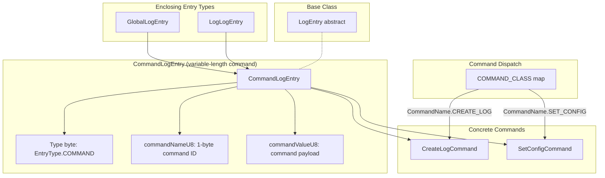
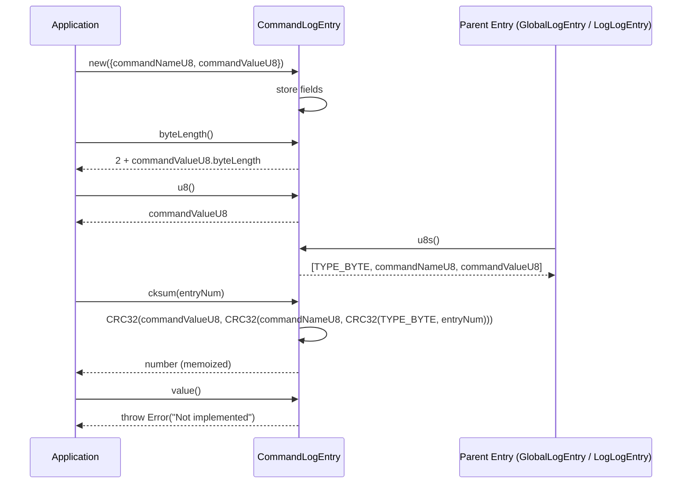

# CommandLogEntry Specification

**Module: Entry Types**

## 1. Overview

`CommandLogEntry` encodes a command as a typed log entry. It carries a 1-byte command name (interpreted as `CommandName` enum) followed by a variable-length command value. The CRC32 checksum chains through the type byte, entry number, command name, and command value. Currently `value()` throws `Not implemented` — subclasses like `CreateLogCommand` and `SetConfigCommand` provide the actual interpretation.

## 2. Component Specifications (TypeScript Declarations)

```typescript
class CommandLogEntry extends LogEntry {
  // ── Public fields ──────────────────────────────────────────
  commandNameU8: Uint8Array     // 1-byte command identifier (CommandName enum)
  commandValueU8: Uint8Array    // Variable-length command payload

  // ── Constructor ────────────────────────────────────────────
  constructor({ commandNameU8, commandValueU8 }: {
    commandNameU8: Uint8Array
    commandValueU8: Uint8Array
  })

  // ── Methods ────────────────────────────────────────────────
  byteLength(): number          // 2 (type byte + command name) + commandValueU8.byteLength
  cksum(entryNum: number): number  // CRC32(commandValueU8, CRC32(commandNameU8, CRC32(TYPE_BYTE, entryNum)))
  u8(): Uint8Array              // Returns commandValueU8
  u8s(): Uint8Array[]           // [TYPE_BYTE, commandNameU8, commandValueU8]
  value(): never                // Throws Error("Not implemented")
}
```

**Binary layout** (variable length):

| Offset | Size | Field               |
|--------|------|---------------------|
| 0      | 1    | EntryType.COMMAND (4) |
| 1      | 1    | commandName (CommandName enum as Uint8) |
| 2      | var  | commandValue payload |

**CommandName enum:**

| Value | Name        |
|-------|-------------|
| 0     | CREATE_LOG  |
| 1     | SET_CONFIG  |

## 3. System Architecture (Mermaid graph TB)



## 4. Detailed Data Flow (Mermaid sequenceDiagram)



## 5. Visualization (self-contained D3 HTML)

```html
<!DOCTYPE html>
<html>
<head>
<meta charset="utf-8">
<title>CommandLogEntry Animation</title>
<style>
  body { font-family: system-ui, sans-serif; background: #0d1117; display: flex; flex-direction: column; align-items: center; padding: 2rem; }
  #container { max-width: 960px; width: 100%; }
  svg { display: block; margin: 0 auto; background: #161b22; border-radius: 8px; box-shadow: 0 4px 24px rgba(0,0,0,0.4); }
  .controls { display: flex; gap: 12px; align-items: center; margin-top: 1rem; flex-wrap: wrap; justify-content: center; }
  button { background: #238636; color: #fff; border: none; border-radius: 6px; padding: 8px 20px; font-size: 14px; cursor: pointer; }
  button:hover { background: #2ea043; }
  button:disabled { opacity: 0.5; cursor: not-allowed; }
  label { color: #c9d1d9; font-size: 13px; }
  input[type="range"] { width: 240px; accent-color: #238636; }
  .stats { color: #8b949e; font-size: 12px; margin-top: 0.5rem; display: flex; gap: 1rem; flex-wrap: wrap; justify-content: center; }
  .byte-legend { display: flex; gap: 2px; justify-content: center; flex-wrap: wrap; margin: 0.5rem 0; }
  .legend-item { display: flex; align-items: center; gap: 4px; font-size: 11px; color: #c9d1d9; }
  .legend-swatch { width: 14px; height: 14px; border-radius: 3px; border: 1px solid #30363d; }
  #kf-total { color: #58a6ff; font-weight: 600; }
</style>
</head>
<body>
<div id="container">
  <svg id="vis" width="900" height="400"></svg>
  <div class="controls">
    <button id="play-pause" data-testid="play-pause">Play</button>
    <button id="reset">Reset</button>
    <label>Keyframe <span id="kf-current">0</span>/<span id="kf-total">0</span>
      <input type="range" id="kf-slider" min="0" max="0" value="0" step="1">
    </label>
  </div>
  <div class="stats">
    <span>State: <span id="state-value">idle</span></span>
    <span>Phase: <span id="phase-value">--</span></span>
  </div>
  <div class="byte-legend" id="legend"></div>
</div>

<script src="https://d3js.org/d3.v7.min.js"></script>
<script>
(function() {
  var ANIMATION_DURATION_MS = 900;
  var ANIMATION_KEYFRAMES = [
    { label: "Construct with name + value", phase: "init", desc: "new CommandLogEntry({commandNameU8, commandValueU8})" },
    { label: "byteLength() = 2 + value.len", phase: "measure", desc: "2 fixed bytes (type + name) plus value payload" },
    { label: "u8s() = [TYPE, name, value]", phase: "serialize", desc: "Three-part serialization: type byte, command name, command value" },
    { label: "cksum(entryNum)", phase: "checksum", desc: "CRC32 chained through type, entryNum, name, value" },
    { label: "u8() returns value payload", phase: "access", desc: "Returns commandValueU8 directly" },
    { label: "value() throws", phase: "error", desc: "Base class method throws Error('Not implemented')" },
  ];
  var ANIMATION_VERIFICATION = [
    "byteLength() must equal 2 + commandValueU8.byteLength",
    "u8s() has exactly 3 elements: [TYPE_BYTE, commandNameU8, commandValueU8]",
    "u8s()[0] is Uint8Array([EntryType.COMMAND]) i.e. [4]",
    "u8s()[1] is commandNameU8 (1 byte, CommandName enum value)",
    "u8s()[2] is commandValueU8 (variable-length payload)",
    "cksum() chains CRC32 through type, entryNum, name, value and memoizes",
    "u8() returns the same reference as stored commandValueU8",
    "value() throws Error('Not implemented')",
    "cksum() is memoized (cksumNum set after first call)",
  ];

  var LEGEND = [
    { label: "Type (1B)", color: "#f781bf" },
    { label: "Command Name (1B)", color: "#a6cee3" },
    { label: "Command Value (variable)", color: "#cab2d6" },
  ];

  var legendEl = document.getElementById("legend");
  LEGEND.forEach(function(l) {
    var item = document.createElement("span");
    item.className = "legend-item";
    item.innerHTML = '<span class="legend-swatch" style="background:' + l.color + '"></span>' + l.label;
    legendEl.appendChild(item);
  });

  var TOTAL_KF = ANIMATION_KEYFRAMES.length;
  document.getElementById("kf-total").textContent = TOTAL_KF;

  var width = 900, height = 400;
  var svg = d3.select("#vis");

  var byteCells = [];
  for (var i = 0; i < 1; i++) byteCells.push({ color: "#f781bf", label: "T", offset: i });
  for (var i = 0; i < 1; i++) byteCells.push({ color: "#a6cee3", label: "N", offset: 1 + i });
  for (var i = 0; i < 14; i++) byteCells.push({ color: "#cab2d6", label: "V", offset: 2 + i });

  var cellW = 22, cellH = 22, gap = 1;
  var totalW = byteCells.length * (cellW + gap);
  var startX = (width - totalW) / 2;
  var infoY = 60;

  svg.append("text")
    .attr("x", width / 2).attr("y", 30)
    .attr("text-anchor", "middle").attr("fill", "#58a6ff")
    .attr("font-size", "18").attr("font-weight", "bold")
    .text("CommandLogEntry Binary Layout");

  svg.append("text")
    .attr("id", "phase-label")
    .attr("x", width / 2).attr("y", infoY)
    .attr("text-anchor", "middle").attr("fill", "#8b949e").attr("font-size", "13")
    .text("Click Play to animate");

  svg.append("text")
    .attr("id", "desc-label")
    .attr("x", width / 2).attr("y", infoY + 20)
    .attr("text-anchor", "middle").attr("fill", "#c9d1d9").attr("font-size", "12")
    .text("");

  var byteRects = svg.selectAll("rect.byte")
    .data(byteCells).join("rect").attr("class", "byte")
    .attr("x", function(d,i) { return startX + i*(cellW+gap); }).attr("y", infoY+40)
    .attr("width", cellW).attr("height", cellH).attr("rx",3).attr("ry",3)
    .attr("fill", function(d) { return d.color; }).attr("stroke","#30363d").attr("stroke-width",1)
    .attr("opacity", 0.15);

  var byteLabels = svg.selectAll("text.bytelen")
    .data(byteCells).join("text").attr("class","bytelen")
    .attr("x", function(d,i) { return startX + i*(cellW+gap) + cellW/2; })
    .attr("y", infoY+40+cellH/2+4)
    .attr("text-anchor","middle").attr("fill","#fff").attr("font-size","9")
    .attr("opacity",0)
    .text(function(d,i) { return i; });

  svg.selectAll("text.offset")
    .data(byteCells).join("text").attr("class","offset")
    .attr("x", function(d,i) { return startX + i*(cellW+gap) + cellW/2; })
    .attr("y", infoY+40+cellH+14)
    .attr("text-anchor","middle").attr("fill","#484f58").attr("font-size","9")
    .text(function(d,i) { return i; });

  var timelineY = height - 60;
  svg.append("text").attr("x",width/2).attr("y",timelineY-10)
    .attr("text-anchor","middle").attr("fill","#8b949e").attr("font-size","11")
    .text("Keyframe Timeline");

  var kfBarW = Math.min(700, width-80), kfBarX = (width - kfBarW)/2;
  svg.append("rect").attr("x",kfBarX).attr("y",timelineY)
    .attr("width",kfBarW).attr("height",6).attr("rx",3).attr("fill","#30363d");
  svg.append("rect").attr("id","timeline-progress")
    .attr("x",kfBarX).attr("y",timelineY)
    .attr("width",0).attr("height",6).attr("rx",3).attr("fill","#238636");

  var kfSpacing = kfBarW / (TOTAL_KF-1||1);
  svg.selectAll("circle.kf-marker")
    .data(d3.range(TOTAL_KF)).join("circle").attr("class","kf-marker")
    .attr("cx", function(d,i) { return kfBarX + i*kfSpacing; }).attr("cy",timelineY+3)
    .attr("r",5).attr("fill","#484f58").attr("stroke","#30363d");
  svg.append("text").attr("id","kf-label")
    .attr("x",width/2).attr("y",timelineY+30)
    .attr("text-anchor","middle").attr("fill","#c9d1d9").attr("font-size","11").text("");

  var currentKF=0, playing=false, timer=null;
  var state = { keyframe:0, phase:"idle" };

  function jumpToKeyframe(idx) {
    if (idx<0) idx=0;
    if (idx>=TOTAL_KF) { idx=TOTAL_KF-1; if(playing) stop(); }
    currentKF=idx;
    var kf=ANIMATION_KEYFRAMES[idx];
    if(!kf) return;
    document.getElementById("kf-current").textContent=idx;
    document.getElementById("kf-slider").value=idx;
    document.getElementById("phase-value").textContent=kf.phase;
    document.getElementById("state-value").textContent=idx>=TOTAL_KF-1?"complete":(playing?"playing":"paused");
    svg.select("#phase-label").text(kf.label);
    svg.select("#desc-label").text(kf.desc);

    var hs=0, he=byteCells.length;
    if(idx===0 || idx===1 || idx===4){
      hs=0; he=byteCells.length;
    } else if(idx===2){
      hs=0; he=3;
    } else if(idx===5){
      hs=2; he=byteCells.length;
    } else { hs=0; he=byteCells.length; }

    byteRects.attr("opacity",function(d,i){return i>=hs&&i<he?1:0.15;})
      .attr("stroke",function(d,i){return i>=hs&&i<he?"#58a6ff":"#30363d";})
      .attr("stroke-width",function(d,i){return i>=hs&&i<he?2:1;});
    byteLabels.attr("opacity",function(d,i){return i>=hs&&i<he?1:0;});

    var progress = idx/(TOTAL_KF-1);
    svg.select("#timeline-progress").attr("width",progress*kfBarW);
    svg.selectAll("circle.kf-marker")
      .attr("fill",function(d,i){return i<=idx?"#238636":"#484f58";})
      .attr("r",function(d,i){return i===idx?7:5;});
    svg.select("#kf-label").text(idx + ': ' + kf.label);
    state.keyframe=idx; state.phase=kf.phase;
  }

  function resetAnimation() {
    stop(); jumpToKeyframe(0);
    document.getElementById("state-value").textContent="idle";
    document.getElementById("phase-value").textContent="--";
    svg.select("#phase-label").text("Click Play to animate");
    svg.select("#desc-label").text("");
    byteRects.attr("opacity",0.15).attr("stroke","#30363d").attr("stroke-width",1);
    byteLabels.attr("opacity",0);
    svg.select("#timeline-progress").attr("width",0);
    svg.selectAll("circle.kf-marker").attr("fill","#484f58").attr("r",5);
    svg.select("#kf-label").text("");
    state.keyframe=0; state.phase="idle";
  }

  function stop() {
    playing=false; if(timer){clearTimeout(timer);timer=null;}
    document.getElementById("play-pause").textContent="Play";
    document.getElementById("state-value").textContent="paused";
  }

  function play() {
    if(currentKF>=TOTAL_KF-1) resetAnimation();
    playing=true;
    document.getElementById("play-pause").textContent="Pause";
    document.getElementById("state-value").textContent="playing";
    advance();
  }

  function advance() {
    if(!playing) return;
    if(currentKF>=TOTAL_KF-1){stop();return;}
    jumpToKeyframe(currentKF+1);
    timer=setTimeout(advance, ANIMATION_DURATION_MS/TOTAL_KF);
  }

  function togglePlay() { playing?stop():play(); }
  function getAnimationState() { return { keyframe: state.keyframe, phase: state.phase, isPlaying: playing, totalKeyframes: TOTAL_KF }; }

  document.getElementById("play-pause").addEventListener("click", togglePlay);
  document.getElementById("reset").addEventListener("click", resetAnimation);
  document.getElementById("kf-slider").addEventListener("input", function() {
    if(playing) stop();
    jumpToKeyframe(parseInt(this.value));
  });

  jumpToKeyframe(0);
  window.ANIMATION_DURATION_MS=ANIMATION_DURATION_MS;
  window.ANIMATION_KEYFRAMES=ANIMATION_KEYFRAMES;
  window.ANIMATION_VERIFICATION=ANIMATION_VERIFICATION;
  window.jumpToKeyframe=jumpToKeyframe;
  window.resetAnimation=resetAnimation;
  window.getAnimationState=getAnimationState;
})();
</script>
</body>
</html>
```

## 6. Testing Requirements

| # | Test | Expected |
|---|------|----------|
| 1 | Construct with `commandNameU8` and `commandValueU8` | Fields stored correctly |
| 2 | `byteLength()` equals `2 + commandValueU8.byteLength` | Integer sum |
| 3 | `u8()` returns `commandValueU8` reference | Same reference |
| 4 | `u8s()` returns exactly 3 elements | Array length = 3 |
| 5 | `u8s()[0]` is `TYPE_BYTE` = `Uint8Array([EntryType.COMMAND])` | `[4]` |
| 6 | `u8s()[1]` is `commandNameU8` | Same reference |
| 7 | `u8s()[2]` is `commandValueU8` | Same reference |
| 8 | `cksum()` computes CRC32 chained through type, entryNum, name, value and memoizes | `cksumNum` set after first call |
| 9 | `cksum()` formula: `CRC32(value, CRC32(name, CRC32(TYPE_BYTE, entryNum)))` | Correct chaining |
| 10 | `value()` throws `Error("Not implemented")` | Error thrown |

---

## 7. Source-Test Cross-References

### Test Coverage

| Test Spec | Path |
|---|---|
| CommandLogEntry.test.spec.md | `source/src/lib/entry/CommandLogEntry.test.spec.md` |
