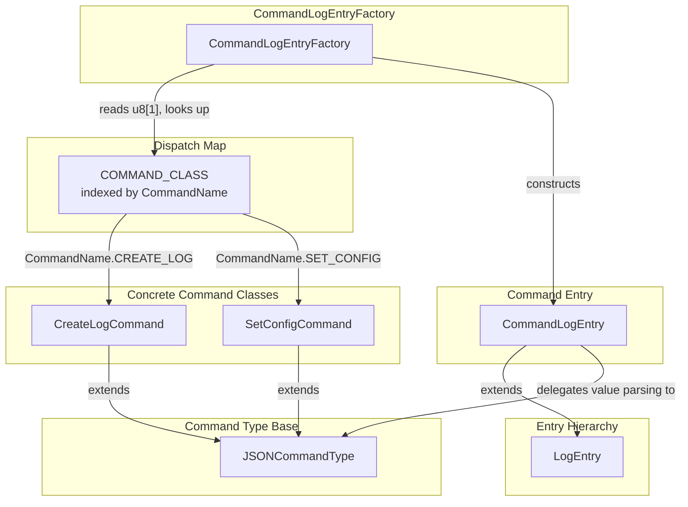
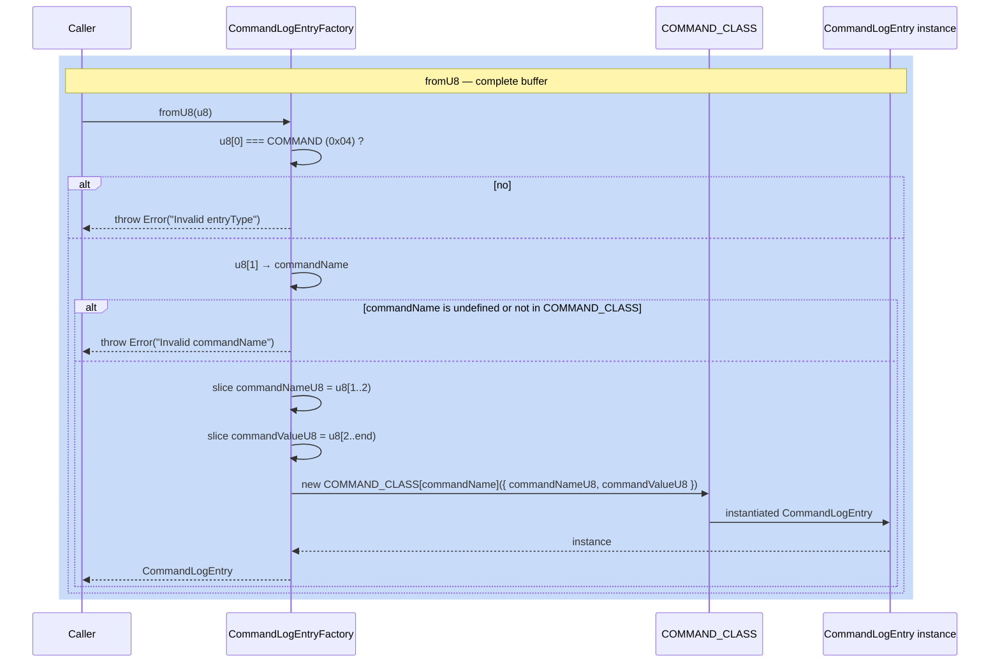

# CommandLogEntryFactory — Command Entry Deserialiser

**Module: Entry Types**

## Overview

`CommandLogEntryFactory` deserialises **command entries** from raw `Uint8Array` buffers. A command entry is a minimal binary format:

```
┌────┬──────────────┬───────────────────┐
│ Ty │ CommandName  │ CommandValue      │
│0x04│ 1 byte       │ variable bytes    │
└────┴──────────────┴───────────────────┘
```

| Offset | Size | Field | Description |
|---|---|---|---|
| 0 | 1 | `entryType` | Must be `EntryType.COMMAND` (0x04) |
| 1 | 1 | `commandName` | Enum value identifying the command (`CommandName`) |
| 2 | N | `commandValue` | Command-specific payload bytes |

The factory uses the `COMMAND_CLASS` lookup table (indexed by numeric `commandName`) to instantiate the correct subclass. Each command class extends `JSONCommandType` and receives `{ commandNameU8, commandValueU8 }` constructor args.

**Registered commands:**

| `commandName` value | `CommandName` enum | Class |
|---|---|---|
| `0x00` | `CREATE_LOG` | `CreateLogCommand` |
| `0x01` | `SET_CONFIG` | `SetConfigCommand` |

---

## Component Specifications

### Full TypeScript Declaration

```typescript
import { COMMAND_CLASS, EntryType } from "../globals"
import CommandLogEntry from "./command-log-entry"

export default class CommandLogEntryFactory {
    static fromU8(u8: Uint8Array): CommandLogEntry
}
```

### Method Details

| Method | Signature | Behaviour |
|---|---|---|
| `fromU8` | `(u8: Uint8Array) => CommandLogEntry` | Validates `u8[0] === COMMAND`, reads `u8[1]` as `commandName`, looks up `COMMAND_CLASS[commandName]`, instantiates with `{ commandNameU8, commandValueU8 }`. Throws on invalid type or unknown command name. |

### `CommandLogEntry` Constructor Contract

```typescript
new CommandLogEntry({ commandNameU8: Uint8Array, commandValueU8: Uint8Array })
```

| Parameter | Source | Description |
|---|---|---|
| `commandNameU8` | `u8[1..2)` → `new Uint8Array(u8.buffer, 1, 1)` | Single byte identifying the command |
| `commandValueU8` | `u8[2..end)` → `new Uint8Array(u8.buffer, 2, u8.byteLength - 2)` | Remaining bytes as command payload |

---

## System Architecture



### Dispatch Logic

```
u8[0] → EntryType.COMMAND (0x04)
    ↓
u8[1] → commandName (0x00 = CREATE_LOG, 0x01 = SET_CONFIG)
    ↓
COMMAND_CLASS[commandName]:
    ↓
┌─ 0x00 → new CreateLogCommand({ commandNameU8, commandValueU8 })
└─ 0x01 → new SetConfigCommand({ commandNameU8, commandValueU8 })
```

---

## Detailed Data Flow



### Buffer Slicing Detail

Given a buffer `u8` containing a command entry, the slices are:

```
u8 = [0x04, 0x00, 0x7b, 0x22, ... , 0x7d]
      ↑      ↑      ↑
      |      |      └── commandValueU8 = u8[2..end)
      |      └───────── commandNameU8 = u8[1..2)  (1 byte)
      └──────────────── entryType = u8[0]
```

The `commandNameU8` is intentionally sliced as a 1-byte `Uint8Array` (not a scalar) so that it can be used directly in checksum computation (`crc32(this.commandNameU8, ...)`).

---

## Visualization

```html
<!DOCTYPE html>
<html>
<head>
  <meta charset="utf-8" />
  <style>
    body { margin: 0; background: #0d1117; font-family: system-ui, sans-serif; }
    #container { width: 100%; height: 100vh; display: flex; flex-direction: column; align-items: center; justify-content: center; }
    svg { display: block; }
    .controls { margin-top: 20px; display: flex; gap: 12px; align-items: center; flex-wrap: wrap; justify-content: center; }
    .controls button { background: #21262d; border: 1px solid #30363d; color: #c9d1d9; padding: 6px 16px; border-radius: 6px; cursor: pointer; font-size: 14px; }
    .controls button:hover { background: #30363d; }
    .controls button[data-testid="play-pause"] { background: #1f6feb; border-color: #1f6feb; color: #fff; }
    .info { color: #8b949e; font-size: 13px; }
    .node rect { stroke-width: 2; }
    .factory-node rect { fill: #1f6feb; stroke: #58a6ff; }
    .dispatcher-node rect { fill: #d29922; stroke: #e3b341; }
    .command-node rect { fill: #238636; stroke: #3fb950; }
    .base-node rect { fill: #9e6a03; stroke: #d29922; }
    .abstract-node rect { fill: #21262d; stroke: #484f58; }
    text { fill: #c9d1d9; font-size: 13px; text-anchor: middle; dominant-baseline: central; }
  </style>
</head>
<body>
<div id="container">
  <svg id="svg" width="800" height="500"></svg>
  <div class="controls">
    <button data-testid="play-pause" id="playPauseBtn">&#9646;&#9646;</button>
    <button id="prevBtn">&#9664; Prev</button>
    <button id="nextBtn">Next &#9654;</button>
    <button id="resetBtn">Reset</button>
    <span class="info">Keyframe <span id="kf-current">0</span> / <span id="kf-total">0</span></span>
    <span id="stateDisplay" class="info" style="margin-left:8px;">&#8203;</span>
  </div>
</div>
<script>
(function() {
  const nodes = [
    { id: 'CommandLogEntryFactory', cls: 'factory-node',  tier: 0 },
    { id: 'COMMAND_CLASS map',      cls: 'dispatcher-node', tier: 1 },
    { id: 'CommandLogEntry',        cls: 'command-node',  tier: 2 },
    { id: 'CreateLogCommand',       cls: 'command-node',  tier: 2 },
    { id: 'SetConfigCommand',       cls: 'command-node',  tier: 2 },
    { id: 'JSONCommandType',        cls: 'base-node',     tier: 3 },
    { id: 'LogEntry',               cls: 'abstract-node', tier: 3 },
  ];
  const edges = [
    { src: 'CommandLogEntryFactory', dst: 'COMMAND_CLASS map' },
    { src: 'COMMAND_CLASS map',      dst: 'CommandLogEntry' },
    { src: 'COMMAND_CLASS map',      dst: 'CreateLogCommand' },
    { src: 'COMMAND_CLASS map',      dst: 'SetConfigCommand' },
    { src: 'CreateLogCommand',       dst: 'JSONCommandType' },
    { src: 'SetConfigCommand',       dst: 'JSONCommandType' },
    { src: 'CommandLogEntry',        dst: 'LogEntry' },
  ];

  const W = 170, H = 42, GX = 200, GY = 100, topMargin = 40;
  const tiers = {};
  nodes.forEach(n => { if (!tiers[n.tier]) tiers[n.tier] = []; tiers[n.tier].push(n); });
  const tierY = {};
  let yAcc = topMargin;
  Object.keys(tiers).sort((a,b)=>a-b).forEach(t => { tierY[t] = yAcc; yAcc += GY; });

  const svg = d3.select('#svg');
  const g = svg.append('g');

  const nodeMap = {};
  nodes.forEach(n => {
    const tn = tiers[n.tier];
    const idx = tn.indexOf(n);
    const totalW = tn.length * GX;
    const startX = (800 - totalW) / 2;
    n._x = startX + idx * GX;
    n._y = tierY[n.tier];
    nodeMap[n.id] = n;
  });

  edges.forEach(e => {
    const s = nodeMap[e.src], d = nodeMap[e.dst];
    if (!s || !d) return;
    g.append('line')
      .attr('class', 'cls-edge')
      .attr('x1', s._x + W/2).attr('y1', s._y + H)
      .attr('x2', d._x + W/2).attr('y2', d._y)
      .attr('stroke', '#484f58').attr('stroke-width', 1.5);
  });

  nodes.forEach(n => {
    const nodeG = g.append('g')
      .attr('id', 'node-'+n.id.replace(/\s+/g, ''))
      .attr('class', 'cls-node ' + n.cls);
    nodeG.append('rect')
      .attr('x', n._x).attr('y', n._y)
      .attr('width', W).attr('height', H).attr('rx', 8);
    nodeG.append('text')
      .attr('class', 'cls-label')
      .attr('x', n._x + W/2).attr('y', n._y + H/2)
      .text(n.id);
  });

  const keyframes = [];
  keyframes.push(() => {
    d3.selectAll('.cls-node, .cls-label').attr('opacity', 0.2);
    d3.selectAll('.cls-edge').attr('opacity', 0.06);
  });
  keyframes.push(() => {
    d3.selectAll('.cls-node, .cls-label').attr('opacity', 0.15);
    d3.selectAll('.cls-edge').attr('opacity', 0.04);
    d3.select('#node-CommandLogEntryFactory').attr('opacity', 1);
    d3.select('#node-CommandLogEntryFactory text').attr('opacity', 1);
  });
  keyframes.push(() => {
    d3.selectAll('.cls-node, .cls-label').attr('opacity', 0.15);
    d3.selectAll('.cls-edge').attr('opacity', 0.04);
    ['CommandLogEntryFactory','COMMAND_CLASSmap','CommandLogEntry'].forEach(id => {
      d3.select('#node-'+id.replace(/\s+/g, '')).attr('opacity', 1);
      d3.select('#node-'+id.replace(/\s+/g, '')+' text').attr('opacity', 1);
    });
  });
  keyframes.push(() => {
    d3.selectAll('.cls-node, .cls-label').attr('opacity', 0.15);
    d3.selectAll('.cls-edge').attr('opacity', 0.04);
    ['CommandLogEntryFactory','COMMAND_CLASSmap','CreateLogCommand','SetConfigCommand','CommandLogEntry'].forEach(id => {
      d3.select('#node-'+id.replace(/\s+/g, '')).attr('opacity', 1);
      d3.select('#node-'+id.replace(/\s+/g, '')+' text').attr('opacity', 1);
    });
  });
  keyframes.push(() => {
    d3.selectAll('.cls-node, .cls-label').attr('opacity', 0.15);
    d3.selectAll('.cls-edge').attr('opacity', 0.04);
    nodes.forEach(n => {
      d3.select('#node-'+n.id.replace(/\s+/g, '')).attr('opacity', 1);
      d3.select('#node-'+n.id.replace(/\s+/g, '')+' text').attr('opacity', 1);
    });
  });
  keyframes.push(() => {
    d3.selectAll('.cls-node').attr('opacity', 1);
    d3.selectAll('.cls-label').attr('opacity', 1);
    d3.selectAll('.cls-edge').attr('opacity', 0.3);
  });
  window.ANIMATION_KEYFRAMES = keyframes;

  let currentKF = 0, playing = false, interval = null;
  const totalKF = keyframes.length;
  document.getElementById('kf-total').textContent = totalKF;

  function applyKF(idx) {
    currentKF = Math.max(0, Math.min(totalKF - 1, idx));
    keyframes[currentKF]();
    document.getElementById('kf-current').textContent = currentKF;
    const st = document.getElementById('stateDisplay');
    st.innerHTML = currentKF === 0 ? '&#9679; dimmed' :
                   currentKF === totalKF-1 ? '&#9679; full' :
                   '&#9679; step ' + currentKF;
  }

  window.jumpToKeyframe = function(idx) { applyKF(idx); };
  window.getAnimationState = function() {
    return { currentKeyframe: currentKF, totalKeyframes: totalKF, playing: playing };
  };
  window.resetAnimation = function() {
    if (interval) { clearInterval(interval); interval = null; }
    playing = false;
    document.getElementById('playPauseBtn').innerHTML = '&#9654;';
    applyKF(0);
  };
  window.ANIMATION_DURATION_MS = totalKF * 800;
  window.ANIMATION_VERIFICATION = function() {
    const failures = [];
    if (typeof window.ANIMATION_KEYFRAMES === 'undefined' || !Array.isArray(window.ANIMATION_KEYFRAMES)) failures.push('ANIMATION_KEYFRAMES missing');
    if (typeof window.ANIMATION_DURATION_MS === 'undefined') failures.push('ANIMATION_DURATION_MS missing');
    if (typeof window.ANIMATION_VERIFICATION !== 'function') failures.push('ANIMATION_VERIFICATION missing');
    if (typeof window.jumpToKeyframe !== 'function') failures.push('jumpToKeyframe missing');
    if (typeof window.resetAnimation !== 'function') failures.push('resetAnimation missing');
    if (typeof window.getAnimationState !== 'function') failures.push('getAnimationState missing');
    const pp = document.querySelector('[data-testid="play-pause"]');
    if (!pp) failures.push('[data-testid="play-pause"] missing');
    if (!document.getElementById('kf-total')) failures.push('#kf-total missing');
    return { ok: failures.length === 0, failures };
  };

  document.getElementById('playPauseBtn').addEventListener('click', function() {
    if (playing) {
      clearInterval(interval); interval = null;
      playing = false;
      this.innerHTML = '&#9654;';
    } else {
      playing = true;
      this.innerHTML = '&#9646;&#9646;';
      interval = setInterval(() => {
        if (currentKF >= totalKF - 1) {
          clearInterval(interval); interval = null;
          playing = false;
          document.getElementById('playPauseBtn').innerHTML = '&#9654;';
          return;
        }
        applyKF(currentKF + 1);
      }, 800);
    }
  });
  document.getElementById('prevBtn').addEventListener('click', () => applyKF(currentKF - 1));
  document.getElementById('nextBtn').addEventListener('click', () => applyKF(currentKF + 1));
  document.getElementById('resetBtn').addEventListener('click', window.resetAnimation);

  applyKF(0);
  window.ANIMATION_VERIFICATION_RESULT = window.ANIMATION_VERIFICATION();
})();
</script>
</body>
</html>
```

---

## Testing Requirements

### Unit Tests — `fromU8`

| # | Test | Expected Outcome |
|---|---|---|
| 1 | `CommandLogEntryFactory.fromU8(buffer with entryType !== COMMAND)` | Throws `Error("Invalid entryType: ...")` |
| 2 | `CommandLogEntryFactory.fromU8(buffer with COMMAND type and valid CREATE_LOG command)` | Returns `CommandLogEntry` with `commandNameU8 = [0x00]` |
| 3 | `CommandLogEntryFactory.fromU8(buffer with COMMAND type and valid SET_CONFIG command)` | Returns `CommandLogEntry` with `commandNameU8 = [0x01]` |
| 4 | `CommandLogEntryFactory.fromU8(buffer with unknown commandName e.g. 0xFF)` | Throws `Error("Invalid commandName: 255")` |
| 5 | `CommandLogEntryFactory.fromU8(buffer with commandName undefined — single byte)` | Throws `Error("Invalid commandName: undefined")` |
| 6 | `CommandLogEntryFactory.fromU8(empty buffer)` | Throws `Error("Invalid entryType: undefined")` (before commandName is checked) |

### Command Dispatch Tests

| # | Test | Expected Outcome |
|---|---|---|
| 1 | `commandName = 0x00` dispatches to `CreateLogCommand` | `result instanceof CreateLogCommand` is `true` |
| 2 | `commandName = 0x01` dispatches to `SetConfigCommand` | `result instanceof SetConfigCommand` is `true` |
| 3 | `COMMAND_CLASS` map contains exactly 2 entries | `Object.keys(COMMAND_CLASS).length === 2` |
| 4 | Each command class sets its own `commandNameU8` when not provided in args | Constructor fills default byte from `COMMAND_NAME_BYTE` constant |

### Serialisation Round-Trip Tests

| # | Test | Expected Outcome |
|---|---|---|
| 1 | `CommandLogEntryFactory.fromU8(commandEntry.u8s().flat())` | Produces equivalent entry with same `commandNameU8` and `commandValueU8` |
| 2 | `entry.byteLength() === 2 + commandValueU8.byteLength` | Entry type byte + command name byte + payload |
| 3 | `entry.cksum(entryNum)` produces the same CRC as `crc32(commandValueU8, crc32(commandNameU8, crc32([0x04], entryNum)))` | Checksum is deterministic and verifiable |

### Contract Tests

| # | Test | Rationale |
|---|---|---|
| 1 | `result instanceof CommandLogEntry` | All returned entries are `CommandLogEntry` or subclass |
| 2 | `result instanceof LogEntry` | `CommandLogEntry` extends `LogEntry` |
| 3 | `result.commandNameU8.byteLength === 1` | Command name is always a single byte |
| 4 | `result.u8().byteLength === result.commandValueU8.byteLength` | `u8()` returns only the value portion (not the full serialisation — `u8s()` is the complete serialisation) |

### Edge Cases

| # | Scenario | Assertion |
|---|---|---|
| 1 | `commandNameU8` and `commandValueU8` are views into the original buffer | No defensive copy is made — mutations to the original buffer would affect the entry (caller must clone if needed) |
| 2 | Empty command payload (`commandValueU8.byteLength === 0`) | Valid; e.g. a command with no arguments |
| 3 | Very large command payload (up to `MAX_ENTRY_SIZE - 2`) | Valid — the entry type and command name account for 2 bytes of the total entry size |
| 4 | `COMMAND_CLASS[commandName]` returns a class that throws during construction | The error propagates up through `CommandLogEntryFactory.fromU8` to the caller |
| 5 | `u8` is a view (`u8.byteOffset !== 0`) of a larger `ArrayBuffer` | Buffer slicing uses `u8.byteOffset + N`, which correctly handles views |

---

## 7. Source-Test Cross-References

### Test Coverage

| Test Spec | Path |
|---|---|
| CommandLogEntryFactory.test.spec.md | `source/src/lib/entry/CommandLogEntryFactory.test.spec.md` |
