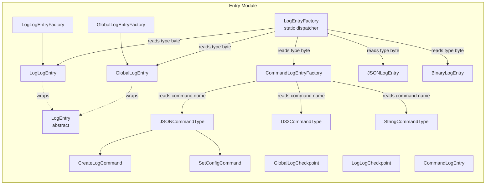
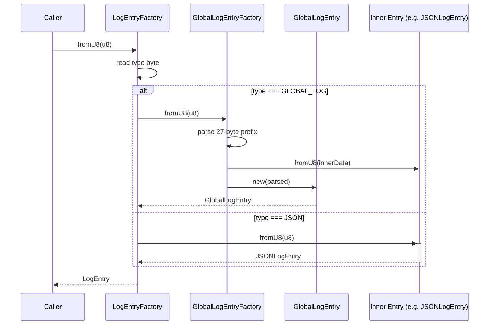

# Entry Module — EntryModule.spec.md

## 1. Overview

The **Entry Module** defines the complete entry type hierarchy for the logsrd append-only log system. It is a **leaf module** with zero internal dependencies on other sub-modules; it only imports from `src/lib/globals.ts` for shared constants and enums. Every persisted record on disk is serialized/deserialized through one of these entry classes.

**Dependencies:** (none) — depends only on `globals`
**Lifecycle stages:** Static factory dispatch → Instance construction → Serialization (`u8`/`u8s`) → Checksum verification → Deserialization (`fromU8`/`fromPartialU8`)

## 2. Component Specifications

| Component | Role | Access Path |
|---|---|---|
| `LogEntry` (abstract) | Base entry class with serialization + checksum interface | `./log-entry.ts` |
| `LogEntryFactory` | Top-level dispatcher — reads type byte, routes to concrete factory | `./log-entry-factory.ts` |
| `GlobalLogEntry` | Wraps any entry with a global-log prefix (logId, entryNum, CRC) | `./global-log-entry.ts` |
| `GlobalLogEntryFactory` | Parses `GlobalLogEntry` from binary (full + partial) | `./global-log-entry-factory.ts` |
| `LogLogEntry` | Wraps an entry with a log-log prefix (entryNum, CRC) | `./log-log-entry.ts` |
| `LogLogEntryFactory` | Parses `LogLogEntry` from binary (full + partial) | `./log-log-entry-factory.ts` |
| `GlobalLogCheckpoint` | Checkpoint entry embedded in the global hot log | `./global-log-checkpoint.ts` |
| `LogLogCheckpoint` | Checkpoint entry embedded in a log-log file | `./log-log-checkpoint.ts` |
| `CommandLogEntry` | Command entry with typed name+value payload | `./command-log-entry.ts` |
| `CommandLogEntryFactory` | Parses `CommandLogEntry` — dispatches to concrete command type | `./command-log-entry-factory.ts` |
| `JSONLogEntry` | Entry holding a JSON string payload | `./json-log-entry.ts` |
| `BinaryLogEntry` | Entry holding an opaque binary payload | `./binary-log-entry.ts` |
| `CreateLogCommand` | CREATE_LOG command (extends JSONCommandType) | `./command/create-log-command.ts` |
| `SetConfigCommand` | SET_CONFIG command (extends JSONCommandType) | `./command/set-config-command.ts` |
| `JSONCommandType` | Command with JSON-serialized value | `./command/command-type/json-command-type.ts` |
| `U32CommandType` | Command with a u32 value | `./command/command-type/u32-command-type.ts` |
| `StringCommandType` | Command with a string value | `./command/command-type/string-command-type.ts` |

## 3. System Architecture



## 4. Detailed Data Flow



## 5. Visualization

```html
<!DOCTYPE html>
<html>
<head>
<meta charset="utf-8">
<style>
  body { font-family: monospace; background: #1e1e2e; color: #cdd6f4; margin: 0; }
  #vis { width: 960px; height: 540px; position: relative; }
  .controls { display: flex; gap: 8px; padding: 8px; background: #181825; align-items: center; }
  .controls button { background: #45475a; color: #cdd6f4; border: none; padding: 4px 12px; cursor: pointer; }
  .controls button:hover { background: #585b70; }
  #kf-current, #kf-total { color: #a6adc8; font-size: 12px; min-width: 20px; text-align: center; }
  #kf-total { min-width: 40px; }
  #frame-label { color: #89b4fa; font-size: 14px; margin-left: auto; }
  .node { position: absolute; border: 2px solid #89b4fa; border-radius: 6px; padding: 8px 12px;
           background: #313244; font-size: 11px; text-align: center; transition: all 0.3s; }
  .node.active { border-color: #a6e3a1; background: #45475a; box-shadow: 0 0 12px #a6e3a180; }
  .edge { position: absolute; height: 2px; background: #585b70; transform-origin: 0 0; }
  .edge.active { background: #a6e3a1; box-shadow: 0 0 6px #a6e3a1; }
  .badge { font-size: 9px; color: #6c7086; margin-top: 2px; }
</style>
</head>
<body>
<div class="controls">
  <button id="play-pause" data-testid="play-pause">⏸</button>
  <span id="kf-current">0</span><span>/</span><span id="kf-total">5</span>
  <input type="range" id="seek" min="0" max="5" value="0" style="flex:1">
  <span id="frame-label">LogEntryFactory dispatch</span>
</div>
<div id="vis"></div>
<script>
(function(){
  const ANIMATION_DURATION_MS = 8000;
  const ANIMATION_KEYFRAMES = [
    { label: "LogEntryFactory dispatch", active: ["LEF"], edges: [] },
    { label: "read type byte → GLOBAL_LOG", active: ["LEF","GLEF"], edges: ["LEF-GLEF"] },
    { label: "parse 27-byte prefix", active: ["GLEF"], edges: [] },
    { label: "deserialize inner entry", active: ["GLEF","SubE"], edges: ["GLEF-SubE"] },
    { label: "construct GlobalLogEntry", active: ["GLE"], edges: ["GLEF-GLE"] },
  ];
  const ANIMATION_VERIFICATION = {
    kfCount: ANIMATION_KEYFRAMES.length,
    frameLabelEl: "frame-label",
    playPauseEl: "play-pause",
    seekEl: "seek",
    kfCurrentEl: "kf-current",
    kfTotalEl: "kf-total",
    expectedLabels: ANIMATION_KEYFRAMES.map(k => k.label)
  };

  const vis = document.getElementById('vis');
  const nodes = {};
  const nodePositions = {
    LEF: [120, 80], GLEF: [340, 80], GLE: [560, 80],
    SubE: [340, 200], CLE: [120, 200], JLE: [120, 320], BLE: [120, 440]
  };

  Object.entries(nodePositions).forEach(([id, [x, y]]) => {
    const el = document.createElement('div');
    el.className = 'node';
    el.id = 'n-' + id;
    el.style.left = x + 'px';
    el.style.top = y + 'px';
    el.innerHTML = `<strong>${id}</strong><div class="badge">entry-type</div>`;
    vis.appendChild(el);
    nodes[id] = el;
  });

  const edges = [];
  const edgeDefs = [
    ['LEF', 'GLEF'], ['GLEF', 'SubE'], ['GLEF', 'GLE'],
    ['LEF', 'CLE'], ['LEF', 'JLE'], ['LEF', 'BLE']
  ];
  edgeDefs.forEach(([from, to]) => {
    const fx = nodePositions[from][0] + 40, fy = nodePositions[from][1] + 25;
    const tx = nodePositions[to][0], ty = nodePositions[to][1] + 25;
    const dx = tx - fx, dy = ty - fy;
    const len = Math.sqrt(dx*dx + dy*dy);
    const el = document.createElement('div');
    el.className = 'edge';
    el.id = 'e-' + from + '-' + to;
    el.style.left = fx + 'px';
    el.style.top = fy + 'px';
    el.style.width = len + 'px';
    el.style.transform = 'rotate(' + (Math.atan2(dy, dx) * 180 / Math.PI) + 'deg)';
    vis.appendChild(el);
    edges.push({ el, from, to });
  });

  let currentKf = 0, playing = true, intervalId;

  function jumpToKeyframe(idx) {
    currentKf = Math.max(0, Math.min(idx, ANIMATION_KEYFRAMES.length - 1));
    const kf = ANIMATION_KEYFRAMES[currentKf];
    Object.keys(nodes).forEach(id => nodes[id].classList.toggle('active', kf.active.includes(id)));
    edges.forEach(e => e.el.classList.toggle('active', kf.edges.includes(e.from + '-' + e.to)));
    document.getElementById('frame-label').textContent = kf.label;
    document.getElementById('kf-current').textContent = currentKf;
    document.getElementById('seek').value = currentKf;
  }

  function resetAnimation() { jumpToKeyframe(0); }

  function getAnimationState() { return { currentKf, playing, total: ANIMATION_KEYFRAMES.length }; }

  function togglePlay() {
    playing = !playing;
    document.getElementById('play-pause').textContent = playing ? '⏸' : '▶';
    if (playing) {
      intervalId = setInterval(() => {
        const next = (currentKf + 1) % ANIMATION_KEYFRAMES.length;
        jumpToKeyframe(next);
      }, ANIMATION_DURATION_MS / ANIMATION_KEYFRAMES.length);
    } else {
      clearInterval(intervalId);
    }
  }

  document.getElementById('play-pause').addEventListener('click', togglePlay);
  document.getElementById('seek').addEventListener('input', function() {
    jumpToKeyframe(parseInt(this.value));
  });

  document.getElementById('kf-total').textContent = ANIMATION_KEYFRAMES.length - 1;
  jumpToKeyframe(0);
  intervalId = setInterval(() => {
    const next = (currentKf + 1) % ANIMATION_KEYFRAMES.length;
    jumpToKeyframe(next);
  }, ANIMATION_DURATION_MS / ANIMATION_KEYFRAMES.length);

  // Expose for verification
  window.__ANIMATION = { ANIMATION_KEYFRAMES, ANIMATION_DURATION_MS, ANIMATION_VERIFICATION,
    jumpToKeyframe, resetAnimation, getAnimationState };
})();
</script>
</body>
</html>
```

## 6. Testing Requirements

| Method / Constructor | Unit test | Validates |
|---|---|---|
| `GlobalLogEntry.constructor()` | `global-log-entry.test.ts` | Prefix bytes, CRC default null, entry wrapper |
| `GlobalLogEntry.u8()` | same | Binary serialization of full prefix + inner |
| `GlobalLogEntry.u8s()` | same | Two-buffer layout |
| `GlobalLogEntry.byteLength()` | same | Correct length calculation |
| `GlobalLogEntry.cksum()` | same | CRC matches expected |
| `GlobalLogEntry.verify()` | same | CRC integrity check |
| `GlobalLogEntry.key()` | same | Composite key string |
| `LogLogEntry.*` | `log-log-entry.test.ts` | Mirror of GlobalLogEntry with 11-byte prefix |
| `GlobalLogCheckpoint.*` | `global-log-checkpoint.test.ts` | 9-byte checkpoint serialization + CRC |
| `LogLogCheckpoint.*` | `log-log-checkpoint.test.ts` | 13-byte checkpoint serialization + lastConfigOffset |
| `JSONLogEntry.constructor()` | `json-log-entry.test.ts` | From string, from Uint8Array |
| `JSONLogEntry.str()` | same | Decoded JSON string |
| `JSONLogEntry.cksum()` | same | CRC over type+data+entryNum |
| `JSONLogEntry.fromU8()` | same | Complete round-trip |
| `BinaryLogEntry.*` | `binary-log-entry.test.ts` | Constructor, checksum, round-trip |
| `CommandLogEntry.*` | `command-log-entry.test.ts` | Base command serialization |
| `CreateLogCommand.*` | `create-log-command.test.ts` | Command name byte, JSON value |
| `SetConfigCommand.*` | `set-config-command.test.ts` | Command name byte, JSON value |
| `JSONCommandType.value()` | `json-command-type.test.ts` | JSON parse |
| `JSONCommandType.setValue()` | same | JSON serialize |
| `U32CommandType.value()` | `u32-command-type.test.ts` | u32 read (aligned) |
| `U32CommandType.setValue()` | same | u32 write |
| `StringCommandType.value()` | `string-command-type.test.ts` | Text decode |
| `LogEntryFactory.fromU8()` | `log-entry-factory.test.ts` | Type-byte dispatch to correct factory |
| `LogEntryFactory.fromPartialU8()` | same | Partial parse with needBytes |
| `GlobalLogEntryFactory.fromU8()` | `global-log-entry-factory.test.ts` | Full parse, argument extraction |
| `GlobalLogEntryFactory.fromPartialU8()` | same | Partial parse |
| `GlobalLogEntryFactory.entryLengthFromU8()` | same | Entry length from bytes 21-22 |
| `GlobalLogEntryFactory.globalLogEntryArgsFromU8()` | same | All fields from 27-byte prefix |
| `LogLogEntryFactory.fromU8()` | `log-log-entry-factory.test.ts` | Full parse |
| `LogLogEntryFactory.fromPartialU8()` | same | Partial parse |
| `LogLogEntryFactory.entryLengthFromU8()` | same | Entry length from bytes 5-6 |
| `CommandLogEntryFactory.fromU8()` | `command-log-entry-factory.test.ts` | Command name dispatch |

## 7. Source-Test Cross-References

| Source file | Test spec |
|---|---|
| `src/lib/entry/log-entry.ts` | (abstract — tested via subclasses) |
| `src/lib/entry/global-log-entry.ts` | `src/lib/entry/global-log-entry.test.ts` |
| `src/lib/entry/log-log-entry.ts` | `src/lib/entry/log-log-entry.test.ts` |
| `src/lib/entry/global-log-checkpoint.ts` | `src/lib/entry/global-log-checkpoint.test.ts` |
| `src/lib/entry/log-log-checkpoint.ts` | `src/lib/entry/log-log-checkpoint.test.ts` |
| `src/lib/entry/json-log-entry.ts` | `src/lib/entry/json-log-entry.test.ts` |
| `src/lib/entry/binary-log-entry.ts` | `src/lib/entry/binary-log-entry.test.ts` |
| `src/lib/entry/command-log-entry.ts` | `src/lib/entry/command-log-entry.test.ts` |
| `src/lib/entry/log-entry-factory.ts` | `src/lib/entry/log-entry-factory.test.ts` |
| `src/lib/entry/global-log-entry-factory.ts` | `src/lib/entry/global-log-entry-factory.test.ts` |
| `src/lib/entry/log-log-entry-factory.ts` | `src/lib/entry/log-log-entry-factory.test.ts` |
| `src/lib/entry/command-log-entry-factory.ts` | `src/lib/entry/command-log-entry-factory.test.ts` |
| `src/lib/entry/command/create-log-command.ts` | `src/lib/entry/command/create-log-command.test.ts` |
| `src/lib/entry/command/set-config-command.ts` | `src/lib/entry/command/set-config-command.test.ts` |
| `src/lib/entry/command/command-type/json-command-type.ts` | `src/lib/entry/command/command-type/json-command-type.test.ts` |
| `src/lib/entry/command/command-type/u32-command-type.ts` | `src/lib/entry/command/command-type/u32-command-type.test.ts` |
| `src/lib/entry/command/command-type/string-command-type.ts` | `src/lib/entry/command/command-type/string-command-type.test.ts` |
