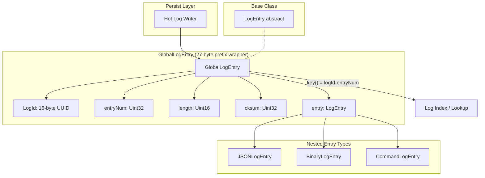
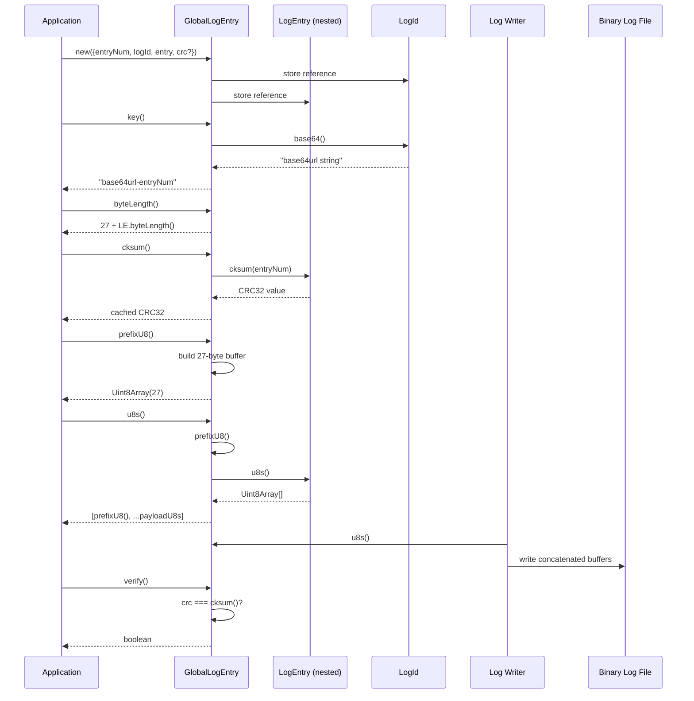

# GlobalLogEntry Specification

**Module: Entry Types**

## 1. Overview

`GlobalLogEntry` wraps a `LogEntry` with a 27-byte binary prefix that identifies the originating logical log (via a 16-byte `LogId`), a monotonically increasing entry number, the nested entry's byte length, and a CRC32 integrity checksum. It is the top-level envelope for entries persisted in the global (hot) log file and enables cross-log correlation by embedding the source log's identity.

## 2. Component Specifications (TypeScript Declarations)

```typescript
class GlobalLogEntry extends LogEntry {
  // ── Public fields ──────────────────────────────────────────
  entryNum: number              // Monotonic entry number within the source log
  logId: LogId                  // 16-byte identifier of the source logical log
  entry: LogEntry               // The nested entry payload (any LogEntry subclass)
  crc: number | null            // Stored CRC32 checksum; null if not provided at construction

  // ── Constructor ────────────────────────────────────────────
  constructor({ entryNum, logId, entry, crc? }: {
    entryNum: number
    logId: LogId
    entry: LogEntry
    crc?: number
  })

  // ── Methods ────────────────────────────────────────────────
  key(): string                 // Composite key: "${logId.base64()}-${entryNum}"
  byteLength(): number          // GLOBAL_LOG_PREFIX_BYTE_LENGTH (27) + entry.byteLength()
  cksum(): number               // CRC32 of (entryNum, entry bytes); cached in this.cksumNum
  prefixU8(): Uint8Array        // 27-byte binary prefix (lazily built, cached in #prefixU8)
  u8(): Uint8Array              // Delegates to this.entry.u8()
  u8s(): Uint8Array[]           // [prefixU8(), ...entry.u8s()]
  verify(): boolean             // crc !== null && crc === this.cksum()
}
```

**Prefix layout** (27 bytes, `GLOBAL_LOG_PREFIX_BYTE_LENGTH`):

| Offset | Size | Field       |
|--------|------|-------------|
| 0      | 1    | EntryType.GLOBAL_LOG (0) |
| 1      | 16   | logId.logId (16-byte UUID) |
| 17     | 4    | entryNum (Uint32LE) |
| 21     | 2    | entry.byteLength() (Uint16LE) |
| 23     | 4    | cksum() (Uint32LE) |

## 3. System Architecture (Mermaid graph TB)



## 4. Detailed Data Flow (Mermaid sequenceDiagram)



## 5. Visualization (self-contained D3 HTML)

```html
<!DOCTYPE html>
<html>
<head>
<meta charset="utf-8">
<title>GlobalLogEntry Animation</title>
<style>
  body { font-family: system-ui, sans-serif; background: #0d1117; display: flex; flex-direction: column; align-items: center; padding: 2rem; }
  #container { max-width: 960px; width: 100%; }
  svg { display: block; margin: 0 auto; background: #161b22; border-radius: 8px; box-shadow: 0 4px 24px rgba(0,0,0,0.4); }
  .controls { display: flex; gap: 12px; align-items: center; margin-top: 1rem; flex-wrap: wrap; justify-content: center; }
  button { background: #238636; color: #fff; border: none; border-radius: 6px; padding: 8px 20px; font-size: 14px; cursor: pointer; }
  button:hover { background: #2ea043; }
  button:disabled { opacity: 0.5; cursor: not-allowed; }
  label { color: #c9d1d9; font-size: 13px; }
  input[type="range"] { width: 240px; accent-color: #238636; }
  .stats { color: #8b949e; font-size: 12px; margin-top: 0.5rem; display: flex; gap: 1rem; flex-wrap: wrap; justify-content: center; }
  .byte-legend { display: flex; gap: 2px; justify-content: center; flex-wrap: wrap; margin: 0.5rem 0; }
  .legend-item { display: flex; align-items: center; gap: 4px; font-size: 11px; color: #c9d1d9; }
  .legend-swatch { width: 14px; height: 14px; border-radius: 3px; border: 1px solid #30363d; }
  #kf-total { color: #58a6ff; font-weight: 600; }
</style>
</head>
<body>
<div id="container">
  <svg id="vis" width="900" height="400"></svg>
  <div class="controls">
    <button id="play-pause" data-testid="play-pause">▶ Play</button>
    <button id="reset">↺ Reset</button>
    <label>Keyframe <span id="kf-current">0</span>/<span id="kf-total">0</span>
      <input type="range" id="kf-slider" min="0" max="0" value="0" step="1">
    </label>
  </div>
  <div class="stats">
    <span id="state-label">State: <span id="state-value">idle</span></span>
    <span>Phase: <span id="phase-value">—</span></span>
  </div>
  <div class="byte-legend" id="legend"></div>
</div>

<script src="https://d3js.org/d3.v7.min.js"></script>
<script>
(function() {
  const ANIMATION_DURATION_MS = 1200;
  const ANIMATION_KEYFRAMES = [
    { label: "Prefix: Type byte", phase: "build", desc: "Write EntryType.GLOBAL_LOG (0x00) at offset 0" },
    { label: "Prefix: LogId (16B)", phase: "build", desc: "Write 16-byte LogId UUID at offsets 1-16" },
    { label: "Prefix: entryNum (4B)", phase: "build", desc: "Write entryNum as Uint32LE at offset 17" },
    { label: "Prefix: length (2B)", phase: "build", desc: "Write entry.byteLength() as Uint16LE at offset 21" },
    { label: "Prefix: cksum (4B)", phase: "build", desc: "Write CRC32 checksum as Uint32LE at offset 23" },
    { label: "Prefix complete (27B)", phase: "prefix", desc: "27-byte prefix fully assembled" },
    { label: "Serialize nested entry", phase: "serialize", desc: "entry.u8s() produces payload bytes" },
    { label: "Concatenate u8s()", phase: "concat", desc: "[prefixU8(), ...entry.u8s()]" },
    { label: "Write to disk", phase: "persist", desc: "Log writer persists full byte array" },
    { label: "Verify checksum", phase: "verify", desc: "verify() compares stored crc vs computed cksum()" },
  ];
  const ANIMATION_VERIFICATION = [
    "prefixU8() must be exactly GLOBAL_LOG_PREFIX_BYTE_LENGTH (27) bytes",
    "Type byte at [0] must equal EntryType.GLOBAL_LOG (0x00)",
    "LogId at [1..16] must match this.logId.logId",
    "entryNum at [17..20] as Uint32LE must equal this.entryNum",
    "Length at [21..22] as Uint16LE must equal this.entry.byteLength()",
    "cksum at [23..26] as Uint32LE must match this.cksum()",
    "verify() returns false when crc is null",
    "verify() returns true only when stored crc === computed cksum()",
    "key() must return `${logId.base64()}-${entryNum}`",
    "byteLength() must equal 27 + nested entry byteLength()",
  ];

  const LEGEND = [
    { label: "Type (1B)", color: "#f781bf" },
    { label: "LogId (16B)", color: "#a6cee3" },
    { label: "entryNum (4B)", color: "#b2df8a" },
    { label: "Length (2B)", color: "#fb9a99" },
    { label: "cksum (4B)", color: "#fdbf6f" },
    { label: "Payload (variable)", color: "#cab2d6" },
  ];

  // Render legend
  const legendEl = document.getElementById("legend");
  LEGEND.forEach(l => {
    const item = document.createElement("span");
    item.className = "legend-item";
    item.innerHTML = `<span class="legend-swatch" style="background:${l.color}"></span>${l.label}`;
    legendEl.appendChild(item);
  });

  const TOTAL_KF = ANIMATION_KEYFRAMES.length;
  document.getElementById("kf-total").textContent = TOTAL_KF;

  const width = 900, height = 400;
  const svg = d3.select("#vis");

  // Static byte-preview row
  const byteGroups = [
    { label: "T", color: "#f781bf", count: 1 },
    { label: "L", color: "#a6cee3", count: 16 },
    { label: "N", color: "#b2df8a", count: 4 },
    { label: "Ln", color: "#fb9a99", count: 2 },
    { label: "C", color: "#fdbf6f", count: 4 },
  ];

  let byteCells = [];
  byteGroups.forEach(g => {
    for (let i = 0; i < g.count; i++) {
      byteCells.push({ color: g.color, label: g.label, offset: byteCells.length });
    }
  });

  // Add payload placeholder cells
  const payloadStart = byteCells.length;
  for (let i = 0; i < 12; i++) {
    byteCells.push({ color: "#cab2d6", label: "P", offset: payloadStart + i });
  }

  const cellW = 22, cellH = 22, gap = 1;
  const totalW = byteCells.length * (cellW + gap);
  const startX = (width - totalW) / 2;

  // Main info area
  const infoY = 60;
  svg.append("text")
    .attr("x", width / 2).attr("y", 30)
    .attr("text-anchor", "middle").attr("fill", "#58a6ff")
    .attr("font-size", "18").attr("font-weight", "bold")
    .text("GlobalLogEntry Binary Layout");

  svg.append("text")
    .attr("id", "phase-label")
    .attr("x", width / 2).attr("y", infoY)
    .attr("text-anchor", "middle").attr("fill", "#8b949e")
    .attr("font-size", "13")
    .text("Click Play to animate");

  svg.append("text")
    .attr("id", "desc-label")
    .attr("x", width / 2).attr("y", infoY + 20)
    .attr("text-anchor", "middle").attr("fill", "#c9d1d9")
    .attr("font-size", "12")
    .text("");

  // Byte cells
  const byteRects = svg.selectAll("rect.byte")
    .data(byteCells)
    .join("rect")
    .attr("class", "byte")
    .attr("x", (d, i) => startX + i * (cellW + gap))
    .attr("y", infoY + 40)
    .attr("width", cellW).attr("height", cellH)
    .attr("rx", 3).attr("ry", 3)
    .attr("fill", d => d.color)
    .attr("stroke", "#30363d")
    .attr("stroke-width", 1)
    .attr("opacity", 0.15);

  const byteLabels = svg.selectAll("text.bytelen")
    .data(byteCells)
    .join("text")
    .attr("class", "bytelen")
    .attr("x", (d, i) => startX + i * (cellW + gap) + cellW / 2)
    .attr("y", infoY + 40 + cellH / 2 + 4)
    .attr("text-anchor", "middle")
    .attr("fill", "#fff")
    .attr("font-size", "9")
    .attr("opacity", 0)
    .text((d, i) => i);

  // Offset labels below bytes
  svg.selectAll("text.offset")
    .data(byteCells)
    .join("text")
    .attr("class", "offset")
    .attr("x", (d, i) => startX + i * (cellW + gap) + cellW / 2)
    .attr("y", infoY + 40 + cellH + 14)
    .attr("text-anchor", "middle")
    .attr("fill", "#484f58")
    .attr("font-size", "9")
    .text((d, i) => i);

  // Keyframe timeline bar
  const timelineY = height - 60;
  svg.append("text")
    .attr("x", width / 2).attr("y", timelineY - 10)
    .attr("text-anchor", "middle").attr("fill", "#8b949e")
    .attr("font-size", "11")
    .text("Keyframe Timeline");

  const kfBarW = Math.min(700, width - 80);
  const kfBarX = (width - kfBarW) / 2;

  // Timeline track
  svg.append("rect")
    .attr("x", kfBarX).attr("y", timelineY)
    .attr("width", kfBarW).attr("height", 6).attr("rx", 3)
    .attr("fill", "#30363d");

  // Timeline progress
  svg.append("rect")
    .attr("id", "timeline-progress")
    .attr("x", kfBarX).attr("y", timelineY)
    .attr("width", 0).attr("height", 6).attr("rx", 3)
    .attr("fill", "#238636");

  // Keyframe markers
  const kfSpacing = kfBarW / (TOTAL_KF - 1 || 1);
  svg.selectAll("circle.kf-marker")
    .data(d3.range(TOTAL_KF))
    .join("circle")
    .attr("class", "kf-marker")
    .attr("cx", (d, i) => kfBarX + i * kfSpacing)
    .attr("cy", timelineY + 3)
    .attr("r", 5)
    .attr("fill", "#484f58")
    .attr("stroke", "#30363d");

  // Keyframe label
  svg.append("text")
    .attr("id", "kf-label")
    .attr("x", width / 2).attr("y", timelineY + 30)
    .attr("text-anchor", "middle").attr("fill", "#c9d1d9")
    .attr("font-size", "11")
    .text("");

  let currentKF = 0;
  let playing = false;
  let timer = null;
  const state = { keyframe: 0, phase: "idle" };

  function jumpToKeyframe(idx) {
    if (idx < 0) idx = 0;
    if (idx >= TOTAL_KF) { idx = TOTAL_KF - 1; if (playing) stop(); }
    currentKF = idx;
    const kf = ANIMATION_KEYFRAMES[idx];
    if (!kf) return;

    document.getElementById("kf-current").textContent = idx;
    document.getElementById("kf-slider").value = idx;
    document.getElementById("phase-value").textContent = kf.phase;
    document.getElementById("state-value").textContent = idx >= TOTAL_KF - 1 ? "complete" : (playing ? "playing" : "paused");

    svg.select("#phase-label").text(kf.label);
    svg.select("#desc-label").text(kf.desc);

    // Byte cell highlighting
    let highlightStart = 0, highlightEnd = byteCells.length;
    if (idx === 0) { highlightStart = 0; highlightEnd = 1; }
    else if (idx === 1) { highlightStart = 1; highlightEnd = 17; }
    else if (idx === 2) { highlightStart = 17; highlightEnd = 21; }
    else if (idx === 3) { highlightStart = 21; highlightEnd = 23; }
    else if (idx === 4) { highlightStart = 23; highlightEnd = 27; }
    else if (idx === 5) { highlightStart = 0; highlightEnd = 27; }
    else { highlightStart = 0; highlightEnd = byteCells.length; }

    byteRects.attr("opacity", (d, i) => (i >= highlightStart && i < highlightEnd) ? 1 : 0.15)
      .attr("stroke", (d, i) => (i >= highlightStart && i < highlightEnd) ? "#58a6ff" : "#30363d")
      .attr("stroke-width", (d, i) => (i >= highlightStart && i < highlightEnd) ? 2 : 1);
    byteLabels.attr("opacity", (d, i) => (i >= highlightStart && i < highlightEnd) ? 1 : 0);

    // Timeline progress
    const progress = idx / (TOTAL_KF - 1);
    svg.select("#timeline-progress").attr("width", progress * kfBarW);

    // Marker highlight
    svg.selectAll("circle.kf-marker")
      .attr("fill", (d, i) => i <= idx ? "#238636" : "#484f58")
      .attr("r", (d, i) => i === idx ? 7 : 5);

    svg.select("#kf-label").text(`${idx}: ${kf.label}`);

    state.keyframe = idx;
    state.phase = kf.phase;
  }

  function resetAnimation() {
    stop();
    jumpToKeyframe(0);
    document.getElementById("state-value").textContent = "idle";
    document.getElementById("phase-value").textContent = "—";
    svg.select("#phase-label").text("Click Play to animate");
    svg.select("#desc-label").text("");
    byteRects.attr("opacity", 0.15).attr("stroke", "#30363d").attr("stroke-width", 1);
    byteLabels.attr("opacity", 0);
    svg.select("#timeline-progress").attr("width", 0);
    svg.selectAll("circle.kf-marker").attr("fill", "#484f58").attr("r", 5);
    svg.select("#kf-label").text("");
    state.keyframe = 0;
    state.phase = "idle";
  }

  function stop() {
    playing = false;
    if (timer) { clearTimeout(timer); timer = null; }
    const btn = document.getElementById("play-pause");
    btn.textContent = "▶ Play";
    document.getElementById("state-value").textContent = "paused";
  }

  function play() {
    if (currentKF >= TOTAL_KF - 1) { resetAnimation(); }
    playing = true;
    const btn = document.getElementById("play-pause");
    btn.textContent = "⏸ Pause";
    document.getElementById("state-value").textContent = "playing";
    advance();
  }

  function advance() {
    if (!playing) return;
    if (currentKF >= TOTAL_KF - 1) { stop(); return; }
    jumpToKeyframe(currentKF + 1);
    timer = setTimeout(advance, ANIMATION_DURATION_MS / TOTAL_KF);
  }

  function togglePlay() {
    if (playing) { stop(); }
    else { play(); }
  }

  function getAnimationState() {
    return { ...state, isPlaying: playing, totalKeyframes: TOTAL_KF };
  }

  // Controls
  document.getElementById("play-pause").addEventListener("click", togglePlay);
  document.getElementById("reset").addEventListener("click", resetAnimation);
  document.getElementById("kf-slider").addEventListener("input", function() {
    if (playing) stop();
    jumpToKeyframe(parseInt(this.value));
  });

  // Init
  jumpToKeyframe(0);
  window.ANIMATION_DURATION_MS = ANIMATION_DURATION_MS;
  window.ANIMATION_KEYFRAMES = ANIMATION_KEYFRAMES;
  window.ANIMATION_VERIFICATION = ANIMATION_VERIFICATION;
  window.jumpToKeyframe = jumpToKeyframe;
  window.resetAnimation = resetAnimation;
  window.getAnimationState = getAnimationState;
})();
</script>
</body>
</html>
```

## 6. Testing Requirements

| # | Test | Expected |
|---|------|----------|
| 1 | Construct with `entryNum`, `logId`, `entry`, no `crc` | `crc` is `null` |
| 2 | Construct with explicit `crc` | `crc` matches provided value |
| 3 | `key()` returns `${logId.base64()}-${entryNum}` | Correct composite string |
| 4 | `byteLength()` equals `27 + entry.byteLength()` | Integer sum |
| 5 | `prefixU8()` produces 27-byte `Uint8Array` | `byteLength === 27` |
| 6 | `prefixU8()` byte at offset 0 equals `EntryType.GLOBAL_LOG` | `0x00` |
| 7 | `prefixU8()` bytes 1–16 match `logId.logId` | Deep equal |
| 8 | `prefixU8()` bytes 17–20 as `Uint32LE` match `entryNum` | Value equal |
| 9 | `prefixU8()` bytes 21–22 as `Uint16LE` match `entry.byteLength()` | Value equal |
| 10 | `prefixU8()` bytes 23–26 as `Uint32LE` match `cksum()` | Value equal |
| 11 | `prefixU8()` is memoized (second call returns same buffer) | Same reference |
| 12 | `u8()` delegates to `entry.u8()` | Deep equal |
| 13 | `u8s()` returns `[prefixU8(), ...entry.u8s()]` | Array length = 1 + `entry.u8s().length` |
| 14 | `cksum()` calls `entry.cksum(entryNum)` exactly once (memoized) | `cksumNum` set after first call |
| 15 | `verify()` returns `false` when `crc` is `null` | `false` |
| 16 | `verify()` returns `false` when `crc !== cksum()` | `false` |
| 17 | `verify()` returns `true` when `crc === cksum()` | `true` |
| 18 | Serialization round-trip: `u8s()` → concatenate → parse | Reconstructed entry matches original |

---

## 7. Source-Test Cross-References

### Test Coverage

| Test Spec | Path |
|---|---|
| GlobalLogEntry.test.spec.md | `source/src/lib/entry/GlobalLogEntry.test.spec.md` |
