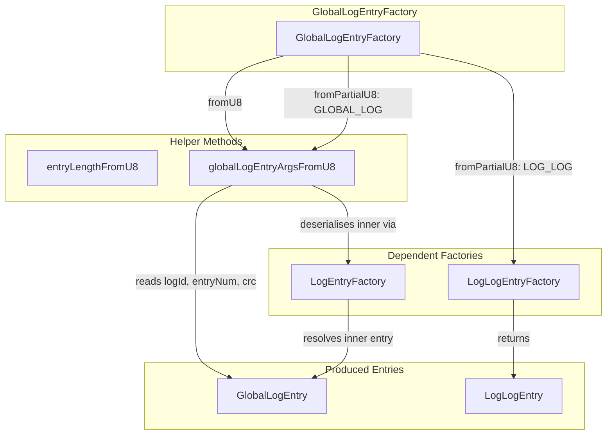
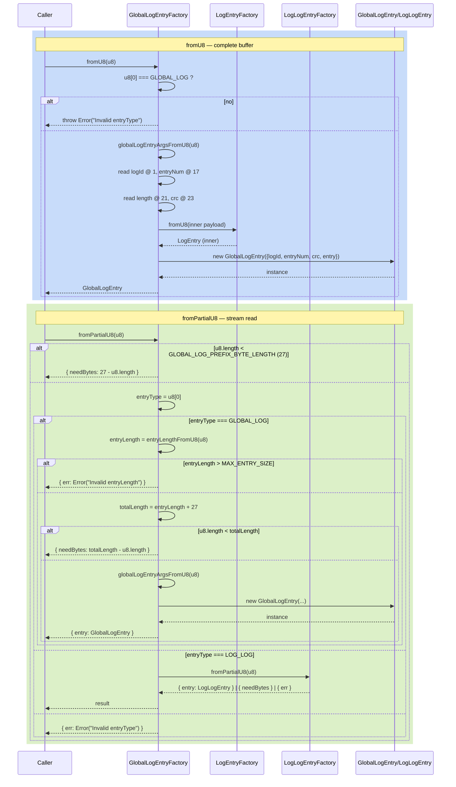

# GlobalLogEntryFactory — Global Log Wrapper Deserialiser

**Module: Entry Types**

## Overview

`GlobalLogEntryFactory` deserialises **global-log wrapper entries** from raw `Uint8Array` buffers. A global log entry is a 27‑byte prefix followed by a variable-length inner `LogEntry`.

**27‑byte prefix layout:**
```
┌──┬────────────────────────┬────────────┬──────┬──────────┬──────────┐
│Ty│ LogId (16 bytes)       │ EntryNum   │ Len  │ CRC32    │ Payload  │
│1 │ 16                     │ 4 (u32 LE) │2(LE) │ 4 (u32)  │ variable │
└──┴────────────────────────┴────────────┴──────┴──────────┴──────────┘
```

| Offset | Size | Field | Description |
|---|---|---|---|
| 0 | 1 | `entryType` | Must be `EntryType.GLOBAL_LOG` (0x00) |
| 1 | 16 | `logId` | 128‑bit unique log identifier |
| 17 | 4 | `entryNum` | Monotonic entry sequence number (u32 LE) |
| 21 | 2 | `length` | Byte length of the inner entry (u16 LE) |
| 23 | 4 | `crc` | CRC32 of the inner entry (u32 LE) |
| 27 | `length` | `payload` | Inner entry bytes |

Two static methods:

| Method | Input | Behaviour |
|---|---|---|
| `fromU8(u8)` | Buffer known to contain a **complete** entry | Validates entry type, parses prefix, deserialises inner entry via `LogEntryFactory.fromU8`. Throws on invalid data. |
| `fromPartialU8(u8)` | Buffer that **may be incomplete** | Also accepts `EntryType.LOG_LOG` (the global log stores its own commands as `LogLogEntry` wrappers). Never throws. |

---

## Component Specifications

### Full TypeScript Declaration

```typescript
import { EntryType, GLOBAL_LOG_PREFIX_BYTE_LENGTH, MAX_ENTRY_SIZE } from "../globals"
import LogId from "../log/log-id"
import GlobalLogEntry from "./global-log-entry"
import LogEntry from "./log-entry"
import LogEntryFactory from "./log-entry-factory"
import LogLogEntry from "./log-log-entry"
import LogLogEntryFactory from "./log-log-entry-factory"

export default class GlobalLogEntryFactory {
    static fromU8(u8: Uint8Array): GlobalLogEntry

    static fromPartialU8(u8: Uint8Array): {
        entry?: LogLogEntry | GlobalLogEntry | null
        needBytes?: number
        err?: Error
    }

    static entryLengthFromU8(u8: Uint8Array): number

    static globalLogEntryArgsFromU8(u8: Uint8Array): {
        logId: LogId
        entryNum: number
        crc: number
        entry: LogEntry
    }
}
```

### Method Details

| Method | Signature | Behaviour |
|---|---|---|
| `fromU8` | `(u8: Uint8Array) => GlobalLogEntry` | Validates `entryType === GLOBAL_LOG`, calls `globalLogEntryArgsFromU8(u8)`, returns `new GlobalLogEntry(args)`. |
| `fromPartialU8` | `(u8: Uint8Array) => Result` | Checks `u8.length >= GLOBAL_LOG_PREFIX_BYTE_LENGTH` first. If `entryType === GLOBAL_LOG`: reads `entryLength`, validates `<= MAX_ENTRY_SIZE`, checks total length, constructs entry. If `entryType === LOG_LOG`: delegates to `LogLogEntryFactory.fromPartialU8(u8)`. |
| `entryLengthFromU8` | `(u8: Uint8Array) => number` | Reads u16 LE at `u8[21..23)`. |
| `globalLogEntryArgsFromU8` | `(u8: Uint8Array) => args` | Extracts `logId` (bytes 1‑17), `entryNum` (17‑21), `crc` (23‑27), deserialises inner entry from remainder via `LogEntryFactory.fromU8`. |

### Constants Referenced

| Constant | Value | Role |
|---|---|---|
| `GLOBAL_LOG_PREFIX_BYTE_LENGTH` | `27` | Minimum bytes needed for prefix |
| `MAX_ENTRY_SIZE` | `32768` (2¹⁵) | Upper bound on the `length` field |
| `EntryType.GLOBAL_LOG` | `0x00` | Required first byte for `fromU8` |
| `EntryType.LOG_LOG` | `0x01` | Alternative first byte accepted by `fromPartialU8` |

---

## System Architecture



### Entry Type Decision Tree

```
            u8[0]
               │
        ┌──────┴──────┐
        │             │
    GLOBAL_LOG      LOG_LOG
    (0x00)         (0x01)
        │             │
        ▼             ▼
  Read 16B logId    Delegate to
  Read 4B entryNum  LogLogEntryFactory
  Read 2B length    .fromPartialU8(u8)
  Read 4B crc
        │
        ▼
  Read `length` bytes
  LogEntryFactory.fromU8(inner)
        │
        ▼
  new GlobalLogEntry({...})
```

---

## Detailed Data Flow



### Buffer Slicing Detail for `globalLogEntryArgsFromU8`

```
Offset  0: entryType (1B)  →  validated earlier
Offset  1: logId      (16B) → new Uint8Array(u8.buffer, 1, 16)   → new LogId(...)
Offset 17: entryNum   (4B)  → new Uint32Array(u8.buffer, 17, 4)[0]
Offset 21: length     (2B)  → new Uint16Array(u8.buffer, 21, 2)[0]
Offset 23: crc        (4B)  → new Uint32Array(u8.buffer, 23, 4)[0]
Offset 27: payload    (var) → new Uint8Array(u8.buffer, 27, length)
                              → LogEntryFactory.fromU8(payload)
```

---

## Visualization

```html
<!DOCTYPE html>
<html>
<head>
  <meta charset="utf-8" />
  <style>
    body { margin: 0; background: #0d1117; font-family: system-ui, sans-serif; }
    #container { width: 100%; height: 100vh; display: flex; flex-direction: column; align-items: center; justify-content: center; }
    svg { display: block; }
    .controls { margin-top: 20px; display: flex; gap: 12px; align-items: center; flex-wrap: wrap; justify-content: center; }
    .controls button { background: #21262d; border: 1px solid #30363d; color: #c9d1d9; padding: 6px 16px; border-radius: 6px; cursor: pointer; font-size: 14px; }
    .controls button:hover { background: #30363d; }
    .controls button[data-testid="play-pause"] { background: #1f6feb; border-color: #1f6feb; color: #fff; }
    .info { color: #8b949e; font-size: 13px; }
    .node rect { stroke-width: 2; }
    .factory-node rect { fill: #1f6feb; stroke: #58a6ff; }
    .helper-node rect { fill: #d29922; stroke: #e3b341; }
    .wrapper-node rect { fill: #238636; stroke: #3fb950; }
    .inner-node rect { fill: #9e6a03; stroke: #d29922; }
    text { fill: #c9d1d9; font-size: 13px; text-anchor: middle; dominant-baseline: central; }
  </style>
</head>
<body>
<div id="container">
  <svg id="svg" width="1000" height="520"></svg>
  <div class="controls">
    <button data-testid="play-pause" id="playPauseBtn">&#9646;&#9646;</button>
    <button id="prevBtn">&#9664; Prev</button>
    <button id="nextBtn">Next &#9654;</button>
    <button id="resetBtn">Reset</button>
    <span class="info">Keyframe <span id="kf-current">0</span> / <span id="kf-total">0</span></span>
    <span id="stateDisplay" class="info" style="margin-left:8px;">&#8203;</span>
  </div>
</div>
<script>
(function() {
  const nodes = [
    { id: 'GlobalLogEntryFactory', cls: 'factory-node', tier: 0 },
    { id: 'entryLengthFromU8',     cls: 'helper-node',  tier: 1 },
    { id: 'globalLogEntryArgsFromU8', cls: 'helper-node', tier: 1 },
    { id: 'LogLogEntryFactory',    cls: 'helper-node',  tier: 1 },
    { id: 'LogEntryFactory',       cls: 'helper-node',  tier: 1 },
    { id: 'GlobalLogEntry',        cls: 'wrapper-node', tier: 2 },
    { id: 'LogLogEntry',           cls: 'wrapper-node', tier: 2 },
    { id: 'Inner LogEntry',        cls: 'inner-node',   tier: 2 },
  ];
  const edges = [
    { src: 'GlobalLogEntryFactory',     dst: 'entryLengthFromU8' },
    { src: 'GlobalLogEntryFactory',     dst: 'globalLogEntryArgsFromU8' },
    { src: 'GlobalLogEntryFactory',     dst: 'LogLogEntryFactory' },
    { src: 'globalLogEntryArgsFromU8',  dst: 'LogEntryFactory' },
    { src: 'LogEntryFactory',           dst: 'Inner LogEntry' },
    { src: 'globalLogEntryArgsFromU8',  dst: 'GlobalLogEntry' },
    { src: 'LogLogEntryFactory',        dst: 'LogLogEntry' },
  ];

  const W = 170, H = 42, GX = 200, GY = 110, topMargin = 40;
  const tiers = {};
  nodes.forEach(n => { if (!tiers[n.tier]) tiers[n.tier] = []; tiers[n.tier].push(n); });
  const tierY = {};
  let yAcc = topMargin;
  Object.keys(tiers).sort((a,b)=>a-b).forEach(t => { tierY[t] = yAcc; yAcc += GY; });

  const svg = d3.select('#svg');
  const g = svg.append('g');

  const nodeMap = {};
  nodes.forEach(n => {
    const tn = tiers[n.tier];
    const idx = tn.indexOf(n);
    const totalW = tn.length * GX;
    const startX = (1000 - totalW) / 2;
    n._x = startX + idx * GX;
    n._y = tierY[n.tier];
    nodeMap[n.id] = n;
  });

  edges.forEach(e => {
    const s = nodeMap[e.src], d = nodeMap[e.dst];
    if (!s || !d) return;
    g.append('line')
      .attr('class', 'cls-edge')
      .attr('x1', s._x + W/2).attr('y1', s._y + H)
      .attr('x2', d._x + W/2).attr('y2', d._y)
      .attr('stroke', '#484f58').attr('stroke-width', 1.5);
  });

  nodes.forEach(n => {
    const nodeG = g.append('g')
      .attr('id', 'node-'+n.id.replace(/\s+/g, ''))
      .attr('class', 'cls-node ' + n.cls);
    nodeG.append('rect')
      .attr('x', n._x).attr('y', n._y)
      .attr('width', W).attr('height', H).attr('rx', 8);
    nodeG.append('text')
      .attr('class', 'cls-label')
      .attr('x', n._x + W/2).attr('y', n._y + H/2)
      .text(n.id);
  });

  const keyframes = [];
  keyframes.push(() => {
    d3.selectAll('.cls-node, .cls-label').attr('opacity', 0.2);
    d3.selectAll('.cls-edge').attr('opacity', 0.06);
  });
  keyframes.push(() => {
    d3.selectAll('.cls-node, .cls-label').attr('opacity', 0.15);
    d3.selectAll('.cls-edge').attr('opacity', 0.04);
    d3.select('#node-GlobalLogEntryFactory').attr('opacity', 1);
    d3.select('#node-GlobalLogEntryFactory text').attr('opacity', 1);
  });
  keyframes.push(() => {
    d3.selectAll('.cls-node, .cls-label').attr('opacity', 0.15);
    d3.selectAll('.cls-edge').attr('opacity', 0.04);
    ['GlobalLogEntryFactory','entryLengthFromU8','globalLogEntryArgsFromU8','LogLogEntryFactory','LogEntryFactory'].forEach(id => {
      d3.select('#node-'+id.replace(/\s+/g, '')).attr('opacity', 1);
      d3.select('#node-'+id.replace(/\s+/g, '')+' text').attr('opacity', 1);
    });
  });
  keyframes.push(() => {
    d3.selectAll('.cls-node, .cls-label').attr('opacity', 0.15);
    d3.selectAll('.cls-edge').attr('opacity', 0.04);
    nodes.forEach(n => {
      d3.select('#node-'+n.id.replace(/\s+/g, '')).attr('opacity', 1);
      d3.select('#node-'+n.id.replace(/\s+/g, '')+' text').attr('opacity', 1);
    });
  });
  keyframes.push(() => {
    d3.selectAll('.cls-node').attr('opacity', 1);
    d3.selectAll('.cls-label').attr('opacity', 1);
    d3.selectAll('.cls-edge').attr('opacity', 0.3);
  });
  window.ANIMATION_KEYFRAMES = keyframes;

  let currentKF = 0, playing = false, interval = null;
  const totalKF = keyframes.length;
  document.getElementById('kf-total').textContent = totalKF;

  function applyKF(idx) {
    currentKF = Math.max(0, Math.min(totalKF - 1, idx));
    keyframes[currentKF]();
    document.getElementById('kf-current').textContent = currentKF;
    const st = document.getElementById('stateDisplay');
    st.innerHTML = currentKF === 0 ? '&#9679; dimmed' :
                   currentKF === totalKF-1 ? '&#9679; full' :
                   '&#9679; step ' + currentKF;
  }

  window.jumpToKeyframe = function(idx) { applyKF(idx); };
  window.getAnimationState = function() {
    return { currentKeyframe: currentKF, totalKeyframes: totalKF, playing: playing };
  };
  window.resetAnimation = function() {
    if (interval) { clearInterval(interval); interval = null; }
    playing = false;
    document.getElementById('playPauseBtn').innerHTML = '&#9654;';
    applyKF(0);
  };
  window.ANIMATION_DURATION_MS = totalKF * 800;
  window.ANIMATION_VERIFICATION = function() {
    const failures = [];
    if (typeof window.ANIMATION_KEYFRAMES === 'undefined' || !Array.isArray(window.ANIMATION_KEYFRAMES)) failures.push('ANIMATION_KEYFRAMES missing');
    if (typeof window.ANIMATION_DURATION_MS === 'undefined') failures.push('ANIMATION_DURATION_MS missing');
    if (typeof window.ANIMATION_VERIFICATION !== 'function') failures.push('ANIMATION_VERIFICATION missing');
    if (typeof window.jumpToKeyframe !== 'function') failures.push('jumpToKeyframe missing');
    if (typeof window.resetAnimation !== 'function') failures.push('resetAnimation missing');
    if (typeof window.getAnimationState !== 'function') failures.push('getAnimationState missing');
    const pp = document.querySelector('[data-testid="play-pause"]');
    if (!pp) failures.push('[data-testid="play-pause"] missing');
    if (!document.getElementById('kf-total')) failures.push('#kf-total missing');
    return { ok: failures.length === 0, failures };
  };

  document.getElementById('playPauseBtn').addEventListener('click', function() {
    if (playing) {
      clearInterval(interval); interval = null;
      playing = false;
      this.innerHTML = '&#9654;';
    } else {
      playing = true;
      this.innerHTML = '&#9646;&#9646;';
      interval = setInterval(() => {
        if (currentKF >= totalKF - 1) {
          clearInterval(interval); interval = null;
          playing = false;
          document.getElementById('playPauseBtn').innerHTML = '&#9654;';
          return;
        }
        applyKF(currentKF + 1);
      }, 800);
    }
  });
  document.getElementById('prevBtn').addEventListener('click', () => applyKF(currentKF - 1));
  document.getElementById('nextBtn').addEventListener('click', () => applyKF(currentKF + 1));
  document.getElementById('resetBtn').addEventListener('click', window.resetAnimation);

  applyKF(0);
  window.ANIMATION_VERIFICATION_RESULT = window.ANIMATION_VERIFICATION();
})();
</script>
</body>
</html>
```

---

## Testing Requirements

### Unit Tests — `fromU8`

| # | Test | Expected Outcome |
|---|---|---|
| 1 | `GlobalLogEntryFactory.fromU8(buffer with entryType !== GLOBAL_LOG)` | Throws `Error("Invalid entryType: ...")` |
| 2 | `GlobalLogEntryFactory.fromU8(buffer with valid GLOBAL_LOG)` | Returns `GlobalLogEntry` with correct `logId`, `entryNum`, `crc`, and inner `entry` |
| 3 | `GlobalLogEntryFactory.fromU8(truncated buffer)` | Throws from `globalLogEntryArgsFromU8` — `Error("Invalid u8 length")` |
| 4 | Inner entry is `CommandLogEntry` (command wrapped in global log) | Round-trips correctly via `LogEntryFactory.fromU8` |
| 5 | Inner entry is another `GlobalLogEntry` (nested — invalid but defensive) | Inner `fromU8` validates its own type byte and may throw |

### Unit Tests — `fromPartialU8`

| # | Test | Expected Outcome |
|---|---|---|
| 1 | `fromPartialU8(u8)` where `u8.length < 27` | `{ needBytes: 27 - u8.length }` |
| 2 | `fromPartialU8(u8)` with `entryType === GLOBAL_LOG` and `entryLength > MAX_ENTRY_SIZE` | `{ err: Error("Invalid entryLength") }` |
| 3 | `fromPartialU8(u8)` with `entryType === GLOBAL_LOG` and insufficient payload | `{ needBytes: totalLength - u8.length }` |
| 4 | `fromPartialU8(u8)` with complete valid `GLOBAL_LOG` entry | `{ entry: GlobalLogEntry }` |
| 5 | `fromPartialU8(u8)` with `entryType === LOG_LOG` | Delegates to `LogLogEntryFactory.fromPartialU8` |
| 6 | `fromPartialU8(u8)` with `entryType` other than `0x00` or `0x01` | `{ err: Error("Invalid entryType") }` |

### Unit Tests — Helper Methods

| # | Test | Expected Outcome |
|---|---|---|
| 1 | `entryLengthFromU8(u8)` reads u16 LE at offset 21 | Returns correct length value |
| 2 | `globalLogEntryArgsFromU8(u8)` on buffer < 27 bytes | Throws `Error("Invalid u8 length")` |
| 3 | `globalLogEntryArgsFromU8(u8)` reads correct 16-byte `logId` bytes | `LogId` constructed with correct `Uint8Array` |
| 4 | `globalLogEntryArgsFromU8(u8)` reads correct u32 `entryNum` | Matches `u8[17..21)` as u32 LE |

### Contract Tests

| # | Test | Rationale |
|---|---|---|
| 1 | `entry.logId.base64()` round-trips via the hex-to-base64 conversion | `logDirPrefix` encoding uses the raw `Uint8Array` — buffer copy in `globalLogEntryArgsFromU8` is intentional |
| 2 | `entry.verify()` returns `true` when CRC matches `entry.cksum()` | CRC integrity must hold after round-trip serialisation |
| 3 | `entry.entry instanceof LogEntry` | Inner entry is always a valid `LogEntry` subclass |
| 4 | `entry.byteLength() === 27 + inner.byteLength()` | Total length is prefix + inner entry payload |

### Edge Cases

| # | Scenario | Assertion |
|---|---|---|
| 1 | `entryLength` field set to `0` | A zero-length inner entry is valid (empty payload) |
| 2 | `entryLength` field set to `MAX_ENTRY_SIZE` — boundary | Accepted as valid, attempts to read `MAX_ENTRY_SIZE` bytes |
| 3 | `entryLength` field set to `MAX_ENTRY_SIZE + 1` | Rejected with `{ err: Error("Invalid entryLength") }` |
| 4 | `globalLogEntryArgsFromU8` copies buffer to avoid LogId hex encoding bug | The copy is intentional — verify no ref to original slice leaks |
| 5 | `CRC` field is stored but optional at construction (`crc?: number`) | If `crc` is `undefined`, `entry.crc` is `null`; `verify()` returns `false` |
| 6 | `fromPartialU8` receives a buffer with `LOG_LOG` entry type but insufficient bytes for `LogLogEntry` prefix | Returns `{ needBytes }` from `LogLogEntryFactory.fromPartialU8` |

---

## 7. Source-Test Cross-References

### Test Coverage

| Test Spec | Path |
|---|---|
| GlobalLogEntryFactory.test.spec.md | `source/src/lib/entry/GlobalLogEntryFactory.test.spec.md` |
