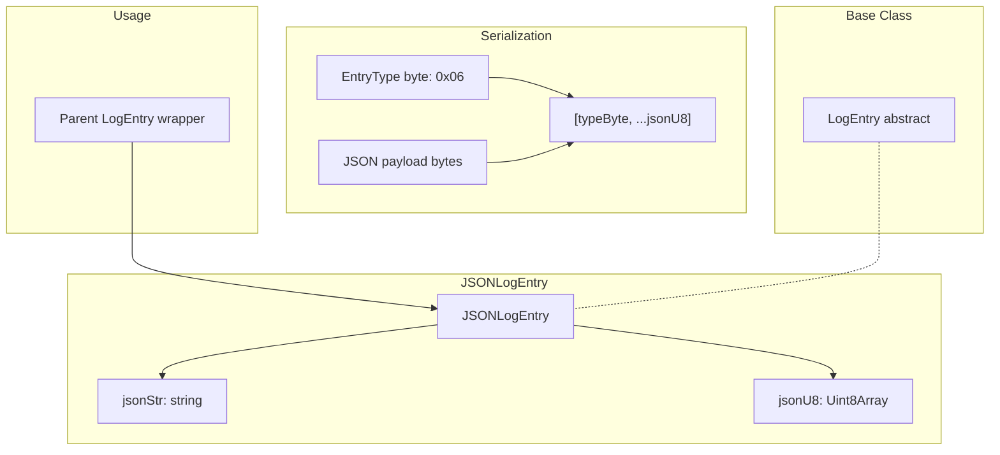
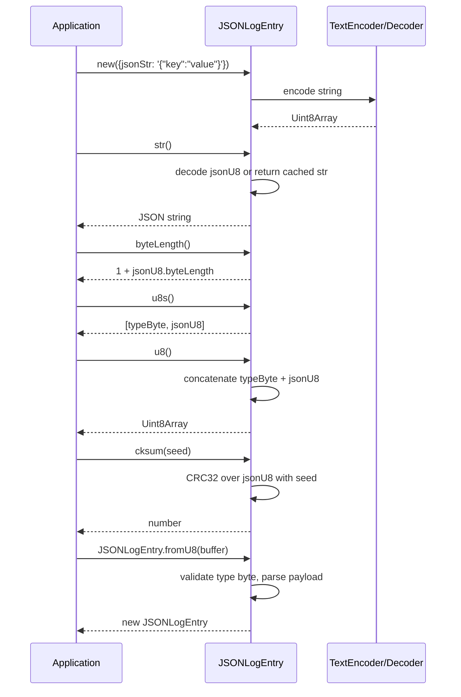

# JSONLogEntry Specification

## 1. Overview

`JSONLogEntry` wraps a JSON string as a binary log entry. It serializes the JSON payload prefixed by a single `EntryType.JSON` byte (0x06). Construction accepts either a raw JSON string (`jsonStr`) or a pre-encoded `Uint8Array` (`jsonU8`). The entry provides checksum computation, byte-length queries, and round-trip serialization via `u8()` / `fromU8()`.

## 2. Component Specifications (TypeScript Declarations)

```typescript
class JSONLogEntry extends LogEntry {
  constructor({ jsonStr, jsonU8 }: {
    jsonStr?: string
    jsonU8?: Uint8Array
  })

  str(): string
  byteLength(): number
  cksum(seed: number): number
  u8(): Uint8Array
  u8s(): Uint8Array[]

  static fromU8(buffer: Uint8Array): JSONLogEntry
}
```

## 3. System Architecture (Mermaid graph TB)



## 4. Detailed Data Flow (Mermaid sequenceDiagram)



## 5. Visualization (self-contained D3 HTML)

```html
<!DOCTYPE html>
<html>
<head>
<meta charset="utf-8">
<title>JSONLogEntry Animation</title>
<style>
  body { font-family: system-ui, sans-serif; background: #0d1117; display: flex; flex-direction: column; align-items: center; padding: 2rem; }
  #container { max-width: 960px; width: 100%; }
  svg { display: block; margin: 0 auto; background: #161b22; border-radius: 8px; box-shadow: 0 4px 24px rgba(0,0,0,0.4); }
  .controls { display: flex; gap: 12px; align-items: center; margin-top: 1rem; flex-wrap: wrap; justify-content: center; }
  button { background: #238636; color: #fff; border: none; border-radius: 6px; padding: 8px 20px; font-size: 14px; cursor: pointer; }
  button:hover { background: #2ea043; }
  button:disabled { opacity: 0.5; cursor: not-allowed; }
  label { color: #c9d1d9; font-size: 13px; }
  input[type="range"] { width: 240px; accent-color: #238636; }
  .stats { color: #8b949e; font-size: 12px; margin-top: 0.5rem; display: flex; gap: 1rem; flex-wrap: wrap; justify-content: center; }
  .byte-legend { display: flex; gap: 2px; justify-content: center; flex-wrap: wrap; margin: 0.5rem 0; }
  .legend-item { display: flex; align-items: center; gap: 4px; font-size: 11px; color: #c9d1d9; }
  .legend-swatch { width: 14px; height: 14px; border-radius: 3px; border: 1px solid #30363d; }
  #kf-total { color: #58a6ff; font-weight: 600; }
</style>
</head>
<body>
<div id="container">
  <svg id="vis" width="900" height="400"></svg>
  <div class="controls">
    <button id="play-pause" data-testid="play-pause">▶ Play</button>
    <button id="reset">↺ Reset</button>
    <label>Keyframe <span id="kf-current">0</span>/<span id="kf-total">0</span>
      <input type="range" id="kf-slider" min="0" max="0" value="0" step="1">
    </label>
  </div>
  <div class="stats">
    <span id="state-label">State: <span id="state-value">idle</span></span>
    <span>Phase: <span id="phase-value">—</span></span>
  </div>
  <div class="byte-legend" id="legend"></div>
</div>

<script src="https://d3js.org/d3.v7.min.js"></script>
<script>
(function() {
  const ANIMATION_DURATION_MS = 800;
  const ANIMATION_KEYFRAMES = [
    { label: "Input JSON string", phase: "input", desc: "User provides a JSON string" },
    { label: "Encode to UTF-8", phase: "encode", desc: "TextEncoder converts string to Uint8Array" },
    { label: "Prepend type byte (0x06)", phase: "serialize", desc: "EntryType.JSON byte at offset 0" },
    { label: "Full byte array ready", phase: "ready", desc: "typeByte + jsonU8 concatenated" },
    { label: "Compute checksum", phase: "checksum", desc: "CRC32 over JSON payload" },
    { label: "Deserialize via fromU8", phase: "deserialize", desc: "Parse type byte + payload back" },
    { label: "Decode back to string", phase: "decode", desc: "TextDecoder converts to original string" },
  ];
  const ANIMATION_VERIFICATION = [
    "EntryType byte must be EntryType.JSON (0x06)",
    "jsonStr and jsonU8 are mutually exclusive with jsonStr preferred",
    "u8() must return type byte + encoded JSON concatenated",
    "str() must decode jsonU8 back to original string and cache it",
    "u8() is memoized on second call",
    "str() is memoized on second call",
    "byteLength() must equal 1 + jsonU8.byteLength",
    "u8s() must return [typeByte, jsonU8]",
    "fromU8() must validate entry type and throw on mismatch",
    "cksum() must produce consistent output for identical inputs",
  ];

  const LEGEND = [
    { label: "Type Byte (1B)", color: "#f781bf" },
    { label: "JSON Payload", color: "#a6cee3" },
  ];

  const legendEl = document.getElementById("legend");
  LEGEND.forEach(l => {
    const item = document.createElement("span");
    item.className = "legend-item";
    item.innerHTML = `<span class="legend-swatch" style="background:${l.color}"></span>${l.label}`;
    legendEl.appendChild(item);
  });

  const TOTAL_KF = ANIMATION_KEYFRAMES.length;
  document.getElementById("kf-total").textContent = TOTAL_KF;

  const width = 900, height = 400;
  const svg = d3.select("#vis");

  const infoY = 60;
  svg.append("text")
    .attr("x", width / 2).attr("y", 30)
    .attr("text-anchor", "middle").attr("fill", "#58a6ff")
    .attr("font-size", "18").attr("font-weight", "bold")
    .text("JSONLogEntry Serialization");

  svg.append("text")
    .attr("id", "phase-label")
    .attr("x", width / 2).attr("y", infoY)
    .attr("text-anchor", "middle").attr("fill", "#8b949e")
    .attr("font-size", "13")
    .text("Click Play to animate");

  svg.append("text")
    .attr("id", "desc-label")
    .attr("x", width / 2).attr("y", infoY + 20)
    .attr("text-anchor", "middle").attr("fill", "#c9d1d9")
    .attr("font-size", "12")
    .text("");

  const timelineY = height - 60;
  svg.append("text")
    .attr("x", width / 2).attr("y", timelineY - 10)
    .attr("text-anchor", "middle").attr("fill", "#8b949e")
    .attr("font-size", "11")
    .text("Keyframe Timeline");

  const kfBarW = Math.min(700, width - 80);
  const kfBarX = (width - kfBarW) / 2;

  svg.append("rect")
    .attr("x", kfBarX).attr("y", timelineY)
    .attr("width", kfBarW).attr("height", 6).attr("rx", 3)
    .attr("fill", "#30363d");

  svg.append("rect")
    .attr("id", "timeline-progress")
    .attr("x", kfBarX).attr("y", timelineY)
    .attr("width", 0).attr("height", 6).attr("rx", 3)
    .attr("fill", "#238636");

  const kfSpacing = kfBarW / (TOTAL_KF - 1 || 1);
  svg.selectAll("circle.kf-marker")
    .data(d3.range(TOTAL_KF))
    .join("circle")
    .attr("class", "kf-marker")
    .attr("cx", (d, i) => kfBarX + i * kfSpacing)
    .attr("cy", timelineY + 3)
    .attr("r", 5)
    .attr("fill", "#484f58")
    .attr("stroke", "#30363d");

  svg.append("text")
    .attr("id", "kf-label")
    .attr("x", width / 2).attr("y", timelineY + 30)
    .attr("text-anchor", "middle").attr("fill", "#c9d1d9")
    .attr("font-size", "11")
    .text("");

  let currentKF = 0;
  let playing = false;
  let timer = null;
  const state = { keyframe: 0, phase: "idle" };

  function jumpToKeyframe(idx) {
    if (idx < 0) idx = 0;
    if (idx >= TOTAL_KF) { idx = TOTAL_KF - 1; if (playing) stop(); }
    currentKF = idx;
    const kf = ANIMATION_KEYFRAMES[idx];
    if (!kf) return;

    document.getElementById("kf-current").textContent = idx;
    document.getElementById("kf-slider").value = idx;
    document.getElementById("phase-value").textContent = kf.phase;
    document.getElementById("state-value").textContent = idx >= TOTAL_KF - 1 ? "complete" : (playing ? "playing" : "paused");

    svg.select("#phase-label").text(kf.label);
    svg.select("#desc-label").text(kf.desc);

    const progress = idx / (TOTAL_KF - 1);
    svg.select("#timeline-progress").attr("width", progress * kfBarW);

    svg.selectAll("circle.kf-marker")
      .attr("fill", (d, i) => i <= idx ? "#238636" : "#484f58")
      .attr("r", (d, i) => i === idx ? 7 : 5);

    svg.select("#kf-label").text(`${idx}: ${kf.label}`);

    state.keyframe = idx;
    state.phase = kf.phase;
  }

  function resetAnimation() {
    stop();
    jumpToKeyframe(0);
    document.getElementById("state-value").textContent = "idle";
    document.getElementById("phase-value").textContent = "—";
    svg.select("#phase-label").text("Click Play to animate");
    svg.select("#desc-label").text("");
    svg.select("#timeline-progress").attr("width", 0);
    svg.selectAll("circle.kf-marker").attr("fill", "#484f58").attr("r", 5);
    svg.select("#kf-label").text("");
    state.keyframe = 0;
    state.phase = "idle";
  }

  function stop() {
    playing = false;
    if (timer) { clearTimeout(timer); timer = null; }
    const btn = document.getElementById("play-pause");
    btn.textContent = "▶ Play";
    document.getElementById("state-value").textContent = "paused";
  }

  function play() {
    if (currentKF >= TOTAL_KF - 1) { resetAnimation(); }
    playing = true;
    const btn = document.getElementById("play-pause");
    btn.textContent = "⏸ Pause";
    document.getElementById("state-value").textContent = "playing";
    advance();
  }

  function advance() {
    if (!playing) return;
    if (currentKF >= TOTAL_KF - 1) { stop(); return; }
    jumpToKeyframe(currentKF + 1);
    timer = setTimeout(advance, ANIMATION_DURATION_MS / TOTAL_KF);
  }

  function togglePlay() {
    if (playing) { stop(); }
    else { play(); }
  }

  function getAnimationState() {
    return { ...state, isPlaying: playing, totalKeyframes: TOTAL_KF };
  }

  document.getElementById("play-pause").addEventListener("click", togglePlay);
  document.getElementById("reset").addEventListener("click", resetAnimation);
  document.getElementById("kf-slider").addEventListener("input", function() {
    if (playing) stop();
    jumpToKeyframe(parseInt(this.value));
  });

  jumpToKeyframe(0);
  window.ANIMATION_DURATION_MS = ANIMATION_DURATION_MS;
  window.ANIMATION_KEYFRAMES = ANIMATION_KEYFRAMES;
  window.ANIMATION_VERIFICATION = ANIMATION_VERIFICATION;
  window.jumpToKeyframe = jumpToKeyframe;
  window.resetAnimation = resetAnimation;
  window.getAnimationState = getAnimationState;
})();
</script>
</body>
</html>
```

## 6. Testing Requirements

| # | Test | Expected |
|---|------|----------|
| 1 | Create from string `jsonStr` | `str()` returns the original string |
| 2 | Create from `Uint8Array` `jsonU8` | `str()` returns the decoded string |
| 3 | Create with empty `{}` (no data) | Throws `"Must provide jsonStr or jsonU8"` |
| 4 | `byteLength()` for a known JSON string | Correct byte length (1 + payload length) |
| 5 | `cksum(0)` returns a non-zero number | Type is number, value not 0 |
| 6 | Consistent checksum for identical data | Two entries with same JSON produce same cksum |
| 7 | `u8s()` returns `[typeByte, jsonU8]` | Array length = 2 |
| 8 | Serialization round-trip: `u8()` → `fromU8()` | Deserialized entry matches original |
| 9 | `fromU8()` throws on invalid entry type | Throws `"Invalid entryType"` |
| 10 | `u8()` is memoized (second call returns same buffer) | Same reference |
| 11 | `str()` is memoized (second call returns same string) | Same reference |

---

## 7. Source-Test Cross-References

### Source Coverage

| Source Spec | Path |
|---|---|
| JSONLogEntry.spec.md | `source/src/lib/entry/JSONLogEntry.spec.md` |
