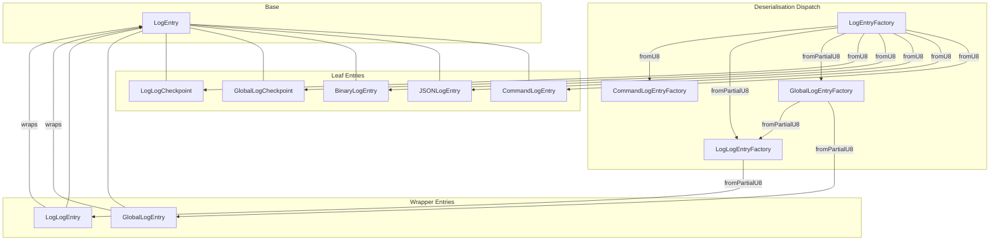
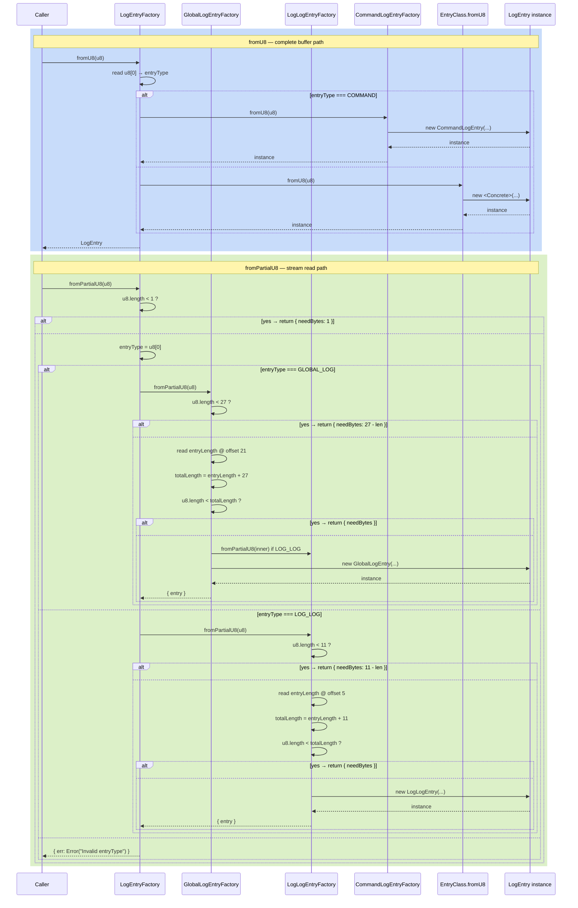

# LogEntry — Abstract Base Class

**Module: Entry Types**

## Overview

`LogEntry` is the abstract base class for every entry stored in a logrd log. All concrete entry types (`GlobalLogEntry`, `LogLogEntry`, `CommandLogEntry`, `JSONLogEntry`, `BinaryLogEntry`, `GlobalLogCheckpoint`, `LogLogCheckpoint`) **extend `LogEntry`** and satisfy the [Liskov substitution principle](https://en.wikipedia.org/wiki/Liskov_substitution_principle) — every subclass can be used wherever a `LogEntry` is expected without altering the correctness of the system.

The class defines:

- The **serialization contract** (`u8()`, `u8s()`)
- The **byte-length contract** (`byteLength()`)
- The **checksum contract** (`cksum()`)
- The **deserialization contract** (`fromU8()`, `fromPartialU8()` — both static)

Subclasses override the methods that apply; default implementations return a no-op or throw.

---

## Component Specifications

### Full TypeScript Declaration

```typescript
export default abstract class LogEntry {
    cksumNum: number = 0

    constructor()

    /** Serialise entry payload to a single contiguous Uint8Array. */
    u8(): Uint8Array

    /** Serialise entry payload as ordered array of chunks (allows zero-copy prefix
     *  concatenation for GlobalLogEntry / LogLogEntry wrappers). */
    u8s(): Uint8Array[]

    /** Total on-wire byte length (including any type-byte prefix). */
    byteLength(): number

    /** Compute (or return cached) CRC32 checksum scoped to entryNum.
     *  Default returns 0; subclasses that need checksums override this. */
    cksum(entryNum: number): number

    /** For entry types with a fixed on-wire length, set this to the known
     *  constant.  0 means variable-length entry (the default). */
    static expectedByteLength: number = 0

    /** Deserialise a complete entry from a buffer that contains every byte.
     *  Throws on invalid data or wrong entry type. */
    static fromU8(u8: Uint8Array): LogEntry

    /** Partial-deserialise from an *incomplete* buffer (disk/network stream).
     *  Never throws.  Returns one of:
     *    - `{ entry }`              — the complete entry
     *    - `{ needBytes: N }`       — N more bytes required
     *    - `{ err: Error }`         — data is irrecoverably corrupt */
    static fromPartialU8(u8: Uint8Array): {
        entry?: LogEntry | null
        needBytes?: number
        err?: Error
    }
}
```

### Property & Method Details

| Member | Type / Signature | Overrideable | Default Behaviour |
|---|---|---|---|
| `cksumNum` | `number` | No (owned by instance) | `0` |
| `constructor()` | `() => LogEntry` | Yes | no-op |
| `u8()` | `() => Uint8Array` | Yes | throws `Error("Not implemented")` |
| `u8s()` | `() => Uint8Array[]` | Yes | returns `[]` |
| `byteLength()` | `() => number` | Yes | returns `0` |
| `cksum(entryNum)` | `(entryNum: number) => number` | Yes | returns `0` |
| `static expectedByteLength` | `number` | Yes (override on subclass) | `0` (= variable length) |
| `static fromU8(u8)` | `(u8: Uint8Array) => LogEntry` | Yes | throws `Error("Not implemented")` |
| `static fromPartialU8(u8)` | `(u8: Uint8Array) => Result` | Yes | throws `Error("Not implemented")` |

---

## System Architecture



### Entry Type IDs

| Enum Value | Numeric ID (hex) | Concrete Class |
|---|---|---|
| `EntryType.GLOBAL_LOG` | `0x00` | `GlobalLogEntry` |
| `EntryType.LOG_LOG` | `0x01` | `LogLogEntry` |
| `EntryType.GLOBAL_LOG_CHECKPOINT` | `0x02` | `GlobalLogCheckpoint` |
| `EntryType.LOG_LOG_CHECKPOINT` | `0x03` | `LogLogCheckpoint` |
| `EntryType.COMMAND` | `0x04` | `CommandLogEntry` |
| `EntryType.BINARY` | `0x05` | `BinaryLogEntry` |
| `EntryType.JSON` | `0x06` | `JSONLogEntry` |

### Fixed-Length Entries

| Class | `expectedByteLength` | Constant |
|---|---|---|
| `GlobalLogCheckpoint` | `9` | `GLOBAL_LOG_CHECKPOINT_BYTE_LENGTH` |
| `LogLogCheckpoint` | `13` | `LOG_LOG_CHECKPOINT_BYTE_LENGTH` |

### Wrapper Prefix Layouts

**GlobalLogEntry** (27‑byte prefix):
```
┌────┬──────────────────────┬──────────┬──────┬──────────┐
│ Ty │ LogId (16 bytes)     │ EntryNum │ Len  │ CRC32    │
│ 1  │ 16                   │ 4 (u32)  │ 2(LE)│ 4 (u32)  │
└────┴──────────────────────┴──────────┴──────┴──────────┘
```

**LogLogEntry** (11‑byte prefix):
```
┌────┬──────────┬──────┬──────────┐
│ Ty │ EntryNum │ Len  │ CRC32    │
│ 1  │ 4 (u32)  │ 2(LE)│ 4 (u32)  │
└────┴──────────┴──────┴──────────┘
```

---

## Detailed Data Flow



---

## Visualization

```html
<!DOCTYPE html>
<html>
<head>
  <meta charset="utf-8" />
  <style>
    body { margin: 0; background: #0d1117; font-family: system-ui, sans-serif; }
    #container { width: 100%; height: 100vh; display: flex; flex-direction: column; align-items: center; justify-content: center; }
    svg { display: block; }
    .controls { margin-top: 20px; display: flex; gap: 12px; align-items: center; flex-wrap: wrap; justify-content: center; }
    .controls button { background: #21262d; border: 1px solid #30363d; color: #c9d1d9; padding: 6px 16px; border-radius: 6px; cursor: pointer; font-size: 14px; }
    .controls button:hover { background: #30363d; }
    .controls button[data-testid="play-pause"] { background: #1f6feb; border-color: #1f6feb; color: #fff; }
    .info { color: #8b949e; font-size: 13px; }
    .node rect { stroke-width: 2; }
    .edgePath path { fill: none; stroke-width: 2; }
    .root-node rect { fill: #1f6feb; stroke: #58a6ff; }
    .wrapper-node rect { fill: #d29922; stroke: #e3b341; }
    .leaf-node rect { fill: #238636; stroke: #3fb950; }
    .checkpoint-node rect { fill: #9e6a03; stroke: #d29922; }
    text { fill: #c9d1d9; font-size: 13px; text-anchor: middle; dominant-baseline: central; }
  </style>
</head>
<body>
<div id="container">
  <svg id="svg" width="900" height="550"></svg>
  <div class="controls">
    <button data-testid="play-pause" id="playPauseBtn">&#9646;&#9646;</button>
    <button id="prevBtn">&#9664; Prev</button>
    <button id="nextBtn">Next &#9654;</button>
    <button id="resetBtn">Reset</button>
    <span class="info">Keyframe <span id="kf-current">0</span> / <span id="kf-total">0</span></span>
    <span id="stateDisplay" class="info" style="margin-left:8px;">&#8203;</span>
  </div>
</div>
<script>
(function() {
  // ---- hierarchy data ----
  const root  = { id: 'LogEntry',        cls: 'root-node',       children: [] };
  const gle   = { id: 'GlobalLogEntry',  cls: 'wrapper-node',    children: [] };
  const lle   = { id: 'LogLogEntry',     cls: 'wrapper-node',    children: [] };
  const cmd   = { id: 'CommandLogEntry', cls: 'leaf-node',       children: [] };
  const json  = { id: 'JSONLogEntry',    cls: 'leaf-node',       children: [] };
  const bin   = { id: 'BinaryLogEntry',  cls: 'leaf-node',       children: [] };
  const glchk = { id: 'GlobalLogChkpt',  cls: 'checkpoint-node', children: [] };
  const llchk = { id: 'LogLogChkpt',     cls: 'checkpoint-node', children: [] };
  root.children = [gle, lle, cmd, json, bin, glchk, llchk];

  // ---- layout helpers ----
  const W = 160, H = 42, GX = 200, GY = 70, ROOT_Y = 40;
  const total = 7;
  const startX = (900 - total * GX + GX) / 2;

  // ---- keyframes ----
  const keyframes = [];
  // kf 0: all greyed out
  keyframes.push(() => {
    d3.selectAll('.cls-node').attr('opacity', 0.25);
    d3.selectAll('.cls-label').attr('opacity', 0.25);
    d3.selectAll('.cls-edge').attr('opacity', 0.08);
  });
  // kf 1: highlight root
  keyframes.push(() => {
    d3.selectAll('.cls-node').attr('opacity', 0.15);
    d3.selectAll('.cls-label').attr('opacity', 0.15);
    d3.selectAll('.cls-edge').attr('opacity', 0.05);
    d3.select('#node-LogEntry').attr('opacity', 1);
    d3.select('#label-LogEntry').attr('opacity', 1);
  });
  // kf 2: highlight wrapper entries
  keyframes.push(() => {
    d3.selectAll('.cls-node').attr('opacity', 0.15);
    d3.selectAll('.cls-label').attr('opacity', 0.15);
    d3.selectAll('.cls-edge').attr('opacity', 0.05);
    ['LogEntry','GlobalLogEntry','LogLogEntry'].forEach(id => {
      d3.select('#node-'+id).attr('opacity',1);
      d3.select('#label-'+id).attr('opacity',1);
    });
  });
  // kf 3: highlight leaf entries
  keyframes.push(() => {
    d3.selectAll('.cls-node').attr('opacity', 0.15);
    d3.selectAll('.cls-label').attr('opacity', 0.15);
    d3.selectAll('.cls-edge').attr('opacity', 0.05);
    ['LogEntry','CommandLogEntry','JSONLogEntry','BinaryLogEntry'].forEach(id => {
      d3.select('#node-'+id).attr('opacity',1);
      d3.select('#label-'+id).attr('opacity',1);
    });
  });
  // kf 4: highlight checkpoint entries
  keyframes.push(() => {
    d3.selectAll('.cls-node').attr('opacity', 0.15);
    d3.selectAll('.cls-label').attr('opacity', 0.15);
    d3.selectAll('.cls-edge').attr('opacity', 0.05);
    ['LogEntry','GlobalLogChkpt','LogLogChkpt'].forEach(id => {
      d3.select('#node-'+id).attr('opacity',1);
      d3.select('#label-'+id).attr('opacity',1);
    });
  });
  // kf 5: full all
  keyframes.push(() => {
    d3.selectAll('.cls-node').attr('opacity', 1);
    d3.selectAll('.cls-label').attr('opacity', 1);
    d3.selectAll('.cls-edge').attr('opacity', 0.3);
  });
  window.ANIMATION_KEYFRAMES = keyframes;

  // ---- render ----
  const svg = d3.select('#svg');
  const g = svg.append('g').attr('transform', 'translate(0,20)');

  root.children.forEach((child, i) => {
    const cx = startX + i * GX;
    const cy = ROOT_Y + GY;
    // edge from root
    g.append('line')
      .attr('x1', 450).attr('y1', ROOT_Y + H)
      .attr('x2', cx + W/2).attr('y2', cy)
      .attr('class', 'cls-edge')
      .attr('stroke', '#484f58').attr('stroke-width', 1.5);
    // node
    const nodeG = g.append('g')
      .attr('id', 'node-'+child.id)
      .attr('class', 'cls-node ' + child.cls);
    nodeG.append('rect')
      .attr('x', cx).attr('y', cy)
      .attr('width', W).attr('height', H).attr('rx', 8);
    nodeG.append('text')
      .attr('id', 'label-'+child.id)
      .attr('class', 'cls-label')
      .attr('x', cx + W/2).attr('y', cy + H/2)
      .text(child.id);
  });
  // root node
  const rootG = g.append('g')
    .attr('id', 'node-LogEntry')
    .attr('class', 'cls-node root-node');
  rootG.append('rect')
    .attr('x', 370).attr('y', ROOT_Y)
    .attr('width', 160).attr('height', H).attr('rx', 8);
  rootG.append('text')
    .attr('id', 'label-LogEntry')
    .attr('class', 'cls-label')
    .attr('x', 450).attr('y', ROOT_Y + H/2)
    .text('LogEntry');

  // ---- animation state ----
  let currentKF = 0;
  let playing = false;
  let interval = null;

  const totalKF = keyframes.length;
  document.getElementById('kf-total').textContent = totalKF;

  function applyKF(idx) {
    currentKF = Math.max(0, Math.min(totalKF - 1, idx));
    keyframes[currentKF]();
    document.getElementById('kf-current').textContent = currentKF;
    const st = document.getElementById('stateDisplay');
    st.innerHTML = currentKF === 0 ? '&#9679; dimmed' :
                   currentKF === totalKF-1 ? '&#9679; full' :
                   '&#9679; step ' + currentKF;
  }

  window.jumpToKeyframe = function(idx) { applyKF(idx); };
  window.getAnimationState = function() {
    return { currentKeyframe: currentKF, totalKeyframes: totalKF, playing: playing };
  };
  window.resetAnimation = function() {
    if (interval) { clearInterval(interval); interval = null; }
    playing = false;
    document.getElementById('playPauseBtn').innerHTML = '&#9654;';
    applyKF(0);
  };
  window.ANIMATION_DURATION_MS = totalKF * 800;
  window.ANIMATION_VERIFICATION = function() {
    const failures = [];
    if (typeof window.ANIMATION_KEYFRAMES === 'undefined' || !Array.isArray(window.ANIMATION_KEYFRAMES)) failures.push('ANIMATION_KEYFRAMES missing');
    if (typeof window.ANIMATION_DURATION_MS === 'undefined') failures.push('ANIMATION_DURATION_MS missing');
    if (typeof window.ANIMATION_VERIFICATION !== 'function') failures.push('ANIMATION_VERIFICATION missing');
    if (typeof window.jumpToKeyframe !== 'function') failures.push('jumpToKeyframe missing');
    if (typeof window.resetAnimation !== 'function') failures.push('resetAnimation missing');
    if (typeof window.getAnimationState !== 'function') failures.push('getAnimationState missing');
    const pp = document.querySelector('[data-testid="play-pause"]');
    if (!pp) failures.push('[data-testid="play-pause"] missing');
    if (!document.getElementById('kf-total')) failures.push('#kf-total missing');
    return { ok: failures.length === 0, failures };
  };

  // ---- controls ----
  document.getElementById('playPauseBtn').addEventListener('click', function() {
    if (playing) {
      clearInterval(interval); interval = null;
      playing = false;
      this.innerHTML = '&#9654;';
    } else {
      playing = true;
      this.innerHTML = '&#9646;&#9646;';
      interval = setInterval(() => {
        if (currentKF >= totalKF - 1) {
          clearInterval(interval); interval = null;
          playing = false;
          document.getElementById('playPauseBtn').innerHTML = '&#9654;';
          return;
        }
        applyKF(currentKF + 1);
      }, 800);
    }
  });
  document.getElementById('prevBtn').addEventListener('click', () => applyKF(currentKF - 1));
  document.getElementById('nextBtn').addEventListener('click', () => applyKF(currentKF + 1));
  document.getElementById('resetBtn').addEventListener('click', window.resetAnimation);

  applyKF(0);

  // expose for verification after load
  window.ANIMATION_VERIFICATION_RESULT = window.ANIMATION_VERIFICATION();
})();
</script>
</body>
</html>
```

---

## Testing Requirements

### Unit Tests

| # | Test | Expected Outcome |
|---|---|---|
| 1 | Instantiate `LogEntry` directly (if JS allowed it) | Constructor runs without error; `cksumNum` is `0` |
| 2 | Call `u8()` on a bare `LogEntry` instance | Throws `Error("Not implemented")` |
| 3 | Call `u8s()` on a bare `LogEntry` instance | Returns `[]` |
| 4 | Call `byteLength()` on a bare `LogEntry` instance | Returns `0` |
| 5 | Call `cksum(42)` on a bare `LogEntry` instance | Returns `0` |
| 6 | Call `LogEntry.fromU8(new Uint8Array(1))` | Throws `Error("Not implemented")` |
| 7 | Call `LogEntry.fromPartialU8(new Uint8Array(1))` | Throws `Error("Not implemented")` |
| 8 | `LogEntry.expectedByteLength` | Equals `0` |

### Subclass Contract Tests

Every concrete subclass **must** pass the following (enforced by `instanceof LogEntry` and the Liskov substitution principle):

| # | Test | Rationale |
|---|---|---|
| 1 | `entry instanceof LogEntry` | True for every entry returned by any factory |
| 2 | `entry.byteLength() >= entry.u8().byteLength` | The on-wire length is never less than the payload |
| 3 | `entry.u8s().reduce((a,b) => a + b.byteLength, 0) === entry.u8().byteLength` | `u8s()` chunks concatenate to the same payload as `u8()` |
| 4 | `entry.cksum(entryNum)` is idempotent | Second call returns cached `cksumNum` without recomputation |
| 5 | `entry.cksumNum` starts at `0` | Unset sentinel; set to non-zero after first `cksum()` call |

### Factory Round-Trip Tests

| # | Test |
|---|---|
| 1 | `LogEntryFactory.fromU8(entry.u8s())` returns an equivalent entry for every complete-serialisation subclass |
| 2 | `CommandLogEntryFactory.fromU8(u8)` correctly dispatches to `COMMAND_CLASS[commandName]` |
| 3 | `GlobalLogEntryFactory.fromPartialU8(u8)` with a truncated buffer returns `{ needBytes }` |
| 4 | `GlobalLogEntryFactory.fromPartialU8(u8)` with corrupt `entryType` returns `{ err }` |
| 5 | `LogLogEntryFactory.fromPartialU8(u8)` with `entryLength > MAX_ENTRY_SIZE` returns `{ err }` |
| 6 | `LogEntryFactory.fromU8(u8)` with unknown `entryType` throws `Error("Invalid entryType")` |
| 7 | `LogEntryFactory.fromPartialU8(u8)` with `u8.length < 1` returns `{ needBytes: 1 }` |

### Checkpoint Fixed-Length Tests

| # | Test |
|---|---|
| 1 | `GlobalLogCheckpoint.expectedByteLength === 9` |
| 2 | `LogLogCheckpoint.expectedByteLength === 13` |
| 3 | `new GlobalLogCheckpoint(...).byteLength() === GLOBAL_LOG_CHECKPOINT_BYTE_LENGTH` |
| 4 | `new LogLogCheckpoint(...).byteLength() === LOG_LOG_CHECKPOINT_BYTE_LENGTH` |

### Edge Cases

| # | Scenario | Assertion |
|---|---|---|
| 1 | `fromPartialU8` receives a buffer that starts with a valid entry type but is too short for the prefix | Returns `{ needBytes }` |
| 2 | `fromPartialU8` receives a buffer that is exactly long enough for the prefix but too short for the payload | Returns `{ needBytes }` |
| 3 | `fromPartialU8` receives a buffer with negative-length payload (u16 overflow guard) | Returns `{ err }` |
| 4 | Checksum mismatch during `fromU8` in a class that validates on construction | Throws or returns `{ err }` depending on the path |
| 5 | `GlobalLogEntry` wrapping a `LogLogEntry` wrapping a `CommandLogEntry` (deep nesting) | Full round-trip succeeds |

---

## 7. Source-Test Cross-References

### Test Coverage

| Test Spec | Path |
|---|---|
| No test spec | |
