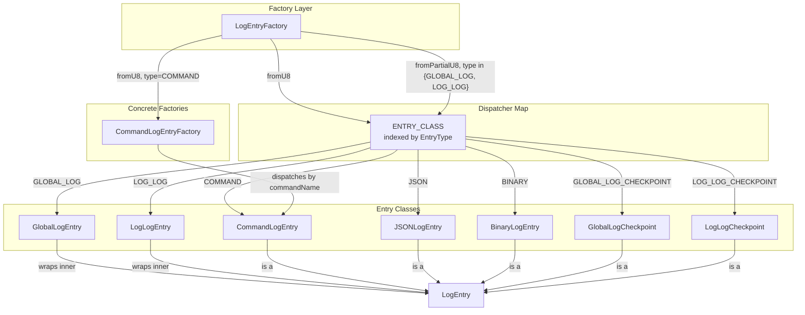
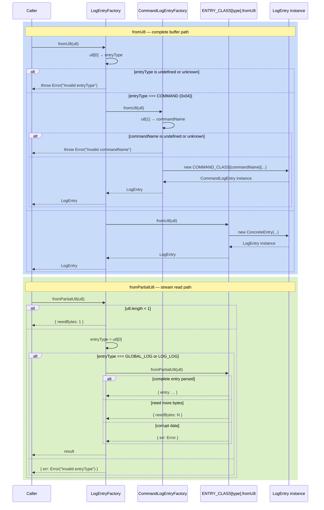

# LogEntryFactory — Entry Deserialisation Dispatcher

**Module: Entry Types**

## Overview

`LogEntryFactory` is the **top-level deserialisation entry point** for all logrd entry types. It reads the first byte of a `Uint8Array` as an `EntryType` enum value and dispatches to the appropriate concrete factory or class.

Two static methods are provided:

| Method | Input | Behaviour |
|---|---|---|
| `fromU8(u8)` | Buffer known to contain a **complete** entry | Throws on unknown `entryType`; delegates `COMMAND` to `CommandLogEntryFactory.fromU8`, all other types to `ENTRY_CLASS[entryType].fromU8`. |
| `fromPartialU8(u8)` | Buffer that **may be incomplete** (stream/disk read) | Only accepts `EntryType.GLOBAL_LOG` or `EntryType.LOG_LOG` (entries that carry their own length prefix). Never throws — returns `{ needBytes }`, `{ entry }`, or `{ err }`. |

The factory is never instantiated; both methods are `static`.

---

## Component Specifications

### Full TypeScript Declaration

```typescript
import { ENTRY_CLASS, EntryType } from "../globals"
import CommandLogEntryFactory from "./command-log-entry-factory"
import LogEntry from "./log-entry"

export default class LogEntryFactory {
    static fromU8(u8: Uint8Array): LogEntry

    static fromPartialU8(u8: Uint8Array): {
        entry?: LogEntry | null
        needBytes?: number
        err?: Error
    }
}
```

### Method Details

| Method | Signature | Dispatch Logic | Error Behaviour |
|---|---|---|---|
| `fromU8` | `(u8: Uint8Array) => LogEntry` | `u8[0]` → `EntryType`. COMMAND → `CommandLogEntryFactory.fromU8(u8)`. All others → `ENTRY_CLASS[entryType].fromU8(u8)`. | Throws `Error("Invalid entryType: <val>")` if `u8[0]` is `undefined` or not a known `EntryType`. |
| `fromPartialU8` | `(u8: Uint8Array) => { entry?, needBytes?, err? }` | If `u8.length < 1` → `{ needBytes: 1 }`. If `entryType === GLOBAL_LOG` or `LOG_LOG` → `ENTRY_CLASS[entryType].fromPartialU8(u8)`. All others → `{ err }`. | Never throws. Returns `{ err: Error("Invalid entryType: <val>") }` for unsupported types. |

### EntryType Dispatch Table

| `u8[0]` value | `EntryType` enum | `fromU8` target | `fromPartialU8` support |
|---|---|---|---|
| `0x00` | `GLOBAL_LOG` | `GlobalLogEntry.fromU8` | ✅ |
| `0x01` | `LOG_LOG` | `LogLogEntry.fromU8` | ✅ |
| `0x02` | `GLOBAL_LOG_CHECKPOINT` | `GlobalLogCheckpoint.fromU8` | ❌ (returns `{ err }`) |
| `0x03` | `LOG_LOG_CHECKPOINT` | `LogLogCheckpoint.fromU8` | ❌ (returns `{ err }`) |
| `0x04` | `COMMAND` | `CommandLogEntryFactory.fromU8` | ❌ (returns `{ err }`) |
| `0x05` | `BINARY` | `BinaryLogEntry.fromU8` | ❌ (returns `{ err }`) |
| `0x06` | `JSON` | `JSONLogEntry.fromU8` | ❌ (returns `{ err }`) |

---

## System Architecture



### Key Design Decisions

1. **Two-phase dispatch for COMMAND**: `CommandLogEntry` does not have its own `fromU8` on the class — the factory special-cases `EntryType.COMMAND` and routes to `CommandLogEntryFactory.fromU8`, which in turn reads `u8[1]` as the `commandName` and dispatches to `COMMAND_CLASS[commandName]`.

2. **`fromPartialU8` is intentionally restricted**: Only `GLOBAL_LOG` and `LOG_LOG` entries carry their own length prefix (embedded in the 27‑byte / 11‑byte header), making them the only types that support length-delimited streaming. All other types are fixed‑size (checkpoints) or must be frame-delimited by the caller.

---

## Detailed Data Flow



### Partial Read Contract

The `fromPartialU8` contract guarantees:

- **Never throws** — all error paths return `{ err }`.
- `{ needBytes: 1 }` — returned when the buffer is empty and the first type byte is required.
- `{ needBytes: N }` — returned when a known entry type is found but insufficient bytes are available for its declared prefix or payload length.
- `{ entry }` — returned when a complete, valid entry was successfully parsed.
- `{ err }` — returned when the data is irrecoverably corrupt (invalid type, impossible length, checksum mismatch).

---

## Visualization

```html
<!DOCTYPE html>
<html>
<head>
  <meta charset="utf-8" />
  <style>
    body { margin: 0; background: #0d1117; font-family: system-ui, sans-serif; }
    #container { width: 100%; height: 100vh; display: flex; flex-direction: column; align-items: center; justify-content: center; }
    svg { display: block; }
    .controls { margin-top: 20px; display: flex; gap: 12px; align-items: center; flex-wrap: wrap; justify-content: center; }
    .controls button { background: #21262d; border: 1px solid #30363d; color: #c9d1d9; padding: 6px 16px; border-radius: 6px; cursor: pointer; font-size: 14px; }
    .controls button:hover { background: #30363d; }
    .controls button[data-testid="play-pause"] { background: #1f6feb; border-color: #1f6feb; color: #fff; }
    .info { color: #8b949e; font-size: 13px; }
    .node rect { stroke-width: 2; }
    .edgePath path { fill: none; stroke-width: 2; }
    .factory-node rect { fill: #1f6feb; stroke: #58a6ff; }
    .dispatcher-node rect { fill: #d29922; stroke: #e3b341; }
    .entry-node rect { fill: #238636; stroke: #3fb950; }
    .unsupported-node rect { fill: #21262d; stroke: #484f58; }
    text { fill: #c9d1d9; font-size: 13px; text-anchor: middle; dominant-baseline: central; }
  </style>
</head>
<body>
<div id="container">
  <svg id="svg" width="960" height="560"></svg>
  <div class="controls">
    <button data-testid="play-pause" id="playPauseBtn">&#9646;&#9646;</button>
    <button id="prevBtn">&#9664; Prev</button>
    <button id="nextBtn">Next &#9654;</button>
    <button id="resetBtn">Reset</button>
    <span class="info">Keyframe <span id="kf-current">0</span> / <span id="kf-total">0</span></span>
    <span id="stateDisplay" class="info" style="margin-left:8px;">&#8203;</span>
  </div>
</div>
<script>
(function() {
  const nodes = [
    { id: 'LogEntryFactory',      cls: 'factory-node',    tier: 0 },
    { id: 'CommandLogEntryFactory', cls: 'dispatcher-node', tier: 1 },
    { id: 'ENTRY_CLASS map',      cls: 'dispatcher-node', tier: 1 },
    { id: 'CommandLogEntry',      cls: 'entry-node',      tier: 2 },
    { id: 'GlobalLogEntry',       cls: 'entry-node',      tier: 2 },
    { id: 'LogLogEntry',          cls: 'entry-node',      tier: 2 },
    { id: 'JSONLogEntry',         cls: 'entry-node',      tier: 2 },
    { id: 'BinaryLogEntry',       cls: 'entry-node',      tier: 2 },
    { id: 'GlobalLogChkpt',       cls: 'unsupported-node',tier: 2 },
    { id: 'LogLogChkpt',          cls: 'unsupported-node',tier: 2 },
  ];
  const edges = [
    { src: 'LogEntryFactory',      dst: 'CommandLogEntryFactory', label: 'fromU8: COMMAND' },
    { src: 'LogEntryFactory',      dst: 'ENTRY_CLASS map',        label: 'fromU8: other' },
    { src: 'LogEntryFactory',      dst: 'ENTRY_CLASS map',        label: 'fromPartialU8: GLOBAL_LOG | LOG_LOG' },
    { src: 'CommandLogEntryFactory', dst: 'CommandLogEntry',      label: 'COMMAND_CLASS[name]' },
    { src: 'ENTRY_CLASS map',      dst: 'GlobalLogEntry',         label: '0x00' },
    { src: 'ENTRY_CLASS map',      dst: 'LogLogEntry',            label: '0x01' },
    { src: 'ENTRY_CLASS map',      dst: 'CommandLogEntry',        label: '0x04' },
    { src: 'ENTRY_CLASS map',      dst: 'JSONLogEntry',           label: '0x06' },
    { src: 'ENTRY_CLASS map',      dst: 'BinaryLogEntry',         label: '0x05' },
    { src: 'ENTRY_CLASS map',      dst: 'GlobalLogChkpt',         label: '0x02' },
    { src: 'ENTRY_CLASS map',      dst: 'LogLogChkpt',            label: '0x03' },
  ];

  const W = 150, H = 40, GX = 170, GY = 100, margins = { top: 40, left: 60 };
  const tiers = {};
  nodes.forEach(n => { if (!tiers[n.tier]) tiers[n.tier] = []; tiers[n.tier].push(n); });
  const tierY = {};
  let yAcc = margins.top;
  const sortedTiers = Object.keys(tiers).sort((a,b) => a-b);
  sortedTiers.forEach((t, i) => { tierY[t] = yAcc; yAcc += GY; });

  const svg = d3.select('#svg');
  const g = svg.append('g');

  const nodeMap = {};
  nodes.forEach(n => {
    const tier = n.tier;
    const tierNodes = tiers[tier];
    const idx = tierNodes.indexOf(n);
    const totalW = tierNodes.length * GX;
    const startX = (960 - totalW) / 2;
    const cx = startX + idx * GX;
    const cy = tierY[tier];
    n._x = cx; n._y = cy;
    nodeMap[n.id] = n;
  });

  edges.forEach(e => {
    const s = nodeMap[e.src], d = nodeMap[e.dst];
    if (!s || !d) return;
    const sx = s._x + W/2, sy = s._y + H;
    const dx = d._x + W/2, dy = d._y;
    g.append('line')
      .attr('class', 'cls-edge')
      .attr('x1', sx).attr('y1', sy)
      .attr('x2', dx).attr('y2', dy)
      .attr('stroke', '#484f58').attr('stroke-width', 1.5);
  });

  nodes.forEach(n => {
    const nodeG = g.append('g')
      .attr('id', 'node-'+n.id.replace(/\s+/g, ''))
      .attr('class', 'cls-node ' + n.cls);
    nodeG.append('rect')
      .attr('x', n._x).attr('y', n._y)
      .attr('width', W).attr('height', H).attr('rx', 8);
    nodeG.append('text')
      .attr('class', 'cls-label')
      .attr('x', n._x + W/2).attr('y', n._y + H/2)
      .text(n.id);
  });

  const keyframes = [];
  keyframes.push(() => {
    d3.selectAll('.cls-node').attr('opacity', 0.2);
    d3.selectAll('.cls-label').attr('opacity', 0.2);
    d3.selectAll('.cls-edge').attr('opacity', 0.06);
  });
  keyframes.push(() => {
    d3.selectAll('.cls-node, .cls-label').attr('opacity', 0.15);
    d3.selectAll('.cls-edge').attr('opacity', 0.04);
    d3.select('#node-LogEntryFactory').attr('opacity', 1);
    d3.select('#node-LogEntryFactory text').attr('opacity', 1);
  });
  keyframes.push(() => {
    d3.selectAll('.cls-node, .cls-label').attr('opacity', 0.15);
    d3.selectAll('.cls-edge').attr('opacity', 0.04);
    ['LogEntryFactory','CommandLogEntryFactory','ENTRY_CLASSmap'].forEach(id => {
      d3.select('#node-'+id).attr('opacity', 1);
      d3.select('#node-'+id+' text').attr('opacity', 1);
    });
  });
  keyframes.push(() => {
    d3.selectAll('.cls-node, .cls-label').attr('opacity', 0.15);
    d3.selectAll('.cls-edge').attr('opacity', 0.04);
    nodes.forEach(n => {
      if (n.cls !== 'unsupported-node') {
        d3.select('#node-'+n.id.replace(/\s+/g, '')).attr('opacity', 1);
        d3.select('#node-'+n.id.replace(/\s+/g, '')+' text').attr('opacity', 1);
      }
    });
  });
  keyframes.push(() => {
    d3.selectAll('.cls-node').attr('opacity', 1);
    d3.selectAll('.cls-label').attr('opacity', 1);
    d3.selectAll('.cls-edge').attr('opacity', 0.3);
  });
  window.ANIMATION_KEYFRAMES = keyframes;

  let currentKF = 0, playing = false, interval = null;
  const totalKF = keyframes.length;
  document.getElementById('kf-total').textContent = totalKF;

  function applyKF(idx) {
    currentKF = Math.max(0, Math.min(totalKF - 1, idx));
    keyframes[currentKF]();
    document.getElementById('kf-current').textContent = currentKF;
    const st = document.getElementById('stateDisplay');
    st.innerHTML = currentKF === 0 ? '&#9679; dimmed' :
                   currentKF === totalKF-1 ? '&#9679; full' :
                   '&#9679; step ' + currentKF;
  }

  window.jumpToKeyframe = function(idx) { applyKF(idx); };
  window.getAnimationState = function() {
    return { currentKeyframe: currentKF, totalKeyframes: totalKF, playing: playing };
  };
  window.resetAnimation = function() {
    if (interval) { clearInterval(interval); interval = null; }
    playing = false;
    document.getElementById('playPauseBtn').innerHTML = '&#9654;';
    applyKF(0);
  };
  window.ANIMATION_DURATION_MS = totalKF * 800;
  window.ANIMATION_VERIFICATION = function() {
    const failures = [];
    if (typeof window.ANIMATION_KEYFRAMES === 'undefined' || !Array.isArray(window.ANIMATION_KEYFRAMES)) failures.push('ANIMATION_KEYFRAMES missing');
    if (typeof window.ANIMATION_DURATION_MS === 'undefined') failures.push('ANIMATION_DURATION_MS missing');
    if (typeof window.ANIMATION_VERIFICATION !== 'function') failures.push('ANIMATION_VERIFICATION missing');
    if (typeof window.jumpToKeyframe !== 'function') failures.push('jumpToKeyframe missing');
    if (typeof window.resetAnimation !== 'function') failures.push('resetAnimation missing');
    if (typeof window.getAnimationState !== 'function') failures.push('getAnimationState missing');
    const pp = document.querySelector('[data-testid="play-pause"]');
    if (!pp) failures.push('[data-testid="play-pause"] missing');
    if (!document.getElementById('kf-total')) failures.push('#kf-total missing');
    return { ok: failures.length === 0, failures };
  };

  document.getElementById('playPauseBtn').addEventListener('click', function() {
    if (playing) {
      clearInterval(interval); interval = null;
      playing = false;
      this.innerHTML = '&#9654;';
    } else {
      playing = true;
      this.innerHTML = '&#9646;&#9646;';
      interval = setInterval(() => {
        if (currentKF >= totalKF - 1) {
          clearInterval(interval); interval = null;
          playing = false;
          document.getElementById('playPauseBtn').innerHTML = '&#9654;';
          return;
        }
        applyKF(currentKF + 1);
      }, 800);
    }
  });
  document.getElementById('prevBtn').addEventListener('click', () => applyKF(currentKF - 1));
  document.getElementById('nextBtn').addEventListener('click', () => applyKF(currentKF + 1));
  document.getElementById('resetBtn').addEventListener('click', window.resetAnimation);

  applyKF(0);
  window.ANIMATION_VERIFICATION_RESULT = window.ANIMATION_VERIFICATION();
})();
</script>
</body>
</html>
```

---

## Testing Requirements

### Unit Tests — `fromU8`

| # | Test | Expected Outcome |
|---|---|---|
| 1 | `LogEntryFactory.fromU8(new Uint8Array([]))` | Throws `Error("Invalid entryType: undefined")` |
| 2 | `LogEntryFactory.fromU8(new Uint8Array([0xFF]))` | Throws `Error("Invalid entryType: 255")` |
| 3 | `LogEntryFactory.fromU8(buffer with EntryType.GLOBAL_LOG)` | Returns `GlobalLogEntry` (delegates to `GlobalLogEntry.fromU8`) |
| 4 | `LogEntryFactory.fromU8(buffer with EntryType.LOG_LOG)` | Returns `LogLogEntry` (delegates to `LogLogEntry.fromU8`) |
| 5 | `LogEntryFactory.fromU8(buffer with EntryType.COMMAND)` | Returns `CommandLogEntry` via `CommandLogEntryFactory.fromU8` |
| 6 | `LogEntryFactory.fromU8(buffer with EntryType.JSON)` | Returns `JSONLogEntry` (delegates to `JSONLogEntry.fromU8`) |
| 7 | `LogEntryFactory.fromU8(buffer with EntryType.BINARY)` | Returns `BinaryLogEntry` |
| 8 | `LogEntryFactory.fromU8(buffer with EntryType.GLOBAL_LOG_CHECKPOINT)` | Returns `GlobalLogCheckpoint` |
| 9 | `LogEntryFactory.fromU8(buffer with EntryType.LOG_LOG_CHECKPOINT)` | Returns `LogLogCheckpoint` |

### Unit Tests — `fromPartialU8`

| # | Test | Expected Outcome |
|---|---|---|
| 1 | `LogEntryFactory.fromPartialU8(new Uint8Array([]))` | `{ needBytes: 1 }` |
| 2 | `LogEntryFactory.fromPartialU8(new Uint8Array([0xFF]))` | `{ err: Error("Invalid entryType: 255") }` |
| 3 | `LogEntryFactory.fromPartialU8(new Uint8Array([0x00, ...partial]))` | Delegates to `GlobalLogEntry.fromPartialU8` |
| 4 | `LogEntryFactory.fromPartialU8(new Uint8Array([0x01, ...partial]))` | Delegates to `LogLogEntry.fromPartialU8` |
| 5 | `LogEntryFactory.fromPartialU8(new Uint8Array([0x04, ...]))` | `{ err: Error(...) }` — COMMAND not supported in partial path |
| 6 | `LogEntryFactory.fromPartialU8(new Uint8Array([0x02, ...]))` | `{ err: Error(...) }` — GLOBAL_LOG_CHECKPOINT not supported |

### Contract Tests

| # | Test | Rationale |
|---|---|---|
| 1 | `result instanceof LogEntry` for every `fromU8` call | All returned values are `LogEntry` subclasses |
| 2 | `fromPartialU8` never throws for any input | Contract guarantees error returns, never exceptions |
| 3 | `{ needBytes }` result is always a positive integer | The caller can use this to `await` exactly N more bytes |
| 4 | `{ err }` is only returned for known-invalid data | Corrupt type byte, impossible length, etc. |
| 5 | `LogEntryFactory.fromPartialU8(u8)` with a *complete* GLOBAL_LOG entry returns `{ entry }` | Correct round-trip for streamed entries |

### Edge Cases

| # | Scenario | Assertion |
|---|---|---|
| 1 | Buffer length is exactly 1 with an unsupported type | Returns `{ err }` — no crash on single-byte buffer |
| 2 | Buffer length is exactly 1 with GLOBAL_LOG or LOG_LOG | Delegates to sub-factory which checks minimum prefix length |
| 3 | Deep nesting: GLOBAL_LOG wrapping LOG_LOG wrapping COMMAND | `fromPartialU8` recursively resolves inner entries |
| 4 | `entryType` byte is `undefined` (`u8.at(0)` returns `undefined` on empty typed array subset) | Throws `Error("Invalid entryType: undefined")` in `fromU8` |
| 5 | `COMMAND_CLASS` entry with unknown `commandName` | `CommandLogEntryFactory.fromU8` throws `Error("Invalid commandName: <val>")` propagated through `LogEntryFactory.fromU8` |

---

## 7. Source-Test Cross-References

### Test Coverage

| Test Spec | Path |
|---|---|
| LogEntryFactory.test.spec.md | `source/src/lib/entry/LogEntryFactory.test.spec.md` |
