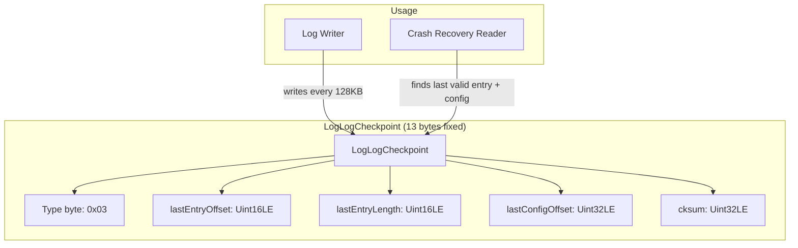
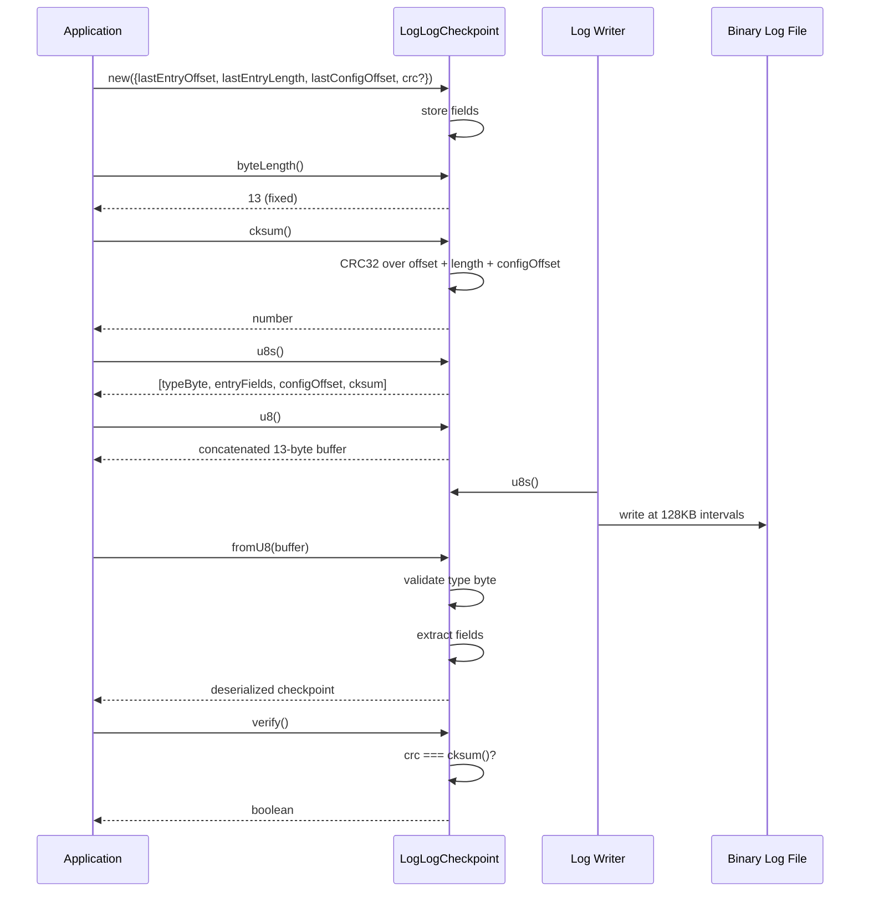

# LogLogCheckpoint Specification

## 1. Overview

`LogLogCheckpoint` is a fixed-size (13-byte) entry written periodically into a logical log to record the file offset and length of the most recent entry, plus the offset of the most recent config entry. It enables fast crash recovery by allowing the reader to locate the last fully-written entry and config. The format is `[EntryType.LOG_LOG_CHECKPOINT (0x03), lastEntryOffset (Uint16LE), lastEntryLength (Uint16LE), lastConfigOffset (Uint32LE), crc (Uint32LE)]`.

## 2. Component Specifications (TypeScript Declarations)

```typescript
class LogLogCheckpoint extends LogEntry {
  lastEntryOffset: number
  lastEntryLength: number
  lastConfigOffset: number
  crc: number | null

  constructor({ lastEntryOffset, lastEntryLength, lastConfigOffset, crc? }: {
    lastEntryOffset: number
    lastEntryLength: number
    lastConfigOffset: number
    crc?: number
  })

  byteLength(): number
  cksum(): number
  u8(): Uint8Array
  u8s(): Uint8Array[]
  verify(): boolean

  static fromU8(buffer: Uint8Array): LogLogCheckpoint
}
```

## 3. System Architecture (Mermaid graph TB)



## 4. Detailed Data Flow (Mermaid sequenceDiagram)



## 5. Visualization (self-contained D3 HTML)

```html
<!DOCTYPE html>
<html>
<head>
<meta charset="utf-8">
<title>LogLogCheckpoint Animation</title>
<style>
  body { font-family: system-ui, sans-serif; background: #0d1117; display: flex; flex-direction: column; align-items: center; padding: 2rem; }
  #container { max-width: 960px; width: 100%; }
  svg { display: block; margin: 0 auto; background: #161b22; border-radius: 8px; box-shadow: 0 4px 24px rgba(0,0,0,0.4); }
  .controls { display: flex; gap: 12px; align-items: center; margin-top: 1rem; flex-wrap: wrap; justify-content: center; }
  button { background: #238636; color: #fff; border: none; border-radius: 6px; padding: 8px 20px; font-size: 14px; cursor: pointer; }
  button:hover { background: #2ea043; }
  button:disabled { opacity: 0.5; cursor: not-allowed; }
  label { color: #c9d1d9; font-size: 13px; }
  input[type="range"] { width: 240px; accent-color: #238636; }
  .stats { color: #8b949e; font-size: 12px; margin-top: 0.5rem; display: flex; gap: 1rem; flex-wrap: wrap; justify-content: center; }
  .byte-legend { display: flex; gap: 2px; justify-content: center; flex-wrap: wrap; margin: 0.5rem 0; }
  .legend-item { display: flex; align-items: center; gap: 4px; font-size: 11px; color: #c9d1d9; }
  .legend-swatch { width: 14px; height: 14px; border-radius: 3px; border: 1px solid #30363d; }
  #kf-total { color: #58a6ff; font-weight: 600; }
</style>
</head>
<body>
<div id="container">
  <svg id="vis" width="900" height="400"></svg>
  <div class="controls">
    <button id="play-pause" data-testid="play-pause">▶ Play</button>
    <button id="reset">↺ Reset</button>
    <label>Keyframe <span id="kf-current">0</span>/<span id="kf-total">0</span>
      <input type="range" id="kf-slider" min="0" max="0" value="0" step="1">
    </label>
  </div>
  <div class="stats">
    <span id="state-label">State: <span id="state-value">idle</span></span>
    <span>Phase: <span id="phase-value">—</span></span>
  </div>
  <div class="byte-legend" id="legend"></div>
</div>

<script src="https://d3js.org/d3.v7.min.js"></script>
<script>
(function() {
  const ANIMATION_DURATION_MS = 900;
  const ANIMATION_KEYFRAMES = [
    { label: "Type byte (0x03)", phase: "build", desc: "EntryType.LOG_LOG_CHECKPOINT" },
    { label: "lastEntryOffset (2B)", phase: "build", desc: "Offset of last entry as Uint16LE" },
    { label: "lastEntryLength (2B)", phase: "build", desc: "Length of last entry as Uint16LE" },
    { label: "lastConfigOffset (4B)", phase: "build", desc: "Offset of last config as Uint32LE" },
    { label: "CRC checksum (4B)", phase: "build", desc: "CRC32 over entry fields + config offset" },
    { label: "Full 13-byte entry", phase: "complete", desc: "Checkpoint ready for writing" },
    { label: "Deserialize via fromU8", phase: "deserialize", desc: "Parse bytes back to checkpoint" },
    { label: "Verify CRC", phase: "verify", desc: "compare stored crc vs computed cksum()" },
  ];
  const ANIMATION_VERIFICATION = [
    "byteLength() must always return 13",
    "u8s() returns exactly 3 segments",
    "First u8 segment is [EntryType.LOG_LOG_CHECKPOINT] = [0x03]",
    "cksum() is cached on second call",
    "u8() is cached on second call",
    "verify() returns false when crc is null",
    "verify() returns false when crc is 0 (mismatch)",
    "Round-trip: u8s() concatenation → fromU8() must reproduce original",
    "fromU8() throws 'Invalid entryType' for unknown type",
  ];

  const LEGEND = [
    { label: "Type (1B)", color: "#f781bf" },
    { label: "Offset (2B)", color: "#b2df8a" },
    { label: "Length (2B)", color: "#fb9a99" },
    { label: "Config (4B)", color: "#a6cee3" },
    { label: "CRC (4B)", color: "#fdbf6f" },
  ];

  const legendEl = document.getElementById("legend");
  LEGEND.forEach(l => {
    const item = document.createElement("span");
    item.className = "legend-item";
    item.innerHTML = `<span class="legend-swatch" style="background:${l.color}"></span>${l.label}`;
    legendEl.appendChild(item);
  });

  const TOTAL_KF = ANIMATION_KEYFRAMES.length;
  document.getElementById("kf-total").textContent = TOTAL_KF;

  const width = 900, height = 400;
  const svg = d3.select("#vis");

  const byteGroups = [
    { label: "T", color: "#f781bf", count: 1 },
    { label: "O", color: "#b2df8a", count: 2 },
    { label: "L", color: "#fb9a99", count: 2 },
    { label: "Cfg", color: "#a6cee3", count: 4 },
    { label: "CRC", color: "#fdbf6f", count: 4 },
  ];

  let byteCells = [];
  byteGroups.forEach(g => {
    for (let i = 0; i < g.count; i++) {
      byteCells.push({ color: g.color, label: g.label, offset: byteCells.length });
    }
  });

  const cellW = 28, cellH = 28, gap = 2;
  const totalW = byteCells.length * (cellW + gap);
  const startX = (width - totalW) / 2;

  const infoY = 60;
  svg.append("text")
    .attr("x", width / 2).attr("y", 30)
    .attr("text-anchor", "middle").attr("fill", "#58a6ff")
    .attr("font-size", "18").attr("font-weight", "bold")
    .text("LogLogCheckpoint Binary Layout (13 bytes)");

  svg.append("text")
    .attr("id", "phase-label")
    .attr("x", width / 2).attr("y", infoY)
    .attr("text-anchor", "middle").attr("fill", "#8b949e")
    .attr("font-size", "13")
    .text("Click Play to animate");

  svg.append("text")
    .attr("id", "desc-label")
    .attr("x", width / 2).attr("y", infoY + 20)
    .attr("text-anchor", "middle").attr("fill", "#c9d1d9")
    .attr("font-size", "12")
    .text("");

  const byteRects = svg.selectAll("rect.byte")
    .data(byteCells)
    .join("rect")
    .attr("class", "byte")
    .attr("x", (d, i) => startX + i * (cellW + gap))
    .attr("y", infoY + 40)
    .attr("width", cellW).attr("height", cellH)
    .attr("rx", 3).attr("ry", 3)
    .attr("fill", d => d.color)
    .attr("stroke", "#30363d")
    .attr("stroke-width", 1)
    .attr("opacity", 0.15);

  const byteLabels = svg.selectAll("text.bytelen")
    .data(byteCells)
    .join("text")
    .attr("class", "bytelen")
    .attr("x", (d, i) => startX + i * (cellW + gap) + cellW / 2)
    .attr("y", infoY + 40 + cellH / 2 + 4)
    .attr("text-anchor", "middle")
    .attr("fill", "#fff")
    .attr("font-size", "10")
    .attr("opacity", 0)
    .text((d, i) => i);

  svg.selectAll("text.offset")
    .data(byteCells)
    .join("text")
    .attr("class", "offset")
    .attr("x", (d, i) => startX + i * (cellW + gap) + cellW / 2)
    .attr("y", infoY + 40 + cellH + 14)
    .attr("text-anchor", "middle")
    .attr("fill", "#484f58")
    .attr("font-size", "9")
    .text((d, i) => i);

  const timelineY = height - 60;
  svg.append("text")
    .attr("x", width / 2).attr("y", timelineY - 10)
    .attr("text-anchor", "middle").attr("fill", "#8b949e")
    .attr("font-size", "11")
    .text("Keyframe Timeline");

  const kfBarW = Math.min(700, width - 80);
  const kfBarX = (width - kfBarW) / 2;

  svg.append("rect")
    .attr("x", kfBarX).attr("y", timelineY)
    .attr("width", kfBarW).attr("height", 6).attr("rx", 3)
    .attr("fill", "#30363d");

  svg.append("rect")
    .attr("id", "timeline-progress")
    .attr("x", kfBarX).attr("y", timelineY)
    .attr("width", 0).attr("height", 6).attr("rx", 3)
    .attr("fill", "#238636");

  const kfSpacing = kfBarW / (TOTAL_KF - 1 || 1);
  svg.selectAll("circle.kf-marker")
    .data(d3.range(TOTAL_KF))
    .join("circle")
    .attr("class", "kf-marker")
    .attr("cx", (d, i) => kfBarX + i * kfSpacing)
    .attr("cy", timelineY + 3)
    .attr("r", 5)
    .attr("fill", "#484f58")
    .attr("stroke", "#30363d");

  svg.append("text")
    .attr("id", "kf-label")
    .attr("x", width / 2).attr("y", timelineY + 30)
    .attr("text-anchor", "middle").attr("fill", "#c9d1d9")
    .attr("font-size", "11")
    .text("");

  let currentKF = 0;
  let playing = false;
  let timer = null;
  const state = { keyframe: 0, phase: "idle" };

  function jumpToKeyframe(idx) {
    if (idx < 0) idx = 0;
    if (idx >= TOTAL_KF) { idx = TOTAL_KF - 1; if (playing) stop(); }
    currentKF = idx;
    const kf = ANIMATION_KEYFRAMES[idx];
    if (!kf) return;

    document.getElementById("kf-current").textContent = idx;
    document.getElementById("kf-slider").value = idx;
    document.getElementById("phase-value").textContent = kf.phase;
    document.getElementById("state-value").textContent = idx >= TOTAL_KF - 1 ? "complete" : (playing ? "playing" : "paused");

    svg.select("#phase-label").text(kf.label);
    svg.select("#desc-label").text(kf.desc);

    let highlightStart = 0, highlightEnd = byteCells.length;
    if (idx === 0) { highlightStart = 0; highlightEnd = 1; }
    else if (idx === 1) { highlightStart = 1; highlightEnd = 3; }
    else if (idx === 2) { highlightStart = 3; highlightEnd = 5; }
    else if (idx === 3) { highlightStart = 5; highlightEnd = 9; }
    else if (idx === 4) { highlightStart = 9; highlightEnd = 13; }
    else if (idx === 5) { highlightStart = 0; highlightEnd = 13; }
    else { highlightStart = 0; highlightEnd = 13; }

    byteRects.attr("opacity", (d, i) => (i >= highlightStart && i < highlightEnd) ? 1 : 0.15)
      .attr("stroke", (d, i) => (i >= highlightStart && i < highlightEnd) ? "#58a6ff" : "#30363d")
      .attr("stroke-width", (d, i) => (i >= highlightStart && i < highlightEnd) ? 2 : 1);
    byteLabels.attr("opacity", (d, i) => (i >= highlightStart && i < highlightEnd) ? 1 : 0);

    const progress = idx / (TOTAL_KF - 1);
    svg.select("#timeline-progress").attr("width", progress * kfBarW);

    svg.selectAll("circle.kf-marker")
      .attr("fill", (d, i) => i <= idx ? "#238636" : "#484f58")
      .attr("r", (d, i) => i === idx ? 7 : 5);

    svg.select("#kf-label").text(`${idx}: ${kf.label}`);

    state.keyframe = idx;
    state.phase = kf.phase;
  }

  function resetAnimation() {
    stop();
    jumpToKeyframe(0);
    document.getElementById("state-value").textContent = "idle";
    document.getElementById("phase-value").textContent = "—";
    svg.select("#phase-label").text("Click Play to animate");
    svg.select("#desc-label").text("");
    byteRects.attr("opacity", 0.15).attr("stroke", "#30363d").attr("stroke-width", 1);
    byteLabels.attr("opacity", 0);
    svg.select("#timeline-progress").attr("width", 0);
    svg.selectAll("circle.kf-marker").attr("fill", "#484f58").attr("r", 5);
    svg.select("#kf-label").text("");
    state.keyframe = 0;
    state.phase = "idle";
  }

  function stop() {
    playing = false;
    if (timer) { clearTimeout(timer); timer = null; }
    const btn = document.getElementById("play-pause");
    btn.textContent = "▶ Play";
    document.getElementById("state-value").textContent = "paused";
  }

  function play() {
    if (currentKF >= TOTAL_KF - 1) { resetAnimation(); }
    playing = true;
    const btn = document.getElementById("play-pause");
    btn.textContent = "⏸ Pause";
    document.getElementById("state-value").textContent = "playing";
    advance();
  }

  function advance() {
    if (!playing) return;
    if (currentKF >= TOTAL_KF - 1) { stop(); return; }
    jumpToKeyframe(currentKF + 1);
    timer = setTimeout(advance, ANIMATION_DURATION_MS / TOTAL_KF);
  }

  function togglePlay() {
    if (playing) { stop(); }
    else { play(); }
  }

  function getAnimationState() {
    return { ...state, isPlaying: playing, totalKeyframes: TOTAL_KF };
  }

  document.getElementById("play-pause").addEventListener("click", togglePlay);
  document.getElementById("reset").addEventListener("click", resetAnimation);
  document.getElementById("kf-slider").addEventListener("input", function() {
    if (playing) stop();
    jumpToKeyframe(parseInt(this.value));
  });

  jumpToKeyframe(0);
  window.ANIMATION_DURATION_MS = ANIMATION_DURATION_MS;
  window.ANIMATION_KEYFRAMES = ANIMATION_KEYFRAMES;
  window.ANIMATION_VERIFICATION = ANIMATION_VERIFICATION;
  window.jumpToKeyframe = jumpToKeyframe;
  window.resetAnimation = resetAnimation;
  window.getAnimationState = getAnimationState;
})();
</script>
</body>
</html>
```

## 6. Testing Requirements

| # | Test | Expected |
|---|------|----------|
| 1 | Construct with `lastEntryOffset`, `lastEntryLength`, `lastConfigOffset` | `crc` is `null`, all fields match |
| 2 | Construct with explicit `crc` | `crc` matches provided value |
| 3 | `byteLength()` returns 13 | Fixed size |
| 4 | `cksum()` returns a non-zero number | Type is number, value not 0 |
| 5 | `verify()` returns `false` when `crc` is `0` (mismatch) | `false` |
| 6 | `verify()` returns `false` when `crc` is `null` | `false` |
| 7 | `u8s()` returns `[typeByte, fields, cksum]` | Array length = 3 |
| 8 | `u8()` is cached on second call | Same reference |
| 9 | `cksum()` is cached on second call | Same value |
| 10 | `fromU8()` round-trip preserves all three fields | Deserialized matches original |
| 11 | `fromU8()` throws on invalid entry type | Throws `"Invalid entryType"` |

---

## 7. Source-Test Cross-References

### Source Coverage

| Source Spec | Path |
|---|---|
| LogLogCheckpoint.spec.md | `source/src/lib/entry/LogLogCheckpoint.spec.md` |
