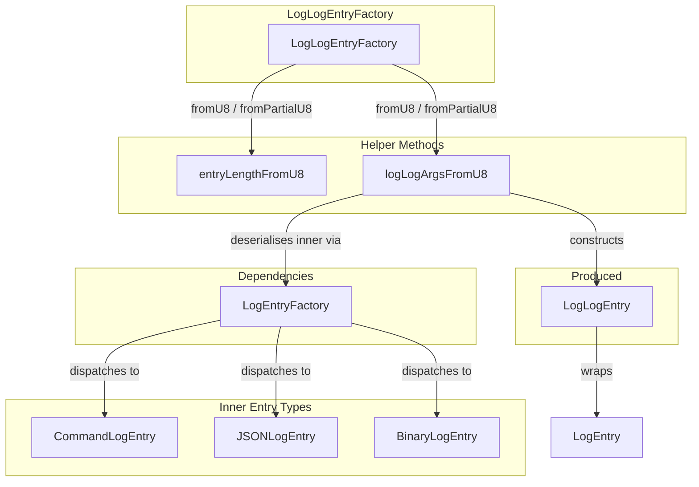
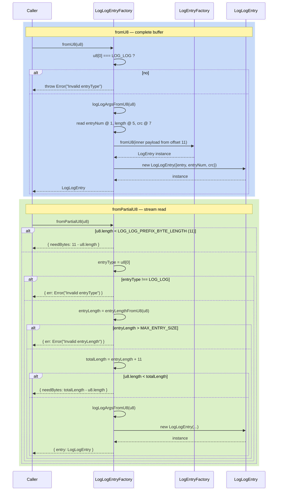

# LogLogEntryFactory — Log-of-Logs Wrapper Deserialiser

**Module: Entry Types**

## Overview

`LogLogEntryFactory` deserialises **log-of-logs (log-log) wrapper entries** from raw `Uint8Array` buffers. A log-log entry is an 11‑byte prefix followed by a variable-length inner `LogEntry`. Log-log entries are used by the global log to store its own management records (commands, metadata).

**11‑byte prefix layout:**
```
┌──┬────────────┬──────┬──────────┬──────────┐
│Ty│ EntryNum   │ Len  │ CRC32    │ Payload  │
│1 │ 4 (u32 LE) │2(LE) │ 4 (u32)  │ variable │
└──┴────────────┴──────┴──────────┴──────────┘
```

| Offset | Size | Field | Description |
|---|---|---|---|
| 0 | 1 | `entryType` | Must be `EntryType.LOG_LOG` (0x01) |
| 1 | 4 | `entryNum` | Monotonic entry sequence number (u32 LE) |
| 5 | 2 | `length` | Byte length of the inner entry (u16 LE) |
| 7 | 4 | `crc` | CRC32 of the inner entry (u32 LE) |
| 11 | `length` | `payload` | Inner entry bytes |

Two static methods:

| Method | Input | Behaviour |
|---|---|---|
| `fromU8(u8)` | Buffer known to contain a **complete** entry | Validates entry type, parses prefix, deserialises inner entry via `LogEntryFactory.fromU8`. Throws on invalid data. |
| `fromPartialU8(u8)` | Buffer that **may be incomplete** | Performs length validation before construction. Never throws. |

---

## Component Specifications

### Full TypeScript Declaration

```typescript
import { EntryType, LOG_LOG_PREFIX_BYTE_LENGTH, MAX_ENTRY_SIZE } from "../globals"
import LogEntry from "./log-entry"
import LogEntryFactory from "./log-entry-factory"
import LogLogEntry from "./log-log-entry"

export default class LogLogEntryFactory {
    static fromU8(u8: Uint8Array): LogLogEntry

    static fromPartialU8(u8: Uint8Array): {
        entry?: LogLogEntry | null
        needBytes?: number
        err?: Error
    }

    static entryLengthFromU8(u8: Uint8Array): number

    static logLogArgsFromU8(u8: Uint8Array): {
        entry: LogEntry
        entryNum: number
        crc: number
    }
}
```

### Method Details

| Method | Signature | Behaviour |
|---|---|---|
| `fromU8` | `(u8: Uint8Array) => LogLogEntry` | Validates `entryType === LOG_LOG`, calls `logLogArgsFromU8(u8)`, returns `new LogLogEntry(args)`. |
| `fromPartialU8` | `(u8: Uint8Array) => Result` | Checks `u8.length >= LOG_LOG_PREFIX_BYTE_LENGTH`. Reads `entryLength` at offset 5, validates `<= MAX_ENTRY_SIZE`, checks total bytes available, then calls `logLogArgsFromU8`. |
| `entryLengthFromU8` | `(u8: Uint8Array) => number` | Reads u16 LE at `u8[5..7)`. |
| `logLogArgsFromU8` | `(u8: Uint8Array) => args` | Extracts `entryNum` (bytes 1‑5), `crc` (7‑11), deserialises inner entry from remainder via `LogEntryFactory.fromU8`. |

### Constants Referenced

| Constant | Value | Role |
|---|---|---|
| `LOG_LOG_PREFIX_BYTE_LENGTH` | `11` | Minimum bytes needed for prefix |
| `MAX_ENTRY_SIZE` | `32768` (2¹⁵) | Upper bound on the `length` field |
| `EntryType.LOG_LOG` | `0x01` | Required first byte |

---

## System Architecture



### Prefix Byte Layout

```
Offset:  0    1    2    3    4    5    6    7    8    9   10   ...
         ┌────┬───────────────┬──────────┬───────────────────┬──────────┐
         │ Ty │   entryNum    │  length  │        crc        │ payload  │
         │0x01│   u32 (LE)    │  u16(LE) │      u32 (LE)     │ variable │
         └────┴───────────────┴──────────┴───────────────────┴──────────┘
```

---

## Detailed Data Flow



### Buffer Slicing Detail for `logLogArgsFromU8`

```
Offset  0: entryType (1B)  →  validated earlier
Offset  1: entryNum   (4B)  → new Uint32Array(u8.buffer, 1, 4)[0]
Offset  5: length     (2B)  → new Uint16Array(u8.buffer, 5, 2)[0]  (entryLengthFromU8)
Offset  7: crc        (4B)  → new Uint32Array(u8.buffer, 7, 4)[0]
Offset 11: payload    (var) → new Uint8Array(u8.buffer, 11, length)
                              → LogEntryFactory.fromU8(payload)
```

---

## Visualization

```html
<!DOCTYPE html>
<html>
<head>
  <meta charset="utf-8" />
  <style>
    body { margin: 0; background: #0d1117; font-family: system-ui, sans-serif; }
    #container { width: 100%; height: 100vh; display: flex; flex-direction: column; align-items: center; justify-content: center; }
    svg { display: block; }
    .controls { margin-top: 20px; display: flex; gap: 12px; align-items: center; flex-wrap: wrap; justify-content: center; }
    .controls button { background: #21262d; border: 1px solid #30363d; color: #c9d1d9; padding: 6px 16px; border-radius: 6px; cursor: pointer; font-size: 14px; }
    .controls button:hover { background: #30363d; }
    .controls button[data-testid="play-pause"] { background: #1f6feb; border-color: #1f6feb; color: #fff; }
    .info { color: #8b949e; font-size: 13px; }
    .node rect { stroke-width: 2; }
    .factory-node rect { fill: #1f6feb; stroke: #58a6ff; }
    .helper-node rect { fill: #d29922; stroke: #e3b341; }
    .wrapper-node rect { fill: #238636; stroke: #3fb950; }
    .inner-node rect { fill: #9e6a03; stroke: #d29922; }
    text { fill: #c9d1d9; font-size: 13px; text-anchor: middle; dominant-baseline: central; }
  </style>
</head>
<body>
<div id="container">
  <svg id="svg" width="900" height="500"></svg>
  <div class="controls">
    <button data-testid="play-pause" id="playPauseBtn">&#9646;&#9646;</button>
    <button id="prevBtn">&#9664; Prev</button>
    <button id="nextBtn">Next &#9654;</button>
    <button id="resetBtn">Reset</button>
    <span class="info">Keyframe <span id="kf-current">0</span> / <span id="kf-total">0</span></span>
    <span id="stateDisplay" class="info" style="margin-left:8px;">&#8203;</span>
  </div>
</div>
<script>
(function() {
  const nodes = [
    { id: 'LogLogEntryFactory',    cls: 'factory-node',  tier: 0 },
    { id: 'entryLengthFromU8',     cls: 'helper-node',   tier: 1 },
    { id: 'logLogArgsFromU8',      cls: 'helper-node',   tier: 1 },
    { id: 'LogEntryFactory',       cls: 'helper-node',   tier: 1 },
    { id: 'LogLogEntry',           cls: 'wrapper-node',  tier: 2 },
    { id: 'Inner LogEntry',        cls: 'inner-node',    tier: 2 },
  ];
  const edges = [
    { src: 'LogLogEntryFactory',  dst: 'entryLengthFromU8' },
    { src: 'LogLogEntryFactory',  dst: 'logLogArgsFromU8' },
    { src: 'logLogArgsFromU8',    dst: 'LogEntryFactory' },
    { src: 'LogEntryFactory',     dst: 'Inner LogEntry' },
    { src: 'logLogArgsFromU8',    dst: 'LogLogEntry' },
  ];

  const W = 170, H = 42, GX = 190, GY = 110, topMargin = 40;
  const tiers = {};
  nodes.forEach(n => { if (!tiers[n.tier]) tiers[n.tier] = []; tiers[n.tier].push(n); });
  const tierY = {};
  let yAcc = topMargin;
  Object.keys(tiers).sort((a,b)=>a-b).forEach(t => { tierY[t] = yAcc; yAcc += GY; });

  const svg = d3.select('#svg');
  const g = svg.append('g');

  const nodeMap = {};
  nodes.forEach(n => {
    const tn = tiers[n.tier];
    const idx = tn.indexOf(n);
    const totalW = tn.length * GX;
    const startX = (900 - totalW) / 2;
    n._x = startX + idx * GX;
    n._y = tierY[n.tier];
    nodeMap[n.id] = n;
  });

  edges.forEach(e => {
    const s = nodeMap[e.src], d = nodeMap[e.dst];
    if (!s || !d) return;
    g.append('line')
      .attr('class', 'cls-edge')
      .attr('x1', s._x + W/2).attr('y1', s._y + H)
      .attr('x2', d._x + W/2).attr('y2', d._y)
      .attr('stroke', '#484f58').attr('stroke-width', 1.5);
  });

  nodes.forEach(n => {
    const nodeG = g.append('g')
      .attr('id', 'node-'+n.id.replace(/\s+/g, ''))
      .attr('class', 'cls-node ' + n.cls);
    nodeG.append('rect')
      .attr('x', n._x).attr('y', n._y)
      .attr('width', W).attr('height', H).attr('rx', 8);
    nodeG.append('text')
      .attr('class', 'cls-label')
      .attr('x', n._x + W/2).attr('y', n._y + H/2)
      .text(n.id);
  });

  const keyframes = [];
  keyframes.push(() => {
    d3.selectAll('.cls-node, .cls-label').attr('opacity', 0.2);
    d3.selectAll('.cls-edge').attr('opacity', 0.06);
  });
  keyframes.push(() => {
    d3.selectAll('.cls-node, .cls-label').attr('opacity', 0.15);
    d3.selectAll('.cls-edge').attr('opacity', 0.04);
    d3.select('#node-LogLogEntryFactory').attr('opacity', 1);
    d3.select('#node-LogLogEntryFactory text').attr('opacity', 1);
  });
  keyframes.push(() => {
    d3.selectAll('.cls-node, .cls-label').attr('opacity', 0.15);
    d3.selectAll('.cls-edge').attr('opacity', 0.04);
    ['LogLogEntryFactory','entryLengthFromU8','logLogArgsFromU8','LogEntryFactory'].forEach(id => {
      d3.select('#node-'+id.replace(/\s+/g, '')).attr('opacity', 1);
      d3.select('#node-'+id.replace(/\s+/g, '')+' text').attr('opacity', 1);
    });
  });
  keyframes.push(() => {
    d3.selectAll('.cls-node, .cls-label').attr('opacity', 0.15);
    d3.selectAll('.cls-edge').attr('opacity', 0.04);
    nodes.forEach(n => {
      d3.select('#node-'+n.id.replace(/\s+/g, '')).attr('opacity', 1);
      d3.select('#node-'+n.id.replace(/\s+/g, '')+' text').attr('opacity', 1);
    });
  });
  keyframes.push(() => {
    d3.selectAll('.cls-node').attr('opacity', 1);
    d3.selectAll('.cls-label').attr('opacity', 1);
    d3.selectAll('.cls-edge').attr('opacity', 0.3);
  });
  window.ANIMATION_KEYFRAMES = keyframes;

  let currentKF = 0, playing = false, interval = null;
  const totalKF = keyframes.length;
  document.getElementById('kf-total').textContent = totalKF;

  function applyKF(idx) {
    currentKF = Math.max(0, Math.min(totalKF - 1, idx));
    keyframes[currentKF]();
    document.getElementById('kf-current').textContent = currentKF;
    const st = document.getElementById('stateDisplay');
    st.innerHTML = currentKF === 0 ? '&#9679; dimmed' :
                   currentKF === totalKF-1 ? '&#9679; full' :
                   '&#9679; step ' + currentKF;
  }

  window.jumpToKeyframe = function(idx) { applyKF(idx); };
  window.getAnimationState = function() {
    return { currentKeyframe: currentKF, totalKeyframes: totalKF, playing: playing };
  };
  window.resetAnimation = function() {
    if (interval) { clearInterval(interval); interval = null; }
    playing = false;
    document.getElementById('playPauseBtn').innerHTML = '&#9654;';
    applyKF(0);
  };
  window.ANIMATION_DURATION_MS = totalKF * 800;
  window.ANIMATION_VERIFICATION = function() {
    const failures = [];
    if (typeof window.ANIMATION_KEYFRAMES === 'undefined' || !Array.isArray(window.ANIMATION_KEYFRAMES)) failures.push('ANIMATION_KEYFRAMES missing');
    if (typeof window.ANIMATION_DURATION_MS === 'undefined') failures.push('ANIMATION_DURATION_MS missing');
    if (typeof window.ANIMATION_VERIFICATION !== 'function') failures.push('ANIMATION_VERIFICATION missing');
    if (typeof window.jumpToKeyframe !== 'function') failures.push('jumpToKeyframe missing');
    if (typeof window.resetAnimation !== 'function') failures.push('resetAnimation missing');
    if (typeof window.getAnimationState !== 'function') failures.push('getAnimationState missing');
    const pp = document.querySelector('[data-testid="play-pause"]');
    if (!pp) failures.push('[data-testid="play-pause"] missing');
    if (!document.getElementById('kf-total')) failures.push('#kf-total missing');
    return { ok: failures.length === 0, failures };
  };

  document.getElementById('playPauseBtn').addEventListener('click', function() {
    if (playing) {
      clearInterval(interval); interval = null;
      playing = false;
      this.innerHTML = '&#9654;';
    } else {
      playing = true;
      this.innerHTML = '&#9646;&#9646;';
      interval = setInterval(() => {
        if (currentKF >= totalKF - 1) {
          clearInterval(interval); interval = null;
          playing = false;
          document.getElementById('playPauseBtn').innerHTML = '&#9654;';
          return;
        }
        applyKF(currentKF + 1);
      }, 800);
    }
  });
  document.getElementById('prevBtn').addEventListener('click', () => applyKF(currentKF - 1));
  document.getElementById('nextBtn').addEventListener('click', () => applyKF(currentKF + 1));
  document.getElementById('resetBtn').addEventListener('click', window.resetAnimation);

  applyKF(0);
  window.ANIMATION_VERIFICATION_RESULT = window.ANIMATION_VERIFICATION();
})();
</script>
</body>
</html>
```

---

## Testing Requirements

### Unit Tests — `fromU8`

| # | Test | Expected Outcome |
|---|---|---|
| 1 | `LogLogEntryFactory.fromU8(buffer with entryType !== LOG_LOG)` | Throws `Error("Invalid entryType")` |
| 2 | `LogLogEntryFactory.fromU8(buffer with valid LOG_LOG entry)` | Returns `LogLogEntry` with correct `entryNum`, `crc`, and inner `entry` |
| 3 | `LogLogEntryFactory.fromU8(truncated buffer)` | Throws from `logLogArgsFromU8` — `Error("Invalid u8 length")` |
| 4 | Inner entry is a `CommandLogEntry` (command wrapped in log-log) | Round-trips correctly via `LogEntryFactory.fromU8` |

### Unit Tests — `fromPartialU8`

| # | Test | Expected Outcome |
|---|---|---|
| 1 | `fromPartialU8(u8)` where `u8.length < 11` | `{ needBytes: 11 - u8.length }` |
| 2 | `fromPartialU8(u8)` with `entryType !== LOG_LOG` | `{ err: Error("Invalid entryType") }` |
| 3 | `fromPartialU8(u8)` with `LOG_LOG` type and `entryLength > MAX_ENTRY_SIZE` | `{ err: Error("Invalid entryLength") }` |
| 4 | `fromPartialU8(u8)` with `LOG_LOG` type but insufficient payload | `{ needBytes: totalLength - u8.length }` |
| 5 | `fromPartialU8(u8)` with complete valid `LOG_LOG` entry | `{ entry: LogLogEntry }` |

### Unit Tests — Helper Methods

| # | Test | Expected Outcome |
|---|---|---|
| 1 | `entryLengthFromU8(u8)` reads u16 LE at offset 5 | Returns correct length value |
| 2 | `logLogArgsFromU8(u8)` on buffer < 11 bytes | Throws `Error("Invalid u8 length")` |
| 3 | `logLogArgsFromU8(u8)` reads correct u32 `entryNum` at offset 1 | Matches `u8[1..5)` as u32 LE |
| 4 | `logLogArgsFromU8(u8)` reads correct u32 `crc` at offset 7 | Matches `u8[7..11)` as u32 LE |

### Contract Tests

| # | Test | Rationale |
|---|---|---|
| 1 | `entry.verify()` returns `true` when CRC matches `entry.cksum()` | CRC integrity must hold after round-trip |
| 2 | `entry.entry instanceof LogEntry` | Inner entry is always a valid `LogEntry` subclass |
| 3 | `entry.byteLength() === 11 + inner.byteLength()` | Total length is prefix + inner entry payload |
| 4 | `entry.entryNum` matches the value stored in the prefix bytes | Sequence number round-trips correctly |

### Edge Cases

| # | Scenario | Assertion |
|---|---|---|
| 1 | `entryLength` field set to `0` | A zero-length inner entry is valid |
| 2 | `entryLength` field set to `MAX_ENTRY_SIZE` | Accepted as valid boundary value |
| 3 | `entryLength` field set to `MAX_ENTRY_SIZE + 1` | Rejected with `{ err: Error("Invalid entryLength") }` |
| 4 | `crc` field missing from constructor args (`crc` is `undefined`) | `entry.crc` is `null`; `verify()` returns `false` |
| 5 | Deep nesting: `LogLogEntry` wrapping another `LogLogEntry` | Inner `LogEntryFactory.fromU8` validates its own type byte; a second `LOG_LOG` type byte would cause it to delegate back to `LogLogEntryFactory.fromU8`, which would then try to read another 11‑byte prefix off the sub-payload — likely corruption |
| 6 | `fromPartialU8` called with a buffer containing multiple log-log entries concatenated | Only the first entry is parsed; remaining bytes are ignored |

---

## 7. Source-Test Cross-References

### Test Coverage

| Test Spec | Path |
|---|---|
| LogLogEntryFactory.test.spec.md | `source/src/lib/entry/LogLogEntryFactory.test.spec.md` |
