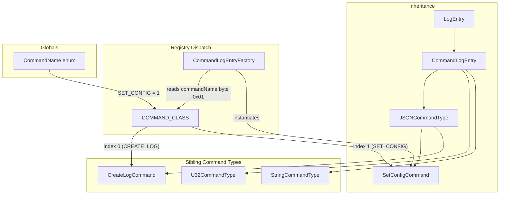
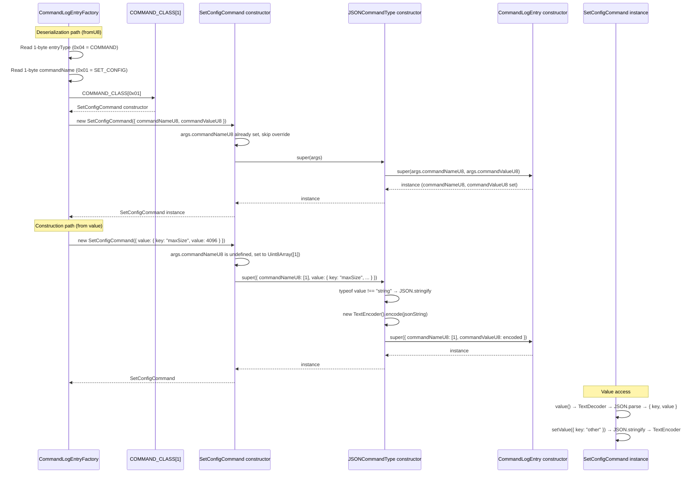

# SetConfigCommand — Set-Config Command Entry

**Module: Entry Types**

## Overview

`SetConfigCommand` is a concrete command entry that extends `JSONCommandType` to represent a **set-config** operation. It inherits the full JSON serialization/deserialization contract from `JSONCommandType` (which itself extends `CommandLogEntry` → `LogEntry`). The only customization is that the constructor automatically injects `CommandName.SET_CONFIG` (byte value `0x01`) as the command-name byte if `args.commandNameU8` is not already set.

**Inheritance:** `LogEntry` → `CommandLogEntry` → `JSONCommandType` → `SetConfigCommand`

**Purpose:** Encodes a "set configuration" command whose payload is a JSON string. The JSON value is stored as `commandValueU8` (UTF-8 encoded). Typical JSON payload contains configuration key-value pairs.

**Registry dispatch:** When the `CommandLogEntryFactory` reads a `CommandLogEntry` whose command-name byte is `0x01`, it looks up `COMMAND_CLASS[1]` → `SetConfigCommand` and instantiates this class.

---

## Component Specifications

### Full TypeScript Declaration

```typescript
import { CommandName } from "../../globals"
import JSONCommandType, { JSONCommandTypeArgs } from "./command-type/json-command-type"

const COMMAND_NAME_BYTE = new Uint8Array([CommandName.SET_CONFIG])

export default class SetConfigCommand extends JSONCommandType {
    constructor(args: JSONCommandTypeArgs) {
        if (!args.commandNameU8) {
            args.commandNameU8 = COMMAND_NAME_BYTE
        }
        super(args)
    }
}
```

### Property & Method Details

| Member | Source | Behaviour |
|---|---|---|
| `constructor(args)` | `SetConfigCommand` | If `args.commandNameU8` is falsy, sets it to `Uint8Array([1])`; delegates to `JSONCommandType` |
| `value(): any` | `JSONCommandType` | Decodes `commandValueU8` via `TextDecoder`, then `JSON.parse` |
| `setValue(value: any): void` | `JSONCommandType` | `JSON.stringify`s value, encodes via `TextEncoder`, stores to `commandValueU8` |
| `commandNameU8` | `CommandLogEntry` | The command-name byte (`Uint8Array([1])` for set-config) |
| `commandValueU8` | `CommandLogEntry` | The JSON-encoded payload bytes |
| `byteLength(): number` | `CommandLogEntry` | Returns `2 + commandValueU8.byteLength` |
| `cksum(entryNum): number` | `CommandLogEntry` | CRC32 of `TYPE_BYTE \|\| commandNameU8 \|\| commandValueU8` |
| `u8(): Uint8Array` | `CommandLogEntry` | Returns `commandValueU8` |
| `u8s(): Uint8Array[]` | `CommandLogEntry` | Returns `[TYPE_BYTE, commandNameU8, commandValueU8]` |

---

## System Architecture



**Command-Name Byte Layout:**
```
┌──────────────┬──────────────────────┐
│ commandName  │ commandValue (JSON)   │
│ 1 byte (0x01)│ N bytes (UTF-8 JSON) │
└──────────────┴──────────────────────┘
```

---

## Detailed Data Flow



---

## Visualization

```html
<!DOCTYPE html>
<html lang="en">
<head>
<meta charset="UTF-8">
<meta name="viewport" content="width=device-width, initial-scale=1.0">
<title>SetConfigCommand — Inheritance &amp; Dispatch</title>
<script src="https://d3js.org/d3.v7.min.js"></script>
<style>
  body { font-family: system-ui, sans-serif; background: #1e1e2e; color: #cdd6f4; display: flex; justify-content: center; padding: 2rem; margin: 0; }
  #container { max-width: 900px; width: 100%; }
  h1 { font-size: 1.4rem; margin-bottom: 0.5rem; }
  svg { display: block; margin: 0 auto; background: #181825; border-radius: 8px; box-shadow: 0 4px 12px rgba(0,0,0,0.4); }
  .cls-node { cursor: default; }
  .cls-label { font-size: 12px; font-family: monospace; text-anchor: middle; dominant-baseline: central; }
  .cls-edge { stroke: #585b70; stroke-width: 1.5; fill: none; }
  .box-base { fill: #313244; stroke: #585b70; stroke-width: 1; rx: 6; ry: 6; }
  .box-leaf { fill: #1e1e2e; stroke: #a6e3a1; stroke-width: 1; rx: 6; ry: 6; }
  .controls { margin-top: 1rem; display: flex; align-items: center; gap: 0.75rem; flex-wrap: wrap; justify-content: center; }
  button { background: #313244; color: #cdd6f4; border: 1px solid #585b70; border-radius: 6px; padding: 0.4rem 1rem; cursor: pointer; font-size: 0.85rem; }
  button:hover { background: #45475a; }
  .info { font-family: monospace; font-size: 0.85rem; color: #a6adc8; }
</style>
</head>
<body>
<div id="container">
  <h1>SetConfigCommand — Inheritance Chain &amp; Dispatch</h1>
  <div id="vis"></div>
  <div class="controls">
    <button data-testid="play-pause" id="playPauseBtn">&#9654; Play</button>
    <button id="resetBtn">&#8634; Reset</button>
    <span class="info">Keyframe: <span id="kf-current">0</span> / <span id="kf-total">0</span></span>
  </div>
</div>

<script>
(function() {
  const nodes = [
    { id: "LogEntry",          type: "base", x: 370, y: 20,  w: 160, h: 36 },
    { id: "CommandLogEntry",   type: "base", x: 340, y: 90,  w: 220, h: 36 },
    { id: "JSONCommandType",   type: "base", x: 310, y: 160, w: 280, h: 36 },
    { id: "SetConfigCommand",  type: "leaf", x: 70,  y: 230, w: 320, h: 36 },
    { id: "CreateLogCommand",  type: "leaf", x: 510, y: 230, w: 320, h: 36 },
    { id: "COMMAND_CLASS[1]",  type: "leaf", x: 50,  y: 310, w: 200, h: 36 },
    { id: "Factory",           type: "leaf", x: 630, y: 310, w: 220, h: 36 },
  ];

  const edges = [
    { src: "LogEntry",        dst: "CommandLogEntry" },
    { src: "CommandLogEntry", dst: "JSONCommandType" },
    { src: "JSONCommandType", dst: "SetConfigCommand" },
    { src: "JSONCommandType", dst: "CreateLogCommand" },
    { src: "COMMAND_CLASS[1]", dst: "SetConfigCommand" },
    { src: "Factory",         dst: "COMMAND_CLASS[1]" },
  ];

  const w = 900, h = 400;
  const svg = d3.select("#vis").append("svg").attr("width", w).attr("height", h);

  svg.append("defs").append("marker")
    .attr("id", "arrow")
    .attr("viewBox", "0 -5 10 10").attr("refX", 10).attr("refY", 0)
    .attr("markerWidth", 6).attr("markerHeight", 6).attr("orient", "auto")
    .append("path").attr("d", "M0,-4L8,0L0,4").attr("fill", "#585b70");

  edges.forEach(e => {
    const src = nodes.find(n => n.id === e.src);
    const dst = nodes.find(n => n.id === e.dst);
    if (!src || !dst) return;
    svg.append("line")
      .attr("class", "cls-edge")
      .attr("id", "edge-"+e.src+"-"+e.dst)
      .attr("x1", src.x + src.w/2).attr("y1", src.y + src.h)
      .attr("x2", dst.x + dst.w/2).attr("y2", dst.y)
      .attr("marker-end", "url(#arrow)");
  });

  nodes.forEach(n => {
    const cls = n.type === "base" ? "box-base" : "box-leaf";
    const g = svg.append("g").attr("id", "node-"+n.id).attr("class", "cls-node");
    g.append("rect").attr("x", n.x).attr("y", n.y).attr("width", n.w).attr("height", n.h)
      .attr("rx", 6).attr("class", cls);
    g.append("text").attr("class", "cls-label").attr("x", n.x + n.w/2).attr("y", n.y + n.h/2)
      .attr("fill", "#cdd6f4").text(n.id);
  });

  const KF = [];
  KF.push(() => { d3.selectAll(".cls-node").attr("opacity", 0.2); d3.selectAll(".cls-edge").attr("opacity", 0.08); });
  KF.push(() => { d3.selectAll(".cls-node").attr("opacity", 0.15); d3.selectAll(".cls-edge").attr("opacity", 0.05); ["LogEntry"].forEach(id => d3.select("#node-"+id).attr("opacity",1)); });
  KF.push(() => { d3.selectAll(".cls-node").attr("opacity", 0.15); d3.selectAll(".cls-edge").attr("opacity", 0.05); ["LogEntry","CommandLogEntry"].forEach(id => d3.select("#node-"+id).attr("opacity",1)); });
  KF.push(() => { d3.selectAll(".cls-node").attr("opacity", 0.15); d3.selectAll(".cls-edge").attr("opacity", 0.05); ["LogEntry","CommandLogEntry","JSONCommandType"].forEach(id => d3.select("#node-"+id).attr("opacity",1)); });
  KF.push(() => { d3.selectAll(".cls-node").attr("opacity", 0.15); d3.selectAll(".cls-edge").attr("opacity", 0.05); ["LogEntry","CommandLogEntry","JSONCommandType","SetConfigCommand"].forEach(id => d3.select("#node-"+id).attr("opacity",1)); d3.select("#edge-LogEntry-CommandLogEntry").attr("opacity",1); d3.select("#edge-CommandLogEntry-JSONCommandType").attr("opacity",1); d3.select("#edge-JSONCommandType-SetConfigCommand").attr("opacity",1); });
  KF.push(() => { d3.selectAll(".cls-node").attr("opacity", 0.15); d3.selectAll(".cls-edge").attr("opacity", 0.05); ["LogEntry","CommandLogEntry","JSONCommandType","SetConfigCommand","Factory","COMMAND_CLASS[1]"].forEach(id => d3.select("#node-"+id).attr("opacity",1)); d3.selectAll(".cls-edge").attr("opacity",0.25); });
  KF.push(() => { d3.selectAll(".cls-node").attr("opacity", 1); d3.selectAll(".cls-edge").attr("opacity", 0.35); });
  window.ANIMATION_KEYFRAMES = KF;

  let currentKF = 0, playing = false, timer = null;
  const $kfCurrent = d3.select("#kf-current");
  const $kfTotal   = d3.select("#kf-total");
  $kfTotal.text(KF.length - 1);

  function applyKF(idx) { currentKF = Math.max(0, Math.min(idx, KF.length-1)); $kfCurrent.text(currentKF); KF[currentKF](); }

  window.jumpToKeyframe = function(idx) { stop(); applyKF(idx); };
  window.resetAnimation = function() { stop(); applyKF(0); };
  window.getAnimationState = function() { return { currentKeyframe: currentKF, totalKeyframes: KF.length-1, isPlaying: playing }; };
  window.ANIMATION_DURATION_MS = KF.length * 800;
  window.ANIMATION_VERIFICATION = function() { const f=[]; if(!Array.isArray(window.ANIMATION_KEYFRAMES)) f.push("ANIMATION_KEYFRAMES missing"); if(typeof window.ANIMATION_DURATION_MS !== "number") f.push("ANIMATION_DURATION_MS missing"); if(typeof window.ANIMATION_VERIFICATION !== "function") f.push("ANIMATION_VERIFICATION missing"); if(typeof window.jumpToKeyframe !== "function") f.push("jumpToKeyframe missing"); if(typeof window.resetAnimation !== "function") f.push("resetAnimation missing"); if(typeof window.getAnimationState !== "function") f.push("getAnimationState missing"); if(!document.querySelector('[data-testid="play-pause"]')) f.push("[data-testid='play-pause'] missing"); if(!document.getElementById("kf-total")) f.push("#kf-total missing"); return { ok: f.length===0, failures: f }; };

  function stop() { playing=false; d3.select("#playPauseBtn").html("&#9654; Play"); if(timer) { clearTimeout(timer); timer=null; } }
  d3.select("#playPauseBtn").on("click", function() { if(playing) { stop(); return; } if(currentKF >= KF.length-1) applyKF(0); playing=true; this.innerHTML = "&#9646;&#9646; Pause"; (function step() { if(!playing) return; const next=currentKF+1; if(next>=KF.length) { stop(); applyKF(0); return; } applyKF(next); timer=setTimeout(step,800); })(); });
  d3.select("#resetBtn").on("click", () => window.resetAnimation());
  applyKF(0);
})();
</script>
</body>
</html>
```

---

## Testing Requirements

### Unit Tests

| # | Test | Expected Outcome |
|---|---|---|
| 1 | `new SetConfigCommand({ value: { key: "x", val: 1 } })` | `commandNameU8` equals `Uint8Array([1])` |
| 2 | `new SetConfigCommand({ value: { key: "x", val: 1 } })` | `commandValueU8` is UTF-8 of `'{"key":"x","val":1}'` |
| 3 | `new SetConfigCommand({ commandNameU8: Uint8Array([0xFF]), value: 42 })` | Provided `commandNameU8` is preserved |
| 4 | `new SetConfigCommand({ commandNameU8: Uint8Array([1]), commandValueU8: encoder.encode('{}') })` | Raw-bypass construction succeeds |
| 5 | `instance.value()` returns parsed JSON | `{ key: "x", val: 1 }` |
| 6 | `instance.setValue({ a: 1 })` then `instance.value()` | Returns `{ a: 1 }` |
| 7 | `instance.byteLength()` | Equals `2 + commandValueU8.byteLength` |
| 8 | `instance instanceof SetConfigCommand` | `true` |
| 9 | `instance instanceof JSONCommandType` | `true` |
| 10 | `instance instanceof CommandLogEntry` | `true` |
| 11 | `instance instanceof LogEntry` | `true` |

### Registry Test

| # | Test | Expected |
|---|---|---|
| 1 | `COMMAND_CLASS[CommandName.SET_CONFIG]` | `SetConfigCommand` constructor |
| 2 | `new COMMAND_CLASS[1]({ value: "{}" })` | `instanceof SetConfigCommand` is `true` |
| 3 | `CommandLogEntryFactory.fromU8(u8)` where commandName byte is `0x01` | `instanceof SetConfigCommand` is `true` |

### Edge Cases

| # | Scenario | Assertion |
|---|---|---|
| 1 | Constructor with no `commandNameU8`, no `value`, no `commandValueU8` | Throws `Error("JSONCommandType requires commandNameU8 and either commandValueU8 or value")` |
| 2 | `value()` on empty `commandValueU8` | Throws `SyntaxError` |
| 3 | `setValue(undefined)` | Encodes `"undefined"` as JSON string |
| 4 | `setValue(() => {})` (function) | `JSON.stringify` returns `undefined` → stored as empty bytes? Verify behaviour |

---

## 7. Source-Test Cross-References

### Test Coverage

| Test Spec | Path |
|---|---|
| SetConfigCommand.test.spec.md | `source/src/lib/entry/command/SetConfigCommand.test.spec.md` |
