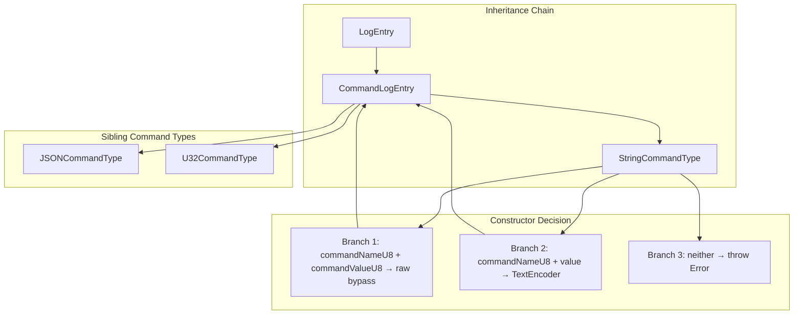
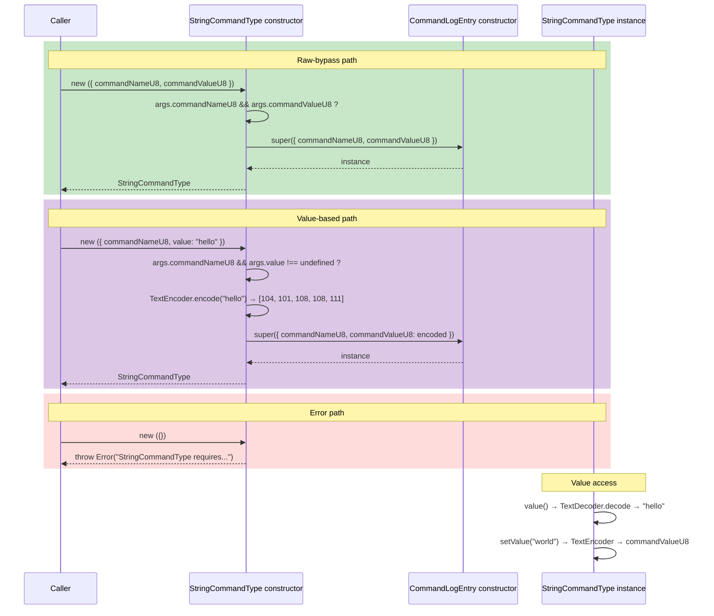

# StringCommandType — String Command Type

**Module: Entry Types**

## Overview

`StringCommandType` is a concrete class that extends `CommandLogEntry` and provides **UTF-8 string serialization** for command entries whose value is a plain string.

**Inheritance:** `LogEntry` → `CommandLogEntry` → `StringCommandType`

**Two construction modes:**
1. **Raw-bypass:** When `args.commandNameU8` and `args.commandValueU8` are both provided, the bytes pass through directly to `CommandLogEntry`.
2. **Value-based:** When `args.commandNameU8` and `args.value` (a `string`) are provided, the string is encoded via `TextEncoder.encode()` and stored as `commandValueU8`.

**`value()`** decodes `commandValueU8` via `TextDecoder.decode()`.

**`setValue(value)`** encodes via `TextEncoder.encode()`.

**This class has NO subclasses** — it is used directly as a leaf command type.

---

## Component Specifications

### Full TypeScript Declaration

```typescript
import CommandLogEntry from "../../command-log-entry"

export type StringCommandTypeArgs = {
    commandNameU8?: Uint8Array
    value?: string
    commandValueU8?: Uint8Array
}

export default class StringCommandType extends CommandLogEntry {
    constructor(args: StringCommandTypeArgs) {
        if (args.commandNameU8 && args.commandValueU8) {
            super({
                commandNameU8: args.commandNameU8,
                commandValueU8: args.commandValueU8,
            })
        } else if (args.commandNameU8 && args.value !== undefined) {
            super({
                commandNameU8: args.commandNameU8,
                commandValueU8: new TextEncoder().encode(args.value),
            })
        } else {
            throw new Error("StringCommandType requires commandNameU8 and either commandValueU8 or value")
        }
    }

    value(): string {
        return new TextDecoder().decode(this.commandValueU8)
    }

    setValue(value: string): void {
        this.commandValueU8 = new TextEncoder().encode(value)
    }
}
```

### Property & Method Details

| Member | Type / Signature | Overrideable | Description |
|---|---|---|---|
| `constructor(args)` | `(args: StringCommandTypeArgs) => StringCommandType` | Yes | Two-mode: raw-bypass or string encoding |
| `value()` | `() => string` | Yes | Decodes `commandValueU8` via `TextDecoder` |
| `setValue(value)` | `(value: string) => void` | Yes | Encodes string via `TextEncoder`, stores to `commandValueU8` |
| `commandNameU8` | `Uint8Array` | No (inherited) | 1-byte command discriminator |
| `commandValueU8` | `Uint8Array` | No (inherited) | UTF-8 encoded string bytes |
| `byteLength()` | `() => number` | No (inherited) | Returns `2 + commandValueU8.byteLength` |

---

## System Architecture



**On-Wire Layout:**
```
┌────┬──────────────┬──────────────────────────────┐
│ Ty │ commandName  │ commandValue (UTF-8 bytes)    │
│0x04│ 1 byte       │ N bytes (variable length)    │
└────┴──────────────┴──────────────────────────────┘
```

---

## Detailed Data Flow



---

## Visualization

```html
<!DOCTYPE html>
<html lang="en">
<head>
<meta charset="UTF-8">
<meta name="viewport" content="width=device-width, initial-scale=1.0">
<title>StringCommandType — Construction &amp; Encoding</title>
<script src="https://d3js.org/d3.v7.min.js"></script>
<style>
  body { font-family: system-ui, sans-serif; background: #1e1e2e; color: #cdd6f4; display: flex; justify-content: center; padding: 2rem; margin: 0; }
  #container { max-width: 800px; width: 100%; }
  h1 { font-size: 1.4rem; margin-bottom: 0.5rem; }
  svg { display: block; margin: 0 auto; background: #181825; border-radius: 8px; box-shadow: 0 4px 12px rgba(0,0,0,0.4); }
  .cls-node { cursor: default; }
  .cls-label { font-size: 12px; font-family: monospace; text-anchor: middle; dominant-baseline: central; }
  .cls-edge { stroke: #585b70; stroke-width: 1.5; fill: none; marker-end: url(#arrow); }
  .box-class { fill: #313244; stroke: #585b70; stroke-width: 1; rx: 6; ry: 6; }
  .box-op { fill: #1e1e2e; stroke: #89b4fa; stroke-width: 1.5; rx: 6; ry: 6; }
  .controls { margin-top: 1rem; display: flex; align-items: center; gap: 0.75rem; flex-wrap: wrap; justify-content: center; }
  button { background: #313244; color: #cdd6f4; border: 1px solid #585b70; border-radius: 6px; padding: 0.4rem 1rem; cursor: pointer; font-size: 0.85rem; }
  button:hover { background: #45475a; }
  .info { font-family: monospace; font-size: 0.85rem; color: #a6adc8; }
</style>
</head>
<body>
<div id="container">
  <h1>StringCommandType — Construction Paths</h1>
  <div id="vis"></div>
  <div class="controls">
    <button data-testid="play-pause" id="playPauseBtn">&#9654; Play</button>
    <button id="resetBtn">&#8634; Reset</button>
    <span class="info">Keyframe: <span id="kf-current">0</span> / <span id="kf-total">0</span></span>
  </div>
</div>

<script>
(function() {
  const nodes = [
    { id: "StringCommandType", x: 300, y: 10,  w: 200, h: 36, cls: "box-class" },
    { id: "Decision",          x: 280, y: 70,  w: 240, h: 36, cls: "box-class", label: "Constructor Decision" },
    { id: "RawBypass",         x: 40,  y: 140, w: 260, h: 36, cls: "box-op", label: "commandNameU8 + commandValueU8" },
    { id: "ValueBased",        x: 340, y: 140, w: 260, h: 36, cls: "box-op", label: "commandNameU8 + value (string)" },
    { id: "ThrowError",        x: 40,  y: 210, w: 260, h: 36, cls: "box-op", label: "neither → throw Error" },
    { id: "TextEncoder",       x: 340, y: 210, w: 140, h: 36, cls: "box-op", label: "TextEncoder.encode" },
    { id: "CommandLogEntry",   x: 520, y: 280, w: 220, h: 36, cls: "box-class" },
  ];

  const edges = [
    { src: "StringCommandType", dst: "Decision" },
    { src: "Decision", dst: "RawBypass",  label: "both U8s" },
    { src: "Decision", dst: "ValueBased", label: "name + value" },
    { src: "Decision", dst: "ThrowError", label: "neither" },
    { src: "RawBypass",  dst: "CommandLogEntry" },
    { src: "ValueBased", dst: "TextEncoder" },
    { src: "TextEncoder", dst: "CommandLogEntry" },
  ];

  const w = 800, h = 360;
  const svg = d3.select("#vis").append("svg").attr("width", w).attr("height", h);

  svg.append("defs").append("marker")
    .attr("id", "arrow").attr("viewBox", "0 -5 10 10").attr("refX", 10).attr("refY", 0)
    .attr("markerWidth", 6).attr("markerHeight", 6).attr("orient", "auto")
    .append("path").attr("d", "M0,-4L8,0L0,4").attr("fill", "#585b70");

  edges.forEach(e => {
    const s = nodes.find(n => n.id === e.src), d = nodes.find(n => n.id === e.dst);
    if (!s || !d) return;
    svg.append("line").attr("class", "cls-edge").attr("id", "edge-"+e.src+"-"+e.dst)
      .attr("x1", s.x + s.w/2).attr("y1", s.y + s.h)
      .attr("x2", d.x + d.w/2).attr("y2", d.y);
  });

  nodes.forEach(n => {
    const g = svg.append("g").attr("id", "node-"+n.id).attr("class", "cls-node");
    g.append("rect").attr("x", n.x).attr("y", n.y).attr("width", n.w).attr("height", n.h)
      .attr("rx", 6).attr("class", n.cls);
    g.append("text").attr("class", "cls-label").attr("x", n.x + n.w/2).attr("y", n.y + n.h/2)
      .attr("fill", "#cdd6f4").text(n.label || n.id);
  });

  const KF = [];
  KF.push(() => { d3.selectAll(".cls-node").attr("opacity", 0.2); d3.selectAll(".cls-edge").attr("opacity", 0.08); });
  KF.push(() => { d3.selectAll(".cls-node").attr("opacity", 0.15); d3.selectAll(".cls-edge").attr("opacity", 0.05); ["StringCommandType","Decision"].forEach(id => d3.select("#node-"+id).attr("opacity",1)); });
  KF.push(() => { d3.selectAll(".cls-node").attr("opacity", 0.15); d3.selectAll(".cls-edge").attr("opacity", 0.05); ["StringCommandType","Decision","RawBypass","CommandLogEntry"].forEach(id => d3.select("#node-"+id).attr("opacity",1)); d3.select("#edge-StringCommandType-Decision").attr("opacity",0.5); d3.select("#edge-Decision-RawBypass").attr("opacity",0.5); d3.select("#edge-RawBypass-CommandLogEntry").attr("opacity",0.5); });
  KF.push(() => { d3.selectAll(".cls-node").attr("opacity", 0.15); d3.selectAll(".cls-edge").attr("opacity", 0.05); ["StringCommandType","Decision","ValueBased","TextEncoder","CommandLogEntry"].forEach(id => d3.select("#node-"+id).attr("opacity",1)); d3.select("#edge-StringCommandType-Decision").attr("opacity",0.5); d3.select("#edge-Decision-ValueBased").attr("opacity",0.5); d3.select("#edge-ValueBased-TextEncoder").attr("opacity",0.5); d3.select("#edge-TextEncoder-CommandLogEntry").attr("opacity",0.5); });
  KF.push(() => { d3.selectAll(".cls-node").attr("opacity", 0.15); d3.selectAll(".cls-edge").attr("opacity", 0.05); ["StringCommandType","Decision","ThrowError"].forEach(id => d3.select("#node-"+id).attr("opacity",1)); d3.select("#edge-StringCommandType-Decision").attr("opacity",0.5); d3.select("#edge-Decision-ThrowError").attr("opacity",0.5); });
  KF.push(() => { d3.selectAll(".cls-node").attr("opacity", 1); d3.selectAll(".cls-edge").attr("opacity", 0.35); });
  window.ANIMATION_KEYFRAMES = KF;

  let currentKF = 0, playing = false, timer = null;
  const $kfCurrent = d3.select("#kf-current");
  const $kfTotal   = d3.select("#kf-total");
  $kfTotal.text(KF.length - 1);

  function applyKF(idx) { currentKF = Math.max(0, Math.min(idx, KF.length-1)); $kfCurrent.text(currentKF); KF[currentKF](); }

  window.jumpToKeyframe = function(idx) { stop(); applyKF(idx); };
  window.resetAnimation = function() { stop(); applyKF(0); };
  window.getAnimationState = function() { return { currentKeyframe: currentKF, totalKeyframes: KF.length-1, isPlaying: playing }; };
  window.ANIMATION_DURATION_MS = KF.length * 800;
  window.ANIMATION_VERIFICATION = function() { const f=[]; if(!Array.isArray(window.ANIMATION_KEYFRAMES)) f.push("ANIMATION_KEYFRAMES missing"); if(typeof window.ANIMATION_DURATION_MS !== "number") f.push("ANIMATION_DURATION_MS missing"); if(typeof window.ANIMATION_VERIFICATION !== "function") f.push("ANIMATION_VERIFICATION missing"); if(typeof window.jumpToKeyframe !== "function") f.push("jumpToKeyframe missing"); if(typeof window.resetAnimation !== "function") f.push("resetAnimation missing"); if(typeof window.getAnimationState !== "function") f.push("getAnimationState missing"); if(!document.querySelector('[data-testid="play-pause"]')) f.push("[data-testid='play-pause'] missing"); if(!document.getElementById("kf-total")) f.push("#kf-total missing"); return { ok: f.length===0, failures: f }; };

  function stop() { playing=false; d3.select("#playPauseBtn").html("&#9654; Play"); if(timer) { clearTimeout(timer); timer=null; } }
  d3.select("#playPauseBtn").on("click", function() { if(playing) { stop(); return; } if(currentKF >= KF.length-1) applyKF(0); playing=true; this.innerHTML = "&#9646;&#9646; Pause"; (function step() { if(!playing) return; const next=currentKF+1; if(next>=KF.length) { stop(); applyKF(0); return; } applyKF(next); timer=setTimeout(step,800); })(); });
  d3.select("#resetBtn").on("click", () => window.resetAnimation());
  applyKF(0);
})();
</script>
</body>
</html>
```

---

## Testing Requirements

### Unit Tests

| # | Test | Expected Outcome |
|---|---|---|
| 1 | `new StringCommandType({ commandNameU8: Uint8Array([3]), commandValueU8: encoder.encode("hello") })` | Raw-bypass: `commandValueU8` is `[104, 101, 108, 108, 111]` |
| 2 | `new StringCommandType({ commandNameU8: Uint8Array([3]), value: "world" })` | Value-based: `commandValueU8` is `[119, 111, 114, 108, 100]` |
| 3 | `new StringCommandType({ commandNameU8: Uint8Array([3]), value: "" })` | `commandValueU8` is empty `Uint8Array(0)` |
| 4 | `new StringCommandType({})` | Throws `Error("StringCommandType requires commandNameU8 and either commandValueU8 or value")` |
| 5 | `new StringCommandType({ value: "x" })` (no commandNameU8) | Throws same error |

### Value Access Tests

| # | Test | Expected Outcome |
|---|---|---|
| 1 | `instance.value()` with `commandValueU8 = encoder.encode("hello")` | Returns `"hello"` |
| 2 | `instance.setValue("world")` then `instance.value()` | Returns `"world"` |
| 3 | `instance.setValue("")` then `instance.value()` | Returns `""` |
| 4 | `instance.value()` with empty `commandValueU8` | Returns `""` (empty string, not an error) |

### Round-Trip Tests

| # | Test | Expected Outcome |
|---|---|---|
| 1 | `new StringCommandType({ commandNameU8: [3], value: "Hello, 世界" })` | `value()` returns `"Hello, 世界"` — UTF-8 multi-byte characters preserved |
| 2 | `instance.byteLength()` | Equals `2 + commandValueU8.byteLength` |
| 3 | `instance.u8s()[2] === instance.commandValueU8` | Payload chunk matches |
| 4 | `instance instanceof StringCommandType` | `true` |
| 5 | `instance instanceof CommandLogEntry` | `true` |
| 6 | `instance instanceof LogEntry` | `true` |

### Edge Cases

| # | Scenario | Assertion |
|---|---|---|
| 1 | `value` is empty string `""` | `commandValueU8` is 0-length, `byteLength()` returns `2` |
| 2 | `value` contains only null character `"\0"` | Encoded as single byte `[0]` |
| 3 | `value` is very long (e.g. 100KB string) | Encodes/decodes without error (within `MAX_ENTRY_SIZE` limit) |
| 4 | `commandValueU8` contains invalid UTF-8 bytes | `value()` may produce replacement character `\uFFFD` (TextDecoder default mode) |

---

## 7. Source-Test Cross-References

### Test Coverage

| Test Spec | Path |
|---|---|
| No test spec | |
