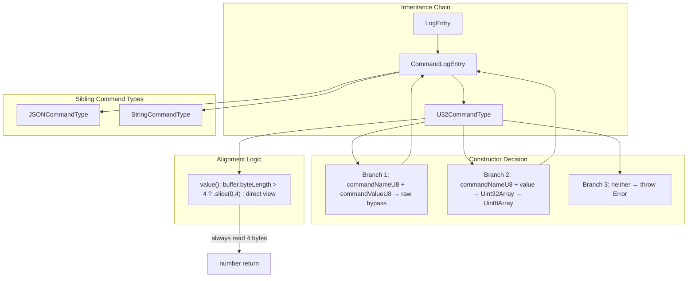
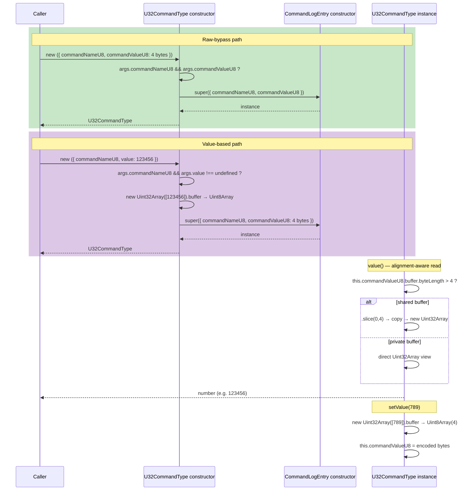

# U32CommandType — Unsigned 32-bit Command Type

**Module: Entry Types**

## Overview

`U32CommandType` is a concrete class that extends `CommandLogEntry` and provides **unsigned 32-bit integer serialization** for command entries whose value is a `number` in the `[0, 2^32−1]` range.

**Inheritance:** `LogEntry` → `CommandLogEntry` → `U32CommandType`

**Two construction modes:**
1. **Raw-bypass:** When `args.commandNameU8` and `args.commandValueU8` are both provided, the bytes pass through directly to `CommandLogEntry`.
2. **Value-based:** When `args.commandNameU8` and `args.value` (a `number`) are provided, the number is encoded as 4 bytes via `Uint32Array` view over a 4-byte `ArrayBuffer`.

**`value()` reads `commandValueU8`** with alignment-aware logic: if the backing `buffer.byteLength > 4` (shared-buffer scenario), it slices to a 4-byte copy first to guarantee 4-byte alignment for the `Uint32Array` view.

**Fixed-length entry:** Has `static expectedByteLength = 6` (1 byte entry type + 1 byte command name + 4 bytes u32 payload).

**This class has NO subclasses** — it is used directly as a leaf command type.

---

## Component Specifications

### Full TypeScript Declaration

```typescript
import CommandLogEntry from "../../command-log-entry"

export type U32CommandTypeArgs = {
    commandNameU8?: Uint8Array
    commandValueU8?: Uint8Array
    value?: number
}

export default class U32CommandType extends CommandLogEntry {
    constructor(args: U32CommandTypeArgs) {
        if (args.commandNameU8 && args.commandValueU8) {
            super({
                commandNameU8: args.commandNameU8,
                commandValueU8: args.commandValueU8,
            })
        } else if (args.commandNameU8 && args.value !== undefined) {
            super({
                commandNameU8: args.commandNameU8,
                commandValueU8: new Uint8Array(new Uint32Array([args.value]).buffer),
            })
        } else {
            throw new Error("U32CommandType requires commandNameU8 and either commandValueU8 or value")
        }
    }

    value(): number {
        return new Uint32Array(
            this.commandValueU8.buffer.byteLength > 4
                ? this.commandValueU8.slice(0, 4).buffer
                : this.commandValueU8.buffer,
        )[0]
    }

    setValue(value: number): void {
        this.commandValueU8 = new Uint8Array(new Uint32Array([value]).buffer)
    }

    static expectedByteLength: number = 6
}
```

### Property & Method Details

| Member | Type / Signature | Overrideable | Description |
|---|---|---|---|
| `constructor(args)` | `(args: U32CommandTypeArgs) => U32CommandType` | Yes | Two-mode: raw-bypass or number encoding |
| `value()` | `() => number` | Yes | Reads `commandValueU8` as little-endian u32 with alignment fix |
| `setValue(value)` | `(value: number) => void` | Yes | Encodes number as 4-byte little-endian u32 |
| `commandNameU8` | `Uint8Array` | No (inherited) | 1-byte command discriminator |
| `commandValueU8` | `Uint8Array` | No (inherited) | Exactly 4 bytes representing a u32 |
| `byteLength()` | `() => number` | No (inherited) | Always `6` (2 + 4) |
| `static expectedByteLength` | `number` | Yes | `6` (fixed-length entry) |

---

## System Architecture



**On-Wire Layout (fixed 6 bytes):**
```
┌────────┬──────────────┬──────────────────────────────┐
│ Ty     │ commandName  │ commandValue (4 bytes, u32 LE)│
│ 0x04   │ 1 byte       │ byte[0..3]                   │
└────────┴──────────────┴──────────────────────────────┘
```

---

## Detailed Data Flow



---

## Visualization

```html
<!DOCTYPE html>
<html lang="en">
<head>
<meta charset="UTF-8">
<meta name="viewport" content="width=device-width, initial-scale=1.0">
<title>U32CommandType — Encoding &amp; Alignment</title>
<script src="https://d3js.org/d3.v7.min.js"></script>
<style>
  body { font-family: system-ui, sans-serif; background: #1e1e2e; color: #cdd6f4; display: flex; justify-content: center; padding: 2rem; margin: 0; }
  #container { max-width: 800px; width: 100%; }
  h1 { font-size: 1.4rem; margin-bottom: 0.5rem; }
  svg { display: block; margin: 0 auto; background: #181825; border-radius: 8px; box-shadow: 0 4px 12px rgba(0,0,0,0.4); }
  .cls-node { cursor: default; }
  .cls-label { font-size: 12px; font-family: monospace; text-anchor: middle; dominant-baseline: central; }
  .cls-edge { stroke: #585b70; stroke-width: 1.5; fill: none; marker-end: url(#arrow); }
  .box-class { fill: #313244; stroke: #585b70; stroke-width: 1; rx: 6; ry: 6; }
  .box-op { fill: #1e1e2e; stroke: #89b4fa; stroke-width: 1.5; rx: 6; ry: 6; }
  .controls { margin-top: 1rem; display: flex; align-items: center; gap: 0.75rem; flex-wrap: wrap; justify-content: center; }
  button { background: #313244; color: #cdd6f4; border: 1px solid #585b70; border-radius: 6px; padding: 0.4rem 1rem; cursor: pointer; font-size: 0.85rem; }
  button:hover { background: #45475a; }
  .info { font-family: monospace; font-size: 0.85rem; color: #a6adc8; }
  .byte-box { fill: #2e3e2e; stroke: #a6e3a1; stroke-width: 1; rx: 3; ry: 3; }
  .byte-label { font-size: 11px; font-family: monospace; text-anchor: middle; fill: #a6e3a1; }
</style>
</head>
<body>
<div id="container">
  <h1>U32CommandType — Construction &amp; Alignment</h1>
  <div id="vis"></div>
  <div class="controls">
    <button data-testid="play-pause" id="playPauseBtn">&#9654; Play</button>
    <button id="resetBtn">&#8634; Reset</button>
    <span class="info">Keyframe: <span id="kf-current">0</span> / <span id="kf-total">0</span></span>
  </div>
</div>

<script>
(function() {
  const nodes = [
    { id: "U32CommandType",   x: 300, y: 10,  w: 200, h: 36, cls: "box-class" },
    { id: "Decision",         x: 280, y: 70,  w: 240, h: 36, cls: "box-class", label: "Constructor Decision" },
    { id: "RawBypass",        x: 40,  y: 140, w: 260, h: 36, cls: "box-op", label: "commandNameU8 + commandValueU8" },
    { id: "ValueBased",       x: 340, y: 140, w: 260, h: 36, cls: "box-op", label: "commandNameU8 + value (number)" },
    { id: "ThrowError",       x: 40,  y: 210, w: 260, h: 36, cls: "box-op", label: "neither → throw Error" },
    { id: "U32Encode",        x: 340, y: 210, w: 140, h: 36, cls: "box-op", label: "Uint32Array([n])" },
    { id: "U8Buffer",         x: 340, y: 280, w: 140, h: 36, cls: "box-op", label: "new Uint8Array(buf)" },
    { id: "CommandLogEntry",  x: 520, y: 280, w: 220, h: 36, cls: "box-class" },
    { id: "ValueRead",        x: 100, y: 320, w: 180, h: 36, cls: "box-op", label: "value() read path" },
    { id: "AlignCheck",       x: 100, y: 390, w: 180, h: 36, cls: "box-op", label: "byteLen > 4 ? slice : direct" },
    { id: "ReturnNum",        x: 100, y: 460, w: 180, h: 36, cls: "box-op", label: "Uint32Array[0] → number" },
  ];

  const edges = [
    { src: "U32CommandType", dst: "Decision" },
    { src: "Decision", dst: "RawBypass",    label: "both U8s" },
    { src: "Decision", dst: "ValueBased",   label: "name + value" },
    { src: "Decision", dst: "ThrowError",   label: "neither" },
    { src: "RawBypass",  dst: "CommandLogEntry" },
    { src: "ValueBased", dst: "U32Encode" },
    { src: "U32Encode",  dst: "U8Buffer" },
    { src: "U8Buffer",   dst: "CommandLogEntry" },
    { src: "U32CommandType", dst: "ValueRead" },
    { src: "ValueRead",  dst: "AlignCheck" },
    { src: "AlignCheck", dst: "ReturnNum" },
  ];

  const w = 800, h = 520;
  const svg = d3.select("#vis").append("svg").attr("width", w).attr("height", h);

  svg.append("defs").append("marker")
    .attr("id", "arrow").attr("viewBox", "0 -5 10 10").attr("refX", 10).attr("refY", 0)
    .attr("markerWidth", 6).attr("markerHeight", 6).attr("orient", "auto")
    .append("path").attr("d", "M0,-4L8,0L0,4").attr("fill", "#585b70");

  edges.forEach(e => {
    const s = nodes.find(n => n.id === e.src), d = nodes.find(n => n.id === e.dst);
    if (!s || !d) return;
    svg.append("line").attr("class", "cls-edge").attr("id", "edge-"+e.src+"-"+e.dst)
      .attr("x1", s.x + s.w/2).attr("y1", s.y + s.h).attr("x2", d.x + d.w/2).attr("y2", d.y);
  });

  nodes.forEach(n => {
    const g = svg.append("g").attr("id", "node-"+n.id).attr("class", "cls-node");
    g.append("rect").attr("x", n.x).attr("y", n.y).attr("width", n.w).attr("height", n.h)
      .attr("rx", 6).attr("class", n.cls);
    g.append("text").attr("class", "cls-label").attr("x", n.x + n.w/2).attr("y", n.y + n.h/2)
      .attr("fill", "#cdd6f4").text(n.label || n.id);
  });

  const KF = [];
  KF.push(() => { d3.selectAll(".cls-node").attr("opacity", 0.2); d3.selectAll(".cls-edge").attr("opacity", 0.08); });
  KF.push(() => { d3.selectAll(".cls-node").attr("opacity", 0.15); d3.selectAll(".cls-edge").attr("opacity", 0.05); ["U32CommandType","Decision"].forEach(id => d3.select("#node-"+id).attr("opacity",1)); });
  KF.push(() => { d3.selectAll(".cls-node").attr("opacity", 0.15); d3.selectAll(".cls-edge").attr("opacity", 0.05); ["U32CommandType","Decision","RawBypass","CommandLogEntry"].forEach(id => d3.select("#node-"+id).attr("opacity",1)); d3.select("#edge-U32CommandType-Decision").attr("opacity",0.5); d3.select("#edge-Decision-RawBypass").attr("opacity",0.5); d3.select("#edge-RawBypass-CommandLogEntry").attr("opacity",0.5); });
  KF.push(() => { d3.selectAll(".cls-node").attr("opacity", 0.15); d3.selectAll(".cls-edge").attr("opacity", 0.05); ["U32CommandType","Decision","ValueBased","U32Encode","U8Buffer","CommandLogEntry"].forEach(id => d3.select("#node-"+id).attr("opacity",1)); d3.select("#edge-U32CommandType-Decision").attr("opacity",0.5); d3.select("#edge-Decision-ValueBased").attr("opacity",0.5); d3.select("#edge-ValueBased-U32Encode").attr("opacity",0.5); d3.select("#edge-U32Encode-U8Buffer").attr("opacity",0.5); d3.select("#edge-U8Buffer-CommandLogEntry").attr("opacity",0.5); });
  KF.push(() => { d3.selectAll(".cls-node").attr("opacity", 0.15); d3.selectAll(".cls-edge").attr("opacity", 0.05); ["U32CommandType","Decision","ThrowError"].forEach(id => d3.select("#node-"+id).attr("opacity",1)); d3.select("#edge-U32CommandType-Decision").attr("opacity",0.5); d3.select("#edge-Decision-ThrowError").attr("opacity",0.5); });
  KF.push(() => { d3.selectAll(".cls-node").attr("opacity", 0.15); d3.selectAll(".cls-edge").attr("opacity", 0.05); ["U32CommandType","ValueRead","AlignCheck","ReturnNum"].forEach(id => d3.select("#node-"+id).attr("opacity",1)); d3.select("#edge-U32CommandType-ValueRead").attr("opacity",0.5); d3.select("#edge-ValueRead-AlignCheck").attr("opacity",0.5); d3.select("#edge-AlignCheck-ReturnNum").attr("opacity",0.5); });
  KF.push(() => { d3.selectAll(".cls-node").attr("opacity", 1); d3.selectAll(".cls-edge").attr("opacity", 0.35); });
  window.ANIMATION_KEYFRAMES = KF;

  let currentKF = 0, playing = false, timer = null;
  const $kfCurrent = d3.select("#kf-current");
  const $kfTotal   = d3.select("#kf-total");
  $kfTotal.text(KF.length - 1);

  function applyKF(idx) { currentKF = Math.max(0, Math.min(idx, KF.length-1)); $kfCurrent.text(currentKF); KF[currentKF](); }

  window.jumpToKeyframe = function(idx) { stop(); applyKF(idx); };
  window.resetAnimation = function() { stop(); applyKF(0); };
  window.getAnimationState = function() { return { currentKeyframe: currentKF, totalKeyframes: KF.length-1, isPlaying: playing }; };
  window.ANIMATION_DURATION_MS = KF.length * 800;
  window.ANIMATION_VERIFICATION = function() { const f=[]; if(!Array.isArray(window.ANIMATION_KEYFRAMES)) f.push("ANIMATION_KEYFRAMES missing"); if(typeof window.ANIMATION_DURATION_MS !== "number") f.push("ANIMATION_DURATION_MS missing"); if(typeof window.ANIMATION_VERIFICATION !== "function") f.push("ANIMATION_VERIFICATION missing"); if(typeof window.jumpToKeyframe !== "function") f.push("jumpToKeyframe missing"); if(typeof window.resetAnimation !== "function") f.push("resetAnimation missing"); if(typeof window.getAnimationState !== "function") f.push("getAnimationState missing"); if(!document.querySelector('[data-testid="play-pause"]')) f.push("[data-testid='play-pause'] missing"); if(!document.getElementById("kf-total")) f.push("#kf-total missing"); return { ok: f.length===0, failures: f }; };

  function stop() { playing=false; d3.select("#playPauseBtn").html("&#9654; Play"); if(timer) { clearTimeout(timer); timer=null; } }
  d3.select("#playPauseBtn").on("click", function() { if(playing) { stop(); return; } if(currentKF >= KF.length-1) applyKF(0); playing=true; this.innerHTML = "&#9646;&#9646; Pause"; (function step() { if(!playing) return; const next=currentKF+1; if(next>=KF.length) { stop(); applyKF(0); return; } applyKF(next); timer=setTimeout(step,800); })(); });
  d3.select("#resetBtn").on("click", () => window.resetAnimation());
  applyKF(0);
})();
</script>
</body>
</html>
```

---

## Testing Requirements

### Unit Tests

| # | Test | Expected Outcome |
|---|---|---|
| 1 | `new U32CommandType({ commandNameU8: Uint8Array([2]), commandValueU8: new Uint8Array(4) })` | Raw-bypass: `commandValueU8` is the exact 4 bytes |
| 2 | `new U32CommandType({ commandNameU8: Uint8Array([2]), value: 0 })` | `commandValueU8` is `Uint8Array([0, 0, 0, 0])` |
| 3 | `new U32CommandType({ commandNameU8: Uint8Array([2]), value: 1 })` | `commandValueU8` is `Uint8Array([1, 0, 0, 0])` (little-endian) |
| 4 | `new U32CommandType({ commandNameU8: Uint8Array([2]), value: 0xDEADBEEF })` | `commandValueU8` is `[0xEF, 0xBE, 0xAD, 0xDE]` |
| 5 | `new U32CommandType({})` | Throws `Error("U32CommandType requires commandNameU8 and either commandValueU8 or value")` |
| 6 | `new U32CommandType({ value: 42 })` (no commandNameU8) | Throws same error |

### Value Access Tests

| # | Test | Expected Outcome |
|---|---|---|
| 1 | `instance.value()` on instance with `commandValueU8 = new Uint8Array([0xEF, 0xBE, 0xAD, 0xDE])` | Returns `0xDEADBEEF` (3735928559) |
| 2 | `instance.setValue(255)` then `instance.value()` | Returns `255` |
| 3 | `instance.setValue(0xFFFFFFFF)` (max u32) then `instance.value()` | Returns `4294967295` |
| 4 | `instance.setValue(0)` then `instance.value()` | Returns `0` |

### Alignment Test

| # | Test | Expected Outcome |
|---|---|---|
| 1 | Create a `Uint8Array(8)` and set bytes 4–7 to an encoded u32; create instance with a subarray view (shared buffer with `byteLength > 4`) | `value()` correctly reads the 4-byte slice without alignment error |
| 2 | Create instance with a private 4-byte buffer (`byteLength === 4`) | `value()` reads directly, returns correct number |

### Fixed-Length Tests

| # | Test | Expected Outcome |
|---|---|---|
| 1 | `U32CommandType.expectedByteLength` | Equals `6` |
| 2 | `instance.byteLength()` | Always `6` regardless of value |
| 3 | `instance.u8s().reduce((a,b) => a + b.byteLength, 0)` | Equals `instance.byteLength()` (6) |

### Edge Cases

| # | Scenario | Assertion |
|---|---|---|
| 1 | `value` is a negative number (e.g. -1) | Encoded as `0xFFFFFFFF` (two's complement u32 wrap) |
| 2 | `value` is `NaN` | `Uint32Array([NaN])` → `[0]` (NaN coerces to 0) |
| 3 | `value` is a float (e.g. `3.14`) | `Uint32Array([3.14])` → `[3]` (truncation toward zero) |
| 4 | `value` > `0xFFFFFFFF` (e.g. `2**32 + 5`) | Wraps modulo `2**32` → `5` |

---

## 7. Source-Test Cross-References

### Test Coverage

| Test Spec | Path |
|---|---|
| No test spec | |
