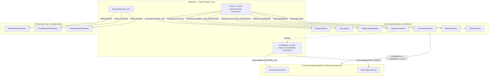
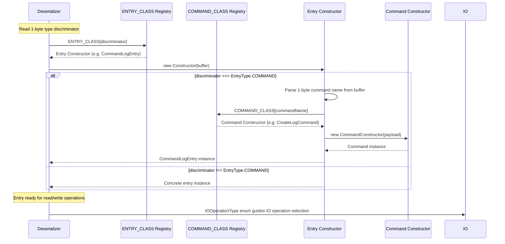

# Globals — Specification

**Module: Globals & Constants**

## 1. Overview

**Role:** `src/lib/globals.ts` defines the foundational constants, enums, and registries used by the entire log-structured storage system. It acts as a single source of truth for magic numbers, type discriminators, and class-mapping tables that drive deserialization dispatch.

**Dependencies:** Zero runtime dependencies. The module imports constructor references from adjacent entry and IO modules, but those are only used for type-theoretic convenience in registry declarations; the values are never instantiated here.

**Lifecycle:** Static-only module. All exports are `const` values, `const enum` discriminators, or plain-object registries. There is no initialization or teardown — the module is ready as soon as it is imported.

---

## 2. Component Specifications

### 2.1 Constants

```typescript
export const DEFAULT_HOT_LOG_FILE_NAME: string         = "global-hot.log"
export const MAX_ENTRY_SIZE: number                    = 32768           // 2^15
export const MAX_LOG_SIZE: number                      = 16777216        // 2^24
export const MAX_RESPONSE_ENTRIES: number               = 100
export const GLOBAL_LOG_CHECKPOINT_INTERVAL: number     = 131072          // 128 * 1024
export const GLOBAL_LOG_CHECKPOINT_BYTE_LENGTH: number  = 9
export const LOG_LOG_CHECKPOINT_INTERVAL: number        = 131072          // 128 * 1024
export const LOG_LOG_CHECKPOINT_BYTE_LENGTH: number     = 13
export const GLOBAL_LOG_PREFIX_BYTE_LENGTH: number      = 27
export const LOG_LOG_PREFIX_BYTE_LENGTH: number         = 11
```

### 2.2 Enums

```typescript
export const enum CommandName {
    CREATE_LOG,    // 0
    SET_CONFIG,    // 1
}

export const enum EntryType {
    GLOBAL_LOG,             // 0
    LOG_LOG,                // 1
    GLOBAL_LOG_CHECKPOINT,  // 2
    LOG_LOG_CHECKPOINT,     // 3
    COMMAND,                // 4
    BINARY,                 // 5
    JSON,                   // 6
}

export enum IOOperationType {
    READ_ENTRY,   // 0
    READ_ENTRIES,  // 1
    READ_RANGE,    // 2
    WRITE,         // 3
}
```

### 2.3 Registries

```typescript
export type COMMAND_CLASSES = typeof CreateLogCommand | typeof SetConfigCommand

export const COMMAND_CLASS: { [index: number]: COMMAND_CLASSES } = {
    [CommandName.CREATE_LOG]: CreateLogCommand,
    [CommandName.SET_CONFIG]: SetConfigCommand,
}

export type ENTRY_TYPE_CLASSES =
    | typeof GlobalLogEntry
    | typeof LogLogEntry
    | typeof GlobalLogCheckpoint
    | typeof LogLogCheckpoint
    | typeof CommandLogEntry
    | typeof BinaryLogEntry
    | typeof JSONLogEntry

export const ENTRY_CLASS: { [index: number]: ENTRY_TYPE_CLASSES } = {
    [EntryType.GLOBAL_LOG]:            GlobalLogEntry,
    [EntryType.LOG_LOG]:               LogLogEntry,
    [EntryType.GLOBAL_LOG_CHECKPOINT]: GlobalLogCheckpoint,
    [EntryType.LOG_LOG_CHECKPOINT]:    LogLogCheckpoint,
    [EntryType.COMMAND]:               CommandLogEntry,
    [EntryType.BINARY]:                BinaryLogEntry,
    [EntryType.JSON]:                  JSONLogEntry,
}
```

### 2.4 Error Class

```typescript
export class AbortWriteError extends Error {
    constructor() {
        super("Write Aborted")
    }
}
```

### 2.5 Read-IO Union Type

```typescript
export type ReadIOOperation = ReadEntryIOOperation | ReadEntriesIOOperation | ReadRangeIOOperation
```

---

## 3. System Architecture



---

## 4. Detailed Data Flow



---

## 5. Visualization

```html
<!DOCTYPE html>
<html lang="en">
<head>
<meta charset="UTF-8">
<meta name="viewport" content="width=device-width, initial-scale=1.0">
<title>ENTRY_CLASS Registry Dispatch</title>
<script src="https://d3js.org/d3.v7.min.js"></script>
<style>
  body { font-family: system-ui, sans-serif; background: #1e1e2e; color: #cdd6f4; display: flex; justify-content: center; padding: 2rem; margin: 0; }
  #container { max-width: 800px; width: 100%; }
  h1 { font-size: 1.4rem; margin-bottom: 0.5rem; }
  #vis { position: relative; }
  svg { display: block; margin: 0 auto; background: #181825; border-radius: 8px; box-shadow: 0 4px 12px rgba(0,0,0,0.4); }
  .entry-row { cursor: default; }
  .entry-label { font-size: 13px; font-family: monospace; }
  .entry-value { font-size: 13px; font-family: monospace; }
  .arrow { stroke: #585b70; stroke-width: 1.5; fill: none; marker-end: url(#arrowhead); }
  .arrow-active { stroke: #f5c2e7; stroke-width: 2.5; }
  .box { fill: #313244; stroke: #585b70; stroke-width: 1; rx: 6; ry: 6; }
  .box-active { fill: #45475a; stroke: #f5c2e7; stroke-width: 2; }
  .box-highlight { fill: #1e66f5; stroke: #89b4fa; stroke-width: 2; }
  .class-box { fill: #1e1e2e; stroke: #a6e3a1; stroke-width: 1; rx: 6; ry: 6; }
  .class-box-active { fill: #2e3e2e; stroke: #a6e3a1; stroke-width: 2.5; }
  .controls { margin-top: 1rem; display: flex; align-items: center; gap: 0.75rem; flex-wrap: wrap; justify-content: center; }
  button { background: #313244; color: #cdd6f4; border: 1px solid #585b70; border-radius: 6px; padding: 0.4rem 1rem; cursor: pointer; font-size: 0.85rem; }
  button:hover { background: #45475a; }
  #kf-info { font-family: monospace; font-size: 0.85rem; color: #a6adc8; }
</style>
</head>
<body>
<div id="container">
  <h1>ENTRY_CLASS Dispatch Registry</h1>
  <div id="vis"></div>
  <div class="controls">
    <button data-testid="play-pause" id="playPauseBtn">&#9654; Play</button>
    <button id="resetBtn">&#8634; Reset</button>
    <span id="kf-info">Keyframe: <span id="kf-current">0</span> / <span id="kf-total">0</span></span>
  </div>
</div>

<script>
(function() {
  // ---- ANIMATION CONFIG ----
  window.ANIMATION_DURATION_MS = 12000;

  window.ANIMATION_KEYFRAMES = [
    { time: 0,    label: "Initial — all entries idle" },
    { time: 1500, label: "GLOBAL_LOG → GlobalLogEntry" },
    { time: 3000, label: "LOG_LOG → LogLogEntry" },
    { time: 4500, label: "GLOBAL_LOG_CHECKPOINT → GlobalLogCheckpoint" },
    { time: 6000, label: "LOG_LOG_CHECKPOINT → LogLogCheckpoint" },
    { time: 7500, label: "COMMAND → CommandLogEntry" },
    { time: 9000, label: "BINARY → BinaryLogEntry" },
    { time: 10500, label: "JSON → JSONLogEntry" },
    { time: 12000, label: "Complete — all entries idle" },
  ];

  const KF = window.ANIMATION_KEYFRAMES;
  const $kfCurrent = d3.select("#kf-current");
  const $kfTotal   = d3.select("#kf-total");
  $kfTotal.text(KF.length - 1);

  // ---- DATA ----
  const entries = [
    { id: 0, type: "GLOBAL_LOG",            cls: "GlobalLogEntry" },
    { id: 1, type: "LOG_LOG",               cls: "LogLogEntry" },
    { id: 2, type: "GLOBAL_LOG_CHECKPOINT", cls: "GlobalLogCheckpoint" },
    { id: 3, type: "LOG_LOG_CHECKPOINT",    cls: "LogLogCheckpoint" },
    { id: 4, type: "COMMAND",               cls: "CommandLogEntry" },
    { id: 5, type: "BINARY",                cls: "BinaryLogEntry" },
    { id: 6, type: "JSON",                  cls: "JSONLogEntry" },
  ];

  // ---- LAYOUT ----
  const w = 700, h = 50 + entries.length * 56 + 40;
  const margin = { top: 20, left: 30, right: 30 };
  const rowH = 56;
  const boxW = 260, gap = 30, classW = 260;
  const leftX = margin.left;
  const rightX = w - margin.right - classW;
  const midX = leftX + boxW + gap / 2;

  const svg = d3.select("#vis").append("svg").attr("width", w).attr("height", h);

  // Arrow marker
  svg.append("defs").append("marker")
    .attr("id", "arrowhead")
    .attr("viewBox", "0 -5 10 10")
    .attr("refX", 5).attr("refY", 0)
    .attr("markerWidth", 6).attr("markerHeight", 6)
    .attr("orient", "auto")
    .append("path").attr("d", "M0,-4L8,0L0,4").attr("fill", "#585b70");

  // ---- DRAW ROWS ----
  const rows = svg.selectAll("g.entry-row")
    .data(entries)
    .enter()
    .append("g")
    .attr("class", "entry-row")
    .attr("transform", (d, i) => `translate(0, ${margin.top + i * rowH})`);

  // EntryType boxes
  rows.append("rect")
    .attr("class", d => `box entry-box-${d.id}`)
    .attr("x", leftX)
    .attr("y", 10)
    .attr("width", boxW)
    .attr("height", 34);

  rows.append("text")
    .attr("x", leftX + boxW / 2)
    .attr("y", 30)
    .attr("text-anchor", "middle")
    .attr("class", "entry-label")
    .attr("fill", "#cdd6f4")
    .text(d => `EntryType.${d.type}`);

  // Arrow
  rows.append("line")
    .attr("class", d => `arrow arrow-${d.id}`)
    .attr("x1", leftX + boxW)
    .attr("y1", 27)
    .attr("x2", rightX)
    .attr("y2", 27);

  // Class boxes
  rows.append("rect")
    .attr("class", d => `class-box class-box-${d.id}`)
    .attr("x", rightX)
    .attr("y", 10)
    .attr("width", classW)
    .attr("height", 34);

  rows.append("text")
    .attr("x", rightX + classW / 2)
    .attr("y", 30)
    .attr("text-anchor", "middle")
    .attr("class", "entry-value")
    .attr("fill", "#a6e3a1")
    .text(d => d.cls);

  // Legend
  svg.append("text")
    .attr("x", margin.left)
    .attr("y", h - 8)
    .attr("font-size", "11px")
    .attr("fill", "#6c7086")
    .text("EntryType discriminator → Constructor lookup");

  // ---- ANIMATION STATE ----
  let currentKF = 0;
  let playing = false;
  let timer = null;

  function applyKeyframe(idx) {
    currentKF = Math.max(0, Math.min(idx, KF.length - 1));
    $kfCurrent.text(currentKF);

    // Reset all rows
    entries.forEach((d, i) => {
      svg.select(`.entry-box-${d.id}`).attr("class", `box entry-box-${d.id}`);
      svg.select(`.arrow-${d.id}`).attr("class", `arrow arrow-${d.id}`).attr("marker-end", "url(#arrowhead)");
      svg.select(`.class-box-${d.id}`).attr("class", `class-box class-box-${d.id}`);
    });

    if (currentKF === 0 || currentKF === KF.length - 1) return;

    // Active entry is currentKF - 1 (0-based, skip initial frame)
    const activeIdx = currentKF - 1;
    const d = entries[activeIdx];
    if (!d) return;

    svg.select(`.entry-box-${d.id}`).attr("class", `box-active entry-box-${d.id}`);
    svg.select(`.arrow-${d.id}`).attr("class", `arrow arrow-active arrow-${d.id}`).attr("marker-end", null);
    svg.select(`.class-box-${d.id}`).attr("class", `class-box-active class-box-${d.id}`);
  }

  // ---- GLOBAL FUNCTIONS ----
  window.jumpToKeyframe = function(idx) {
    stopPlay();
    applyKeyframe(idx);
  };

  window.resetAnimation = function() {
    stopPlay();
    applyKeyframe(0);
  };

  window.getAnimationState = function() {
    return {
      currentKeyframe: currentKF,
      totalKeyframes: KF.length - 1,
      isPlaying: playing,
      label: KF[currentKF] ? KF[currentKF].label : "",
    };
  };

  // ---- PLAY/PAUSE ----
  function stopPlay() {
    playing = false;
    d3.select("#playPauseBtn").html("&#9654; Play");
    if (timer) { clearTimeout(timer); timer = null; }
  }

  function togglePlay() {
    if (playing) { stopPlay(); return; }
    if (currentKF >= KF.length - 1) applyKeyframe(0);
    playing = true;
    d3.select("#playPauseBtn").html("&#9646;&#9646; Pause");

    function step() {
      if (!playing) return;
      const next = currentKF + 1;
      if (next >= KF.length) { stopPlay(); applyKeyframe(0); return; }
      applyKeyframe(next);
      const delay = (next < KF.length - 1)
        ? KF[next + 1].time - KF[next].time
        : KF[next].time - KF[next - 1].time;
      timer = setTimeout(step, delay);
    }

    const delay = (currentKF === 0) ? KF[1].time - KF[0].time : KF[currentKF + 1].time - KF[currentKF].time;
    timer = setTimeout(step, Math.max(16, delay));
  }

  d3.select("#playPauseBtn").on("click", togglePlay);
  d3.select("#resetBtn").on("click", () => window.resetAnimation());

  // ---- VERIFICATION ----
  window.ANIMATION_VERIFICATION = [
    { kf: 0, assert: () => document.querySelectorAll(".entry-row").length === 7, desc: "7 entry rows rendered" },
    { kf: 0, assert: () => document.querySelectorAll(".box").length === 7, desc: "7 entry-type boxes present" },
    { kf: 0, assert: () => document.querySelectorAll(".class-box").length === 7, desc: "7 class boxes present" },
    { kf: 1, assert: () => document.querySelector(".entry-box-0").classList.contains("box-active"), desc: "KF1: GLOBAL_LOG box is active" },
    { kf: 1, assert: () => document.querySelector(".arrow-0").classList.contains("arrow-active"), desc: "KF1: arrow active" },
    { kf: 1, assert: () => document.querySelector(".class-box-0").classList.contains("class-box-active"), desc: "KF1: GlobalLogEntry active" },
    { kf: 2, assert: () => document.querySelector(".entry-box-1").classList.contains("box-active"), desc: "KF2: LOG_LOG box is active" },
    { kf: 3, assert: () => document.querySelector(".entry-box-2").classList.contains("box-active"), desc: "KF3: GLOBAL_LOG_CHECKPOINT active" },
    { kf: 4, assert: () => document.querySelector(".entry-box-3").classList.contains("box-active"), desc: "KF4: LOG_LOG_CHECKPOINT active" },
    { kf: 5, assert: () => document.querySelector(".entry-box-4").classList.contains("box-active"), desc: "KF5: COMMAND active" },
    { kf: 6, assert: () => document.querySelector(".entry-box-5").classList.contains("box-active"), desc: "KF6: BINARY active" },
    { kf: 7, assert: () => document.querySelector(".entry-box-6").classList.contains("box-active"), desc: "KF7: JSON active" },
    { kf: 8, assert: () => !document.querySelector(".entry-box-0").classList.contains("box-active"), desc: "KF8: reset — all idle" },
    { kf: 8, assert: () => document.getElementById("kf-total").textContent === "8", desc: "kf-total shows 8" },
    { kf: 0, assert: () => document.querySelector('[data-testid="play-pause"]') !== null, desc: "play-pause button exists" },
    { kf: 0, assert: () => typeof window.jumpToKeyframe === "function", desc: "jumpToKeyframe is function" },
    { kf: 0, assert: () => typeof window.resetAnimation === "function", desc: "resetAnimation is function" },
    { kf: 0, assert: () => typeof window.getAnimationState === "function", desc: "getAnimationState is function" },
    { kf: 0, assert: () => window.ANIMATION_DURATION_MS === 12000, desc: "ANIMATION_DURATION_MS is 12000" },
  ];

  // Initialize at keyframe 0
  applyKeyframe(0);
})();
</script>
</body>
</html>
```

---

## 6. Testing Requirements

### 6.1 Constant Value Assertions

| Constant | Expected Value | Notes |
|---|---|---|
| `DEFAULT_HOT_LOG_FILE_NAME` | `"global-hot.log"` | String literal |
| `MAX_ENTRY_SIZE` | `32768` | `2 ** 15` |
| `MAX_LOG_SIZE` | `16777216` | `2 ** 24` |
| `MAX_RESPONSE_ENTRIES` | `100` | |
| `GLOBAL_LOG_CHECKPOINT_INTERVAL` | `131072` | `128 * 1024` |
| `GLOBAL_LOG_CHECKPOINT_BYTE_LENGTH` | `9` | 1 (type) + 2 (offset) + 2 (length) + 4 (cksum) |
| `LOG_LOG_CHECKPOINT_INTERVAL` | `131072` | `128 * 1024` |
| `LOG_LOG_CHECKPOINT_BYTE_LENGTH` | `13` | 1 (type) + 2 (offset) + 2 (length) + 4 (config) + 4 (cksum) |
| `GLOBAL_LOG_PREFIX_BYTE_LENGTH` | `27` | 1 (type) + 16 (logId) + 4 (entryNum) + 2 (length) + 4 (crc) |
| `LOG_LOG_PREFIX_BYTE_LENGTH` | `11` | 1 (type) + 4 (entryNum) + 2 (length) + 4 (crc) |

### 6.2 Enum Value Assertions

#### `CommandName` (const enum)

| Member | Expected Value |
|---|---|
| `CommandName.CREATE_LOG` | `0` |
| `CommandName.SET_CONFIG` | `1` |

#### `EntryType` (const enum)

| Member | Expected Value |
|---|---|
| `EntryType.GLOBAL_LOG` | `0` |
| `EntryType.LOG_LOG` | `1` |
| `EntryType.GLOBAL_LOG_CHECKPOINT` | `2` |
| `EntryType.LOG_LOG_CHECKPOINT` | `3` |
| `EntryType.COMMAND` | `4` |
| `EntryType.BINARY` | `5` |
| `EntryType.JSON` | `6` |

#### `IOOperationType` (runtime enum)

| Member | Expected Value |
|---|---|
| `IOOperationType.READ_ENTRY` | `0` |
| `IOOperationType.READ_ENTRIES` | `1` |
| `IOOperationType.READ_RANGE` | `2` |
| `IOOperationType.WRITE` | `3` |

#### `IOOperationType` Enum Runtime Checks

- `IOOperationType` must be a runtime `enum` (not `const enum`), verifiable via `typeof IOOperationType === "object"`.
- Reverse mapping must be present: `IOOperationType[0] === "READ_ENTRY"`, `IOOperationType[3] === "WRITE"`.

### 6.3 Registry Lookup

#### `COMMAND_CLASS`

| Key | Expected Constructor |
|---|---|
| `COMMAND_CLASS[CommandName.CREATE_LOG]` | `CreateLogCommand` |
| `COMMAND_CLASS[CommandName.SET_CONFIG]` | `SetConfigCommand` |

- `Object.keys(COMMAND_CLASS).length` must equal `2`.
- `COMMAND_CLASS[-1]` must be `undefined`.
- `COMMAND_CLASS[99]` must be `undefined`.

#### `ENTRY_CLASS`

| Key | Expected Constructor |
|---|---|
| `ENTRY_CLASS[EntryType.GLOBAL_LOG]` | `GlobalLogEntry` |
| `ENTRY_CLASS[EntryType.LOG_LOG]` | `LogLogEntry` |
| `ENTRY_CLASS[EntryType.GLOBAL_LOG_CHECKPOINT]` | `GlobalLogCheckpoint` |
| `ENTRY_CLASS[EntryType.LOG_LOG_CHECKPOINT]` | `LogLogCheckpoint` |
| `ENTRY_CLASS[EntryType.COMMAND]` | `CommandLogEntry` |
| `ENTRY_CLASS[EntryType.BINARY]` | `BinaryLogEntry` |
| `ENTRY_CLASS[EntryType.JSON]` | `JSONLogEntry` |

- `Object.keys(ENTRY_CLASS).length` must equal `7`.
- `ENTRY_CLASS[-1]` must be `undefined`.
- `ENTRY_CLASS[99]` must be `undefined`.

### 6.4 `AbortWriteError`

- `new AbortWriteError()` must be an instance of `Error`.
- `new AbortWriteError().name` must be `"Error"` (inherited) or `"AbortWriteError"` (if `.name` is overridden).
- `new AbortWriteError().message` must be `"Write Aborted"`.

### 6.5 `ReadIOOperation` Type

- `ReadIOOperation` is a type alias (compile-time only) and cannot be tested at runtime. Verify that `ReadEntryIOOperation`, `ReadEntriesIOOperation`, and `ReadRangeIOOperation` all satisfy `ReadIOOperation` via TypeScript `satisfies` or type assignment compilation checks.

### 6.6 Visualization Verification

1. Open the HTML from §5 in a browser.
2. Confirm 7 entry rows are rendered (EntryType → Class boxes, connected by arrows).
3. Click the `[data-testid="play-pause"]` button — animation must cycle through each EntryType in order.
4. Verify `window.ANIMATION_DURATION_MS` is a positive integer (12000).
5. Verify `window.ANIMATION_KEYFRAMES` has 9 entries (time 0 through 12000).
6. Execute `window.ANIMATION_VERIFICATION` — all `assert` callbacks must return `true`.
7. Call `window.jumpToKeyframe(5)` — the COMMAND row must be highlighted.
8. Call `window.resetAnimation()` — all rows return to idle state, counter shows 0.
9. Call `window.getAnimationState()` — returned object must contain `currentKeyframe`, `totalKeyframes`, `isPlaying`, and `label`.
10. Confirm `<span id="kf-total">` displays `8` (the 0-based total, i.e., keyframe count − 1).

---

## 7. Source-Test Cross-References

### Test Coverage

| Test Spec | Path |
|---|---|
| No test spec | |
