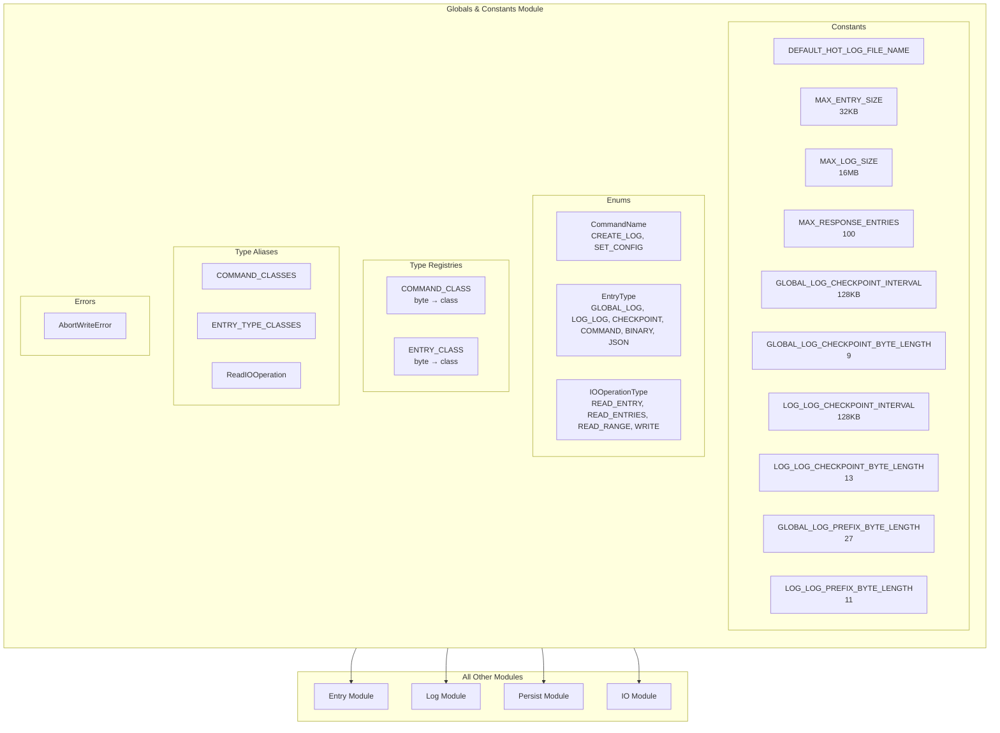
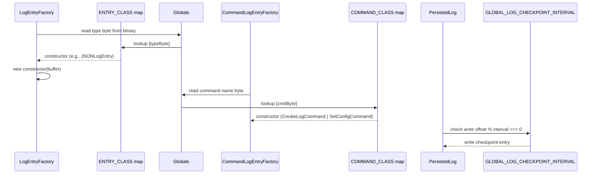

# Globals & Constants — GlobalsModule.spec.md

## 1. Overview

The **Globals & Constants Module** defines all shared constants, enums, type registries, and the `AbortWriteError` exception used across every other sub-module. It is a **leaf module** with zero internal dependencies. Every other module in the system imports from this file.

**Dependencies:** (none)  
**Lifecycle stages:** Static initialization (enum maps `ENTRY_CLASS`, `COMMAND_CLASS` populated at module load time)

## 2. Component Specifications

| Component | Role | Access Path |
|---|---|---|
| `DEFAULT_HOT_LOG_FILE_NAME` | Default filename for global hot log | `../globals.ts` |
| `MAX_ENTRY_SIZE` | Max POST body size (32KB) | `../globals.ts` |
| `MAX_LOG_SIZE` | Max per-log file size (16MB) | `../globals.ts` |
| `MAX_RESPONSE_ENTRIES` | Max entries returned per request (100) | `../globals.ts` |
| `GLOBAL_LOG_CHECKPOINT_INTERVAL` | Checkpoint byte interval in hot log (128KB) | `../globals.ts` |
| `GLOBAL_LOG_CHECKPOINT_BYTE_LENGTH` | Serialized checkpoint size (9 bytes) | `../globals.ts` |
| `LOG_LOG_CHECKPOINT_INTERVAL` | Checkpoint byte interval in log-log (128KB) | `../globals.ts` |
| `LOG_LOG_CHECKPOINT_BYTE_LENGTH` | Serialized log-log checkpoint size (13 bytes) | `../globals.ts` |
| `GLOBAL_LOG_PREFIX_BYTE_LENGTH` | GlobalLogEntry prefix size (27 bytes) | `../globals.ts` |
| `LOG_LOG_PREFIX_BYTE_LENGTH` | LogLogEntry prefix size (11 bytes) | `../globals.ts` |
| `CommandName` enum | `CREATE_LOG`, `SET_CONFIG` | `../globals.ts` |
| `EntryType` enum | `GLOBAL_LOG`, `LOG_LOG`, `GLOBAL_LOG_CHECKPOINT`, `LOG_LOG_CHECKPOINT`, `COMMAND`, `BINARY`, `JSON` | `../globals.ts` |
| `IOOperationType` enum | `READ_ENTRY`, `READ_ENTRIES`, `READ_RANGE`, `WRITE` | `../globals.ts` |
| `COMMAND_CLASS` map | Command enum byte → concrete CommandLogEntry subclass constructor | `../globals.ts` |
| `ENTRY_CLASS` map | EntryType byte → concrete LogEntry subclass constructor | `../globals.ts` |
| `COMMAND_CLASSES` type | Union of `CreateLogCommand` \| `SetConfigCommand` | `../globals.ts` |
| `ENTRY_TYPE_CLASSES` type | Union of all LogEntry subclass constructors | `../globals.ts` |
| `ReadIOOperation` type | Union of read operation types | `../globals.ts` |
| `AbortWriteError` class | Error for aborted write operations | `../globals.ts` |

## 3. System Architecture



## 4. Detailed Data Flow



## 5. Visualization

```html
<!DOCTYPE html>
<html>
<head>
<meta charset="utf-8">
<style>
  body { font-family: monospace; background: #1e1e2e; color: #cdd6f4; margin: 0; }
  #vis { width: 960px; height: 540px; position: relative; }
  .controls { display: flex; gap: 8px; padding: 8px; background: #181825; align-items: center; }
  .controls button { background: #45475a; color: #cdd6f4; border: none; padding: 4px 12px; cursor: pointer; }
  #kf-current, #kf-total { color: #a6adc8; font-size: 12px; min-width: 20px; text-align: center; }
  #frame-label { color: #89b4fa; font-size: 14px; margin-left: auto; }
  .node { position: absolute; border: 2px solid #89b4fa; border-radius: 6px; padding: 8px 12px;
           background: #313244; font-size: 11px; text-align: center; transition: all 0.3s; }
  .node.active { border-color: #a6e3a1; background: #45475a; box-shadow: 0 0 12px #a6e3a180; }
  .edge { position: absolute; height: 2px; background: #585b70; transform-origin: 0 0; }
  .edge.active { background: #a6e3a1; }
  .badge { font-size: 9px; color: #6c7086; }
</style>
</head>
<body>
<div class="controls">
  <button id="play-pause" data-testid="play-pause">⏸</button>
  <span id="kf-current">0</span><span>/</span><span id="kf-total">3</span>
  <input type="range" id="seek" min="0" max="3" value="0" style="flex:1">
  <span id="frame-label">Module load: enum maps populated</span>
</div>
<div id="vis"></div>
<script>
(function(){
  const ANIMATION_DURATION_MS = 6000;
  const ANIMATION_KEYFRAMES = [
    { label: "Module load: enum maps populated", active: ["G"], edges: [] },
    { label: "Factory reads type byte → dispatches", active: ["G","EC"], edges: ["G-EC"] },
    { label: "Factory reads command byte → dispatches", active: ["G","CC"], edges: ["G-CC"] },
  ];
  const nodePositions = {
    G: [80, 120], EC: [320, 60], CC: [320, 180]
  };

  const vis = document.getElementById('vis');
  Object.entries(nodePositions).forEach(([id, [x, y]]) => {
    const el = document.createElement('div');
    el.className = 'node'; el.id = 'n-' + id;
    el.style.left = x + 'px'; el.style.top = y + 'px';
    el.innerHTML = `<strong>${id}</strong><div class="badge">globals</div>`;
    vis.appendChild(el);
  });

  [['G','EC'],['G','CC']].forEach(([from, to]) => {
    const fx = nodePositions[from][0] + 40, fy = nodePositions[from][1] + 20;
    const tx = nodePositions[to][0], ty = nodePositions[to][1] + 20;
    const dx = tx - fx, dy = ty - fy;
    const len = Math.sqrt(dx*dx + dy*dy);
    const el = document.createElement('div');
    el.className = 'edge'; el.id = 'e-' + from + '-' + to;
    el.style.left = fx + 'px'; el.style.top = fy + 'px';
    el.style.width = len + 'px';
    el.style.transform = 'rotate(' + (Math.atan2(dy, dx) * 180 / Math.PI) + 'deg)';
    vis.appendChild(el);
  });

  let currentKf = 0, playing = true, intervalId;
  function jumpToKeyframe(idx) {
    currentKf = Math.max(0, Math.min(idx, ANIMATION_KEYFRAMES.length - 1));
    const kf = ANIMATION_KEYFRAMES[currentKf];
    document.querySelectorAll('.node').forEach(n => n.classList.toggle('active', kf.active.includes(n.id.replace('n-',''))));
    document.querySelectorAll('.edge').forEach(e => e.classList.toggle('active', kf.edges?.includes(e.id.replace('e-',''))));
    document.getElementById('frame-label').textContent = kf.label;
    document.getElementById('kf-current').textContent = currentKf;
    document.getElementById('seek').value = currentKf;
  }
  function resetAnimation() { jumpToKeyframe(0); }
  function getAnimationState() { return { currentKf, playing, total: ANIMATION_KEYFRAMES.length }; }
  function togglePlay() {
    playing = !playing;
    document.getElementById('play-pause').textContent = playing ? '⏸' : '▶';
    if (playing) intervalId = setInterval(() => jumpToKeyframe((currentKf+1) % ANIMATION_KEYFRAMES.length), ANIMATION_DURATION_MS / ANIMATION_KEYFRAMES.length);
    else clearInterval(intervalId);
  }
  document.getElementById('play-pause').addEventListener('click', togglePlay);
  document.getElementById('seek').addEventListener('input', function() { jumpToKeyframe(parseInt(this.value)); });
  document.getElementById('kf-total').textContent = ANIMATION_KEYFRAMES.length - 1;
  jumpToKeyframe(0);
  intervalId = setInterval(() => jumpToKeyframe((currentKf+1) % ANIMATION_KEYFRAMES.length), ANIMATION_DURATION_MS / ANIMATION_KEYFRAMES.length);
  window.__ANIMATION = { ANIMATION_KEYFRAMES, ANIMATION_DURATION_MS, jumpToKeyframe, resetAnimation, getAnimationState };
})();
</script>
</body>
</html>
```

## 6. Testing Requirements

| Test scope | Unit test | Validates |
|---|---|---|
| Constants | `globals.test.ts` | All numeric constants match expected values |
| Enums | same | `CommandName`, `EntryType`, `IOOperationType` have correct numeric values |
| `COMMAND_CLASS` map | same | Correct constructor per command byte |
| `ENTRY_CLASS` map | same | Correct constructor per entry type byte |
| `AbortWriteError` | same | Extends Error |
| Type aliases | same | Compile-time only — validated by TS compiler |

## 7. Source-Test Cross-References

| Source file | Test spec |
|---|---|
| `src/lib/globals.ts` | `src/lib/globals.test.ts` |
