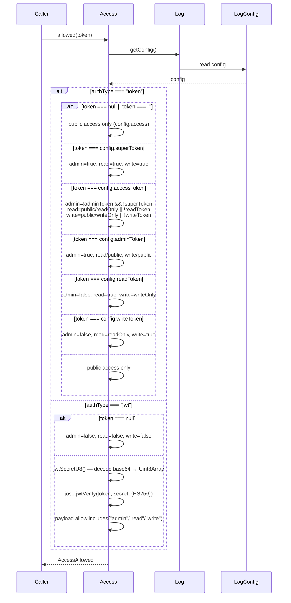

# Access Spec

**Module: Log Abstraction**

## Overview

Authorization layer for log operations. Supports two authentication modes — **token** (static shared secrets for admin/read/write) and **JWT** (HS256-signed payload with `allow` string claim). Delegates to `Log` for config and caches the JWT secret as a `Uint8Array`.

## Component Specifications

```typescript
type AccessAllowed = {
    admin: boolean    // can perform administrative operations
    read: boolean     // can read entries
    write: boolean    // can append entries
}

class Access {
    log: Log
    #jwtSecretU8: Uint8Array | null   // cached decoded JWT secret (base64 → buffer)
}
```

## System Architecture

```mermaid
graph TB
    Client[Client Request] --> A[Access.allowed(token)]
    A --> C[Log.getConfig]
    C --> CFG[LogConfig<br/>authType, access,<br/>superToken, accessToken,<br/>adminToken, readToken,<br/>writeToken, jwtSecret]
    CFG -->|authType === "token"| TokenFlow[Token Matching]
    CFG -->|authType === "jwt"| JWTFlow[JWT Verification]
    TokenFlow --> SuperMatch{superToken?}
    SuperMatch -->|yes| AllowAll[admin=true, read=true, write=true]
    TokenFlow --> AccessMatch{accessToken?}
    AccessMatch -->|yes| AllowAccess[admin, read, write<br/>based on config.access + token presence]
    TokenFlow --> AdminMatch{adminToken?}
    AdminMatch -->|yes| AllowAdmin[admin=true, read/public, write/public]
    TokenFlow --> ReadMatch{readToken?}
    ReadMatch -->|yes| AllowRead[admin=false, read=true, write=writeOnly]
    TokenFlow --> WriteMatch{writeToken?}
    WriteMatch -->|yes| AllowWrite[admin=false, read=readOnly, write=true]
    TokenFlow --> NoMatch[public access only]
    JWTFlow --> jose.jwtVerify
    jose.jwtVerify --> Payload{payload.allow}
    Payload --> JWTResult[admin/read/write from include check]
    AllowAll --> Result[AccessAllowed]
    AllowAccess --> Result
    AllowAdmin --> Result
    AllowRead --> Result
    AllowWrite --> Result
    NoMatch --> Result
    JWTResult --> Result
```

## Detailed Data Flow



## Visualization

```html
<div id="access-viz"></div>
<script src="https://d3js.org/d3.v7.min.js"></script>
<script>
(function() {
    const ANIMATION_DURATION_MS = 4000;
    const ANIMATION_KEYFRAMES = [
        { label: "No Token Public", token: null, authType: "token", config: "public", admin: false, read: true, write: true },
        { label: "SuperToken Grant", token: "super-secret", authType: "token", config: "private", admin: true, read: true, write: true },
        { label: "ReadToken Only", token: "my-read-token", authType: "token", config: "private", admin: false, read: true, write: false },
        { label: "WriteToken Only", token: "my-write-token", authType: "token", config: "private", admin: false, read: false, write: true },
        { label: "JWT Admin", token: "jwt...", authType: "jwt", payload: "admin,read,write", admin: true, read: true, write: true },
        { label: "JWT Read Only", token: "jwt...", authType: "jwt", payload: "read", admin: false, read: true, write: false },
    ];
    let currentFrame = 0;
    let animationId = null;
    let isPlaying = false;

    const container = d3.select("#access-viz");
    container.html("");
    const svg = container.append("svg").attr("width", 650).attr("height", 200);

    // Access indicators
    const labels = ["Read", "Write", "Admin"];
    const cx = 130, cy = 100, r = 50;
    const colors = ["#4caf50", "#ff9800", "#f44336"];

    const groups = svg.selectAll("g.access-group").data(labels).enter().append("g")
        .attr("transform", (d,i) => `translate(${cx + i * 200}, ${cy})`);

    groups.append("circle").attr("class", "access-circle").attr("r", r)
        .attr("fill", "#e0e0e0").attr("stroke", "#999").attr("stroke-width", 2);

    groups.append("text").attr("class", "access-text").attr("text-anchor", "middle").attr("dy", 5)
        .attr("font-size", "18").attr("font-weight", "bold").attr("fill", "#fff");

    groups.append("text").attr("text-anchor", "middle").attr("y", r + 20)
        .attr("font-size", "14").attr("fill", "#333").text((d,i) => labels[i]);

    // Info text
    const info = container.append("div").style("margin-top","10px").style("font-family","monospace").style("font-size","13px");

    // Controls
    const controls = container.append("div").style("margin-top","10px");
    controls.append("button").attr("data-testid","play-pause").text("▶ Play").on("click", togglePlay);
    controls.append("span").style("margin-left","10px").text("Frame: ");
    controls.append("span").attr("id","kf-total").text("0 / 5");
    controls.append("input").attr("type","range").attr("min",0).attr("max",ANIMATION_KEYFRAMES.length-1).attr("value",0)
        .style("width","300px").style("margin-left","10px").on("input", function() { jumpToKeyframe(+this.value); });

    function update(kf) {
        const vals = [kf.read, kf.write, kf.admin];
        svg.selectAll("circle.access-circle").data(vals)
            .transition().duration(300)
            .attr("fill", v => v ? "#4caf50" : "#e0e0e0");

        svg.selectAll("text.access-text").data(vals)
            .text(v => v ? "✓" : "✗");

        info.html(`
            <div><b>Token:</b> ${kf.token || "null"} | <b>authType:</b> ${kf.authType} | <b>config.access:</b> ${kf.config || kf.payload || "-"}</div>
            <div><b>Allowed:</b> ${kf.admin ? "Admin " : ""}${kf.read ? "Read " : ""}${kf.write ? "Write" : ""}</div>
        `);
        d3.select("#kf-total").text(`${kf.label} (${currentFrame} / ${ANIMATION_KEYFRAMES.length-1})`);
    }

    function togglePlay() {
        isPlaying = !isPlaying;
        d3.select("[data-testid=play-pause]").text(isPlaying ? "⏸ Pause" : "▶ Play");
        if (isPlaying) {
            animationId = setInterval(() => {
                currentFrame = (currentFrame + 1) % ANIMATION_KEYFRAMES.length;
                update(ANIMATION_KEYFRAMES[currentFrame]);
                d3.select("input[type=range]").property("value", currentFrame);
            }, ANIMATION_DURATION_MS / ANIMATION_KEYFRAMES.length);
        } else if (animationId) {
            clearInterval(animationId);
            animationId = null;
        }
    }

    function jumpToKeyframe(frame) {
        if (isPlaying) togglePlay();
        currentFrame = frame;
        update(ANIMATION_KEYFRAMES[frame]);
        d3.select("input[type=range]").property("value", frame);
    }

    function resetAnimation() {
        if (isPlaying) togglePlay();
        jumpToKeyframe(0);
    }

    function getAnimationState() {
        return { currentFrame, totalFrames: ANIMATION_KEYFRAMES.length, isPlaying, keyframe: ANIMATION_KEYFRAMES[currentFrame] };
    }

    update(ANIMATION_KEYFRAMES[0]);
    setTimeout(() => console.log("ANIMATION_VERIFICATION: Access viz loaded, 6 keyframes, ready"), 100);
})();
</script>
```

## Testing Requirements

| # | Test Case | Input | Expected Output |
|---|-----------|-------|-----------------|
| 1 | Token auth — no token, public | `token=null`, `access="public"` | `{admin:F, read:T, write:T}` |
| 2 | Token auth — no token, private | `token=null`, `access="private"` | `{admin:F, read:F, write:F}` |
| 3 | SuperToken match | `token="super"`, `superToken="super"` | `{admin:T, read:T, write:T}` |
| 4 | AdminToken match | `token="admin"`, `adminToken="admin"`, `access="private"` | `{admin:T, read:F, write:F}` |
| 5 | ReadToken match | `token="read"`, `readToken="read"`, `access="private"` | `{admin:F, read:T, write:F}` |
| 6 | WriteToken match | `token="write"`, `writeToken="write"`, `access="private"` | `{admin:F, read:F, write:T}` |
| 7 | AccessToken (no admin/read/write tokens) | `token="access"`, `accessToken="access"`, no admin/read/write tokens, `access="public"` | `{admin:T, read:T, write:T}` |
| 8 | JWT — valid, full allow | `token="valid-jwt"`, `payload.allow="admin,read,write"` | `{admin:T, read:T, write:T}` |
| 9 | JWT — null token | `token=null` | `{admin:F, read:F, write:F}` |
| 10 | JWT — missing allow claim | `token="jwt-no-allow"` | Throws `Error("Invalid JWT: allow required")` |
| 11 | JWT secret cached | First call decodes, second uses cached `#jwtSecretU8` | Only one decode per instance |
| 12 | `allowAdmin` convenience | Delegates to `allowed(token)` | Returns `allowed.admin` |

---

## 7. Source-Test Cross-References

### Test Coverage

| Test Spec | Path |
|---|---|
| Access.test.spec.md | `source/src/lib/log/Access.test.spec.md` |
