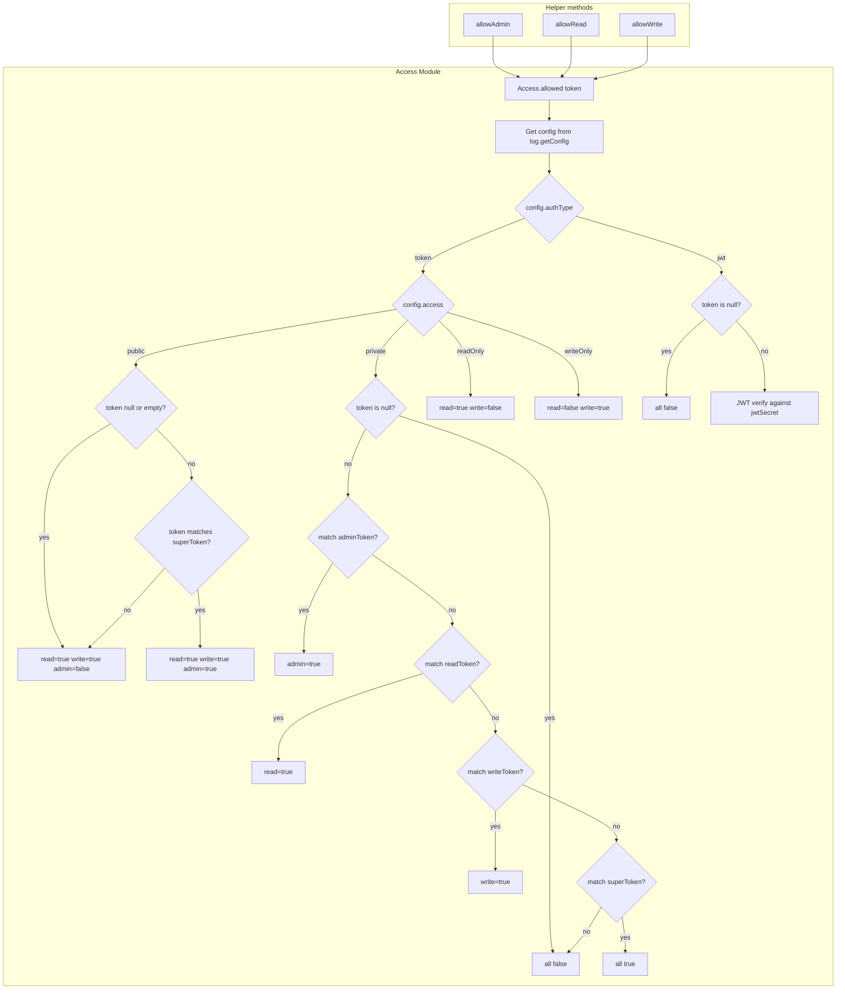
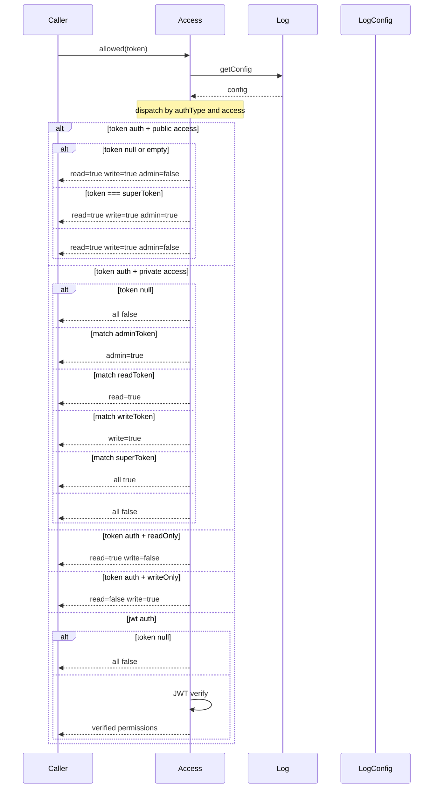

# Access — Specification

## Overview

`Access` manages authorization for a log stream by evaluating a caller-supplied token against the log's configuration. It delegates token matching to a per-access-level scheme: public access allows all null/empty tokens for read/write but blocks admin; private access requires specific token matches; readOnly and writeOnly restrict default permissions. JWT mode cryptographically verifies tokens against `jwtSecret`. Helper methods `allowAdmin`, `allowRead`, `allowWrite` proxy to `allowed()`.

## Component Specifications (TypeScript declarations)

### `Access` class

| Method / Property | Signature | Description |
|---|---|---|
| `constructor` | `(log: Log \| AbstractLog)` | Stores reference to parent log |
| `allowed` | `(token: string \| null): Promise<{read: boolean, write: boolean, admin: boolean}>` | Evaluates token against config; returns permission bitmap |
| `allowAdmin` | `(token: string \| null): Promise<boolean>` | Delegates to `allowed(token).admin` |
| `allowRead` | `(token: string \| null): Promise<boolean>` | Delegates to `allowed(token).read` |
| `allowWrite` | `(token: string \| null): Promise<boolean>` | Delegates to `allowed(token).write` |
| `jwtSecretU8` | `(): Uint8Array` | Returns decoded `jwtSecret` as `Uint8Array` (cached) |

### Authorization matrix

| Access | `authType` | null/empty token | matching scoped token | matching superToken |
|---|---|---|---|---|
| `public` | `token` | read=true, write=true, admin=false | read=true, write=true, admin=false | read=true, write=true, admin=true |
| `private` | `token` | all false | scoped permission | all true |
| `readOnly` | `token` | read=true, write=false | — | — |
| `writeOnly` | `token` | read=false, write=true | — | — |
| `private` | `jwt` | all false | JWT verify | — |

## System Architecture (Mermaid graph TB)



## Detailed Data Flow (Mermaid sequenceDiagram)



## Visualization (self-contained D3 HTML)

```html
<!DOCTYPE html>
<meta charset="utf-8">
<body>
<script src="https://d3js.org/d3.v7.min.js"></script>
<div id="vis" style="text-align:center;font-family:monospace">
  <h3>Access — Authorization Decision Flow</h3>
  <svg width="800" height="400"></svg>
  <div>
    <button id="play-pause" data-testid="play-pause">▶ Play</button>
    <span>Keyframe: <span id="kf-current">0</span> / <span id="kf-total">0</span></span>
    <input type="range" id="kf-slider" min="0" max="0" value="0" step="1">
  </div>
</div>
<script>
(function() {
  const ANIMATION_DURATION_MS = 6000;
  const ANIMATION_KEYFRAMES = [
    { label: "Token Received", detail: "allowed(token) called with token value" },
    { label: "Get Config", detail: "log.getConfig fetches LogConfig" },
    { label: "authType token", detail: "Dispatch by access level" },
    { label: "public access", detail: "null token read=true write=true" },
    { label: "private access", detail: "Match against scoped tokens" },
    { label: "readOnly writeOnly", detail: "Restrict default permissions" },
    { label: "authType jwt", detail: "JWT verify or deny" },
    { label: "Return Permissions", detail: "{read, write, admin} bitmap" },
  ];
  const totalSteps = ANIMATION_KEYFRAMES.length;

  const svg = d3.select("svg");
  const width = 800, height = 400;
  const margin = { top: 40, right: 20, bottom: 60, left: 20 };
  const innerW = width - margin.left - margin.right;
  const innerH = height - margin.top - margin.bottom;

  const g = svg.append("g").attr("transform", `translate(${margin.left},${margin.top})`);

  const xScale = d3.scaleLinear()
    .domain([0, totalSteps - 1])
    .range([50, innerW - 50]);

  g.append("line")
    .attr("x1", xScale(0)).attr("y1", innerH / 2)
    .attr("x2", xScale(totalSteps - 1)).attr("y2", innerH / 2)
    .attr("stroke", "#ccc").attr("stroke-width", 2);

  const nodes = g.selectAll("circle")
    .data(ANIMATION_KEYFRAMES)
    .enter()
    .append("circle")
    .attr("cx", (d, i) => xScale(i))
    .attr("cy", innerH / 2)
    .attr("r", 10)
    .attr("fill", "#c0392b")
    .attr("stroke", "#a93226")
    .attr("stroke-width", 2);

  g.selectAll("text.label")
    .data(ANIMATION_KEYFRAMES)
    .enter()
    .append("text")
    .attr("class", "label")
    .attr("x", (d, i) => xScale(i))
    .attr("y", innerH / 2 - 20)
    .attr("text-anchor", "middle")
    .attr("font-size", "11px")
    .attr("fill", "#333")
    .text((d) => d.label);

  const detailText = g.append("text")
    .attr("class", "detail")
    .attr("x", innerW / 2)
    .attr("y", innerH - 10)
    .attr("text-anchor", "middle")
    .attr("font-size", "13px")
    .attr("fill", "#555");

  const highlight = g.append("circle")
    .attr("r", 16).attr("fill", "none")
    .attr("stroke", "#e74c3c").attr("stroke-width", 3);

  let currentStep = 0, intervalId = null, isPlaying = false;

  function getAnimationState() { return { currentStep, totalSteps, isPlaying }; }

  function jumpToKeyframe(step) {
    step = Math.max(0, Math.min(totalSteps - 1, Math.round(step)));
    currentStep = step;
    highlight.attr("cx", xScale(step)).attr("cy", innerH / 2);
    nodes.attr("fill", (d, i) => i === step ? "#e74c3c" : "#c0392b");
    detailText.text(`${ANIMATION_KEYFRAMES[step].label}: ${ANIMATION_KEYFRAMES[step].detail}`);
    document.getElementById("kf-current").textContent = step;
    d3.select("#kf-slider").property("value", step);
  }

  const stepMs = ANIMATION_DURATION_MS / totalSteps;

  function tick() { jumpToKeyframe((currentStep + 1) % totalSteps); }
  function startAnimation() {
    if (intervalId) return;
    isPlaying = true;
    document.querySelector('#play-pause').textContent = '⏸ Pause';
    intervalId = setInterval(tick, stepMs);
  }
  function stopAnimation() {
    if (intervalId) { clearInterval(intervalId); intervalId = null; }
    isPlaying = false;
    document.querySelector('#play-pause').textContent = '▶ Play';
  }
  function togglePlay() { isPlaying ? stopAnimation() : startAnimation(); }

  document.getElementById('play-pause').addEventListener('click', togglePlay);
  d3.select("#kf-slider").on("input", function() {
    if (isPlaying) stopAnimation();
    jumpToKeyframe(+this.value);
  });

  document.getElementById("kf-total").textContent = totalSteps - 1;
  d3.select("#kf-slider").attr("max", totalSteps - 1);
  jumpToKeyframe(0);

  window.ANIMATION_DURATION_MS = ANIMATION_DURATION_MS;
  window.ANIMATION_KEYFRAMES = ANIMATION_KEYFRAMES;
  window.ANIMATION_VERIFICATION = true;
  window.jumpToKeyframe = jumpToKeyframe;
  window.resetAnimation = () => { stopAnimation(); jumpToKeyframe(0); };
  window.getAnimationState = getAnimationState;
  console.log('ANIMATION_VERIFICATION:', window.ANIMATION_VERIFICATION);
})();
</script>
</body>
```

## Testing Requirements

| # | Test | Type | Description |
|---|---|---|---|
| 1 | Public access allows read+write for null token | Unit | `allowed(null)` returns `read=true, write=true, admin=false` |
| 2 | Public access allows read+write for empty token | Unit | `allowed("")` returns `read=true, write=true` |
| 3 | Public access allows everything for superToken | Unit | `allowed("super-secret")` returns `admin=true, read=true, write=true` |
| 4 | Private access denies everything for null token | Unit | `allowed(null)` returns `read=false, write=false, admin=false` |
| 5 | Private access grants admin with adminToken | Unit | `allowed("admin-secret")` returns `admin=true` |
| 6 | Private access grants read with readToken | Unit | `allowed("read-secret")` returns `read=true, write=false, admin=false` |
| 7 | Private access grants write with writeToken | Unit | `allowed("write-secret")` returns `write=true, read=false` |
| 8 | Private access grants full with superToken | Unit | `allowed("super-secret")` returns all true |
| 9 | Private access denies invalid token | Unit | `allowed("invalid-token")` returns all false |
| 10 | readOnly access allows only read | Unit | `allowed(null)` returns `read=true, write=false` |
| 11 | writeOnly access allows only write | Unit | `allowed(null)` returns `read=false, write=true` |
| 12 | JWT auth denies null token | Unit | `allowed(null)` returns all false |
| 13 | allowAdmin helper returns admin status | Unit | `allowAdmin("admin-secret")` true, `allowAdmin("wrong")` false |
| 14 | allowRead helper returns read status | Unit | `allowRead(null)` on public log returns true |
| 15 | allowWrite helper returns write status | Unit | `allowWrite(null)` on public log returns true |
| 16 | jwtSecretU8 returns cached Uint8Array | Unit | Second call returns same cached object |
| 17 | jwtSecretU8 throws when no jwtSecret | Unit | Config without `jwtSecret` throws |

---

## 7. Source-Test Cross-References

### Source Coverage

| Source Spec | Path |
|---|---|
| Access.spec.md | `source/src/lib/log/Access.spec.md` |
