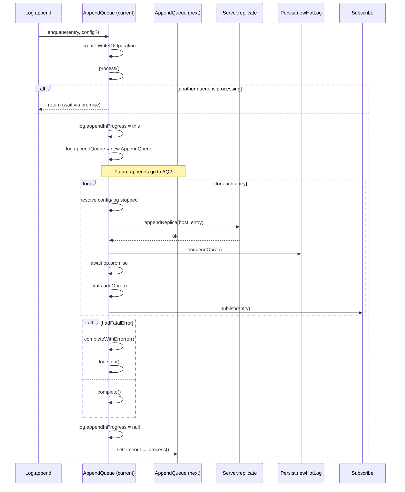

# AppendQueue Spec

**Module: Log Abstraction**

## Overview

Serializes log appends through a queue-based pipeline. Each `enqueue` creates a `WriteIOOperation` and triggers `process()`. Only one queue processes at a time (guarded by `log.appendInProgress`); subsequent appends go to a fresh queue. Processing: replicate to replicas → persist to HotLog → update stats → publish to subscribers. On fatal error the log is stopped.

## Component Specifications

```typescript
type AppendQueueEntry = {
    entry: GlobalLogEntry
    op: WriteIOOperation
    config: LogConfig | null   // non-null when entry is a config command
}

class AppendQueue {
    log: Log
    entries: AppendQueueEntry[]
    promise: Promise<void>          // resolved/rejected when all entries in this queue complete
    resolve: (() => void) | null
    reject: ((err: any) => void) | null
    lastConfig: GlobalLogEntry | null   // most recent entry that carried a LogConfig
}
```

## System Architecture

```mermaid
graph TB
    A[Log.append] --> B[AppendQueue.enqueue]
    B --> C[entries[]]
    B --> D[process]
    D --> E{appendInProgress?}
    E -->|yes| F[return — new queue created for this]
    E -->|no| G[Set log.appendInProgress = this]
    G --> H[Create fresh AppendQueue for log]
    H --> I[Loop over entries]
    I --> J{entry.config?}
    J -->|yes| K[Update config reference]
    J -->|no| L{log.stopped or config.stopped?}
    L -->|yes| M[hadFatalError = true, break]
    L -->|no| N[Replicate]
    N --> O[Persist: HotLog.enqueueOp]
    O --> P[Wait: op.promise]
    P --> Q[LogStats.addOp]
    Q --> R[Subscribe.publish]
    R --> I
    I --> S{hadFatalError?}
    S -->|yes| T[Log.stop]
    T --> U[completeWithError]
    S -->|no| V[complete]
    U --> W[setTimeout → next queue.process]
    V --> W
```

## Detailed Data Flow



## Visualization

```html
<div id="appendqueue-viz"></div>
<script src="https://d3js.org/d3.v7.min.js"></script>
<script>
(function() {
    const ANIMATION_DURATION_MS = 5000;
    const ANIMATION_KEYFRAMES = [
        { label: "Empty Queue", queueLen: 0, processing: false, replicated: 0, persisted: 0, published: 0 },
        { label: "Enqueue #1", queueLen: 1, processing: true, replicated: 0, persisted: 0, published: 0 },
        { label: "Replicate", queueLen: 1, processing: true, replicated: 1, persisted: 0, published: 0 },
        { label: "Persist", queueLen: 1, processing: true, replicated: 1, persisted: 1, published: 0 },
        { label: "Publish", queueLen: 1, processing: true, replicated: 1, persisted: 1, published: 1 },
        { label: "Enqueue #2", queueLen: 1, processing: true, replicated: 1, persisted: 1, published: 1 },
        { label: "Batch Done", queueLen: 0, processing: false, replicated: 2, persisted: 2, published: 2 },
    ];
    let currentFrame = 0;
    let animationId = null;
    let isPlaying = false;

    const container = d3.select("#appendqueue-viz");
    container.html("");
    const svg = container.append("svg").attr("width", 700).attr("height", 220);

    // Pipeline stages
    const stages = ["Enqueued", "Replicate", "Persist", "Publish"];
    const stageX = [50, 230, 400, 570];
    const stageColors = ["#ff9800", "#9c27b0", "#2196f3", "#4caf50"];

    stages.forEach((s, i) => {
        const g = svg.append("g").attr("transform", `translate(${stageX[i]}, 80)`);
        g.append("rect").attr("class", "stage-box").attr("width", 120).attr("height", 60)
            .attr("rx", 8).attr("fill", "#e0e0e0").attr("stroke", stageColors[i]).attr("stroke-width", 2);
        g.append("text").attr("class", "stage-label").attr("x", 60).attr("y", 35)
            .attr("text-anchor", "middle").attr("font-size", "13").attr("font-weight", "bold").text(s);
        // Count badge
        g.append("text").attr("class", "stage-count").attr("x", 60).attr("y", 52)
            .attr("text-anchor", "middle").attr("font-size", "20").attr("font-weight", "bold").attr("fill", "#333").text("0");
        // Arrow
        if (i < stages.length - 1) {
            svg.append("text").attr("x", stageX[i] + 125).attr("y", 110)
                .attr("font-size", "20").attr("fill", "#999").text("→");
        }
    });

    // Queue visual
    const queueG = svg.append("g").attr("transform", "translate(20, 20)");
    queueG.append("text").attr("font-size", "12").attr("fill", "#666").text("Queue:");
    queueG.append("rect").attr("class", "queue-bar").attr("x", 60).attr("y", 8).attr("width", 0).attr("height", 16).attr("fill", "#ff9800").attr("rx", 3);
    queueG.append("text").attr("class", "queue-text").attr("x", 65).attr("y", 20).attr("font-size", "11").attr("fill", "#fff").text("");

    // Processing indicator
    const procG = svg.append("g").attr("transform", "translate(20, 45)");
    procG.append("text").attr("class", "proc-text").attr("font-size", "12").attr("fill", "#666").text("Status: idle");

    // Controls
    const controls = container.append("div").style("margin-top","10px");
    controls.append("button").attr("data-testid","play-pause").text("▶ Play").on("click", togglePlay);
    controls.append("span").style("margin-left","10px").text("Frame: ");
    controls.append("span").attr("id","kf-total").text("0 / 6");
    controls.append("input").attr("type","range").attr("min",0).attr("max",ANIMATION_KEYFRAMES.length-1).attr("value",0)
        .style("width","300px").style("margin-left","10px").on("input", function() { jumpToKeyframe(+this.value); });

    function update(kf) {
        const counts = [kf.queueLen, kf.replicated, kf.persisted, kf.published];
        svg.selectAll("text.stage-count").data(counts).text(d => d);
        svg.select("rect.queue-bar").attr("width", kf.queueLen * 30);
        svg.select("text.queue-text").text(kf.queueLen > 0 ? `${kf.queueLen}` : "");
        svg.select("text.proc-text").text(kf.processing ? "Status: processing..." : "Status: idle");
        d3.select("#kf-total").text(`${kf.label} (${currentFrame} / ${ANIMATION_KEYFRAMES.length-1})`);
    }

    function togglePlay() {
        isPlaying = !isPlaying;
        d3.select("[data-testid=play-pause]").text(isPlaying ? "⏸ Pause" : "▶ Play");
        if (isPlaying) {
            animationId = setInterval(() => {
                currentFrame = (currentFrame + 1) % ANIMATION_KEYFRAMES.length;
                update(ANIMATION_KEYFRAMES[currentFrame]);
                d3.select("input[type=range]").property("value", currentFrame);
            }, ANIMATION_DURATION_MS / ANIMATION_KEYFRAMES.length);
        } else if (animationId) {
            clearInterval(animationId);
            animationId = null;
        }
    }

    function jumpToKeyframe(frame) {
        if (isPlaying) togglePlay();
        currentFrame = frame;
        update(ANIMATION_KEYFRAMES[frame]);
        d3.select("input[type=range]").property("value", frame);
    }

    function resetAnimation() {
        if (isPlaying) togglePlay();
        jumpToKeyframe(0);
    }

    function getAnimationState() {
        return { currentFrame, totalFrames: ANIMATION_KEYFRAMES.length, isPlaying, keyframe: ANIMATION_KEYFRAMES[currentFrame] };
    }

    update(ANIMATION_KEYFRAMES[0]);
    setTimeout(() => console.log("ANIMATION_VERIFICATION: AppendQueue viz loaded, 7 keyframes, ready"), 100);
})();
</script>
```

## Testing Requirements

| # | Test Case | Input | Expected |
|---|-----------|-------|----------|
| 1 | Enqueue single entry | `enqueue(entry)` | `entries.length === 1`, `process()` called |
| 2 | Enqueue with config | `enqueue(entry, config)` | `lastConfig === entry`, entry carries config |
| 3 | No-op on empty process | No entries | Returns immediately |
| 4 | Skip processing when another in progress | `appendInProgress !== null` | Returns, new queue created |
| 5 | Full pipeline success | One entry, replicas=[host] | Entry replicated, persisted, published, promise resolved |
| 6 | Error during processing | Replica throws | `hadFatalError=true`, `log.stop()` called, promise rejected |
| 7 | `waitHead` returns last entry | One entry enqueued | Returns entry after promise resolves |
| 8 | `waitHead` on empty queue | No entries | Throws `Error("No entries in queue")` |
| 9 | `waitConfig` returns config entry | Config entry enqueued | Returns `lastConfig` after promise resolves |
| 10 | `waitConfig` on queue without config | No config entry | Throws `Error("No config in queue")` |
| 11 | Promise resolution chain | Multiple enqueues | Each queue processes sequentially, promises resolve in order |
| 12 | Stopped log mid-processing | `log.stopped=true` in loop | `hadFatalError=true`, breaks, log.stop() idempotent |

---

## 7. Source-Test Cross-References

### Test Coverage

| Test Spec | Path |
|---|---|
| AppendQueue.test.spec.md | `source/src/lib/log/AppendQueue.test.spec.md` |
