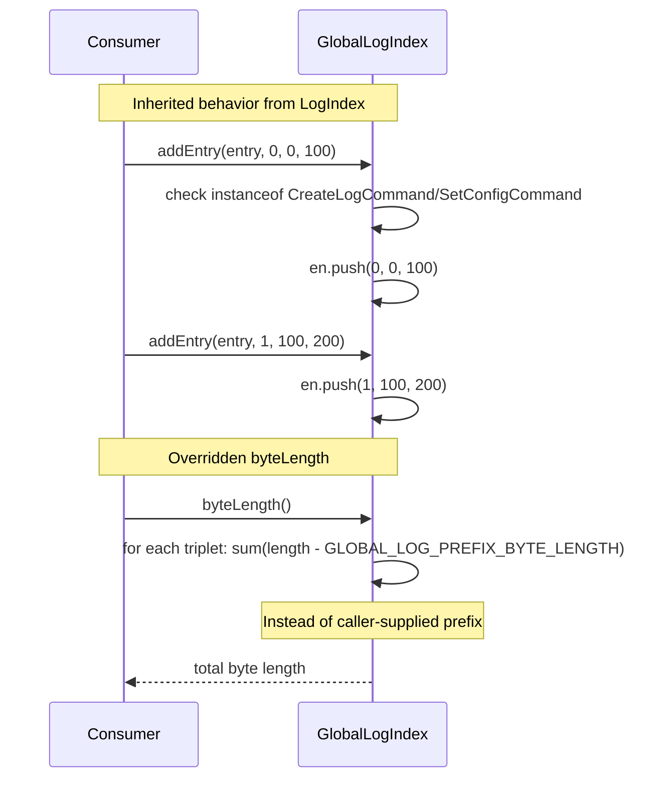

# GlobalLogIndex — Specification

**Module: Log Abstraction**

## Overview

`GlobalLogIndex` extends `LogIndex` with an overridden `byteLength()` method that subtracts `GLOBAL_LOG_PREFIX_BYTE_LENGTH` instead of a caller-supplied prefix length. It reuses all other `LogIndex` behavior (entry triplet storage, config tracking, merging, querying).

## Component Specifications (TypeScript declarations)

### `GlobalLogIndex` class

| Method / Property | Signature | Description |
|---|---|---|
| `byteLength()` | `(): number` | Overrides `LogIndex.byteLength`; sums `(length - GLOBAL_LOG_PREFIX_BYTE_LENGTH)` over all entries in `en` |

### Inherited from `LogIndex`

- `en: number[]`
- `lcNum / lcOff / lcLen: number | null`
- `addEntry(entry, entryNum, offset, length)`
- `hasEntry(entryNum): boolean`
- `entry(entryNum): [number, number, number]`
- `entries(): number[]`
- `entryCount(): number`
- `appendIndex(index)`
- `hasConfig(): boolean`
- `lastConfig(): [number, number, number]`
- `lastConfigEntryNum(): number`
- `hasEntries(): boolean`
- `lastEntry(): [number, number, number]`
- `maxEntryNum(): number`

### Dependency graph

```
GlobalLogIndex ──► LogIndex
GlobalLogIndex ──► GLOBAL_LOG_PREFIX_BYTE_LENGTH (from globals)
```

## System Architecture (Mermaid graph TB)

```mermaid
graph TB
    subgraph "GlobalLogIndex"
        A[byteLength override] --> B[Iterate en triplets]
        B --> C[Sum (length - GLOBAL_LOG_PREFIX_BYTE_LENGTH)]
    end

    subgraph "LogIndex (parent)"
        D[addEntry] --> E[en array + lc tracking]
        F[entry / hasEntry / lastConfig] --> E
        G[appendIndex] --> E
    end

    subgraph "Globals"
        H[GLOBAL_LOG_PREFIX_BYTE_LENGTH] --> A
    end

    GlobalLogIndex -- inherits --> D
    GlobalLogIndex -- inherits --> F
    GlobalLogIndex -- inherits --> G
```

## Detailed Data Flow (Mermaid sequenceDiagram)



## Visualization (self-contained D3 HTML)

```html
<!DOCTYPE html>
<meta charset="utf-8">
<body>
<script src="https://d3js.org/d3.v7.min.js"></script>
<div id="vis" style="text-align:center;font-family:monospace">
  <h3>GlobalLogIndex — byteLength Override</h3>
  <svg width="800" height="400"></svg>
  <div>
    <button id="play-pause" data-testid="play-pause">▶ Play</button>
    <span>Keyframe: <span id="kf-current">0</span> / <span id="kf-total">0</span></span>
    <input type="range" id="kf-slider" min="0" max="0" value="0" step="1">
  </div>
</div>
<script>
(function() {
  const ANIMATION_DURATION_MS = 4000;
  const ANIMATION_KEYFRAMES = [
    { label: "Inherits LogIndex", detail: "All entry/query/merge behavior from parent" },
    { label: "addEntry(entry, 0, 0, 100)", detail: "en pushed: [0, 0, 100]" },
    { label: "addEntry(entry, 1, 100, 200)", detail: "en pushed: [0, 0, 100, 1, 100, 200]" },
    { label: "byteLength()", detail: "Sum((length - GLOBAL_LOG_PREFIX_BYTE_LENGTH) ...)" },
  ];
  const totalSteps = ANIMATION_KEYFRAMES.length;

  const svg = d3.select("svg");
  const width = 800, height = 400;
  const margin = { top: 40, right: 20, bottom: 60, left: 20 };
  const innerW = width - margin.left - margin.right;
  const innerH = height - margin.top - margin.bottom;

  const g = svg.append("g").attr("transform", `translate(${margin.left},${margin.top})`);

  const xScale = d3.scaleLinear()
    .domain([0, totalSteps - 1])
    .range([50, innerW - 50]);

  g.append("line")
    .attr("x1", xScale(0)).attr("y1", innerH / 2)
    .attr("x2", xScale(totalSteps - 1)).attr("y2", innerH / 2)
    .attr("stroke", "#ccc").attr("stroke-width", 2);

  const nodes = g.selectAll("circle")
    .data(ANIMATION_KEYFRAMES)
    .enter()
    .append("circle")
    .attr("cx", (d, i) => xScale(i))
    .attr("cy", innerH / 2)
    .attr("r", 10)
    .attr("fill", "#16a085")
    .attr("stroke", "#0e6655")
    .attr("stroke-width", 2);

  g.selectAll("text.label")
    .data(ANIMATION_KEYFRAMES)
    .enter()
    .append("text")
    .attr("class", "label")
    .attr("x", (d, i) => xScale(i))
    .attr("y", innerH / 2 - 20)
    .attr("text-anchor", "middle")
    .attr("font-size", "11px")
    .attr("fill", "#333")
    .text((d) => d.label);

  const detailText = g.append("text")
    .attr("class", "detail")
    .attr("x", innerW / 2)
    .attr("y", innerH - 10)
    .attr("text-anchor", "middle")
    .attr("font-size", "13px")
    .attr("fill", "#555");

  const highlight = g.append("circle")
    .attr("r", 16).attr("fill", "none")
    .attr("stroke", "#e74c3c").attr("stroke-width", 3);

  let currentStep = 0, intervalId = null, isPlaying = false;

  function getAnimationState() { return { currentStep, totalSteps, isPlaying }; }

  function jumpToKeyframe(step) {
    step = Math.max(0, Math.min(totalSteps - 1, Math.round(step)));
    currentStep = step;
    highlight.attr("cx", xScale(step)).attr("cy", innerH / 2);
    nodes.attr("fill", (d, i) => i === step ? "#e74c3c" : "#16a085");
    detailText.text(`${ANIMATION_KEYFRAMES[step].label}: ${ANIMATION_KEYFRAMES[step].detail}`);
    document.getElementById("kf-current").textContent = step;
    d3.select("#kf-slider").property("value", step);
  }

  const stepMs = ANIMATION_DURATION_MS / totalSteps;

  function tick() { jumpToKeyframe((currentStep + 1) % totalSteps); }
  function startAnimation() {
    if (intervalId) return;
    isPlaying = true;
    document.querySelector('#play-pause').textContent = '⏸ Pause';
    intervalId = setInterval(tick, stepMs);
  }
  function stopAnimation() {
    if (intervalId) { clearInterval(intervalId); intervalId = null; }
    isPlaying = false;
    document.querySelector('#play-pause').textContent = '▶ Play';
  }
  function togglePlay() { isPlaying ? stopAnimation() : startAnimation(); }

  document.getElementById('play-pause').addEventListener('click', togglePlay);
  d3.select("#kf-slider").on("input", function() {
    if (isPlaying) stopAnimation();
    jumpToKeyframe(+this.value);
  });

  document.getElementById("kf-total").textContent = totalSteps - 1;
  d3.select("#kf-slider").attr("max", totalSteps - 1);
  jumpToKeyframe(0);

  window.ANIMATION_DURATION_MS = ANIMATION_DURATION_MS;
  window.ANIMATION_KEYFRAMES = ANIMATION_KEYFRAMES;
  window.ANIMATION_VERIFICATION = true;
  window.jumpToKeyframe = jumpToKeyframe;
  window.resetAnimation = () => { stopAnimation(); jumpToKeyframe(0); };
  window.getAnimationState = getAnimationState;
  console.log('ANIMATION_VERIFICATION:', window.ANIMATION_VERIFICATION);
})();
</script>
</body>
```

## Testing Requirements

| # | Test | Type | Description |
|---|---|---|---|
| 1 | Inherits `addEntry` from LogIndex | Unit | Entries stored correctly in `en` |
| 2 | `byteLength()` uses `GLOBAL_LOG_PREFIX_BYTE_LENGTH` | Unit | Sum computed with correct constant, not parameter |
| 3 | Inherits config tracking via `addEntry` | Unit | `CreateLogCommand` / `SetConfigCommand` update `lcNum` |
| 4 | Inherited `appendIndex` merges correctly | Unit | Triplets appended, `lcNum` updated if newer |
| 5 | Inherited `entry` lookup | Unit | Arithmetic index offset works for global log index |
| 6 | Inherited `lastConfig` / `lastEntry` | Unit | Returns correct values |
| 7 | Inherited `hasEntries` / `hasConfig` | Unit | Correct boolean state |

---

## 7. Source-Test Cross-References

### Test Coverage

| Test Spec | Path |
|---|---|
| GlobalLogIndex.test.spec.md | `source/src/lib/log/GlobalLogIndex.test.spec.md` |
