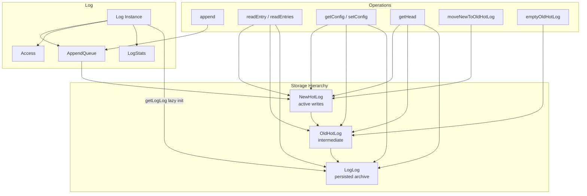
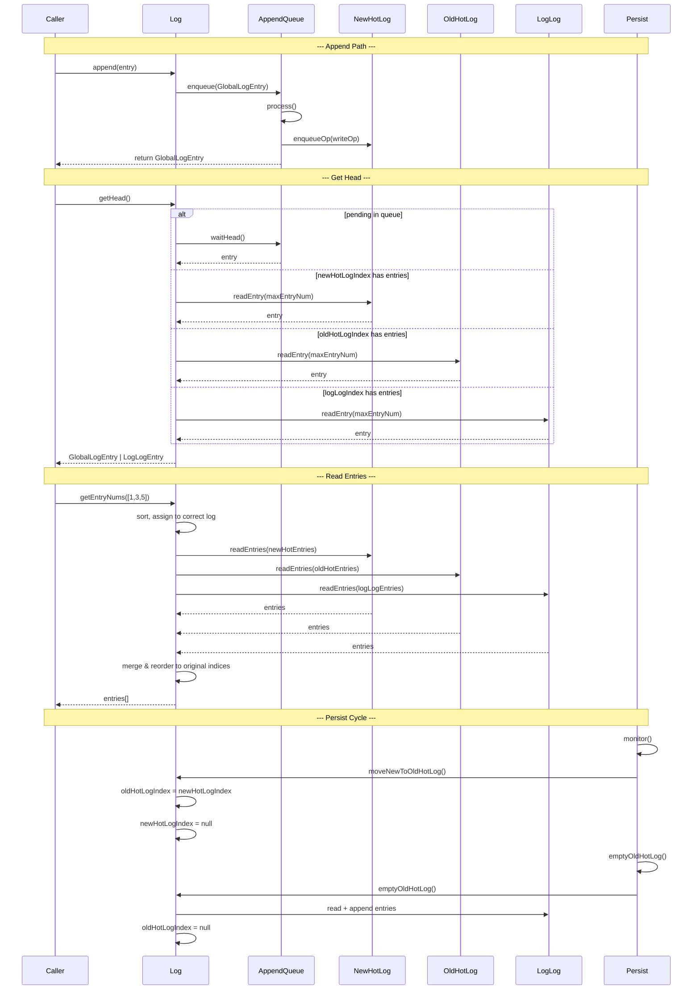

# Log Spec

**Module: Log Abstraction**

## Overview

Central log abstraction representing a single append-only log identified by `LogId`. Manages a three-tier storage hierarchy: **NewHotLog** (active writes) → **OldHotLog** (intermediate buffer) → **LogLog** (persisted archive). Coordinates appends via `AppendQueue`, access control via `Access`, and I/O stats via `LogStats`. Provides read operations (`getHead`, `getEntryNums`, `getEntries`) that route through the correct storage tier.

## Component Specifications

```typescript
class Log {
    server: Server
    logId: LogId
    access: Access
    newHotLogIndex: GlobalLogIndex | null
    oldHotLogIndex: GlobalLogIndex | null
    logLogIndex: LogLogIndex | null
    logLog: LogLog | null
    creating: boolean
    stats: LogStats
    config: LogConfig | null
    appendInProgress: AppendQueue | null
    appendQueue: AppendQueue
    stopped: boolean
}
```

## System Architecture



## Detailed Data Flow



## Visualization

```html
<div id="log-viz"></div>
<script src="https://d3js.org/d3.v7.min.js"></script>
<script>
(function() {
    const ANIMATION_DURATION_MS = 5000;
    const ANIMATION_KEYFRAMES = [
        { label: "Empty Log", newHot: 0, oldHot: 0, logLog: 0, pending: 0 },
        { label: "Append Entry #1", newHot: 1, oldHot: 0, logLog: 0, pending: 0 },
        { label: "Append Entry #2", newHot: 2, oldHot: 0, logLog: 0, pending: 0 },
        { label: "Rollover → OldHot", newHot: 0, oldHot: 2, logLog: 0, pending: 0 },
        { label: "Append Entry #3", newHot: 1, oldHot: 2, logLog: 0, pending: 0 },
        { label: "Empty → LogLog", newHot: 1, oldHot: 0, logLog: 2, pending: 0 },
        { label: "Append Entries #4-5", newHot: 3, oldHot: 0, logLog: 2, pending: 0 },
    ];
    let currentFrame = 0;
    let animationId = null;
    let isPlaying = false;

    const container = d3.select("#log-viz");
    container.html("");
    const svg = container.append("svg").attr("width", 700).attr("height", 250);

    // Three tiers
    const tiers = [
        { label: "NewHotLog", x: 50, color: "#ff9800" },
        { label: "OldHotLog", x: 270, color: "#9c27b0" },
        { label: "LogLog", x: 490, color: "#2196f3" },
    ];

    tiers.forEach(t => {
        const g = svg.append("g").attr("transform", `translate(${t.x}, 60)`);
        g.append("rect").attr("class", "tier-box").attr("width", 170).attr("height", 100)
            .attr("rx", 8).attr("fill", "#f5f5f5").attr("stroke", t.color).attr("stroke-width", 2);
        g.append("text").attr("x", 85).attr("y", 25).attr("text-anchor", "middle")
            .attr("font-size", "12").attr("font-weight", "bold").attr("fill", t.color).text(t.label);
        g.append("text").attr("class", "tier-count").attr("x", 85).attr("y", 60)
            .attr("text-anchor", "middle").attr("font-size", "28").attr("font-weight", "bold").text("0");
        g.append("text").attr("class", "tier-sub").attr("x", 85).attr("y", 82)
            .attr("text-anchor", "middle").attr("font-size", "11").attr("fill", "#999").text("entries");
    });

    // Arrows between tiers
    svg.append("text").attr("x", 225).attr("y", 110).attr("font-size", "22").attr("fill", "#999").text("→");
    svg.append("text").attr("x", 445).attr("y", 110).attr("font-size", "22").attr("fill", "#999").text("→");

    // Pending bar
    const pendingG = svg.append("g").attr("transform", "translate(50, 25)");
    pendingG.append("text").attr("font-size", "12").attr("fill", "#666").text("Pending queue:");
    pendingG.append("rect").attr("class", "pending-bar").attr("x", 110).attr("y", 3).attr("width", 0).attr("height", 14)
        .attr("fill", "#f44336").attr("rx", 3);
    pendingG.append("text").attr("class", "pending-text").attr("x", 115).attr("y", 14).attr("font-size", "10").attr("fill", "#fff");

    // Label
    svg.append("text").attr("class", "frame-label").attr("x", 350).attr("y", 220)
        .attr("text-anchor", "middle").attr("font-size", "14").attr("fill", "#333");

    // Controls
    const controls = container.append("div").style("margin-top","10px");
    controls.append("button").attr("data-testid","play-pause").text("▶ Play").on("click", togglePlay);
    controls.append("span").style("margin-left","10px").text("Frame: ");
    controls.append("span").attr("id","kf-total").text("0 / 6");
    controls.append("input").attr("type","range").attr("min",0).attr("max",ANIMATION_KEYFRAMES.length-1).attr("value",0)
        .style("width","300px").style("margin-left","10px").on("input", function() { jumpToKeyframe(+this.value); });

    function update(kf) {
        const counts = [kf.newHot, kf.oldHot, kf.logLog];
        svg.selectAll("text.tier-count").data(counts).text(d => d);
        svg.select("rect.pending-bar").attr("width", kf.pending * 10);
        svg.select("text.pending-text").text(kf.pending > 0 ? `${kf.pending}` : "");
        svg.select("text.frame-label").text(kf.label);
        d3.select("#kf-total").text(`${kf.label} (${currentFrame} / ${ANIMATION_KEYFRAMES.length-1})`);
    }

    function togglePlay() {
        isPlaying = !isPlaying;
        d3.select("[data-testid=play-pause]").text(isPlaying ? "⏸ Pause" : "▶ Play");
        if (isPlaying) {
            animationId = setInterval(() => {
                currentFrame = (currentFrame + 1) % ANIMATION_KEYFRAMES.length;
                update(ANIMATION_KEYFRAMES[currentFrame]);
                d3.select("input[type=range]").property("value", currentFrame);
            }, ANIMATION_DURATION_MS / ANIMATION_KEYFRAMES.length);
        } else if (animationId) {
            clearInterval(animationId);
            animationId = null;
        }
    }

    function jumpToKeyframe(frame) {
        if (isPlaying) togglePlay();
        currentFrame = frame;
        update(ANIMATION_KEYFRAMES[frame]);
        d3.select("input[type=range]").property("value", frame);
    }

    function resetAnimation() {
        if (isPlaying) togglePlay();
        jumpToKeyframe(0);
    }

    function getAnimationState() {
        return { currentFrame, totalFrames: ANIMATION_KEYFRAMES.length, isPlaying, keyframe: ANIMATION_KEYFRAMES[currentFrame] };
    }

    update(ANIMATION_KEYFRAMES[0]);
    setTimeout(() => console.log("ANIMATION_VERIFICATION: Log viz loaded, 7 keyframes, ready"), 100);
})();
</script>
```

## Testing Requirements

| # | Test Case | Input | Expected |
|---|-----------|-------|----------|
| 1 | Append entry | `append(LogEntry)` | GlobalLogEntry created, enqueued, promise resolves |
| 2 | Get head with queue pending | Entry in appendInProgress | Returns `appendInProgress.waitHead()` |
| 3 | Get head from newHotLog | Entry in newHotLogIndex | `readEntry(newHotLog, maxEntryNum)` |
| 4 | Get head from logLog | Entry only in logLogIndex | `readEntry(logLog, maxEntryNum)` |
| 5 | Get entries spanning tiers | Entry nums in all 3 tiers | Each tier read, merged, reordered |
| 6 | Get entries — limit not found | `getEntries(0, 100)`, only 50 exist | Returns 50, no error |
| 7 | Get entry nums — not found | `getEntryNums([999])` | Throws `Error("entryNum 999 not found")` |
| 8 | Create log | `create(config)` | Append CreateLogCommand, config set, `creating` guard |
| 9 | Create while already creating | `create(config)` × 2 concurrent | Throws `Error("already creating")` |
| 10 | Exists — file on disk | Log file exists | Returns `true` |
| 11 | Exists — no index, no file | Nothing | Returns `false` |
| 12 | moveNewToOldHotLog | Called with non-null newHotLogIndex | Index swapped, ops reassigned |
| 13 | emptyOldHotLog | oldHotLogIndex has entries | Entries moved to logLog, oldHotLogIndex nulled |
| 14 | getConfig — from newHotLog | Config in newHotLogIndex | Returns parsed LogConfig |
| 15 | setConfig — lastConfigNum mismatch | Wrong lastConfigNum | Throws `Error("lastConfigNum mismatch")` |
| 16 | Stop log | `stop()` | `stopped = true` |

---

## 7. Source-Test Cross-References

### Test Coverage

| Test Spec | Path |
|---|---|
| Log.test.spec.md | `source/src/lib/log/Log.test.spec.md` |
