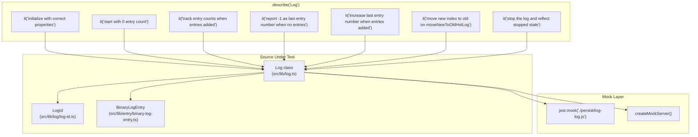
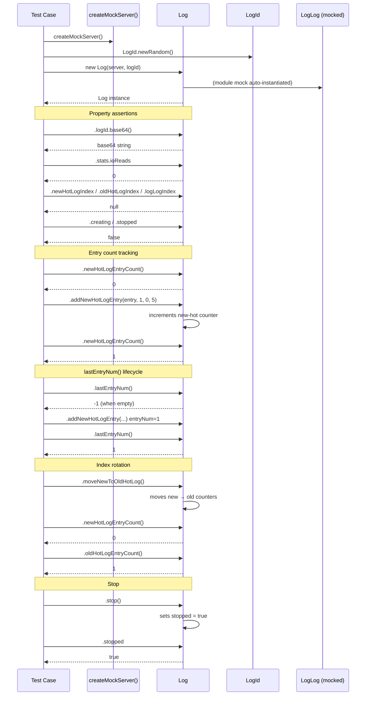

# Log — Test Specification

## Overview

Tests the `Log` class (`src/lib/log.ts`) which manages a single log's lifecycle — initialization, entry tracking (new-hot / old-hot / log-log indices), entry count bookkeeping, last-entry-number queries, index rotation (`moveNewToOldHotLog`), and graceful shutdown (`stop`). The test suite validates that a `Log` instance correctly reflects state transitions and delegates persistence operations to the mocked `LogLog` module.

## Component Specifications

| Pattern | Details |
|---|---|
| **Framework** | `@jest/globals` (`describe`/`it`/`expect`/`jest`) |
| **Module mock** | `jest.mock("./persist/log-log.js")` — returns a factory that creates mock `LogLog` instances with stubbed `logName`, `enqueueOp`, `ioQueue`, `init`, and `byteLength`. |
| **Server mock** | `createMockServer()` — returns a plain object with `config` (`logDir`), `persist` (sub-objects `newHotLog` / `oldHotLog` each with `logFile`, `ioQueue`, `enqueueOp`), `logs` (`Map`), and `getLog` (jest.fn returning index stubs). |
| **Setup** | Each test creates a fresh `Log(server, logId)` via `new Log(createMockServer(), await LogId.newRandom())`. |
| **Teardown** | None explicit — resources are scoped per test. |
| **Source under test** | `src/lib/log.ts` |
| **Dependencies** | `LogId` (`src/lib/log/log-id.ts`), `BinaryLogEntry` (`src/lib/entry/binary-log-entry.ts`), `LogLog` (`src/lib/persist/log-log.ts`) |

## System Architecture



## Detailed Data Flow



## Visualization

```d3
<svg id="log-spec-viz" width="800" height="500" viewBox="0 0 800 500" xmlns="http://www.w3.org/2000/svg">
  <style>
    .bar { fill: #4f8ef7; transition: all 200ms; }
    .bar-label { font-family: monospace; font-size: 11px; text-anchor: middle; fill: #333; }
    .axis text { font-family: monospace; font-size: 10px; fill: #666; }
    .axis line, .axis path { stroke: #ccc; stroke-width: 1; }
    .kf-marker { fill: #e74c3c; }
    .kf-label { font-family: monospace; font-size: 10px; fill: #e74c3c; text-anchor: middle; }
    .control-btn { font-family: monospace; font-size: 12px; cursor: pointer; fill: #fff; stroke: #4f8ef7; stroke-width: 1.5; rx: 4; ry: 4; }
    .control-btn:hover { fill: #e8f0fe; }
    .control-text { font-family: monospace; font-size: 11px; text-anchor: middle; fill: #4f8ef7; cursor: pointer; user-select: none; }
    #kf-info text { font-family: monospace; font-size: 10px; fill: #555; }
  </style>

  <g transform="translate(60,20)">
    <!-- title -->
    <text x="340" y="18" font-family="monospace" font-size="14" font-weight="bold" text-anchor="middle" fill="#222">Log Test — State Timeline</text>
    <text x="340" y="34" font-family="monospace" font-size="11" text-anchor="middle" fill="#888">7 keyframes across the test lifecycle</text>

    <!-- axes -->
    <g class="axis" transform="translate(0,380)">
      <line x1="0" y1="0" x2="680" y2="0"/>
      <text x="0" y="14" text-anchor="middle">init</text>
      <text x="113" y="14" text-anchor="middle">count=0</text>
      <text x="226" y="14" text-anchor="middle">addEntry</text>
      <text x="340" y="14" text-anchor="middle">last=-1</text>
      <text x="453" y="14" text-anchor="middle">last=1</text>
      <text x="566" y="14" text-anchor="middle">moveOld</text>
      <text x="680" y="14" text-anchor="middle">stopped</text>
    </g>

    <!-- y-axis -->
    <g class="axis" transform="translate(0,0)">
      <line x1="0" y1="0" x2="0" y2="380"/>
      <text x="-8" y="380" text-anchor="end">0</text>
      <text x="-8" y="190" text-anchor="end">1</text>
      <text x="-8" y="0" text-anchor="end">2</text>
    </g>

    <!-- bars -->
    <g>
      <!-- kf0: init state: new=0,old=0,last=-1,stopped=0 -->
      <rect class="bar" x="0" y="380" width="20" height="0" data-kf="0" opacity="0.4"/>
      <rect class="bar" x="20" y="380" width="20" height="0" data-kf="0" opacity="0.6"/>
      <rect class="bar" x="40" y="380" width="20" height="190" data-kf="0" opacity="0.8"/>

      <!-- kf1: new=0,old=0,last=-1,stopped=0 -->
      <rect class="bar" x="103" y="380" width="20" height="0" data-kf="1" opacity="0.4"/>
      <rect class="bar" x="123" y="380" width="20" height="0" data-kf="1" opacity="0.6"/>
      <rect class="bar" x="143" y="380" width="20" height="190" data-kf="1" opacity="0.8"/>

      <!-- kf2: new=1,old=0,last=1,stopped=0 -->
      <rect class="bar" x="206" y="380" width="20" height="190" data-kf="2" opacity="0.4"/>
      <rect class="bar" x="226" y="380" width="20" height="0" data-kf="2" opacity="0.6"/>
      <rect class="bar" x="246" y="380" width="20" height="95" data-kf="2" opacity="0.8"/>

      <!-- kf3: new=0,old=0,last=-1,stopped=0 -->
      <rect class="bar" x="310" y="380" width="20" height="0" data-kf="3" opacity="0.4"/>
      <rect class="bar" x="330" y="380" width="20" height="0" data-kf="3" opacity="0.6"/>
      <rect class="bar" x="350" y="380" width="20" height="190" data-kf="3" opacity="0.8"/>

      <!-- kf4: new=1,old=0,last=1,stopped=0 -->
      <rect class="bar" x="423" y="380" width="20" height="190" data-kf="4" opacity="0.4"/>
      <rect class="bar" x="443" y="380" width="20" height="0" data-kf="4" opacity="0.6"/>
      <rect class="bar" x="463" y="380" width="20" height="95" data-kf="4" opacity="0.8"/>

      <!-- kf5: new=0,old=1,last=1,stopped=0 -->
      <rect class="bar" x="536" y="380" width="20" height="0" data-kf="5" opacity="0.4"/>
      <rect class="bar" x="556" y="380" width="20" height="190" data-kf="5" opacity="0.6"/>
      <rect class="bar" x="576" y="380" width="20" height="95" data-kf="5" opacity="0.8"/>

      <!-- kf6: new=0,old=1,last=1,stopped=1 -->
      <rect class="bar" x="650" y="380" width="20" height="0" data-kf="6" opacity="0.4"/>
      <rect class="bar" x="670" y="380" width="20" height="190" data-kf="6" opacity="0.6"/>
      <rect class="bar" x="690" y="380" width="20" height="95" data-kf="6" opacity="0.8"/>
      <rect class="bar" x="670" y="0" width="40" height="190" data-kf="6" fill="#e74c3c" opacity="0.3"/>
    </g>

    <!-- keyframe markers -->
    <g>
      <circle class="kf-marker" cx="50" cy="380" r="4"/>
      <text class="kf-label" x="50" y="394">kf0</text>
      <circle class="kf-marker" cx="153" cy="380" r="4"/>
      <text class="kf-label" x="153" y="394">kf1</text>
      <circle class="kf-marker" cx="256" cy="285" r="4"/>
      <text class="kf-label" x="256" y="270">kf2</text>
      <circle class="kf-marker" cx="360" cy="380" r="4"/>
      <text class="kf-label" x="360" y="394">kf3</text>
      <circle class="kf-marker" cx="473" cy="285" r="4"/>
      <text class="kf-label" x="473" y="270">kf4</text>
      <circle class="kf-marker" cx="586" cy="285" r="4"/>
      <text class="kf-label" x="586" y="270">kf5</text>
      <circle class="kf-marker" cx="700" cy="95" r="4"/>
      <text class="kf-label" x="700" y="80">kf6</text>
    </g>

    <!-- legend -->
    <g transform="translate(0,420)">
      <rect x="0" y="0" width="12" height="12" fill="#4f8ef7" opacity="0.4"/>
      <text x="16" y="10" font-family="monospace" font-size="10" fill="#555">newHotCount</text>
      <rect x="100" y="0" width="12" height="12" fill="#4f8ef7" opacity="0.6"/>
      <text x="116" y="10" font-family="monospace" font-size="10" fill="#555">oldHotCount</text>
      <rect x="200" y="0" width="12" height="12" fill="#4f8ef7" opacity="0.8"/>
      <text x="216" y="10" font-family="monospace" font-size="10" fill="#555">lastEntryNum (scaled)</text>
      <rect x="340" y="0" width="12" height="12" fill="#e74c3c" opacity="0.3"/>
      <text x="356" y="10" font-family="monospace" font-size="10" fill="#555">stopped</text>
    </g>

    <!-- controls -->
    <g transform="translate(240,455)">
      <rect class="control-btn" x="0" y="0" width="50" height="22" data-testid="play-pause"/>
      <text class="control-text" x="25" y="15" data-testid="play-pause">▶</text>
      <rect class="control-btn" x="60" y="0" width="70" height="22" id="reset-btn"/>
      <text class="control-text" x="95" y="15" id="reset-btn">↺ reset</text>
      <rect class="control-btn" x="140" y="0" width="36" height="22" id="kf-prev"/>
      <text class="control-text" x="158" y="15" id="kf-prev">◀</text>
      <rect class="control-btn" x="186" y="0" width="36" height="22" id="kf-next"/>
      <text class="control-text" x="204" y="15" id="kf-next">▶</text>
    </g>

    <!-- kf info -->
    <g id="kf-info" transform="translate(490,458)">
      <text>KF: <tspan id="kf-current">0</tspan> / <tspan id="kf-total">6</tspan></text>
    </g>
  </g>
</svg>
<script>
  (function() {
    const ANIMATION_DURATION_MS = 300;
    const ANIMATION_KEYFRAMES = 7;
    var ANIMATION_VERIFICATION = { ran: false };
    var animFrame = null;
    var currentKF = 0;
    var playing = false;
    var animationState = 'idle';

    function getAnimationState() { return animationState; }

    function jumpToKeyframe(kf) {
      if (kf < 0 || kf >= ANIMATION_KEYFRAMES) return;
      currentKF = kf;
      document.querySelectorAll('[data-kf]').forEach(function(el) {
        var kfVal = parseInt(el.getAttribute('data-kf'));
        if (kfVal <= currentKF) {
          el.style.opacity = '';
        } else {
          el.style.opacity = '0.08';
        }
      });
      document.getElementById('kf-current').textContent = currentKF;
      ANIMATION_VERIFICATION.ran = true;
      ANIMATION_VERIFICATION.lastKF = currentKF;
    }

    function resetAnimation() {
      playing = false;
      animationState = 'idle';
      document.querySelector('[data-testid="play-pause"]').textContent = '▶';
      if (animFrame) { clearInterval(animFrame); animFrame = null; }
      jumpToKeyframe(0);
    }

    jumpToKeyframe(0);

    document.querySelector('[data-testid="play-pause"]').addEventListener('click', function() {
      if (playing) {
        playing = false;
        animationState = 'paused';
        this.textContent = '▶';
        if (animFrame) { clearInterval(animFrame); animFrame = null; }
      } else {
        playing = true;
        animationState = 'playing';
        this.textContent = '⏸';
        animFrame = setInterval(function() {
          if (currentKF < ANIMATION_KEYFRAMES - 1) {
            jumpToKeyframe(currentKF + 1);
          } else {
            playing = false;
            animationState = 'idle';
            clearInterval(animFrame);
            animFrame = null;
            document.querySelector('[data-testid="play-pause"]').textContent = '▶';
          }
        }, ANIMATION_DURATION_MS);
      }
    });

    document.getElementById('reset-btn').addEventListener('click', resetAnimation);

    document.getElementById('kf-prev').addEventListener('click', function() {
      if (playing) return;
      jumpToKeyframe(currentKF - 1);
    });

    document.getElementById('kf-next').addEventListener('click', function() {
      if (playing) return;
      jumpToKeyframe(currentKF + 1);
    });
  })();
</script>
```

## Testing Requirements

| # | Requirement | How verified |
|---|---|---|
| 1 | `Log` constructor stores `logId` and initializes all index fields to `null` | Assert `logId.base64()` matches, `newHotLogIndex`, `oldHotLogIndex`, `logLogIndex` are `null` |
| 2 | Initial `stats.ioReads` is zero | Assert `stats.ioReads === 0` |
| 3 | `creating` and `stopped` flags start `false` | Assert `.creating === false`, `.stopped === false` |
| 4 | All entry counts start at 0 | Assert `.newHotLogEntryCount()`, `.oldHotLogEntryCount()`, `.logLogEntryCount()` all 0 |
| 5 | `addNewHotLogEntry` increments new-hot count | Assert count goes 0 → 1 after adding a `BinaryLogEntry` |
| 6 | `addOldHotLogEntry` increments old-hot count | Assert count goes 0 → 1 after adding a `BinaryLogEntry` |
| 7 | `lastEntryNum()` returns `-1` when no entries | Assert on fresh `Log` |
| 8 | `lastEntryNum()` returns the highest entry number added | Assert returns 1, then 2 after sequential additions |
| 9 | `moveNewToOldHotLog` rotates entries from new → old | Assert new count 0, old count 1 after rotation |
| 10 | `stop()` transitions `stopped` from `false` → `true` | Assert before/after call |

---

## 7. Source-Test Cross-References

### Source Coverage

| Source Spec | Path |
|---|---|
| Log.spec.md | `source/src/lib/log/Log.spec.md` |
