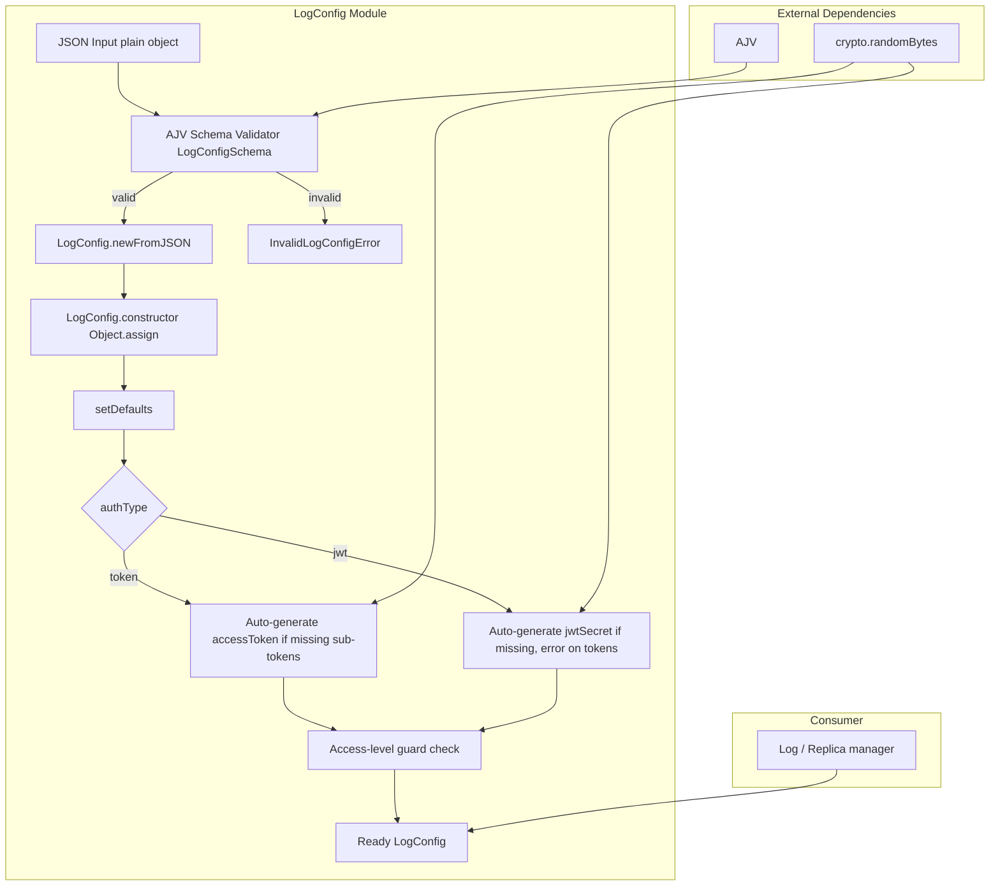
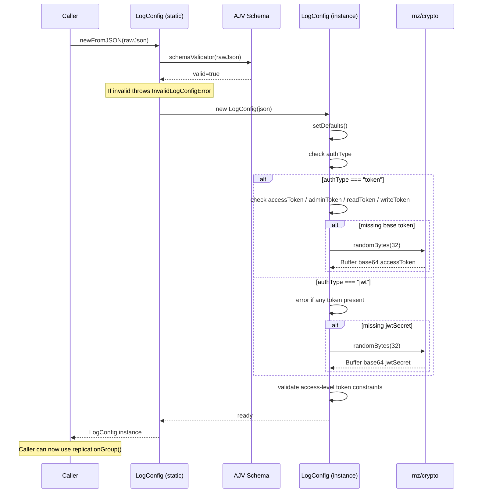

# LogConfig — Specification

## Overview

`LogConfig` validates, stores, and initializes the configuration for a single log stream. It enforces mutual exclusivity between token-based and JWT-based authentication, auto-generates missing secrets, and guards access-level token constraints. The class is constructed from a plain `ILogConfig` object and validated through a JSON Schema compiled with AJV.

## Component Specifications (TypeScript declarations)

### `ILogConfig` interface

| Property | Type | Required | Description |
|---|---|---|---|
| `logId` | `string` | Yes | Unique log identifier |
| `type` | `"binary" \| "json"` | Yes | Log format |
| `master` | `string` | Yes | Master host address |
| `replicas` | `string[]` | No | Replica host addresses |
| `access` | `"public" \| "private" \| "readOnly" \| "writeOnly"` | Yes | Access level |
| `authType` | `"token" \| "jwt"` | Yes | Authentication mechanism |
| `accessToken` | `string` | No | Base access token |
| `adminToken` | `string` | No | Admin token |
| `readToken` | `string` | No | Read-only token |
| `writeToken` | `string` | No | Write token |
| `superToken` | `string` | No | Super token |
| `jwtSecret` | `string` | No | JWT signing secret |
| `stopped` | `boolean` | Yes | Whether the log is stopped |

### `LogConfig` class

| Method / Property | Signature | Description |
|---|---|---|
| `constructor` | `(config: ILogConfig)` | Copies properties onto instance |
| `replicationGroup()` | `(): string[]` | Returns `[master, ...replicas]` |
| `setDefaults()` | `(): Promise<void>` | Validates mutual exclusivity, auto-generates tokens/secret |
| `newFromJSON` | `static (json: any): Promise<LogConfig>` | Validates via JSON Schema, constructs, applies defaults |

### `InvalidLogConfigError` class

Extends `Error` with an `errors` field holding AJV `ErrorObject[]`.

## System Architecture (Mermaid graph TB)



## Detailed Data Flow (Mermaid sequenceDiagram)



## Visualization (self-contained D3 HTML)

```html
<!DOCTYPE html>
<meta charset="utf-8">
<body>
<script src="https://d3js.org/d3.v7.min.js"></script>
<div id="vis" style="text-align:center;font-family:monospace">
  <h3>LogConfig — AuthType Mutual Exclusivity</h3>
  <svg width="800" height="400"></svg>
  <div>
    <button id="play-pause" data-testid="play-pause">▶ Play</button>
    <span>Keyframe: <span id="kf-current">0</span> / <span id="kf-total">0</span></span>
    <input type="range" id="kf-slider" min="0" max="0" value="0" step="1">
  </div>
</div>
<script>
(function() {
  const ANIMATION_DURATION_MS = 6000;
  const ANIMATION_KEYFRAMES = [
    { label: "Config Received", detail: "newFromJSON(rawJson) called" },
    { label: "Schema Validation", detail: "AJV validates against LogConfigSchema" },
    { label: "Constructor", detail: "Object.assign onto instance" },
    { label: "setDefaults authType?", detail: "Branch on token vs jwt" },
    { label: "Token Path", detail: "Auto-generate missing accessToken" },
    { label: "JWT Path", detail: "Auto-generate missing jwtSecret" },
    { label: "Access Guard", detail: "Validate readToken/writeToken constraints" },
    { label: "Ready", detail: "LogConfig instance fully initialized" },
  ];
  const totalSteps = ANIMATION_KEYFRAMES.length;

  const svg = d3.select("svg");
  const width = 800, height = 400;
  const margin = { top: 40, right: 20, bottom: 60, left: 20 };
  const innerW = width - margin.left - margin.right;
  const innerH = height - margin.top - margin.bottom;

  const g = svg.append("g").attr("transform", `translate(${margin.left},${margin.top})`);

  const xScale = d3.scaleLinear()
    .domain([0, totalSteps - 1])
    .range([50, innerW - 50]);

  g.append("line")
    .attr("x1", xScale(0)).attr("y1", innerH / 2)
    .attr("x2", xScale(totalSteps - 1)).attr("y2", innerH / 2)
    .attr("stroke", "#ccc").attr("stroke-width", 2);

  const nodes = g.selectAll("circle")
    .data(ANIMATION_KEYFRAMES)
    .enter()
    .append("circle")
    .attr("cx", (d, i) => xScale(i))
    .attr("cy", innerH / 2)
    .attr("r", 10)
    .attr("fill", "#69b3a2")
    .attr("stroke", "#2c7a6b")
    .attr("stroke-width", 2);

  g.selectAll("text.label")
    .data(ANIMATION_KEYFRAMES)
    .enter()
    .append("text")
    .attr("class", "label")
    .attr("x", (d, i) => xScale(i))
    .attr("y", innerH / 2 - 20)
    .attr("text-anchor", "middle")
    .attr("font-size", "11px")
    .attr("fill", "#333")
    .text((d) => d.label);

  const detailText = g.append("text")
    .attr("class", "detail")
    .attr("x", innerW / 2)
    .attr("y", innerH - 10)
    .attr("text-anchor", "middle")
    .attr("font-size", "13px")
    .attr("fill", "#555");

  const highlight = g.append("circle")
    .attr("r", 16).attr("fill", "none")
    .attr("stroke", "#e74c3c").attr("stroke-width", 3);

  let currentStep = 0, intervalId = null, isPlaying = false;

  function getAnimationState() { return { currentStep, totalSteps, isPlaying }; }

  function jumpToKeyframe(step) {
    step = Math.max(0, Math.min(totalSteps - 1, Math.round(step)));
    currentStep = step;
    highlight.attr("cx", xScale(step)).attr("cy", innerH / 2);
    nodes.attr("fill", (d, i) => i === step ? "#e74c3c" : "#69b3a2");
    detailText.text(`${ANIMATION_KEYFRAMES[step].label}: ${ANIMATION_KEYFRAMES[step].detail}`);
    document.getElementById("kf-current").textContent = step;
    d3.select("#kf-slider").property("value", step);
  }

  const stepMs = ANIMATION_DURATION_MS / totalSteps;

  function tick() { jumpToKeyframe((currentStep + 1) % totalSteps); }
  function startAnimation() {
    if (intervalId) return;
    isPlaying = true;
    document.querySelector('#play-pause').textContent = '⏸ Pause';
    intervalId = setInterval(tick, stepMs);
  }
  function stopAnimation() {
    if (intervalId) { clearInterval(intervalId); intervalId = null; }
    isPlaying = false;
    document.querySelector('#play-pause').textContent = '▶ Play';
  }
  function togglePlay() { isPlaying ? stopAnimation() : startAnimation(); }

  document.getElementById('play-pause').addEventListener('click', togglePlay);
  d3.select("#kf-slider").on("input", function() {
    if (isPlaying) stopAnimation();
    jumpToKeyframe(+this.value);
  });

  document.getElementById("kf-total").textContent = totalSteps - 1;
  d3.select("#kf-slider").attr("max", totalSteps - 1);
  jumpToKeyframe(0);

  window.ANIMATION_DURATION_MS = ANIMATION_DURATION_MS;
  window.ANIMATION_KEYFRAMES = ANIMATION_KEYFRAMES;
  window.ANIMATION_VERIFICATION = true;
  window.jumpToKeyframe = jumpToKeyframe;
  window.resetAnimation = () => { stopAnimation(); jumpToKeyframe(0); };
  window.getAnimationState = getAnimationState;
  console.log('ANIMATION_VERIFICATION:', window.ANIMATION_VERIFICATION);
})();
</script>
</body>
```

## Testing Requirements

| # | Test | Type | Description |
|---|---|---|---|
| 1 | Minimal valid config with token auth fills defaults | Unit | `newFromJSON` with required fields + `authType=token` auto-generates `accessToken` |
| 2 | JWT config generates secret without token conflict | Unit | `authType=jwt` generates `jwtSecret`, all token fields stay undefined |
| 3 | Invalid access/token combos throw | Unit | Five invalid combos each throw specific error messages |
| 4 | Replication group returns master + replicas | Unit | `replicationGroup()` equals `[master, ...replicas]` |
| 5 | Scoped tokens without accessToken | Unit | When all scoped tokens provided, `accessToken` stays undefined |
| 6 | Missing required fields rejected | Unit | Invalid type enum value throws `InvalidLogConfigError` |
| 7 | accessToken cached (no duplicate generation) | Unit | Second access of `config.accessToken` returns same reference |

---

## 7. Source-Test Cross-References

### Source Coverage

| Source Spec | Path |
|---|---|
| LogConfig.spec.md | `source/src/lib/log/LogConfig.spec.md` |
