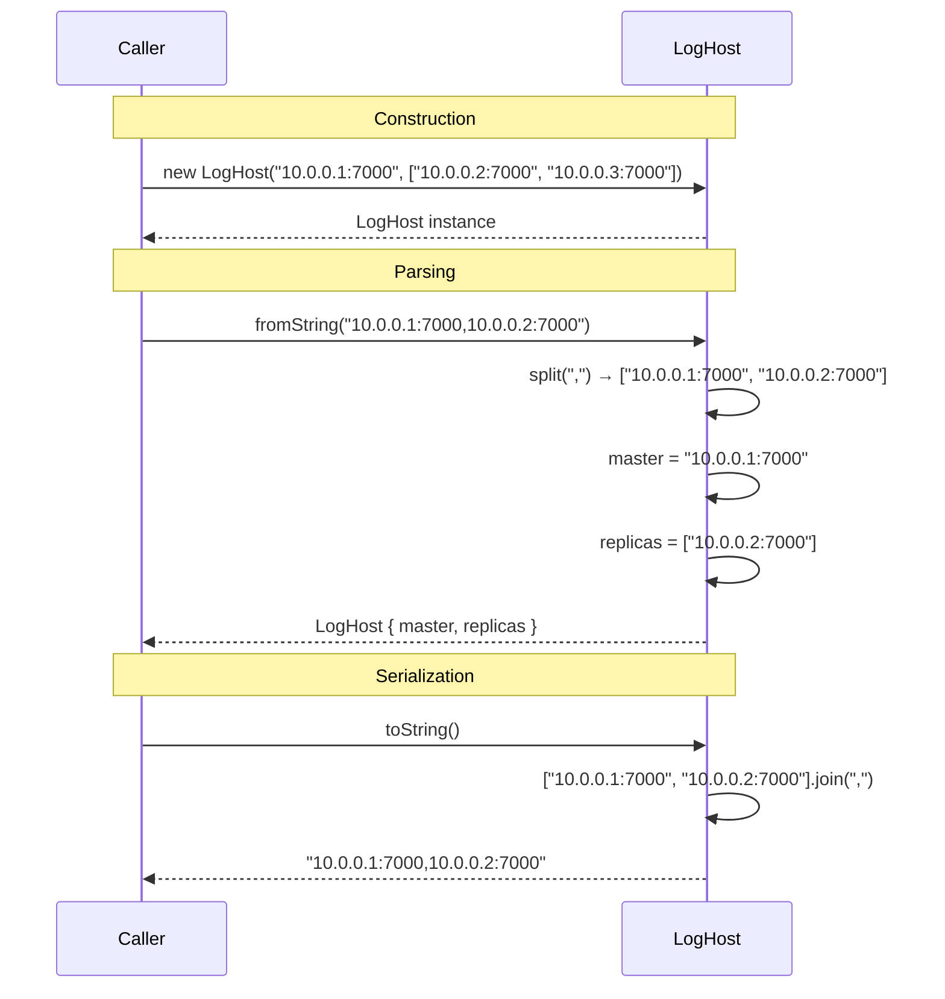

# LogHost — Specification

**Module: Log Abstraction**

## Overview

`LogHost` represents a replication group: one master address with zero or more replica addresses. It supports serialization to and from a comma-separated string where the first element is the master and the remaining elements are replicas.

## Component Specifications (TypeScript declarations)

### `LogHost` class

| Method / Property | Signature | Description |
|---|---|---|
| `constructor` | `(master: string, replicas?: string[])` | Creates host with master address and optional replica list |
| `master` | `string` | Master host address |
| `replicas` | `string[]` | Array of replica host addresses |
| `fromString` | `static (host: string): LogHost` | Parses `"master,replica1,replica2"` format |
| `toString()` | `(): string` | Serializes to `"master,replica1,replica2,..."` |

### String format

```
<master>[,<replica1>[,<replica2>...]]
```

- Master is required (first element)
- Replicas are optional (subsequent elements)
- No validation of address format

### Dependency graph

```
LogHost — no external dependencies (standalone value object)
```

## System Architecture (Mermaid graph TB)

```mermaid
graph TB
    subgraph "LogHost Module"
        A[fromString] --> B[Split by ,]
        B --> C[First element → master]
        B --> D[Rest → replicas[]]
        C --> E[new LogHost]
        D --> E

        F[toString] --> G[Collect [master, ...replicas]]
        G --> H[Join with ,]
    end

    subgraph "Consumers"
        I[LogAddress] --> A
        I --> F
        J[LogConfig.replicationGroup] -.-> K[LogHost-like pattern]
    end
```

## Detailed Data Flow (Mermaid sequenceDiagram)



## Visualization (self-contained D3 HTML)

```html
<!DOCTYPE html>
<meta charset="utf-8">
<body>
<script src="https://d3js.org/d3.v7.min.js"></script>
<div id="vis" style="text-align:center;font-family:monospace">
  <h3>LogHost — Master / Replica Split & Join</h3>
  <svg width="800" height="400"></svg>
  <div>
    <button id="play-pause" data-testid="play-pause">▶ Play</button>
    <span>Keyframe: <span id="kf-current">0</span> / <span id="kf-total">0</span></span>
    <input type="range" id="kf-slider" min="0" max="0" value="0" step="1">
  </div>
</div>
<script>
(function() {
  const ANIMATION_DURATION_MS = 4000;
  const ANIMATION_KEYFRAMES = [
    { label: "fromString Input", detail: "\"m:7000,r1:7000,r2:7000\"" },
    { label: "Split by ,", detail: "→ [\"m:7000\", \"r1:7000\", \"r2:7000\"]" },
    { label: "Master = first", detail: "master = \"m:7000\"" },
    { label: "Replicas = rest", detail: "replicas = [\"r1:7000\", \"r2:7000\"]" },
    { label: "toString()", detail: "Join → \"m:7000,r1:7000,r2:7000\"" },
  ];
  const totalSteps = ANIMATION_KEYFRAMES.length;

  const svg = d3.select("svg");
  const width = 800, height = 400;
  const margin = { top: 40, right: 20, bottom: 60, left: 20 };
  const innerW = width - margin.left - margin.right;
  const innerH = height - margin.top - margin.bottom;

  const g = svg.append("g").attr("transform", `translate(${margin.left},${margin.top})`);

  const xScale = d3.scaleLinear()
    .domain([0, totalSteps - 1])
    .range([50, innerW - 50]);

  g.append("line")
    .attr("x1", xScale(0)).attr("y1", innerH / 2)
    .attr("x2", xScale(totalSteps - 1)).attr("y2", innerH / 2)
    .attr("stroke", "#ccc").attr("stroke-width", 2);

  const nodes = g.selectAll("circle")
    .data(ANIMATION_KEYFRAMES)
    .enter()
    .append("circle")
    .attr("cx", (d, i) => xScale(i))
    .attr("cy", innerH / 2)
    .attr("r", 10)
    .attr("fill", "#27ae60")
    .attr("stroke", "#1e8449")
    .attr("stroke-width", 2);

  g.selectAll("text.label")
    .data(ANIMATION_KEYFRAMES)
    .enter()
    .append("text")
    .attr("class", "label")
    .attr("x", (d, i) => xScale(i))
    .attr("y", innerH / 2 - 20)
    .attr("text-anchor", "middle")
    .attr("font-size", "11px")
    .attr("fill", "#333")
    .text((d) => d.label);

  const detailText = g.append("text")
    .attr("class", "detail")
    .attr("x", innerW / 2)
    .attr("y", innerH - 10)
    .attr("text-anchor", "middle")
    .attr("font-size", "13px")
    .attr("fill", "#555");

  const highlight = g.append("circle")
    .attr("r", 16).attr("fill", "none")
    .attr("stroke", "#e74c3c").attr("stroke-width", 3);

  let currentStep = 0, intervalId = null, isPlaying = false;

  function getAnimationState() { return { currentStep, totalSteps, isPlaying }; }

  function jumpToKeyframe(step) {
    step = Math.max(0, Math.min(totalSteps - 1, Math.round(step)));
    currentStep = step;
    highlight.attr("cx", xScale(step)).attr("cy", innerH / 2);
    nodes.attr("fill", (d, i) => i === step ? "#e74c3c" : "#27ae60");
    detailText.text(`${ANIMATION_KEYFRAMES[step].label}: ${ANIMATION_KEYFRAMES[step].detail}`);
    document.getElementById("kf-current").textContent = step;
    d3.select("#kf-slider").property("value", step);
  }

  const stepMs = ANIMATION_DURATION_MS / totalSteps;

  function tick() { jumpToKeyframe((currentStep + 1) % totalSteps); }
  function startAnimation() {
    if (intervalId) return;
    isPlaying = true;
    document.querySelector('#play-pause').textContent = '⏸ Pause';
    intervalId = setInterval(tick, stepMs);
  }
  function stopAnimation() {
    if (intervalId) { clearInterval(intervalId); intervalId = null; }
    isPlaying = false;
    document.querySelector('#play-pause').textContent = '▶ Play';
  }
  function togglePlay() { isPlaying ? stopAnimation() : startAnimation(); }

  document.getElementById('play-pause').addEventListener('click', togglePlay);
  d3.select("#kf-slider").on("input", function() {
    if (isPlaying) stopAnimation();
    jumpToKeyframe(+this.value);
  });

  document.getElementById("kf-total").textContent = totalSteps - 1;
  d3.select("#kf-slider").attr("max", totalSteps - 1);
  jumpToKeyframe(0);

  window.ANIMATION_DURATION_MS = ANIMATION_DURATION_MS;
  window.ANIMATION_KEYFRAMES = ANIMATION_KEYFRAMES;
  window.ANIMATION_VERIFICATION = true;
  window.jumpToKeyframe = jumpToKeyframe;
  window.resetAnimation = () => { stopAnimation(); jumpToKeyframe(0); };
  window.getAnimationState = getAnimationState;
  console.log('ANIMATION_VERIFICATION:', window.ANIMATION_VERIFICATION);
})();
</script>
</body>
```

## Testing Requirements

| # | Test | Type | Description |
|---|---|---|---|
| 1 | `fromString` parses master + replicas | Unit | `"a,b,c"` → master="a", replicas=["b","c"] |
| 2 | `fromString` with only master | Unit | `"a"` → master="a", replicas=[] |
| 3 | `toString` with master + replicas | Unit | `"a,b,c"` round-trips |
| 4 | `toString` with only master | Unit | Returns just the master string |
| 5 | Empty string fromString | Unit | master="" (empty string), replicas=[] |
| 6 | Constructor default replicas | Unit | `new LogHost("m")` → replicas=[] |
| 7 | Constructor with explicit replicas | Unit | `new LogHost("m", ["r1"])` → replicas=["r1"] |
| 8 | Round-trip property identity | Unit | `LogHost.fromString(h.toString()).master === h.master` |

---

## 7. Source-Test Cross-References

### Test Coverage

| Test Spec | Path |
|---|---|
| LogHost.test.spec.md | `source/src/lib/log/LogHost.test.spec.md` |
