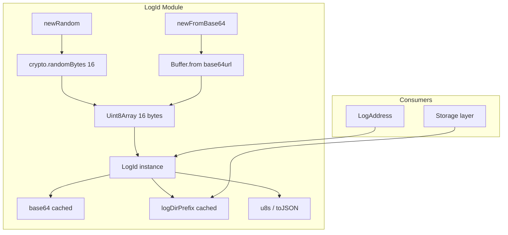
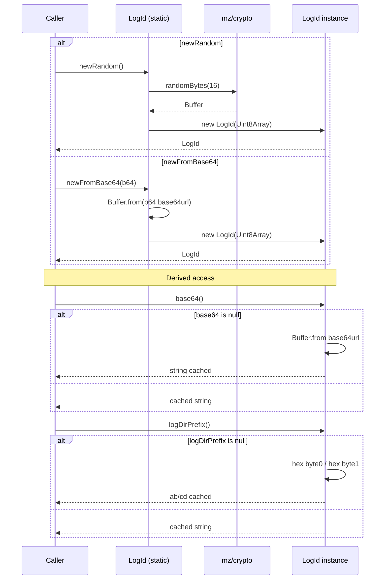

# LogId — Specification

## Overview

`LogId` wraps a 16-byte `Uint8Array` identifier for a log stream. It provides Base64URL serialization, a two-level hex directory prefix (used for filesystem sharding), random generation via `crypto.randomBytes(16)`, and deserialization from Base64URL strings. The class caches derived string representations lazily.

## Component Specifications (TypeScript declarations)

### `LogId` class

| Method / Property | Signature | Description |
|---|---|---|
| `constructor` | `(logId: Uint8Array, base64?: string)` | Stores the byte array; optionally accepts pre-computed base64 string |
| `base64()` | `(): string` | Returns Base64URL-encoded string (cached) |
| `byteLength()` | `(): number` | Returns `logId.byteLength` (always 16) |
| `u8s()` | `(): Uint8Array[]` | Returns `[this.logId]` |
| `toJSON()` | `(): string` | Returns `base64()` |
| `logDirPrefix()` | `(): string` | Returns hex directory prefix like `"ab/cd"` from first two bytes (cached) |
| `newRandom` | `static (): Promise<LogId>` | Generates 16 random bytes via `crypto.randomBytes` |
| `newFromBase64` | `static (base64: string): LogId` | Decodes Base64URL string into `Uint8Array(16)` |

## System Architecture (Mermaid graph TB)



## Detailed Data Flow (Mermaid sequenceDiagram)



## Visualization (self-contained D3 HTML)

```html
<!DOCTYPE html>
<meta charset="utf-8">
<body>
<script src="https://d3js.org/d3.v7.min.js"></script>
<div id="vis" style="text-align:center;font-family:monospace">
  <h3>LogId — 16-byte Identifier Lifecycle</h3>
  <svg width="800" height="400"></svg>
  <div>
    <button id="play-pause" data-testid="play-pause">▶ Play</button>
    <span>Keyframe: <span id="kf-current">0</span> / <span id="kf-total">0</span></span>
    <input type="range" id="kf-slider" min="0" max="0" value="0" step="1">
  </div>
</div>
<script>
(function() {
  const ANIMATION_DURATION_MS = 5000;
  const ANIMATION_KEYFRAMES = [
    { label: "Generate Decode", detail: "newRandom or newFromBase64 called" },
    { label: "16-byte Uint8Array", detail: "Random or decoded bytes stored" },
    { label: "base64 access", detail: "Lazy Base64URL encoding cached in base64" },
    { label: "logDirPrefix access", detail: "First 2 bytes hex dir1/dir2 cached" },
    { label: "toJSON u8s", detail: "Serialization for transport and storage" },
  ];
  const totalSteps = ANIMATION_KEYFRAMES.length;

  const svg = d3.select("svg");
  const width = 800, height = 400;
  const margin = { top: 40, right: 20, bottom: 60, left: 20 };
  const innerW = width - margin.left - margin.right;
  const innerH = height - margin.top - margin.bottom;

  const g = svg.append("g").attr("transform", `translate(${margin.left},${margin.top})`);

  const xScale = d3.scaleLinear()
    .domain([0, totalSteps - 1])
    .range([50, innerW - 50]);

  g.append("line")
    .attr("x1", xScale(0)).attr("y1", innerH / 2)
    .attr("x2", xScale(totalSteps - 1)).attr("y2", innerH / 2)
    .attr("stroke", "#ccc").attr("stroke-width", 2);

  const nodes = g.selectAll("circle")
    .data(ANIMATION_KEYFRAMES)
    .enter()
    .append("circle")
    .attr("cx", (d, i) => xScale(i))
    .attr("cy", innerH / 2)
    .attr("r", 10)
    .attr("fill", "#8e44ad")
    .attr("stroke", "#6c3483")
    .attr("stroke-width", 2);

  g.selectAll("text.label")
    .data(ANIMATION_KEYFRAMES)
    .enter()
    .append("text")
    .attr("class", "label")
    .attr("x", (d, i) => xScale(i))
    .attr("y", innerH / 2 - 20)
    .attr("text-anchor", "middle")
    .attr("font-size", "11px")
    .attr("fill", "#333")
    .text((d) => d.label);

  const detailText = g.append("text")
    .attr("class", "detail")
    .attr("x", innerW / 2)
    .attr("y", innerH - 10)
    .attr("text-anchor", "middle")
    .attr("font-size", "13px")
    .attr("fill", "#555");

  const highlight = g.append("circle")
    .attr("r", 16).attr("fill", "none")
    .attr("stroke", "#e74c3c").attr("stroke-width", 3);

  let currentStep = 0, intervalId = null, isPlaying = false;

  function getAnimationState() { return { currentStep, totalSteps, isPlaying }; }

  function jumpToKeyframe(step) {
    step = Math.max(0, Math.min(totalSteps - 1, Math.round(step)));
    currentStep = step;
    highlight.attr("cx", xScale(step)).attr("cy", innerH / 2);
    nodes.attr("fill", (d, i) => i === step ? "#e74c3c" : "#8e44ad");
    detailText.text(`${ANIMATION_KEYFRAMES[step].label}: ${ANIMATION_KEYFRAMES[step].detail}`);
    document.getElementById("kf-current").textContent = step;
    d3.select("#kf-slider").property("value", step);
  }

  const stepMs = ANIMATION_DURATION_MS / totalSteps;

  function tick() { jumpToKeyframe((currentStep + 1) % totalSteps); }
  function startAnimation() {
    if (intervalId) return;
    isPlaying = true;
    document.querySelector('#play-pause').textContent = '⏸ Pause';
    intervalId = setInterval(tick, stepMs);
  }
  function stopAnimation() {
    if (intervalId) { clearInterval(intervalId); intervalId = null; }
    isPlaying = false;
    document.querySelector('#play-pause').textContent = '▶ Play';
  }
  function togglePlay() { isPlaying ? stopAnimation() : startAnimation(); }

  document.getElementById('play-pause').addEventListener('click', togglePlay);
  d3.select("#kf-slider").on("input", function() {
    if (isPlaying) stopAnimation();
    jumpToKeyframe(+this.value);
  });

  document.getElementById("kf-total").textContent = totalSteps - 1;
  d3.select("#kf-slider").attr("max", totalSteps - 1);
  jumpToKeyframe(0);

  window.ANIMATION_DURATION_MS = ANIMATION_DURATION_MS;
  window.ANIMATION_KEYFRAMES = ANIMATION_KEYFRAMES;
  window.ANIMATION_VERIFICATION = true;
  window.jumpToKeyframe = jumpToKeyframe;
  window.resetAnimation = () => { stopAnimation(); jumpToKeyframe(0); };
  window.getAnimationState = getAnimationState;
  console.log('ANIMATION_VERIFICATION:', window.ANIMATION_VERIFICATION);
})();
</script>
</body>
```

## Testing Requirements

| # | Test | Type | Description |
|---|---|---|---|
| 1 | `newRandom` returns LogId with length 16 | Unit | `byteLength()` returns 16 |
| 2 | `base64` round-trips | Unit | `newFromBase64(id.base64()).base64() === id.base64()` |
| 3 | `logDirPrefix` matches hex pattern | Unit | Format `"XX/XX"` from first two bytes |
| 4 | `base64` is cached on second call | Unit | Second call returns same string without recomputation |
| 5 | `logDirPrefix` is cached on second call | Unit | Second call returns same string without recomputation |
| 6 | `u8s` returns array containing logId | Unit | `u8s()[0] === this.logId` |
| 7 | `toJSON` returns base64 | Unit | `id.toJSON() === id.base64()` |
| 8 | Constructor with pre-computed base64 | Unit | Passing base64 string skips encoding on first call |

---

## 7. Source-Test Cross-References

### Source Coverage

| Source Spec | Path |
|---|---|
| LogId.spec.md | `source/src/lib/log/LogId.spec.md` |
