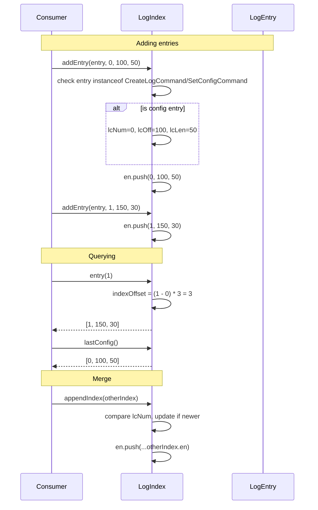

# LogIndex — Specification

**Module: Log Abstraction**

## Overview

`LogIndex` is an in-memory index for a log's entries. It stores entry triplets `[entryNum, offset, length]` in a flat `number[]` array, and tracks the most recent config-setting entry (`CreateLogCommand` or `SetConfigCommand`) separately. It supports appending, querying by entry number, computing total byte length, and config-aware lookups.

## Component Specifications (TypeScript declarations)

### `LogIndex` class

| Method / Property | Signature | Description |
|---|---|---|
| `en` | `number[]` | Flat array of `[entryNum, offset, length, ...]` triplets |
| `lcNum` | `number \| null` | Entry number of most recent config entry |
| `lcOff` | `number \| null` | Offset of most recent config entry |
| `lcLen` | `number \| null` | Length of most recent config entry |
| `constructor` | `()` | Initializes empty index |
| `addEntry(entry, entryNum, offset, length)` | `(LogEntry, number, number, number): void` | Inserts entry; updates last config if entry is `CreateLogCommand` or `SetConfigCommand` |
| `hasEntry(entryNum)` | `(number): boolean` | Linear scan for entry number |
| `entry(entryNum)` | `(number): [number, number, number]` | Returns triplet by entryNum; uses arithmetic offset assuming contiguous numbering starting at `en[0]` |
| `entries()` | `(): number[]` | Returns raw `en` array |
| `entryCount()` | `(): number` | `en.length / 3` |
| `appendIndex(index)` | `(LogIndex): void` | Merges another index: updates last config if newer, pushes all triplets |
| `byteLength(prefixByteLength)` | `(number): number` | Sum of `(length - prefixByteLength)` over all entries |
| `hasConfig()` | `(): boolean` | `lcNum !== null && lcOff !== null && lcLen !== null` |
| `lastConfig()` | `(): [number, number, number]` | Returns `[lcNum, lcOff, lcLen]`; throws if no config |
| `lastConfigEntryNum()` | `(): number` | Returns `lcNum`; throws if no config |
| `hasEntries()` | `(): boolean` | `en.length >= 3` |
| `lastEntry()` | `(): [number, number, number]` | Returns last triplet; throws if no entries |
| `maxEntryNum()` | `(): number` | Returns last entry number; throws if no entries |

### Assumptions

- Entry numbers are sequential integers starting from `en[0]` with no gaps (used in `entry()` arithmetic).
- `en` stores triplets `[entryNum, offset, length]` contiguously.

### Dependency graph

```
LogIndex ──► LogEntry
LogIndex ──► CreateLogCommand (from entry/command)
LogIndex ──► SetConfigCommand  (from entry/command)
```

## System Architecture (Mermaid graph TB)

```mermaid
graph TB
    subgraph "LogIndex Module"
        A[addEntry] --> B{instanceof CreateLogCommand<br/>or SetConfigCommand?}
        B -- yes --> C[Update lcNum/lcOff/lcLen<br/>if entryNum > current]
        B -- no --> D
        C --> D[Push entryNum, offset, length to en[]]

        E[entry] --> F[Arithmetic indexOffset = (entryNum - en[0]) * 3]
        F --> G[Return [en[i], en[i+1], en[i+2]]]

        H[appendIndex] --> I[Update last config if newer]
        I --> J[Push all .en triplets]

        K[byteLength] --> L[Sum all (length - prefixByteLength)]
    end

    subgraph "External"
        M[LogEntry] --> A
        N[CreateLogCommand] --> B
        O[SetConfigCommand] --> B
    end
```

## Detailed Data Flow (Mermaid sequenceDiagram)



## Visualization (self-contained D3 HTML)

```html
<!DOCTYPE html>
<meta charset="utf-8">
<body>
<script src="https://d3js.org/d3.v7.min.js"></script>
<div id="vis" style="text-align:center;font-family:monospace">
  <h3>LogIndex — Entry Triplet Storage & Queries</h3>
  <svg width="800" height="400"></svg>
  <div>
    <button id="play-pause" data-testid="play-pause">▶ Play</button>
    <span>Keyframe: <span id="kf-current">0</span> / <span id="kf-total">0</span></span>
    <input type="range" id="kf-slider" min="0" max="0" value="0" step="1">
  </div>
</div>
<script>
(function() {
  const ANIMATION_DURATION_MS = 6000;
  const ANIMATION_KEYFRAMES = [
    { label: "Empty Index", detail: "en=[], lcNum=null" },
    { label: "addEntry(createLog, 0, 100, 50)", detail: "Config entry → lcNum=0; en=[0,100,50]" },
    { label: "addEntry(data, 1, 150, 30)", detail: "Data entry → en=[0,100,50, 1,150,30]" },
    { label: "addEntry(setConfig, 2, 180, 60)", detail: "Config entry → lcNum=2; en=[...,2,180,60]" },
    { label: "entry(1) lookup", detail: "indexOffset=(1-0)*3=3 → [1,150,30]" },
    { label: "lastConfig()", detail: "→ [2, 180, 60] (most recent config)" },
    { label: "byteLength(20)", detail: "Sum of (length-20) = (50-20)+(30-20)+(60-20) = 80" },
    { label: "appendIndex", detail: "Merge another index's en + update lcNum" },
  ];
  const totalSteps = ANIMATION_KEYFRAMES.length;

  const svg = d3.select("svg");
  const width = 800, height = 400;
  const margin = { top: 40, right: 20, bottom: 60, left: 20 };
  const innerW = width - margin.left - margin.right;
  const innerH = height - margin.top - margin.bottom;

  const g = svg.append("g").attr("transform", `translate(${margin.left},${margin.top})`);

  const xScale = d3.scaleLinear()
    .domain([0, totalSteps - 1])
    .range([50, innerW - 50]);

  g.append("line")
    .attr("x1", xScale(0)).attr("y1", innerH / 2)
    .attr("x2", xScale(totalSteps - 1)).attr("y2", innerH / 2)
    .attr("stroke", "#ccc").attr("stroke-width", 2);

  const nodes = g.selectAll("circle")
    .data(ANIMATION_KEYFRAMES)
    .enter()
    .append("circle")
    .attr("cx", (d, i) => xScale(i))
    .attr("cy", innerH / 2)
    .attr("r", 10)
    .attr("fill", "#e67e22")
    .attr("stroke", "#ca6f1e")
    .attr("stroke-width", 2);

  g.selectAll("text.label")
    .data(ANIMATION_KEYFRAMES)
    .enter()
    .append("text")
    .attr("class", "label")
    .attr("x", (d, i) => xScale(i))
    .attr("y", innerH / 2 - 20)
    .attr("text-anchor", "middle")
    .attr("font-size", "11px")
    .attr("fill", "#333")
    .text((d) => d.label);

  const detailText = g.append("text")
    .attr("class", "detail")
    .attr("x", innerW / 2)
    .attr("y", innerH - 10)
    .attr("text-anchor", "middle")
    .attr("font-size", "13px")
    .attr("fill", "#555");

  const highlight = g.append("circle")
    .attr("r", 16).attr("fill", "none")
    .attr("stroke", "#e74c3c").attr("stroke-width", 3);

  let currentStep = 0, intervalId = null, isPlaying = false;

  function getAnimationState() { return { currentStep, totalSteps, isPlaying }; }

  function jumpToKeyframe(step) {
    step = Math.max(0, Math.min(totalSteps - 1, Math.round(step)));
    currentStep = step;
    highlight.attr("cx", xScale(step)).attr("cy", innerH / 2);
    nodes.attr("fill", (d, i) => i === step ? "#e74c3c" : "#e67e22");
    detailText.text(`${ANIMATION_KEYFRAMES[step].label}: ${ANIMATION_KEYFRAMES[step].detail}`);
    document.getElementById("kf-current").textContent = step;
    d3.select("#kf-slider").property("value", step);
  }

  const stepMs = ANIMATION_DURATION_MS / totalSteps;

  function tick() { jumpToKeyframe((currentStep + 1) % totalSteps); }
  function startAnimation() {
    if (intervalId) return;
    isPlaying = true;
    document.querySelector('#play-pause').textContent = '⏸ Pause';
    intervalId = setInterval(tick, stepMs);
  }
  function stopAnimation() {
    if (intervalId) { clearInterval(intervalId); intervalId = null; }
    isPlaying = false;
    document.querySelector('#play-pause').textContent = '▶ Play';
  }
  function togglePlay() { isPlaying ? stopAnimation() : startAnimation(); }

  document.getElementById('play-pause').addEventListener('click', togglePlay);
  d3.select("#kf-slider").on("input", function() {
    if (isPlaying) stopAnimation();
    jumpToKeyframe(+this.value);
  });

  document.getElementById("kf-total").textContent = totalSteps - 1;
  d3.select("#kf-slider").attr("max", totalSteps - 1);
  jumpToKeyframe(0);

  window.ANIMATION_DURATION_MS = ANIMATION_DURATION_MS;
  window.ANIMATION_KEYFRAMES = ANIMATION_KEYFRAMES;
  window.ANIMATION_VERIFICATION = true;
  window.jumpToKeyframe = jumpToKeyframe;
  window.resetAnimation = () => { stopAnimation(); jumpToKeyframe(0); };
  window.getAnimationState = getAnimationState;
  console.log('ANIMATION_VERIFICATION:', window.ANIMATION_VERIFICATION);
})();
</script>
</body>
```

## Testing Requirements

| # | Test | Type | Description |
|---|---|---|---|
| 1 | `addEntry` with `CreateLogCommand` updates last config | Unit | `lcNum`, `lcOff`, `lcLen` set |
| 2 | `addEntry` with `SetConfigCommand` updates last config | Unit | Same as above |
| 3 | `addEntry` with data entry does not affect config | Unit | `lcNum` unchanged, `en` appended |
| 4 | `hasEntry` returns true for existing entry | Unit | Linear scan matches |
| 5 | `hasEntry` returns false for missing entry | Unit | Returns false |
| 6 | `entry` arithmetic lookup | Unit | Correct triplet for given entryNum in contiguous range |
| 7 | `entry` throws for out-of-range | Unit | entryNum < en[0] or > en.at(-3) throws |
| 8 | `entryCount` returns correct count | Unit | `en.length / 3` |
| 9 | `appendIndex` merges en and updates lcNum | Unit | If newer config, lcNum updated; en extended |
| 10 | `byteLength` sums (length - prefix) | Unit | Compute manually and verify |
| 11 | `hasConfig` false when no config | Unit | Returns false |
| 12 | `hasConfig` true after config entry | Unit | Returns true |
| 13 | `lastConfig` returns [lcNum, lcOff, lcLen] | Unit | After config entry |
| 14 | `lastConfig` throws when no config | Unit | Error: "no last config" |
| 15 | `hasEntries` false when empty | Unit | Returns false |
| 16 | `hasEntries` true after addEntry | Unit | Returns true |
| 17 | `lastEntry` returns last triplet | Unit | Correct values |
| 18 | `lastEntry` throws when empty | Unit | Error: "no last entry" |
| 19 | `maxEntryNum` returns last entryNum | Unit | Correct last entry number |
| 20 | `maxEntryNum` throws when empty | Unit | Error: "no entries" |

---

## 7. Source-Test Cross-References

### Test Coverage

| Test Spec | Path |
|---|---|
| LogIndex.test.spec.md | `source/src/lib/log/LogIndex.test.spec.md` |
