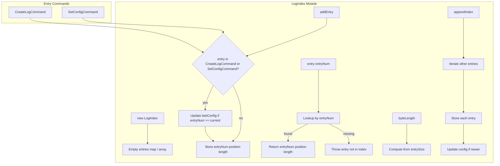
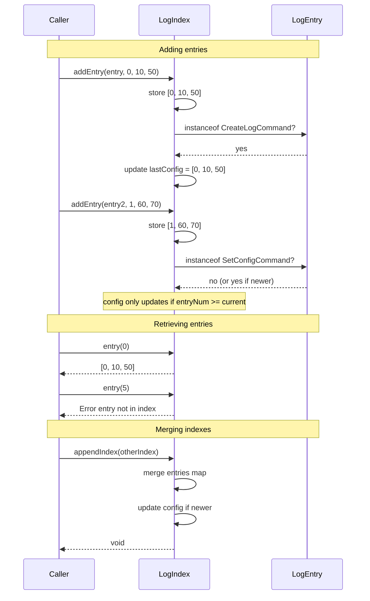

# LogIndex — Specification

## Overview

`LogIndex` is an in-memory ordered index of log entries for a single log stream. Each entry records a 3-tuple of `[entryNum, position, length]`. It tracks the last configuration entry (from `CreateLogCommand` or `SetConfigCommand`), supports appending another index, and provides byte-length calculations for serialization.

## Component Specifications (TypeScript declarations)

### `LogIndex` class

| Method / Property | Signature | Description |
|---|---|---|
| `constructor` | `()` | Creates empty index with no entries |
| `addEntry` | `(entry: LogEntry, entryNum: number, position: number, length: number): void` | Records entry and optionally updates last config if entry is a config-type command |
| `entry` | `(entryNum: number): [number, number, number]` | Returns `[entryNum, position, length]` for the given entry number |
| `entryCount` | `(): number` | Number of entries in the index |
| `hasEntries` | `(): boolean` | Whether any entries exist |
| `hasEntry` | `(entryNum: number): boolean` | Whether a specific entry number is indexed |
| `entries` | `(): [number, number, number]` | Returns the first entry's tuple |
| `lastEntry` | `(): [number, number, number]` | Returns the last entry's tuple |
| `maxEntryNum` | `(): number` | Largest entry number indexed |
| `hasConfig` | `(): boolean` | Whether a config entry has been recorded |
| `lastConfig` | `(): [number, number, number]` | Returns the last config entry's tuple |
| `lastConfigEntryNum` | `(): number` | Entry number of the last config entry |
| `byteLength` | `(entrySize: number): number` | Computes total byte length from entry size + number of entries + entry data |
| `appendIndex` | `(other: LogIndex): void` | Merges entries from another index into this one, updating config if newer |

### Config entry detection

`addEntry` checks `entry instanceof CreateLogCommand` or `entry instanceof SetConfigCommand` to determine whether the entry represents a configuration change. The config is only updated when the new entry's number is >= the current config's entry number.

## System Architecture (Mermaid graph TB)



## Detailed Data Flow (Mermaid sequenceDiagram)



## Visualization (self-contained D3 HTML)

```html
<!DOCTYPE html>
<meta charset="utf-8">
<body>
<script src="https://d3js.org/d3.v7.min.js"></script>
<div id="vis" style="text-align:center;font-family:monospace">
  <h3>LogIndex — Entry Indexing &amp; Config Tracking</h3>
  <svg width="800" height="400"></svg>
  <div>
    <button id="play-pause" data-testid="play-pause">▶ Play</button>
    <span>Keyframe: <span id="kf-current">0</span> / <span id="kf-total">0</span></span>
    <input type="range" id="kf-slider" min="0" max="0" value="0" step="1">
  </div>
</div>
<script>
(function() {
  const ANIMATION_DURATION_MS = 6000;
  const ANIMATION_KEYFRAMES = [
    { label: "Empty Index", detail: "entryCount 0, hasEntries false" },
    { label: "addEntry 0", detail: "Store [0, 10, 50], detect config type" },
    { label: "addEntry 1", detail: "Store [1, 60, 70], update lastConfig" },
    { label: "entry Lookup", detail: "entry(0) returns [0, 10, 50]" },
    { label: "Missing Entry", detail: "entry(5) throws entry not in index" },
    { label: "appendIndex", detail: "Merge another LogIndex entries" },
    { label: "byteLength", detail: "Compute serialized size from entrySize" },
  ];
  const totalSteps = ANIMATION_KEYFRAMES.length;

  const svg = d3.select("svg");
  const width = 800, height = 400;
  const margin = { top: 40, right: 20, bottom: 60, left: 20 };
  const innerW = width - margin.left - margin.right;
  const innerH = height - margin.top - margin.bottom;

  const g = svg.append("g").attr("transform", `translate(${margin.left},${margin.top})`);

  const xScale = d3.scaleLinear()
    .domain([0, totalSteps - 1])
    .range([50, innerW - 50]);

  g.append("line")
    .attr("x1", xScale(0)).attr("y1", innerH / 2)
    .attr("x2", xScale(totalSteps - 1)).attr("y2", innerH / 2)
    .attr("stroke", "#ccc").attr("stroke-width", 2);

  const nodes = g.selectAll("circle")
    .data(ANIMATION_KEYFRAMES)
    .enter()
    .append("circle")
    .attr("cx", (d, i) => xScale(i))
    .attr("cy", innerH / 2)
    .attr("r", 10)
    .attr("fill", "#e67e22")
    .attr("stroke", "#d35400")
    .attr("stroke-width", 2);

  g.selectAll("text.label")
    .data(ANIMATION_KEYFRAMES)
    .enter()
    .append("text")
    .attr("class", "label")
    .attr("x", (d, i) => xScale(i))
    .attr("y", innerH / 2 - 20)
    .attr("text-anchor", "middle")
    .attr("font-size", "11px")
    .attr("fill", "#333")
    .text((d) => d.label);

  const detailText = g.append("text")
    .attr("class", "detail")
    .attr("x", innerW / 2)
    .attr("y", innerH - 10)
    .attr("text-anchor", "middle")
    .attr("font-size", "13px")
    .attr("fill", "#555");

  const highlight = g.append("circle")
    .attr("r", 16).attr("fill", "none")
    .attr("stroke", "#e74c3c").attr("stroke-width", 3);

  let currentStep = 0, intervalId = null, isPlaying = false;

  function getAnimationState() { return { currentStep, totalSteps, isPlaying }; }

  function jumpToKeyframe(step) {
    step = Math.max(0, Math.min(totalSteps - 1, Math.round(step)));
    currentStep = step;
    highlight.attr("cx", xScale(step)).attr("cy", innerH / 2);
    nodes.attr("fill", (d, i) => i === step ? "#e74c3c" : "#e67e22");
    detailText.text(`${ANIMATION_KEYFRAMES[step].label}: ${ANIMATION_KEYFRAMES[step].detail}`);
    document.getElementById("kf-current").textContent = step;
    d3.select("#kf-slider").property("value", step);
  }

  const stepMs = ANIMATION_DURATION_MS / totalSteps;

  function tick() { jumpToKeyframe((currentStep + 1) % totalSteps); }
  function startAnimation() {
    if (intervalId) return;
    isPlaying = true;
    document.querySelector('#play-pause').textContent = '⏸ Pause';
    intervalId = setInterval(tick, stepMs);
  }
  function stopAnimation() {
    if (intervalId) { clearInterval(intervalId); intervalId = null; }
    isPlaying = false;
    document.querySelector('#play-pause').textContent = '▶ Play';
  }
  function togglePlay() { isPlaying ? stopAnimation() : startAnimation(); }

  document.getElementById('play-pause').addEventListener('click', togglePlay);
  d3.select("#kf-slider").on("input", function() {
    if (isPlaying) stopAnimation();
    jumpToKeyframe(+this.value);
  });

  document.getElementById("kf-total").textContent = totalSteps - 1;
  d3.select("#kf-slider").attr("max", totalSteps - 1);
  jumpToKeyframe(0);

  window.ANIMATION_DURATION_MS = ANIMATION_DURATION_MS;
  window.ANIMATION_KEYFRAMES = ANIMATION_KEYFRAMES;
  window.ANIMATION_VERIFICATION = true;
  window.jumpToKeyframe = jumpToKeyframe;
  window.resetAnimation = () => { stopAnimation(); jumpToKeyframe(0); };
  window.getAnimationState = getAnimationState;
  console.log('ANIMATION_VERIFICATION:', window.ANIMATION_VERIFICATION);
})();
</script>
</body>
```

## Testing Requirements

| # | Test | Type | Description |
|---|---|---|---|
| 1 | Starts empty | Unit | `entryCount() === 0`, `hasEntries() === false` |
| 2 | addEntry and track count | Unit | After adding one entry, `entryCount() === 1`, `hasEntries() === true` |
| 3 | Retrieve entry by number | Unit | `entry(0)` returns `[0, 10, 50]` |
| 4 | Missing entry throws | Unit | `entry(5)` throws `"entry not in index"` |
| 5 | Track last config from CreateLogCommand | Unit | `hasConfig()`, `lastConfig()`, `lastConfigEntryNum()` return correct values |
| 6 | Track last config from SetConfigCommand | Unit | `lastConfig()` returns `[5, 20, 60]` |
| 7 | Config updates when newer entry added | Unit | After adding entry 0 then entry 1, `lastConfig()` reflects entry 1 |
| 8 | Config does not update when older entry added | Unit | After adding entry 5 then entry 3, `lastConfig()` still reflects entry 5 |
| 9 | lastConfig throws when no config exists | Unit | `lastConfig()` on empty index throws `"no last config"` |
| 10 | lastConfigEntryNum throws when no config exists | Unit | `lastConfigEntryNum()` on empty index throws `"no last config"` |
| 11 | lastEntry returns last entry | Unit | After entries 0 and 1, `lastEntry()` returns `[1, 60, 70]` |
| 12 | lastEntry throws when no entries | Unit | `lastEntry()` on empty index throws `"no last entry"` |
| 13 | maxEntryNum returns max | Unit | After entries 0 and 5, `maxEntryNum()` returns 5 |
| 14 | maxEntryNum throws when no entries | Unit | `maxEntryNum()` on empty index throws `"no entries"` |
| 15 | appendIndex merges entries | Unit | `appendIndex(other)` results in `entryCount() === 2` and correct `entry(1)` |
| 16 | appendIndex updates config when newer | Unit | Config from newer appended index replaces older config |
| 17 | appendIndex does not update config when older | Unit | Config from older appended index is ignored |
| 18 | byteLength calculation | Unit | `byteLength(27)` returns correct total byte length |
| 19 | entries returns first entry | Unit | `entries()` returns `[0, 10, 50]` |
| 20 | hasEntry checks correctly | Unit | `hasEntry(5)` true, `hasEntry(3)` false, `hasEntry(7)` false |

---

## 7. Source-Test Cross-References

### Source Coverage

| Source Spec | Path |
|---|---|
| LogIndex.spec.md | `source/src/lib/log/LogIndex.spec.md` |
