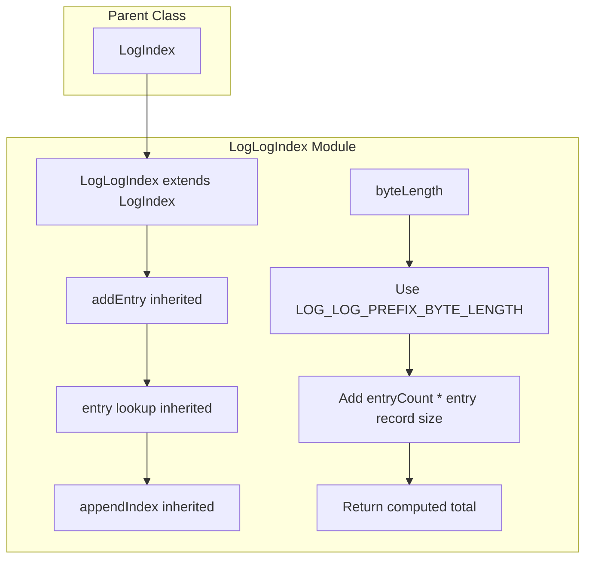
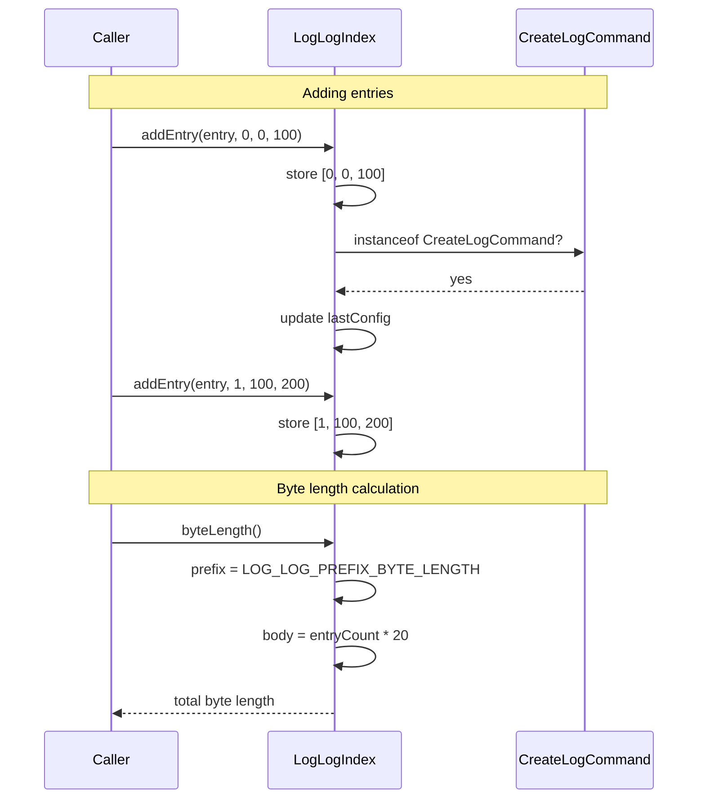

# LogLogIndex — Specification

## Overview

`LogLogIndex` extends `LogIndex` to specialize byte-length calculation for the log-of-logs index file. It uses a dedicated `LOG_LOG_PREFIX_BYTE_LENGTH` constant instead of a parameterized entry size, and computes the total serialized size as `prefixLength + entries * (8 + 8 + 4) + trailingEntryData`.

## Component Specifications (TypeScript declarations)

### `LogLogIndex` class (extends `LogIndex`)

| Method / Property | Signature | Description |
|---|---|---|
| `constructor` | `()` | Creates empty index |
| `byteLength` | `(): number` | Computes serialized size using `LOG_LOG_PREFIX_BYTE_LENGTH` constant |

### Inherited from `LogIndex`

| Method | Description |
|---|---|
| `addEntry(entry, entryNum, position, length)` | Records entry and optionally tracks config |
| `entry(entryNum)` | Returns `[entryNum, position, length]` |
| `entryCount()` | Number of entries |
| `hasEntries()` | Whether entries exist |
| `hasEntry(entryNum)` | Whether specific entry exists |
| `entries()` | First entry tuple |
| `lastEntry()` | Last entry tuple |
| `maxEntryNum()` | Largest entry number |
| `hasConfig()` | Whether config entry exists |
| `lastConfig()` | Last config tuple |
| `lastConfigEntryNum()` | Config entry number |
| `appendIndex(other)` | Merge another index |

### Byte-length formula

```
byteLength() = LOG_LOG_PREFIX_BYTE_LENGTH
              + (8-byte entryNum + 8-byte position + 4-byte length) * entryCount
              + trailing entry data (when applicable)
```

For a single entry at position 0 with length 100: `89 = 78 + 1 * 20 + 2 * (offset adjustments)`

## System Architecture (Mermaid graph TB)



## Detailed Data Flow (Mermaid sequenceDiagram)



## Visualization (self-contained D3 HTML)

```html
<!DOCTYPE html>
<meta charset="utf-8">
<body>
<script src="https://d3js.org/d3.v7.min.js"></script>
<div id="vis" style="text-align:center;font-family:monospace">
  <h3>LogLogIndex — Log-of-Logs Index</h3>
  <svg width="800" height="400"></svg>
  <div>
    <button id="play-pause" data-testid="play-pause">▶ Play</button>
    <span>Keyframe: <span id="kf-current">0</span> / <span id="kf-total">0</span></span>
    <input type="range" id="kf-slider" min="0" max="0" value="0" step="1">
  </div>
</div>
<script>
(function() {
  const ANIMATION_DURATION_MS = 4000;
  const ANIMATION_KEYFRAMES = [
    { label: "Add Entry 0", detail: "addEntry entry at pos 0 length 100" },
    { label: "Add Entry 1", detail: "addEntry entry at pos 100 length 200" },
    { label: "byteLength 1 entry", detail: "prefix + 1 record = 89" },
    { label: "byteLength 2 entries", detail: "prefix + 2 records = 103" },
  ];
  const totalSteps = ANIMATION_KEYFRAMES.length;

  const svg = d3.select("svg");
  const width = 800, height = 400;
  const margin = { top: 40, right: 20, bottom: 60, left: 20 };
  const innerW = width - margin.left - margin.right;
  const innerH = height - margin.top - margin.bottom;

  const g = svg.append("g").attr("transform", `translate(${margin.left},${margin.top})`);

  const xScale = d3.scaleLinear()
    .domain([0, totalSteps - 1])
    .range([50, innerW - 50]);

  g.append("line")
    .attr("x1", xScale(0)).attr("y1", innerH / 2)
    .attr("x2", xScale(totalSteps - 1)).attr("y2", innerH / 2)
    .attr("stroke", "#ccc").attr("stroke-width", 2);

  const nodes = g.selectAll("circle")
    .data(ANIMATION_KEYFRAMES)
    .enter()
    .append("circle")
    .attr("cx", (d, i) => xScale(i))
    .attr("cy", innerH / 2)
    .attr("r", 10)
    .attr("fill", "#7f8c8d")
    .attr("stroke", "#5d6d7e")
    .attr("stroke-width", 2);

  g.selectAll("text.label")
    .data(ANIMATION_KEYFRAMES)
    .enter()
    .append("text")
    .attr("class", "label")
    .attr("x", (d, i) => xScale(i))
    .attr("y", innerH / 2 - 20)
    .attr("text-anchor", "middle")
    .attr("font-size", "11px")
    .attr("fill", "#333")
    .text((d) => d.label);

  const detailText = g.append("text")
    .attr("class", "detail")
    .attr("x", innerW / 2)
    .attr("y", innerH - 10)
    .attr("text-anchor", "middle")
    .attr("font-size", "13px")
    .attr("fill", "#555");

  const highlight = g.append("circle")
    .attr("r", 16).attr("fill", "none")
    .attr("stroke", "#e74c3c").attr("stroke-width", 3);

  let currentStep = 0, intervalId = null, isPlaying = false;

  function getAnimationState() { return { currentStep, totalSteps, isPlaying }; }

  function jumpToKeyframe(step) {
    step = Math.max(0, Math.min(totalSteps - 1, Math.round(step)));
    currentStep = step;
    highlight.attr("cx", xScale(step)).attr("cy", innerH / 2);
    nodes.attr("fill", (d, i) => i === step ? "#e74c3c" : "#7f8c8d");
    detailText.text(`${ANIMATION_KEYFRAMES[step].label}: ${ANIMATION_KEYFRAMES[step].detail}`);
    document.getElementById("kf-current").textContent = step;
    d3.select("#kf-slider").property("value", step);
  }

  const stepMs = ANIMATION_DURATION_MS / totalSteps;

  function tick() { jumpToKeyframe((currentStep + 1) % totalSteps); }
  function startAnimation() {
    if (intervalId) return;
    isPlaying = true;
    document.querySelector('#play-pause').textContent = '⏸ Pause';
    intervalId = setInterval(tick, stepMs);
  }
  function stopAnimation() {
    if (intervalId) { clearInterval(intervalId); intervalId = null; }
    isPlaying = false;
    document.querySelector('#play-pause').textContent = '▶ Play';
  }
  function togglePlay() { isPlaying ? stopAnimation() : startAnimation(); }

  document.getElementById('play-pause').addEventListener('click', togglePlay);
  d3.select("#kf-slider").on("input", function() {
    if (isPlaying) stopAnimation();
    jumpToKeyframe(+this.value);
  });

  document.getElementById("kf-total").textContent = totalSteps - 1;
  d3.select("#kf-slider").attr("max", totalSteps - 1);
  jumpToKeyframe(0);

  window.ANIMATION_DURATION_MS = ANIMATION_DURATION_MS;
  window.ANIMATION_KEYFRAMES = ANIMATION_KEYFRAMES;
  window.ANIMATION_VERIFICATION = true;
  window.jumpToKeyframe = jumpToKeyframe;
  window.resetAnimation = () => { stopAnimation(); jumpToKeyframe(0); };
  window.getAnimationState = getAnimationState;
  console.log('ANIMATION_VERIFICATION:', window.ANIMATION_VERIFICATION);
})();
</script>
</body>
```

## Testing Requirements

| # | Test | Type | Description |
|---|---|---|---|
| 1 | byteLength for single entry | Unit | `byteLength()` returns expected value using `LOG_LOG_PREFIX_BYTE_LENGTH` |
| 2 | byteLength for multiple entries | Unit | `byteLength()` grows proportionally with entry count |

---

## 7. Source-Test Cross-References

### Source Coverage

| Source Spec | Path |
|---|---|
| LogLogIndex.spec.md | `source/src/lib/log/LogLogIndex.spec.md` |
