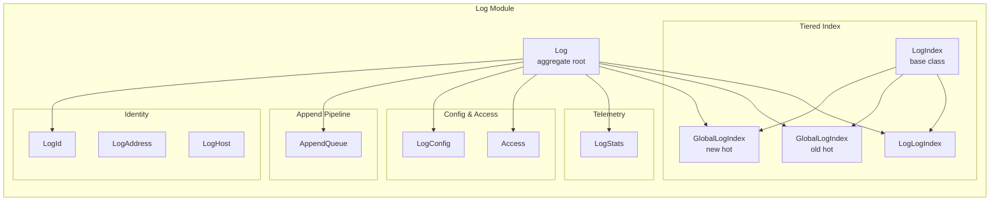
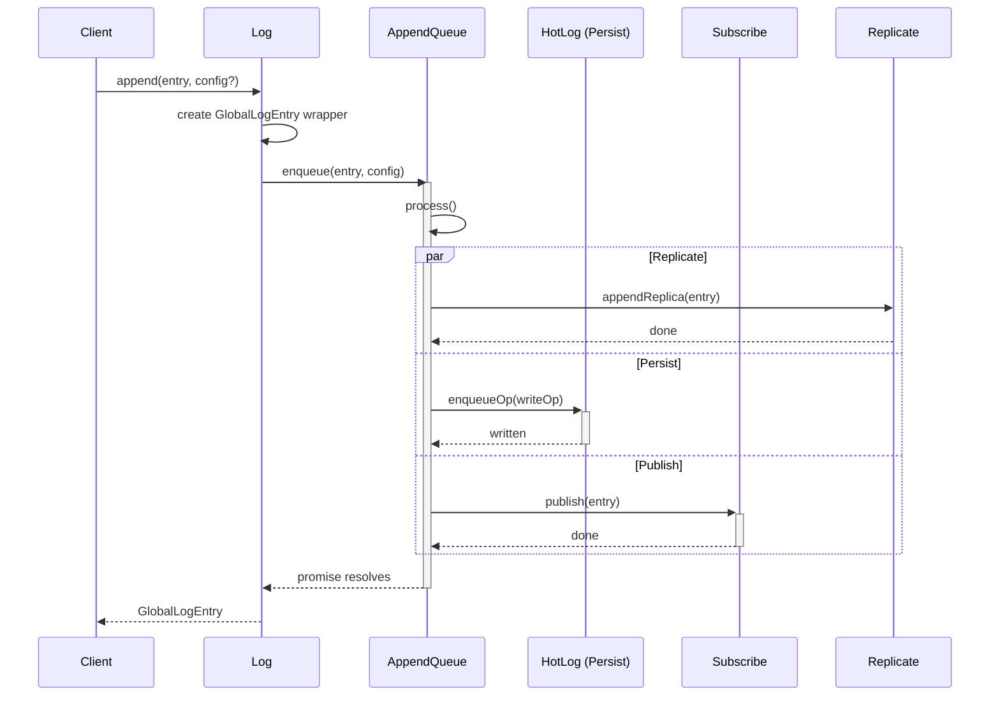

# Log Module — LogModule.spec.md

## 1. Overview

The **Log Module** defines the `Log` aggregate — the central runtime object representing a single log in the system. It owns the multi-tier index structure (`GlobalLogIndex` × 2 + `LogLogIndex`), the append pipeline (`AppendQueue`), per-log configuration (`LogConfig`), access control (`Access`), identity (`LogId`, `LogAddress`, `LogHost`), and telemetry (`LogStats`). Every client-facing operation (`append`, `getHead`, `getEntries`, `getConfig`, `setConfig`) is orchestrated through `Log`.

**Dependencies:** Entry Module (entry types), Persistence Module (LogLog), Server Module (Server)
**Lifecycle stages:** Construct (with Server + LogId) → Lazy-init LogLog → Create/Append → Stop

## 2. Component Specifications

| Component | Role | Access Path |
|---|---|---|
| `Log` | Aggregate root — owns indices, append queue, config, access, stats | `../log.ts` |
| `LogConfig` | Per-log configuration with JSON Schema validation | `./log-config.ts` |
| `LogId` | 16-byte unique log identifier with base64url encoding | `./log-id.ts` |
| `LogAddress` | Address string encoding logId + host + config hosts | `./log-address.ts` |
| `LogHost` | Master + replicas host string | `./log-host.ts` |
| `LogIndex` | In-memory index of `[entryNum, offset, length]` triplets | `./log-index.ts` |
| `GlobalLogIndex` | LogIndex using `GLOBAL_LOG_PREFIX_BYTE_LENGTH` | `./global-log-index.ts` |
| `LogLogIndex` | LogIndex using `LOG_LOG_PREFIX_BYTE_LENGTH` | `./log-log-index.ts` |
| `LogStats` | Per-log IO statistics (reads, writes, timing) | `./log-stats.ts` |
| `Access` | Token/JWT-based authorization for read/write/admin | `./access.ts` |
| `AppendQueue` | Serialized append pipeline — replicate → persist → publish | `./append-queue.ts` |

## 3. System Architecture



## 4. Detailed Data Flow



## 5. Visualization

```html
<!DOCTYPE html>
<html>
<head>
<meta charset="utf-8">
<style>
  body { font-family: monospace; background: #1e1e2e; color: #cdd6f4; margin: 0; }
  #vis { width: 960px; height: 540px; position: relative; }
  .controls { display: flex; gap: 8px; padding: 8px; background: #181825; align-items: center; }
  .controls button { background: #45475a; color: #cdd6f4; border: none; padding: 4px 12px; cursor: pointer; }
  .controls button:hover { background: #585b70; }
  #kf-current, #kf-total { color: #a6adc8; font-size: 12px; min-width: 20px; text-align: center; }
  #frame-label { color: #89b4fa; font-size: 14px; margin-left: auto; }
  .node { position: absolute; border: 2px solid #89b4fa; border-radius: 6px; padding: 8px 12px;
           background: #313244; font-size: 11px; text-align: center; transition: all 0.3s; }
  .node.active { border-color: #a6e3a1; background: #45475a; box-shadow: 0 0 12px #a6e3a180; }
  .edge { position: absolute; height: 2px; background: #585b70; transform-origin: 0 0; }
  .edge.active { background: #a6e3a1; box-shadow: 0 0 6px #a6e3a1; }
  .badge { font-size: 9px; color: #6c7086; margin-top: 2px; }
</style>
</head>
<body>
<div class="controls">
  <button id="play-pause" data-testid="play-pause">⏸</button>
  <span id="kf-current">0</span><span>/</span><span id="kf-total">6</span>
  <input type="range" id="seek" min="0" max="6" value="0" style="flex:1">
  <span id="frame-label">Append pipeline start</span>
</div>
<div id="vis"></div>
<script>
(function(){
  const ANIMATION_DURATION_MS = 10000;
  const ANIMATION_KEYFRAMES = [
    { label: "Client calls Log.append()", active: ["L","Client"], edges: ["Client-L"] },
    { label: "Log wraps entry, enqueues", active: ["L"], edges: [] },
    { label: "AppendQueue.process() starts", active: ["AQ"], edges: ["L-AQ"] },
    { label: "Replicate to peers", active: ["AQ","Rep"], edges: ["AQ-Rep"] },
    { label: "Persist to HotLog", active: ["AQ","Hot"], edges: ["AQ-Hot"] },
    { label: "Publish to subscribers", active: ["AQ","Sub"], edges: ["AQ-Sub"] },
    { label: "Promise resolves → return", active: ["Client"], edges: ["AQ-Client"] },
  ];
  const ANIMATION_VERIFICATION = {
    kfCount: ANIMATION_KEYFRAMES.length,
    frameLabelEl: "frame-label",
    playPauseEl: "play-pause",
    kfCurrentEl: "kf-current",
    kfTotalEl: "kf-total",
    expectedLabels: ANIMATION_KEYFRAMES.map(k => k.label)
  };

  const vis = document.getElementById('vis');
  const nodePositions = {
    Client: [80, 120], L: [280, 80], AQ: [480, 80],
    Hot: [680, 40], Sub: [680, 120], Rep: [680, 200]
  };
  const nodes = {};
  Object.entries(nodePositions).forEach(([id, [x, y]]) => {
    const el = document.createElement('div');
    el.className = 'node';
    el.id = 'n-' + id;
    el.style.left = x + 'px'; el.style.top = y + 'px';
    el.innerHTML = `<strong>${id}</strong><div class="badge">log</div>`;
    vis.appendChild(el);
    nodes[id] = el;
  });

  const edgeDefs = [['Client','L'],['L','AQ'],['AQ','Hot'],['AQ','Sub'],['AQ','Rep'],['AQ','Client']];
  edgeDefs.forEach(([from, to]) => {
    const fx = nodePositions[from][0] + 40, fy = nodePositions[from][1] + 20;
    const tx = nodePositions[to][0], ty = nodePositions[to][1] + 20;
    const dx = tx - fx, dy = ty - fy;
    const len = Math.sqrt(dx*dx + dy*dy);
    const el = document.createElement('div');
    el.className = 'edge'; el.id = 'e-' + from + '-' + to;
    el.style.left = fx + 'px'; el.style.top = fy + 'px';
    el.style.width = len + 'px';
    el.style.transform = 'rotate(' + (Math.atan2(dy, dx) * 180 / Math.PI) + 'deg)';
    vis.appendChild(el);
  });

  let currentKf = 0, playing = true, intervalId;

  function jumpToKeyframe(idx) {
    currentKf = Math.max(0, Math.min(idx, ANIMATION_KEYFRAMES.length - 1));
    const kf = ANIMATION_KEYFRAMES[currentKf];
    Object.keys(nodes).forEach(id => nodes[id].classList.toggle('active', kf.active.includes(id)));
    document.querySelectorAll('.edge').forEach(el => el.classList.toggle('active', kf.edges?.includes(el.id.replace('e-',''))));
    document.getElementById('frame-label').textContent = kf.label;
    document.getElementById('kf-current').textContent = currentKf;
    document.getElementById('seek').value = currentKf;
  }
  function resetAnimation() { jumpToKeyframe(0); }
  function getAnimationState() { return { currentKf, playing, total: ANIMATION_KEYFRAMES.length }; }
  function togglePlay() {
    playing = !playing;
    document.getElementById('play-pause').textContent = playing ? '⏸' : '▶';
    if (playing) {
      intervalId = setInterval(() => jumpToKeyframe((currentKf + 1) % ANIMATION_KEYFRAMES.length),
        ANIMATION_DURATION_MS / ANIMATION_KEYFRAMES.length);
    } else { clearInterval(intervalId); }
  }
  document.getElementById('play-pause').addEventListener('click', togglePlay);
  document.getElementById('seek').addEventListener('input', function() { jumpToKeyframe(parseInt(this.value)); });
  document.getElementById('kf-total').textContent = ANIMATION_KEYFRAMES.length - 1;
  jumpToKeyframe(0);
  intervalId = setInterval(() => jumpToKeyframe((currentKf + 1) % ANIMATION_KEYFRAMES.length),
    ANIMATION_DURATION_MS / ANIMATION_KEYFRAMES.length);
  window.__ANIMATION = { ANIMATION_KEYFRAMES, ANIMATION_DURATION_MS, ANIMATION_VERIFICATION,
    jumpToKeyframe, resetAnimation, getAnimationState };
})();
</script>
</body>
</html>
```

## 6. Testing Requirements

| Method / Constructor | Unit test | Validates |
|---|---|---|
| `Log.constructor()` | `log.test.ts` | Fields initialized, no side effects |
| `Log.getLogLog()` | same | Lazy-init LogLog, cached |
| `Log.stop()` | same | Stopped flag set |
| `Log.append()` | same | Entry wrapped, AppendQueue enqueued |
| `Log.appendOp()` | same | Immediate persist to HotLog |
| `Log.create()` | same | CreateLogCommand built, config stored |
| `Log.exists()` | same | File or index check |
| `Log.getConfig()` | same | Reads last config entry from index |
| `Log.setConfig()` | same | Validates entryNum, appends SetConfigCommand |
| `Log.getHead()` | same | Latest entry across all indices |
| `Log.getEntries()` | same | Multi-log read with offset/limit |
| `Log.getEntryNums()` | same | Specific entry numbers |
| `Log.moveNewToOldHotLog()` | same | Index transfer, IO reassignment |
| `Log.emptyOldHotLog()` | same | Entries migrated to LogLog |
| `LogId.newRandom()` | `log-id.test.ts` | 16 random bytes |
| `LogId.base64()` | same | Base64url encoding, cached |
| `LogId.logDirPrefix()` | same | Two-level hex prefix |
| `LogId.newFromBase64()` | same | Round-trip |
| `LogConfig.constructor()` | `log-config.test.ts` | Field assignment, LogAddress conversion |
| `LogConfig.setDefaults()` | same | Token generation, constraint validation |
| `LogConfig.newFromJSON()` | same | AJV schema validation |
| `LogConfig.replicationGroup()` | same | Master + replicas array |
| `LogIndex.addEntry()` | `log-index.test.ts` | Triplet storage, config tracking |
| `LogIndex.entry()` | same | Triplet retrieval, bounds check |
| `LogIndex.entryCount()` / `entries()` | same | Correct count and raw data |
| `LogIndex.appendIndex()` | same | Merge with config preservation |
| `LogIndex.byteLength()` | same | Sum of data lengths |
| `LogIndex.hasConfig()` / `lastConfig()` | same | Config tracking |
| `GlobalLogIndex.byteLength()` | `global-log-index.test.ts` | Override with correct prefix |
| `LogLogIndex.byteLength()` | `log-log-index.test.ts` | Override with correct prefix |
| `LogStats.addOp()` | `log-stats.test.ts` | Read/write categorization, timing |
| `Access.allowed()` | `access.test.ts` | Token mode: super/access/admin/read/write |
| `Access.allowed()` | same | JWT mode: HS256 verification, allow claim |
| `Access.jwtSecretU8()` | same | Base64 decode |
| `LogAddress.constructor()` | `log-address.test.ts` | Fields |
| `LogAddress.toString()` | same | Semicolon-separated format |
| `LogAddress.fromString()` | same | Full round-trip |
| `LogHost.constructor()` | `log-host.test.ts` | Master + replicas |
| `LogHost.fromString()` | same | Comma parsing |
| `AppendQueue.enqueue()` | `append-queue.test.ts` | Entry added, process triggered |
| `AppendQueue.process()` | same | Full pipeline: replicate → persist → publish |
| `AppendQueue.waitHead()` | same | Promise resolves on head entry |

## 7. Source-Test Cross-References

| Source file | Test spec |
|---|---|
| `src/lib/log.ts` | `src/lib/log.test.ts` |
| `src/lib/log/log-config.ts` | `src/lib/log/log-config.test.ts` |
| `src/lib/log/log-id.ts` | `src/lib/log/log-id.test.ts` |
| `src/lib/log/log-address.ts` | `src/lib/log/log-address.test.ts` |
| `src/lib/log/log-host.ts` | `src/lib/log/log-host.test.ts` |
| `src/lib/log/log-index.ts` | `src/lib/log/log-index.test.ts` |
| `src/lib/log/global-log-index.ts` | `src/lib/log/global-log-index.test.ts` |
| `src/lib/log/log-log-index.ts` | `src/lib/log/log-log-index.test.ts` |
| `src/lib/log/log-stats.ts` | `src/lib/log/log-stats.test.ts` |
| `src/lib/log/access.ts` | `src/lib/log/access.test.ts` |
| `src/lib/log/append-queue.ts` | `src/lib/log/append-queue.test.ts` |
