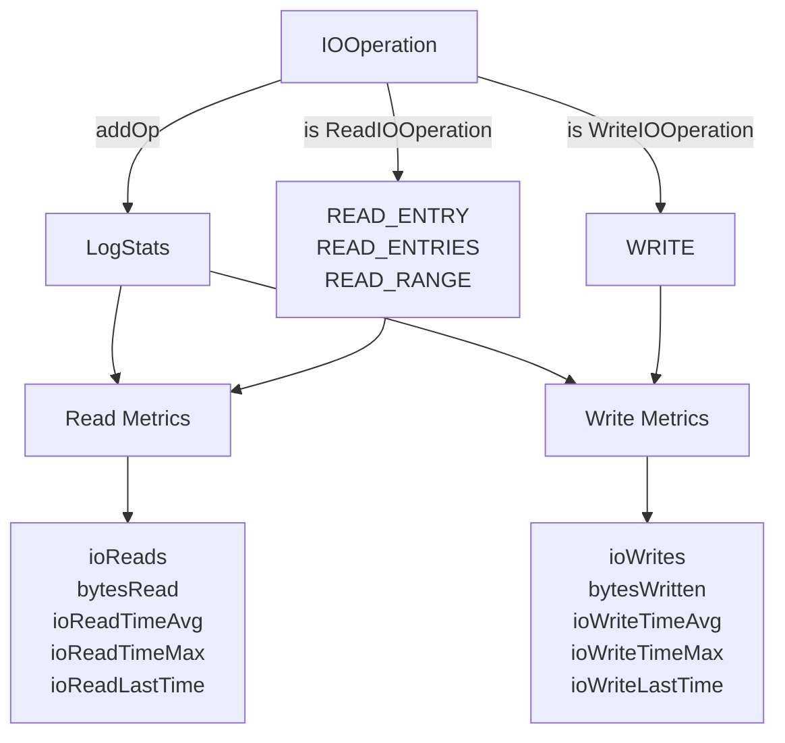
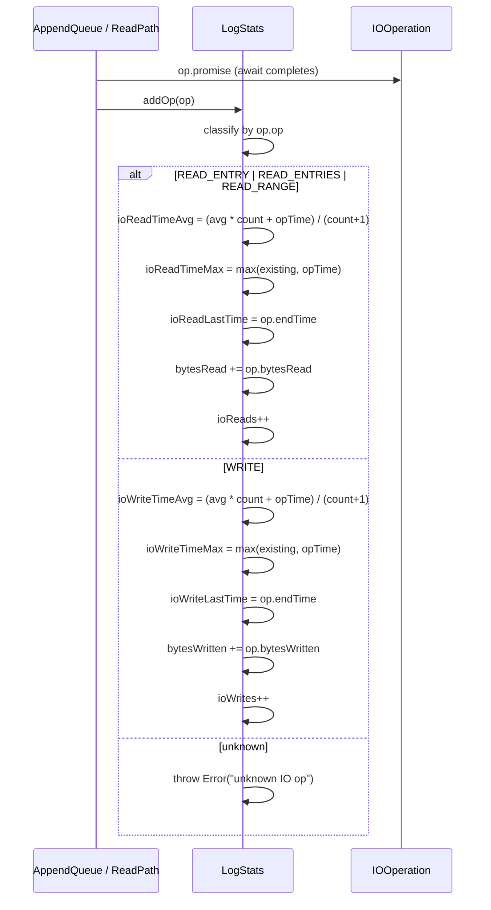

# LogStats Spec

**Module: Log Abstraction**

## Overview

Tracks I/O performance metrics for a log, including read/write counts, bytes transferred, and timing statistics (average, max, last). Fed incrementally via `addOp()` as each I/O operation completes.

## Component Specifications

```typescript
class LogStats {
    ioReads: number            // count of completed read operations
    bytesRead: number          // total bytes read
    ioReadTimeAvg: number      // running average of read duration (ms)
    ioReadTimeMax: number      // maximum read duration (ms)
    ioReadLastTime: number     // endTime of most recent read op
    ioWrites: number           // count of completed write operations
    bytesWritten: number       // total bytes written
    ioWriteTimeAvg: number     // running average of write duration (ms)
    ioWriteTimeMax: number     // maximum write duration (ms)
    ioWriteLastTime: number    // endTime of most recent write op
}
```

## System Architecture



## Detailed Data Flow



## Visualization

```html
<div id="logstats-viz"></div>
<script src="https://d3js.org/d3.v7.min.js"></script>
<script>
(function() {
    const ANIMATION_DURATION_MS = 3000;
    const ANIMATION_KEYFRAMES = [
        { label: "Initial", reads: 0, bytesR: 0, writes: 0, bytesW: 0, avgR: 0, maxR: 0, avgW: 0, maxW: 0 },
        { label: "Write #1", reads: 0, bytesR: 0, writes: 1, bytesW: 256, avgR: 0, maxR: 0, avgW: 1.2, maxW: 1.2 },
        { label: "Read #1", reads: 1, bytesR: 128, writes: 1, bytesW: 256, avgR: 0.8, maxR: 0.8, avgW: 1.2, maxW: 1.2 },
        { label: "Write #2", reads: 1, bytesR: 128, writes: 2, bytesW: 512, avgR: 0.8, maxR: 0.8, avgW: 1.5, maxW: 2.1 },
        { label: "Read #2", reads: 2, bytesR: 384, writes: 2, bytesW: 512, avgR: 1.1, maxR: 1.4, avgW: 1.5, maxW: 2.1 },
    ];
    let currentFrame = 0;
    let animationId = null;
    let isPlaying = false;

    const container = d3.select("#logstats-viz");
    container.html("");
    const svg = container.append("svg").attr("width", 700).attr("height", 300);

    // Bars
    const xScale = d3.scaleBand().domain(["Read Ops", "Write Ops", "Bytes Read", "Bytes Written"]).range([60, 680]).padding(0.3);
    const yScale = d3.scaleLinear().domain([0, 1]).range([240, 40]);

    const groups = svg.selectAll("g.bar-group").data(xScale.domain()).enter().append("g").attr("class", "bar-group")
        .attr("transform", d => `translate(${xScale(d)},0)`);

    groups.append("rect").attr("class", "bar").attr("y", 240).attr("width", xScale.bandwidth()).attr("height", 0)
        .attr("fill", (d, i) => ["#4caf50","#2196f3","#ff9800","#9c27b0"][i]);

    groups.append("text").attr("class", "value-label").attr("y", 235).attr("x", xScale.bandwidth()/2)
        .attr("text-anchor", "middle").attr("font-size", "12").attr("fill", "#333");

    groups.append("text").attr("class", "axis-label").attr("y", 270).attr("x", xScale.bandwidth()/2)
        .attr("text-anchor", "middle").attr("font-size", "11").attr("fill", "#666").text(d => d);

    // Stats table
    const statsDiv = container.append("div").style("margin-top", "10px").style("font-family","monospace").style("font-size","12px");

    const controls = container.append("div").style("margin-top","10px");
    controls.append("button").attr("data-testid","play-pause").text("▶ Play").on("click", togglePlay);
    controls.append("span").style("margin-left","10px").text("Frame: ");
    controls.append("span").attr("id","kf-total").text("0 / 4");
    controls.append("input").attr("type","range").attr("min",0).attr("max", ANIMATION_KEYFRAMES.length-1).attr("value",0)
        .style("width","300px").style("margin-left","10px").on("input", function() { jumpToKeyframe(+this.value); });

    function update(kf) {
        const barData = [
            { v: kf.reads, max: 5 },
            { v: kf.writes, max: 5 },
            { v: kf.bytesR, max: 600 },
            { v: kf.bytesW, max: 600 }
        ];
        svg.selectAll("rect.bar").data(barData).transition().duration(300)
            .attr("height", d => yScale(0) - yScale(d.v / d.max))
            .attr("y", d => yScale(d.v / d.max));
        svg.selectAll("text.value-label").data(barData)
            .text(d => d.v);

        statsDiv.html(`
            <div>Reads: ${kf.reads} | Bytes Read: ${kf.bytesR}</div>
            <div>Writes: ${kf.writes} | Bytes Written: ${kf.bytesW}</div>
            <div>Avg Read: ${kf.avgR.toFixed(1)}ms | Max Read: ${kf.maxR.toFixed(1)}ms</div>
            <div>Avg Write: ${kf.avgW.toFixed(1)}ms | Max Write: ${kf.maxW.toFixed(1)}ms</div>
        `);
        d3.select("#kf-total").text(`${kf.label} (${currentFrame} / ${ANIMATION_KEYFRAMES.length-1})`);
    }

    function togglePlay() {
        isPlaying = !isPlaying;
        d3.select("[data-testid=play-pause]").text(isPlaying ? "⏸ Pause" : "▶ Play");
        if (isPlaying) {
            animationId = setInterval(() => {
                currentFrame = (currentFrame + 1) % ANIMATION_KEYFRAMES.length;
                update(ANIMATION_KEYFRAMES[currentFrame]);
                d3.select("input[type=range]").property("value", currentFrame);
            }, ANIMATION_DURATION_MS / ANIMATION_KEYFRAMES.length);
        } else if (animationId) {
            clearInterval(animationId);
            animationId = null;
        }
    }

    function jumpToKeyframe(frame) {
        if (isPlaying) togglePlay();
        currentFrame = frame;
        update(ANIMATION_KEYFRAMES[frame]);
        d3.select("input[type=range]").property("value", frame);
    }

    function resetAnimation() {
        if (isPlaying) togglePlay();
        jumpToKeyframe(0);
    }

    function getAnimationState() {
        return { currentFrame, totalFrames: ANIMATION_KEYFRAMES.length, isPlaying, keyframe: ANIMATION_KEYFRAMES[currentFrame] };
    }

    update(ANIMATION_KEYFRAMES[0]);
    // Verification
    setTimeout(() => {
        console.log("ANIMATION_VERIFICATION: LogStats viz loaded, 4 keyframes, ready");
    }, 100);
})();
</script>
```

## Testing Requirements

| # | Test Case | Input | Expected Output |
|---|-----------|-------|-----------------|
| 1 | Add read op (READ_ENTRY) | `MockReadOp(READ_ENTRY, start=0, end=1, bytesRead=100)` | `ioReads=1, bytesRead=100, ioReadTimeAvg=1, ioReadTimeMax=1, ioReadLastTime=1` |
| 2 | Add read op (READ_RANGE) | `MockReadOp(READ_RANGE, start=1, end=3, bytesRead=200)` | `ioReads=2, bytesRead=300, ioReadTimeAvg=1.5, ioReadTimeMax=2, ioReadLastTime=3` |
| 3 | Add write op (WRITE) | `MockWriteOp(start=0, end=2, bytesWritten=256)` | `ioWrites=1, bytesWritten=256, ioWriteTimeAvg=2, ioWriteTimeMax=2, ioWriteLastTime=2` |
| 4 | Multiple writes verify running avg | Two writes: 1ms and 3ms | `ioWrites=2, ioWriteTimeAvg=2, ioWriteTimeMax=3` |
| 5 | Unknown op type throws | `MockOp("DELETE")` | Throws `Error("unknown IO op")` |
| 6 | Max tracking with mixed values | Reads of [1, 5, 2] ms | `ioReadTimeMax=5` |
| 7 | Initial state | Fresh `new LogStats()` | All fields = 0 |
| 8 | Consecutive addOp calls | 3 reads then 2 writes | Reads counted separately from writes |

---

## 7. Source-Test Cross-References

### Test Coverage

| Test Spec | Path |
|---|---|
| LogStats.test.spec.md | `source/src/lib/log/LogStats.test.spec.md` |
