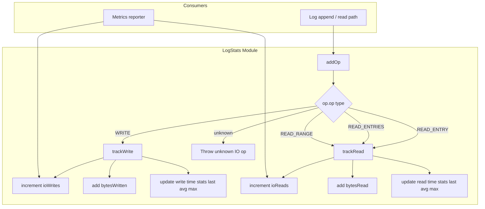
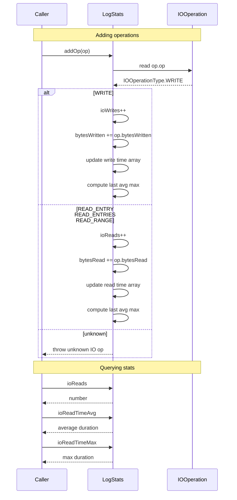

# LogStats — Specification

## Overview

`LogStats` tracks I/O performance metrics for a log stream. It records read and write operation counts, byte totals, timing statistics (last, average, max), and accepts typed `IOOperation` objects dispatched via `addOp`. The class distinguishes `READ_ENTRY`, `READ_ENTRIES`, `READ_RANGE`, and `WRITE` operation types.

## Component Specifications (TypeScript declarations)

### `LogStats` class

| Method / Property | Signature | Description |
|---|---|---|
| `constructor` | `()` | Initializes all counters and timing values to zero |
| `addOp` | `(op: IOOperation): void` | Dispatches to read or write tracking based on `op.op` type |
| `ioReads` | `number` (get) | Count of read operations |
| `bytesRead` | `number` (get) | Total bytes read |
| `ioReadTimeAvgs` | `number[]` (private) | Durations of each read op (for average computation) |
| `ioReadTimeAvg` | `number` (get) | Average read time |
| `ioReadTimeMax` | `number` (get) | Maximum read time |
| `ioReadLastTime` | `number` (get) | Last read operation time |
| `ioWrites` | `number` (get) | Count of write operations |
| `bytesWritten` | `number` (get) | Total bytes written |
| `ioWriteTimeAvgs` | `number[]` (private) | Durations of each write op (for average computation) |
| `ioWriteTimeAvg` | `number` (get) | Average write time |
| `ioWriteTimeMax` | `number` (get) | Maximum write time |
| `ioWriteLastTime` | `number` (get) | Last write operation time |

### `IOOperation` interface (consumed)

| Property | Type | Description |
|---|---|---|
| `op` | `IOOperationType` | Operation type discriminator |
| `startTime` | `number` | Operation start timestamp |
| `endTime` | `number` | Operation end timestamp |
| `bytesRead` | `number` | Bytes read (for read ops) |
| `bytesWritten` | `number` | Bytes written (for write ops) |

### `IOOperationType` enum

| Value | Description |
|---|---|
| `READ_ENTRY` | Single entry read |
| `READ_ENTRIES` | Multiple entry read |
| `READ_RANGE` | Range read |
| `WRITE` | Write operation |

### Dispatch logic

```
op.op === WRITE → trackWrite(op)
op.op === READ_ENTRY | READ_ENTRIES | READ_RANGE → trackRead(op)
otherwise → throw unknown IO op
```

## System Architecture (Mermaid graph TB)



## Detailed Data Flow (Mermaid sequenceDiagram)



## Visualization (self-contained D3 HTML)

```html
<!DOCTYPE html>
<meta charset="utf-8">
<body>
<script src="https://d3js.org/d3.v7.min.js"></script>
<div id="vis" style="text-align:center;font-family:monospace">
  <h3>LogStats — I/O Operation Tracking</h3>
  <svg width="800" height="400"></svg>
  <div>
    <button id="play-pause" data-testid="play-pause">▶ Play</button>
    <span>Keyframe: <span id="kf-current">0</span> / <span id="kf-total">0</span></span>
    <input type="range" id="kf-slider" min="0" max="0" value="0" step="1">
  </div>
</div>
<script>
(function() {
  const ANIMATION_DURATION_MS = 5000;
  const ANIMATION_KEYFRAMES = [
    { label: "Zero State", detail: "ioReads 0 ioWrites 0 bytes 0" },
    { label: "addOp READ", detail: "Increment ioReads add bytesRead" },
    { label: "addOp WRITE", detail: "Increment ioWrites add bytesWritten" },
    { label: "Time Tracking", detail: "Update last avg max durations" },
    { label: "Multiple Ops", detail: "Running averages computed correctly" },
    { label: "Unknown Op", detail: "Throw unknown IO op error" },
  ];
  const totalSteps = ANIMATION_KEYFRAMES.length;

  const svg = d3.select("svg");
  const width = 800, height = 400;
  const margin = { top: 40, right: 20, bottom: 60, left: 20 };
  const innerW = width - margin.left - margin.right;
  const innerH = height - margin.top - margin.bottom;

  const g = svg.append("g").attr("transform", `translate(${margin.left},${margin.top})`);

  const xScale = d3.scaleLinear()
    .domain([0, totalSteps - 1])
    .range([50, innerW - 50]);

  g.append("line")
    .attr("x1", xScale(0)).attr("y1", innerH / 2)
    .attr("x2", xScale(totalSteps - 1)).attr("y2", innerH / 2)
    .attr("stroke", "#ccc").attr("stroke-width", 2);

  const nodes = g.selectAll("circle")
    .data(ANIMATION_KEYFRAMES)
    .enter()
    .append("circle")
    .attr("cx", (d, i) => xScale(i))
    .attr("cy", innerH / 2)
    .attr("r", 10)
    .attr("fill", "#27ae60")
    .attr("stroke", "#1e8449")
    .attr("stroke-width", 2);

  g.selectAll("text.label")
    .data(ANIMATION_KEYFRAMES)
    .enter()
    .append("text")
    .attr("class", "label")
    .attr("x", (d, i) => xScale(i))
    .attr("y", innerH / 2 - 20)
    .attr("text-anchor", "middle")
    .attr("font-size", "11px")
    .attr("fill", "#333")
    .text((d) => d.label);

  const detailText = g.append("text")
    .attr("class", "detail")
    .attr("x", innerW / 2)
    .attr("y", innerH - 10)
    .attr("text-anchor", "middle")
    .attr("font-size", "13px")
    .attr("fill", "#555");

  const highlight = g.append("circle")
    .attr("r", 16).attr("fill", "none")
    .attr("stroke", "#e74c3c").attr("stroke-width", 3);

  let currentStep = 0, intervalId = null, isPlaying = false;

  function getAnimationState() { return { currentStep, totalSteps, isPlaying }; }

  function jumpToKeyframe(step) {
    step = Math.max(0, Math.min(totalSteps - 1, Math.round(step)));
    currentStep = step;
    highlight.attr("cx", xScale(step)).attr("cy", innerH / 2);
    nodes.attr("fill", (d, i) => i === step ? "#e74c3c" : "#27ae60");
    detailText.text(`${ANIMATION_KEYFRAMES[step].label}: ${ANIMATION_KEYFRAMES[step].detail}`);
    document.getElementById("kf-current").textContent = step;
    d3.select("#kf-slider").property("value", step);
  }

  const stepMs = ANIMATION_DURATION_MS / totalSteps;

  function tick() { jumpToKeyframe((currentStep + 1) % totalSteps); }
  function startAnimation() {
    if (intervalId) return;
    isPlaying = true;
    document.querySelector('#play-pause').textContent = '⏸ Pause';
    intervalId = setInterval(tick, stepMs);
  }
  function stopAnimation() {
    if (intervalId) { clearInterval(intervalId); intervalId = null; }
    isPlaying = false;
    document.querySelector('#play-pause').textContent = '▶ Play';
  }
  function togglePlay() { isPlaying ? stopAnimation() : startAnimation(); }

  document.getElementById('play-pause').addEventListener('click', togglePlay);
  d3.select("#kf-slider").on("input", function() {
    if (isPlaying) stopAnimation();
    jumpToKeyframe(+this.value);
  });

  document.getElementById("kf-total").textContent = totalSteps - 1;
  d3.select("#kf-slider").attr("max", totalSteps - 1);
  jumpToKeyframe(0);

  window.ANIMATION_DURATION_MS = ANIMATION_DURATION_MS;
  window.ANIMATION_KEYFRAMES = ANIMATION_KEYFRAMES;
  window.ANIMATION_VERIFICATION = true;
  window.jumpToKeyframe = jumpToKeyframe;
  window.resetAnimation = () => { stopAnimation(); jumpToKeyframe(0); };
  window.getAnimationState = getAnimationState;
  console.log('ANIMATION_VERIFICATION:', window.ANIMATION_VERIFICATION);
})();
</script>
</body>
```

## Testing Requirements

| # | Test | Type | Description |
|---|---|---|---|
| 1 | Starts with zero values | Unit | `ioReads`, `bytesRead`, `ioWrites`, `bytesWritten` all 0 |
| 2 | Track read operations | Unit | `addOp` with `READ_ENTRY` increments `ioReads`, `bytesRead`, updates times |
| 3 | Track write operations | Unit | `addOp` with `WRITE` increments `ioWrites`, `bytesWritten`, updates times |
| 4 | Average read time correct | Unit | Two reads of 100ms and 200ms produce avg 150ms |
| 5 | Average write time correct | Unit | Two writes of 100ms and 300ms produce avg 200ms |
| 6 | Max read time tracked | Unit | Three reads with max 500ms produces `ioReadTimeMax === 500` |
| 7 | Max write time tracked | Unit | Two writes with max 600ms produces `ioWriteTimeMax === 600` |
| 8 | READ_ENTRIES handled | Unit | `ioReads` increments, `bytesRead` tracked |
| 9 | READ_RANGE handled | Unit | `ioReads` increments, `bytesRead` tracked |
| 10 | Unknown operation type throws | Unit | Invalid type 99 throws `"unknown IO op"` |

---

## 7. Source-Test Cross-References

### Source Coverage

| Source Spec | Path |
|---|---|
| LogStats.spec.md | `source/src/lib/log/LogStats.spec.md` |
