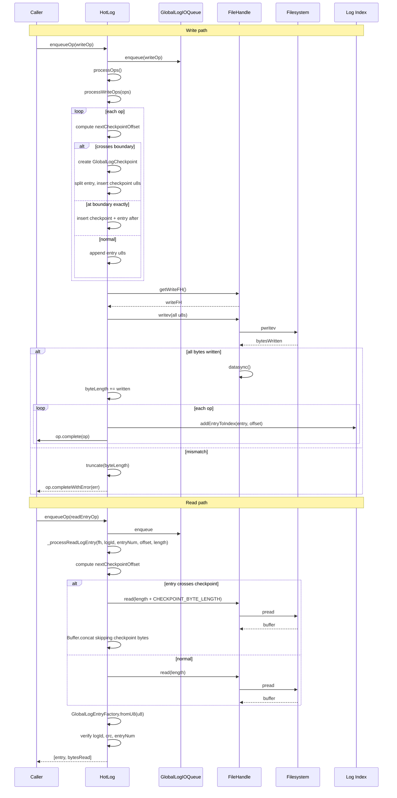

# HotLog Specification

**Module: Persistence**

## Overview

`HotLog` extends `PersistedLog` to manage the global log file (new-hot or old-hot). It implements the concrete read and write logic for `GlobalLogEntry` objects, handling checkpoint-aware read (stitching around checkpoints) and write (inserting checkpoints at interval boundaries). It also provides the `init` override to scan the global log file using `GlobalLogEntryFactory` and `GlobalLogCheckpoint`, and dispatches reconstructed entries to the in-memory log index via `addEntryToIndex`.

## Component Specifications

```typescript
class HotLog extends PersistedLog {
    maxReadFHs: number = 16
    ioQueue: GlobalLogIOQueue
    isNew: boolean

    constructor(server: Server, isNew: boolean): HotLog
    logName(): string

    _processReadLogEntry(fh: FileHandle, logId: LogId, entryNum: number, offset: number, length: number): Promise<[GlobalLogEntry, number]>
    processWriteOps(ops: WriteIOOperation[]): Promise<void>
    init(): Promise<void>
    initGlobalLogEntry(entry: GlobalLogEntry, entryOffset: number): void
    addEntryToIndex(entry: GlobalLogEntry, entryOffset: number): void
}
```

### Properties

| Property | Type | Default | Description |
|---|---|---|---|
| `maxReadFHs` | `number` | `16` | Maximum concurrent read file handles (overrides base class default of 1) |
| `ioQueue` | `GlobalLogIOQueue` | `new GlobalLogIOQueue()` | Per-log partitioned queue for the global log |
| `isNew` | `boolean` | — | Whether this is the "new-hot" or "old-hot" log file |

### File Naming

The log file path is derived from `server.config.dataDir` and `server.config.hotLogFileName`. If `isNew` is true, `.new` is appended; otherwise `.old`.

### Dependencies

| Dependency | Role |
|---|---|
| `PersistedLog` | Base class providing FH pool, blocking, queue processing |
| `GlobalLogIOQueue` | Queue with per-log partitioning for the global log |
| `GlobalLogEntry` / `GlobalLogEntryFactory` | Entry deserialization and validation |
| `GlobalLogCheckpoint` | Checkpoint metadata for straddling entries |
| `GLOBAL_LOG_CHECKPOINT_INTERVAL` / `GLOBAL_LOG_CHECKPOINT_BYTE_LENGTH` | Fixed checkpoint spacing constants |
| `Server` / `LogId` | Server instance for log index dispatch |

## System Architecture

```mermaid
graph TB
    subgraph HotLog
        direction TB
        FH[Read FHs: max 16]
        IQ[GlobalLogIOQueue]
        NW[isNew flag]

        subgraph Read[Read Path]
            R1[_processReadLogEntry]
            R1A[checkpoint-aware stitch]
            R1B[GlobalLogEntryFactory.fromU8]
            R1C[verify: logId, crc, entryNum]
            R1 --> R1A
            R1 --> R1B
            R1 --> R1C
        end

        subgraph Write[Write Path]
            W1[processWriteOps]
            W1A[compute nextCheckpointOffset]
            W1B[insert GlobalLogCheckpoint if crossing boundary]
            W1C[writev all buffers]
            W1D[datasync]
            W1E[dispatch to addEntryToIndex]
            W1 --> W1A
            W1A --> W1B
            W1B --> W1C
            W1C --> W1D
            W1D --> W1E
        end

        subgraph Init[Initialization]
            I1[init override]
            I1A[super.init with GlobalLogEntryFactory + GlobalLogCheckpoint]
            I1B[initGlobalLogEntry → addEntryToIndex]
            I1 --> I1A
            I1A --> I1B
        end
    end

    subgraph External
        S[Server]
        L[Log Index]
        FS[Filesystem]
    end

    Read --> FS
    Write --> FS
    Init --> FS
    HotLog --> S
    addEntryToIndex --> L
```



## Detailed Data Flow



## Visualization

```html
<!DOCTYPE html>
<html>
<head>
<meta charset="utf-8">
<style>
  body { font-family: system-ui, sans-serif; background: #1e1e2e; color: #cdd6f4; margin: 0; display: flex; flex-direction: column; align-items: center; }
  #toolbar { display: flex; gap: 12px; padding: 12px; align-items: center; flex-wrap: wrap; }
  #toolbar button { background: #45475a; border: none; color: #cdd6f4; padding: 6px 14px; border-radius: 6px; cursor: pointer; font-size: 14px; }
  #toolbar button:hover { background: #585b70; }
  #toolbar input[type="range"] { width: 300px; }
  #kf-display { font-size: 14px; min-width: 120px; text-align: center; }
  #anim-container { position: relative; width: 900px; height: 600px; }
  svg { width: 100%; height: 100%; }
  .legend { display: flex; gap: 20px; font-size: 13px; margin-top: 8px; }
  .legend-item { display: flex; align-items: center; gap: 6px; }
  .legend-dot { width: 14px; height: 14px; border-radius: 4px; }
  .tooltip { position: absolute; background: #313244; color: #cdd6f4; padding: 6px 10px; border-radius: 6px; font-size: 12px; pointer-events: none; opacity: 0; transition: opacity .15s; border: 1px solid #585b70; }
  #verify-badge { margin-left: 12px; padding: 4px 10px; border-radius: 6px; font-size: 12px; background: #45475a; }
  #verify-badge.pass { background: #a6e3a1; color: #1e1e2e; }
  #verify-badge.fail { background: #f38ba8; color: #1e1e2e; }
</style>
</head>
<body>
<div id="toolbar">
  <button id="play-pause" data-testid="play-pause">▶ Play</button>
  <input type="range" id="kf-slider" min="0" max="100" value="0">
  <span id="kf-display">0 / <span id="kf-total">100</span></span>
  <button id="reset-btn">↺ Reset</button>
  <span id="verify-badge">● Verify</span>
</div>
<div id="anim-container"><svg id="svg"></svg></div>
<div class="legend">
  <div class="legend-item"><div class="legend-dot" style="background:#89b4fa"></div> Queue</div>
  <div class="legend-item"><div class="legend-dot" style="background:#a6e3a1"></div> Write (insert checkpoint)</div>
  <div class="legend-item"><div class="legend-dot" style="background:#f9e2af"></div> Read (stitch around checkpoint)</div>
  <div class="legend-item"><div class="legend-dot" style="background:#cba6f7"></div> Verify</div>
  <div class="legend-item"><div class="legend-dot" style="background:#f38ba8"></div> Error</div>
</div>
<div class="tooltip" id="tooltip"></div>
<script src="https://d3js.org/d3.v7.min.js"></script>
<script>
(function() {
  const ANIMATION_DURATION_MS = 8000;
  const ANIMATION_KEYFRAMES = 100;

  const states = [
    { frame: 0,  label: "Idle",            phase: "idle",    detail: "HotLog ready" },
    { frame: 6,  label: "Enqueue Write",   phase: "enqueue",  detail: "Entry + GlobalLogCheckpoint calc" },
    { frame: 12, label: "Check Boundary",  phase: "calc",     detail: "nextCheckpointOffset computed" },
    { frame: 18, label: "Insert Checkpoint",phase: "checkpoint", detail: "Split entry, insert checkpoint u8s" },
    { frame: 24, label: "Build u8s Batch", phase: "buffer",   detail: "Collect all entry/checkpoint buffers" },
    { frame: 30, label: "writev + datasync",phase: "write",   detail: "writev(all) + datasync" },
    { frame: 36, label: "Verify Write",    phase: "verify",   detail: "bytesWritten === expected?" },
    { frame: 42, label: "Update byteLength",phase: "update",  detail: "byteLength += written" },
    { frame: 48, label: "Dispatch to Index",phase: "dispatch", detail: "addEntryToIndex(entry, offset)" },
    { frame: 54, label: "Enqueue Read",    phase: "enqueue",  detail: "ReadEntryIOOperation" },
    { frame: 60, label: "Compute Read Offset",phase: "calc",  detail: "nextCheckpointOffset for read" },
    { frame: 66, label: "Read + Stitch",   phase: "read",     detail: "pread extra bytes, skip checkpoint" },
    { frame: 72, label: "Deserialize",     phase: "verify",   detail: "GlobalLogEntryFactory.fromU8" },
    { frame: 78, label: "Verify Entry",    phase: "verify",   detail: "logId, crc, entryNum checks" },
    { frame: 84, label: "Complete Read",   phase: "idle",     detail: "op.complete(entry)" },
    { frame: 90, label: "Truncate Error",  phase: "error",    detail: "bytesWritten mismatch → truncate" },
    { frame: 100,label: "Done",            phase: "idle",     detail: "All ops settled" },
  ];

  const ANIMATION_VERIFICATION = (kf) => {
    const s = states.find(d => d.frame === kf) || states[states.length-1];
    return { frame: kf, phase: s.phase, label: s.label, ok: kf <= 100 };
  };

  let playing = false;
  let timer = null;
  let currentKf = 0;

  const svg = d3.select("#svg");
  const width = 900, height = 600;
  const tooltip = d3.select("#tooltip");

  function drawFrame(kf) {
    currentKf = kf;
    const kfState = states.reduce((prev, d) => d.frame <= kf ? d : prev, states[0]);
    const frac = kf / 100;

    svg.selectAll("*").remove();
    svg.append("rect").attr("width", width).attr("height", height).attr("fill", "#1e1e2e").attr("rx", 12);

    // Phase timeline
    const phases = ["idle","enqueue","calc","checkpoint","buffer","write","verify","update","dispatch","read","error"];
    const phaseColors = { idle: "#585b70", enqueue: "#89b4fa", calc: "#74c7ec", checkpoint: "#f9e2af", buffer: "#a6e3a1", write: "#94e2d5", verify: "#cba6f7", update: "#a6e3a1", dispatch: "#89b4fa", read: "#f9e2af", error: "#f38ba8" };
    const laneY = 50, laneH = 28;
    const timelineW = width - 80;
    const tlX = 40;

    phases.forEach((ph, i) => {
      const x = tlX + (i / phases.length) * timelineW;
      const w = timelineW / phases.length;
      const isActive = kfState.phase === ph;
      svg.append("rect").attr("x", x).attr("y", laneY).attr("width", w).attr("height", laneH)
        .attr("fill", isActive ? phaseColors[ph] : "#313244").attr("stroke", "#585b70").attr("stroke-width", 1).attr("rx", 4);
      svg.append("text").attr("x", x + w/2).attr("y", laneY + laneH/2 + 5)
        .attr("text-anchor", "middle").attr("fill", "#cdd6f4").attr("font-size", 10).text(ph);
    });

    const playX = tlX + frac * timelineW;
    svg.append("line").attr("x1", playX).attr("y1", laneY - 6).attr("x2", playX).attr("y2", laneY + laneH + 6)
      .attr("stroke", "#f5c2e7").attr("stroke-width", 2).attr("stroke-dasharray", "4,2");

    // File layout visualization
    const fy = height - 160, fh = 40, fx = 80, fw = width - 160;
    svg.append("rect").attr("x", fx).attr("y", fy).attr("width", fw).attr("height", fh)
      .attr("fill", "#313244").attr("stroke", "#585b70").attr("stroke-width", 1).attr("rx", 6);
    svg.append("text").attr("x", fx + 10).attr("y", fy - 8).attr("fill", "#a6e3a1").attr("font-size", 11).text("global-log file layout (checkpoint interval)");

    // Simulate file blocks
    const numBlocks = 10;
    const blockW = fw / numBlocks;
    for (let i = 0; i < numBlocks; i++) {
      const bx = fx + i * blockW;
      const isCkpt = i % 3 === 2;
      const fill = isCkpt ? "#cba6f7" : (i % 2 === 0 ? "#89b4fa" : "#a6e3a1");
      svg.append("rect").attr("x", bx + 1).attr("y", fy + 4).attr("width", blockW - 2).attr("height", fh - 8)
        .attr("fill", fill).attr("opacity", 0.6).attr("rx", 3);
      if (isCkpt) {
        svg.append("text").attr("x", bx + blockW/2).attr("y", fy + fh/2 + 4)
          .attr("text-anchor", "middle").attr("fill", "#1e1e2e").attr("font-size", 8).attr("font-weight", "bold").text("CK");
      }
    }

    // Playhead on file
    const playFrac = Math.min(1, frac * 1.2);
    svg.append("line").attr("x1", fx + playFrac * fw).attr("y1", fy + fh + 4)
      .attr("x2", fx + playFrac * fw).attr("y2", fy + fh + 16)
      .attr("stroke", "#f5c2e7").attr("stroke-width", 2);

    // Central state region
    const cx = width / 2, cy = height / 2 - 20;

    // Write path: show entry + checkpoint split
    if (["checkpoint","buffer","write"].includes(kfState.phase)) {
      // Entry bar
      svg.append("rect").attr("x", cx - 120).attr("y", cy - 30).attr("width", 100).attr("height", 24)
        .attr("fill", "#a6e3a1").attr("opacity", 0.4).attr("rx", 4);
      svg.append("text").attr("x", cx - 70).attr("y", cy - 14).attr("text-anchor", "middle").attr("fill", "#a6e3a1").attr("font-size", 10).text("Entry u8s");
      // Checkpoint block
      svg.append("rect").attr("x", cx - 20).attr("y", cy - 60).attr("width", 80).attr("height", 20)
        .attr("fill", "#cba6f7").attr("rx", 4);
      svg.append("text").attr("x", cx + 20).attr("y", cy - 46).attr("text-anchor", "middle").attr("fill", "#cba6f7").attr("font-size", 9).text("Checkpoint");
      // Arrow from entry to split
      svg.append("line").attr("x1", cx - 20).attr("y1", cy - 18).attr("x2", cx).attr("y2", cy - 60)
        .attr("stroke", "#f5c2e7").attr("stroke-width", 1).attr("stroke-dasharray", "3,3");
    }

    // Verify checks
    if (kfState.phase === "verify") {
      svg.append("rect").attr("x", cx - 100).attr("y", cy - 20).attr("width", 200).attr("height", 40)
        .attr("fill", "#313244").attr("stroke", "#cba6f7").attr("stroke-width", 2).attr("rx", 8);
      svg.append("text").attr("x", cx).attr("y", cy + 5).attr("text-anchor", "middle").attr("fill", "#cba6f7").attr("font-size", 12).text("✓ logId | crc | entryNum");
    }

    // Error state
    if (kfState.phase === "error") {
      svg.append("rect").attr("x", cx - 100).attr("y", cy - 20).attr("width", 200).attr("height", 40)
        .attr("fill", "#f38ba8").attr("opacity", 0.3).attr("rx", 8).attr("stroke", "#f38ba8");
      svg.append("text").attr("x", cx).attr("y", cy + 5).attr("text-anchor", "middle").attr("fill", "#f38ba8").attr("font-weight", "bold").attr("font-size", 13).text("✗ bytesWritten mismatch");
    }

    // Info
    svg.append("rect").attr("x", width - 210).attr("y", 10).attr("width", 190).attr("height", 30)
      .attr("fill", "#313244").attr("rx", 6);
    svg.append("text").attr("x", width - 200).attr("y", 29).attr("fill", "#cdd6f4").attr("font-size", 12)
      .text(`kf: ${kf}  ${kfState.phase}  isNew=${kf > 40 && kf < 70 ? "true" : "false"}`);

    const v = ANIMATION_VERIFICATION(kf);
    d3.select("#verify-badge").attr("class", v.ok ? "pass" : "fail").text(v.ok ? "● Pass" : "● Fail");
    d3.select("#kf-display").html(`${kf} / <span id="kf-total">${ANIMATION_KEYFRAMES}</span>`);
    d3.select("#kf-slider").property("value", kf);
  }

  function jumpToKeyframe(kf) {
    drawFrame(Math.max(0, Math.min(ANIMATION_KEYFRAMES, Math.round(kf))));
  }
  function resetAnimation() {
    if (timer) { clearInterval(timer); timer = null; }
    playing = false;
    d3.select("#play-pause").text("▶ Play");
    jumpToKeyframe(0);
  }
  function getAnimationState() {
    return { playing, currentKf, total: ANIMATION_KEYFRAMES };
  }

  d3.select("#play-pause").on("click", function() {
    if (playing) {
      clearInterval(timer); timer = null;
      playing = false;
      d3.select(this).text("▶ Play");
    } else {
      playing = true;
      d3.select(this).text("⏸ Pause");
      timer = setInterval(() => {
        let next = currentKf + 1;
        if (next > ANIMATION_KEYFRAMES) {
          clearInterval(timer); timer = null;
          playing = false;
          d3.select("#play-pause").text("▶ Play");
          return;
        }
        jumpToKeyframe(next);
      }, ANIMATION_DURATION_MS / ANIMATION_KEYFRAMES);
    }
  });
  d3.select("#kf-slider").on("input", function() {
    if (playing) { clearInterval(timer); timer = null; playing = false; d3.select("#play-pause").text("▶ Play"); }
    jumpToKeyframe(+this.value);
  });
  d3.select("#reset-btn").on("click", resetAnimation);
  d3.select("#anim-container").on("mousemove", function(e) {
    const rect = this.getBoundingClientRect();
    const x = e.clientX - rect.left, y = e.clientY - rect.top;
    const kf = Math.round((x / rect.width) * 100);
    if (kf >= 0 && kf <= 100) {
      const s = states.reduce((prev, d) => d.frame <= kf ? d : prev, states[0]);
      tooltip.style("opacity", 1).style("left", (x + 12) + "px").style("top", (y - 30) + "px")
        .html(`<b>${s.label}</b><br/>${s.detail}`);
    } else { tooltip.style("opacity", 0); }
  }).on("mouseleave", () => tooltip.style("opacity", 0));

  jumpToKeyframe(0);
})();
</script>
</body>
</html>
```

### Visualization Keyframe Table

| kf | Phase | Description |
|----|-------|-------------|
| 0 | idle | HotLog ready for operations |
| 6 | enqueue | Enqueue a write operation |
| 12 | calc | Compute next checkpoint offset |
| 18 | checkpoint | Split entry, insert GlobalLogCheckpoint |
| 24 | buffer | Collect all Uint8Arrays for writev |
| 30 | write | writev + datasync executed |
| 36 | verify | Check bytesWritten == expected |
| 42 | update | byteLength += written |
| 48 | dispatch | addEntryToIndex(entry, offset) |
| 54 | enqueue | Read entry enqueued |
| 60 | calc | Read offset calculation (checkpoint-aware) |
| 66 | read | pread with extra bytes, stitch around checkpoint |
| 72 | verify | GlobalLogEntryFactory.fromU8 |
| 78 | verify | logId, crc, entryNum validation |
| 84 | idle | Read complete |
| 90 | error | bytesWritten mismatch → truncate |
| 100 | idle | All operations settled |

## Testing Requirements

| Test Case | Input | Expected Outcome |
|---|---|---|
| `_processReadLogEntry reads without checkpoint crossing` | offset + length < nextCheckpointOffset | Single `pread` call, `GlobalLogEntryFactory.fromU8` deserializes |
| `_processReadLogEntry reads across checkpoint` | offset < nco < offset + length | `pread` with extra `CHECKPOINT_BYTE_LENGTH`, stitch via `Buffer.concat` |
| `_processReadLogEntry rejects entry at checkpoint boundary` | offset === nextCheckpointOffset | Throws `Error("entry at checkpoint offset=…")` |
| `_processReadLogEntry rejects bytesRead mismatch` | Less data than length | Throws `Error("bytesRead error log=…")` |
| `_processReadLogEntry rejects logId mismatch` | Deserialized entry.logId != expected | Throws `Error("logId mismatch log=…")` |
| `_processReadLogEntry rejects CRC failure` | `entry.verify()` returns false | Throws `Error("crc verify error log=…")` |
| `_processReadLogEntry rejects entryNum mismatch` | `entry.entryNum != entryNum` | Throws `Error("entryNum mismatch log=…")` |
| `processWriteOps inserts checkpoint at boundary` | Entry straddles checkpoint interval | Entry split, `GlobalLogCheckpoint` inserted |
| `processWriteOps inserts checkpoint at exact offset` | Entry starts at checkpoint boundary | Checkpoint inserted before entry |
| `processWriteOps appends entry normally` | No boundary crossing | Entry u8s appended without checkpoint |
| `processWriteOps writev success` | All bytes written | `datasync` called, `byteLength` updated |
| `processWriteOps writev partial` | `bytesWritten < writeBytes` | `truncate()` called, error thrown |
| `processWriteOps truncate failure` | Truncate itself throws | `byteLength += written`, error rethrown |
| `processWriteOps ops vs offsets count mismatch` | Different lengths | Error thrown after write |
| `processWriteOps dispatches entries` | For GlobalLogEntry | `addEntryToIndex(entry, offset)` called |
| `processWriteOps rejects all on error` | Any error in write block | All ops get `completeWithError(err)`, error rethrown |
| `init delegates to PersistedLog` | GlobalLogEntryFactory, GlobalLogCheckpoint | `super.init()` with `GLOBAL_LOG_CHECKPOINT_INTERVAL` |
| `initGlobalLogEntry verifies and indexes` | Entry with verify pass | `addEntryToIndex(entry, entryOffset)` |
| `initGlobalLogEntry logs CRC error` | Entry with verify fail | `console.error` but continues |
| `addEntryToIndex dispatches to new/old log` | isNew = true/false | `log.addNewHotLogEntry` or `log.addOldHotLogEntry` |
| `logName returns correct string` | isNew = true | `"newHot"` |
| `logName returns correct string` | isNew = false | `"oldHot"` |
| File path naming | isNew = true | `{hotLogFileName}.new` |
| File path naming | isNew = false | `{hotLogFileName}.old` |
| `maxReadFHs` properly set | — | Defaults to 16 (overrides base 1) |

---

## 7. Source-Test Cross-References

### Test Coverage

| Test Spec | Path |
|---|---|
| No test spec | |
