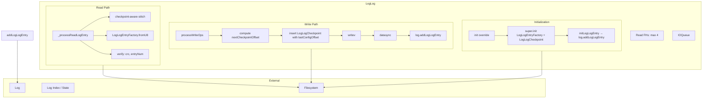
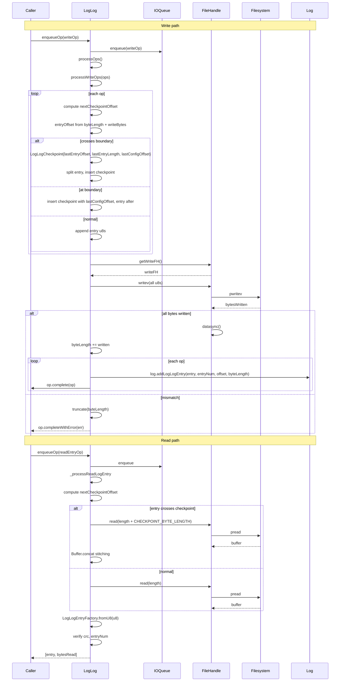

# LogLog Specification

**Module: Persistence**

## Overview

`LogLog` extends `PersistedLog` to manage the per-log persistence file. It implements concrete read and write logic for `LogLogEntry` objects, with checkpoint-aware handling using `LogLogCheckpoint`. Each `LogLog` instance is tied to a specific `Log` and writes to the file path returned by `log.filename()`. During initialization it scans the file via `LogLogEntryFactory` and `LogLogCheckpoint`, dispatching reconstructed entries back to the owning `Log`.

## Component Specifications

```typescript
type OpInfo = {
    offset: number
    op: WriteIOOperation
    entry: LogLogEntry
}

class LogLog extends PersistedLog {
    log: Log
    maxReadFHs: number = 4

    constructor(server: Server, log: Log): LogLog
    logName(): string

    _processReadLogEntry(fh: FileHandle, logId: LogId, entryNum: number, offset: number, length: number): Promise<[LogLogEntry, number]>
    processWriteOps(ops: WriteIOOperation[]): Promise<void>
    init(): Promise<void>
    initLogLogEntry(entry: LogLogEntry, entryOffset: number): void
}
```

### Properties

| Property | Type | Default | Description |
|---|---|---|---|
| `log` | `Log` | — | Owning log instance |
| `maxReadFHs` | `number` | `4` | Maximum concurrent read file handles |
| `logFile` | `string` | `log.filename()` | Path to the per-log persistence file |

### Dependencies

| Dependency | Role |
|---|---|
| `PersistedLog` | Base class providing FH pool, blocking, queue processing |
| `LogLogEntry` / `LogLogEntryFactory` | Entry deserialization and validation |
| `LogLogCheckpoint` | Checkpoint metadata with `lastConfigOffset` |
| `LOG_LOG_CHECKPOINT_INTERVAL` / `LOG_LOG_CHECKPOINT_BYTE_LENGTH` | Fixed checkpoint spacing constants |
| `Log` / `LogId` | Owning log for entry dispatch |
| `Server` | Server instance |

## System Architecture



## Detailed Data Flow



## Visualization

```html
<!DOCTYPE html>
<html>
<head>
<meta charset="utf-8">
<style>
  body { font-family: system-ui, sans-serif; background: #1e1e2e; color: #cdd6f4; margin: 0; display: flex; flex-direction: column; align-items: center; }
  #toolbar { display: flex; gap: 12px; padding: 12px; align-items: center; flex-wrap: wrap; }
  #toolbar button { background: #45475a; border: none; color: #cdd6f4; padding: 6px 14px; border-radius: 6px; cursor: pointer; font-size: 14px; }
  #toolbar button:hover { background: #585b70; }
  #toolbar input[type="range"] { width: 300px; }
  #kf-display { font-size: 14px; min-width: 120px; text-align: center; }
  #anim-container { position: relative; width: 900px; height: 580px; }
  svg { width: 100%; height: 100%; }
  .legend { display: flex; gap: 20px; font-size: 13px; margin-top: 8px; }
  .legend-item { display: flex; align-items: center; gap: 6px; }
  .legend-dot { width: 14px; height: 14px; border-radius: 4px; }
  .tooltip { position: absolute; background: #313244; color: #cdd6f4; padding: 6px 10px; border-radius: 6px; font-size: 12px; pointer-events: none; opacity: 0; transition: opacity .15s; border: 1px solid #585b70; }
  #verify-badge { margin-left: 12px; padding: 4px 10px; border-radius: 6px; font-size: 12px; background: #45475a; }
  #verify-badge.pass { background: #a6e3a1; color: #1e1e2e; }
  #verify-badge.fail { background: #f38ba8; color: #1e1e2e; }
</style>
</head>
<body>
<div id="toolbar">
  <button id="play-pause" data-testid="play-pause">▶ Play</button>
  <input type="range" id="kf-slider" min="0" max="100" value="0">
  <span id="kf-display">0 / <span id="kf-total">100</span></span>
  <button id="reset-btn">↺ Reset</button>
  <span id="verify-badge">● Verify</span>
</div>
<div id="anim-container"><svg id="svg"></svg></div>
<div class="legend">
  <div class="legend-item"><div class="legend-dot" style="background:#89b4fa"></div> Queue</div>
  <div class="legend-item"><div class="legend-dot" style="background:#a6e3a1"></div> Write</div>
  <div class="legend-item"><div class="legend-dot" style="background:#f9e2af"></div> Read</div>
  <div class="legend-item"><div class="legend-dot" style="background:#cba6f7"></div> Checkpoint</div>
  <div class="legend-item"><div class="legend-dot" style="background:#f38ba8"></div> Error</div>
</div>
<div class="tooltip" id="tooltip"></div>
<script src="https://d3js.org/d3.v7.min.js"></script>
<script>
(function() {
  const ANIMATION_DURATION_MS = 8000;
  const ANIMATION_KEYFRAMES = 100;

  const states = [
    { frame: 0,  label: "Idle",           phase: "idle",      detail: "LogLog ready for log " },
    { frame: 7,  label: "Enqueue Write",  phase: "enqueue",   detail: "WriteIOOperation for LogLogEntry" },
    { frame: 14, label: "Checkpoint Calc",phase: "calc",      detail: "nextCheckpointOffset + lastConfigOffset" },
    { frame: 21, label: "Insert Checkpoint",phase: "checkpoint", detail: "LogLogCheckpoint with lastConfigOffset" },
    { frame: 28, label: "Buffer Assembly",phase: "buffer",    detail: "Collect u8s for writev" },
    { frame: 35, label: "writev + sync",  phase: "write",     detail: "writev(all) + datasync" },
    { frame: 42, label: "Verify Write",   phase: "verify",    detail: "bytesWritten === expected?" },
    { frame: 49, label: "Update byteLength",phase: "update",  detail: "byteLength += written" },
    { frame: 56, label: "Dispatch Entry", phase: "dispatch",  detail: "log.addLogLogEntry(entry, entryNum, offset)" },
    { frame: 63, label: "Enqueue Read",   phase: "enqueue",   detail: "ReadEntryIOOperation" },
    { frame: 70, label: "Read + Stitch",  phase: "read",      detail: "pread, concat around checkpoint" },
    { frame: 77, label: "Deserialize",    phase: "verify",    detail: "LogLogEntryFactory.fromU8" },
    { frame: 84, label: "Verify Entry",   phase: "verify",    detail: "crc + entryNum checks" },
    { frame: 90, label: "Write Error",    phase: "error",     detail: "bytesWritten mismatch → truncate" },
    { frame: 100,label: "Done",           phase: "idle",      detail: "All ops settled" },
  ];

  const ANIMATION_VERIFICATION = (kf) => {
    const s = states.find(d => d.frame === kf) || states[states.length-1];
    return { frame: kf, phase: s.phase, label: s.label, ok: kf <= 100 };
  };

  let playing = false, timer = null, currentKf = 0;
  const svg = d3.select("#svg");
  const width = 900, height = 580;
  const tooltip = d3.select("#tooltip");

  function drawFrame(kf) {
    currentKf = kf;
    const kfState = states.reduce((prev, d) => d.frame <= kf ? d : prev, states[0]);
    const frac = kf / 100;
    svg.selectAll("*").remove();
    svg.append("rect").attr("width", width).attr("height", height).attr("fill", "#1e1e2e").attr("rx", 12);

    const phases = ["idle","enqueue","calc","checkpoint","buffer","write","verify","update","dispatch","read","error"];
    const phaseColors = { idle: "#585b70", enqueue: "#89b4fa", calc: "#74c7ec", checkpoint: "#cba6f7", buffer: "#a6e3a1", write: "#94e2d5", verify: "#f9e2af", update: "#a6e3a1", dispatch: "#89b4fa", read: "#f9e2af", error: "#f38ba8" };
    const laneY = 50, laneH = 28;
    const timelineW = width - 80, tlX = 40;

    phases.forEach((ph, i) => {
      const x = tlX + (i / phases.length) * timelineW;
      const w = timelineW / phases.length;
      const isActive = kfState.phase === ph;
      svg.append("rect").attr("x", x).attr("y", laneY).attr("width", w).attr("height", laneH)
        .attr("fill", isActive ? phaseColors[ph] : "#313244").attr("stroke", "#585b70").attr("rx", 4).attr("stroke-width", 1);
      svg.append("text").attr("x", x + w/2).attr("y", laneY + laneH/2 + 5)
        .attr("text-anchor", "middle").attr("fill", "#cdd6f4").attr("font-size", 10).text(ph);
    });

    const playX = tlX + frac * timelineW;
    svg.append("line").attr("x1", playX).attr("y1", laneY - 6).attr("x2", playX).attr("y2", laneY + laneH + 6)
      .attr("stroke", "#f5c2e7").attr("stroke-width", 2).attr("stroke-dasharray", "4,2");

    // File view
    const fy = height - 140, fh = 36, fx = 80, fw = width - 160;
    svg.append("rect").attr("x", fx).attr("y", fy).attr("width", fw).attr("height", fh)
      .attr("fill", "#313244").attr("stroke", "#585b70").attr("rx", 6);
    svg.append("text").attr("x", fx + 10).attr("y", fy - 8).attr("fill", "#a6e3a1").attr("font-size", 11).text("log-log file (per-log)");

    for (let i = 0; i < 10; i++) {
      const bx = fx + (i / 10) * fw, bw = fw / 10;
      const isCkpt = i === 2 || i === 6;
      const fill = isCkpt ? "#cba6f7" : (i % 2 === 0 ? "#89b4fa" : "#a6e3a1");
      svg.append("rect").attr("x", bx + 1).attr("y", fy + 4).attr("width", bw - 2).attr("height", fh - 8)
        .attr("fill", fill).attr("opacity", 0.6).attr("rx", 3);
      if (isCkpt) svg.append("text").attr("x", bx + bw/2).attr("y", fy + fh/2 + 4)
        .attr("text-anchor", "middle").attr("fill", "#1e1e2e").attr("font-size", 7).attr("font-weight", "bold").text("CK");
    }

    // Central state
    const cx = width / 2, cy = height / 2 - 30;

    if (["checkpoint","buffer","write"].includes(kfState.phase)) {
      svg.append("rect").attr("x", cx - 100).attr("y", cy - 20).attr("width", 200).attr("height", 40)
        .attr("fill", "#313244").attr("stroke", "#cba6f7").attr("stroke-width", 2).attr("rx", 8);
      svg.append("text").attr("x", cx).attr("y", cy + 5).attr("text-anchor", "middle").attr("fill", "#cba6f7").attr("font-size", 11)
        .text("LogLogCheckpoint{lastConfigOffset}");
    }

    if (kfState.phase === "dispatch") {
      svg.append("rect").attr("x", cx - 100).attr("y", cy - 20).attr("width", 200).attr("height", 40)
        .attr("fill", "#313244").attr("stroke", "#89b4fa").attr("stroke-width", 2).attr("rx", 8);
      svg.append("text").attr("x", cx).attr("y", cy + 5).attr("text-anchor", "middle").attr("fill", "#89b4fa").attr("font-size", 11)
        .text("→ log.addLogLogEntry(…)");
    }

    if (kfState.phase === "error") {
      svg.append("rect").attr("x", cx - 100).attr("y", cy - 20).attr("width", 200).attr("height", 40)
        .attr("fill", "#f38ba8").attr("opacity", 0.3).attr("rx", 8).attr("stroke", "#f38ba8");
      svg.append("text").attr("x", cx).attr("y", cy + 5).attr("text-anchor", "middle").attr("fill", "#f38ba8").attr("font-weight", "bold").attr("font-size", 13).text("✗ Write Error");
    }

    svg.append("rect").attr("x", width - 210).attr("y", 10).attr("width", 190).attr("height", 30).attr("fill", "#313244").attr("rx", 6);
    svg.append("text").attr("x", width - 200).attr("y", 29).attr("fill", "#cdd6f4").attr("font-size", 12).text(`kf: ${kf}  ${kfState.phase}`);

    const v = ANIMATION_VERIFICATION(kf);
    d3.select("#verify-badge").attr("class", v.ok ? "pass" : "fail").text(v.ok ? "● Pass" : "● Fail");
    d3.select("#kf-display").html(`${kf} / <span id="kf-total">${ANIMATION_KEYFRAMES}</span>`);
    d3.select("#kf-slider").property("value", kf);
  }

  function jumpToKeyframe(kf) { drawFrame(Math.max(0, Math.min(ANIMATION_KEYFRAMES, Math.round(kf)))); }
  function resetAnimation() { if (timer) { clearInterval(timer); timer = null; } playing = false; d3.select("#play-pause").text("▶ Play"); jumpToKeyframe(0); }
  function getAnimationState() { return { playing, currentKf, total: ANIMATION_KEYFRAMES }; }

  d3.select("#play-pause").on("click", function() {
    if (playing) { clearInterval(timer); timer = null; playing = false; d3.select(this).text("▶ Play"); }
    else {
      playing = true; d3.select(this).text("⏸ Pause");
      timer = setInterval(() => {
        let next = currentKf + 1;
        if (next > ANIMATION_KEYFRAMES) { clearInterval(timer); timer = null; playing = false; d3.select("#play-pause").text("▶ Play"); return; }
        jumpToKeyframe(next);
      }, ANIMATION_DURATION_MS / ANIMATION_KEYFRAMES);
    }
  });
  d3.select("#kf-slider").on("input", function() {
    if (playing) { clearInterval(timer); timer = null; playing = false; d3.select("#play-pause").text("▶ Play"); }
    jumpToKeyframe(+this.value);
  });
  d3.select("#reset-btn").on("click", resetAnimation);
  d3.select("#anim-container").on("mousemove", function(e) {
    const rect = this.getBoundingClientRect();
    const x = e.clientX - rect.left, y = e.clientY - rect.top;
    const kf = Math.round((x / rect.width) * 100);
    if (kf >= 0 && kf <= 100) {
      const s = states.reduce((prev, d) => d.frame <= kf ? d : prev, states[0]);
      tooltip.style("opacity", 1).style("left", (x + 12) + "px").style("top", (y - 30) + "px").html(`<b>${s.label}</b><br/>${s.detail}`);
    } else tooltip.style("opacity", 0);
  }).on("mouseleave", () => tooltip.style("opacity", 0));
  jumpToKeyframe(0);
})();
</script>
</body>
</html>
```

### Visualization Keyframe Table

| kf | Phase | Description |
|----|-------|-------------|
| 0 | idle | LogLog ready |
| 7 | enqueue | Write enqueued |
| 14 | calc | Checkpoint offset + lastConfigOffset computation |
| 21 | checkpoint | LogLogCheckpoint inserted at boundary |
| 28 | buffer | Uint8Arrays assembled for writev |
| 35 | write | writev + datasync executed |
| 42 | verify | bytesWritten verification |
| 49 | update | byteLength += written |
| 56 | dispatch | log.addLogLogEntry() called |
| 63 | enqueue | Read enqueued |
| 70 | read | pread + stitch around checkpoint |
| 77 | verify | LogLogEntryFactory.fromU8 deserialization |
| 84 | verify | crc + entryNum validation |
| 90 | error | write failure → truncate |
| 100 | idle | Complete |

## Testing Requirements

| Test Case | Input | Expected Outcome |
|---|---|---|
| `_processReadLogEntry reads without checkpoint crossing` | Normal offset | Single `pread`, `LogLogEntryFactory.fromU8` |
| `_processReadLogEntry reads across checkpoint` | Straddling entry | Extra `CHECKPOINT_BYTE_LENGTH` read, `Buffer.concat` stitch |
| `_processReadLogEntry rejects entry at checkpoint boundary` | offset === nco | Throws `Error` |
| `_processReadLogEntry rejects bytesRead mismatch` | Short read | Throws `Error("bytesRead error log=…")` |
| `_processReadLogEntry rejects CRC failure` | verify returns false | Throws `Error("crc verify error log=…")` |
| `_processReadLogEntry rejects entryNum mismatch` | Different entryNum | Throws `Error("entryNum mismatch log=…")` |
| `processWriteOps inserts checkpoint crossing` | Entry straddles interval | LogLogCheckpoint split + inserted with lastConfigOffset |
| `processWriteOps inserts checkpoint at exact offset` | Entry at boundary | Checkpoint before entry |
| `processWriteOps appends normal entry` | No boundary crossing | Entry u8s appended directly |
| `processWriteOps writev success` | Full write | datasync, byteLength update |
| `processWriteOps writev partial` | Short write | truncate + error |
| `processWriteOps dispatch to log` | After write | `log.addLogLogEntry(entry, entryNum, offset, byteLength)` |
| `processWriteOps reject all on error` | Any exception | All ops `completeWithError`, error rethrown |
| `init delegates to PersistedLog` | — | `super.init(LogLogEntryFactory, LogLogCheckpoint, LOG_LOG_CHECKPOINT_INTERVAL)` |
| `initLogLogEntry verifies and dispatches` | Entry passes verify | `log.addLogLogEntry` called |
| `initLogLogEntry logs CRC error` | Entry fails verify | `console.error` but continues |
| `logName returns log identifier` | — | `"log {logId.base64()}"` |
| `maxReadFHs defaults to 4` | — | Property set to 4 |
| File path from log.filename | — | `this.logFile === log.filename()` |

---

## 7. Source-Test Cross-References

### Test Coverage

| Test Spec | Path |
|---|---|
| No test spec | |
