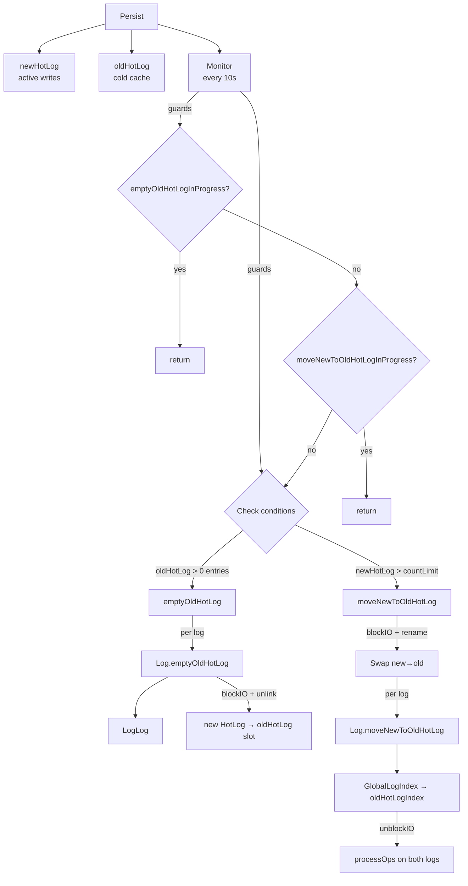
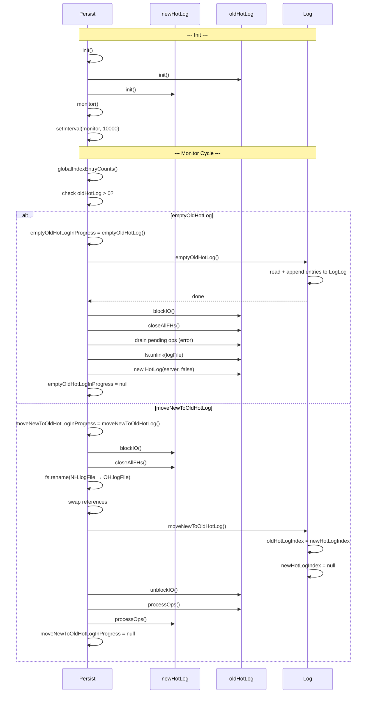

# Persist Spec

**Module: Persistence**

## Overview

Manages the dual HotLog storage lifecycle. Holds **oldHotLog** (cold cache) and **newHotLog** (active writes). Runs a periodic monitor (every 10s) that triggers one of two compaction operations exclusively (never both at once): if oldHotLog has entries it calls `emptyOldHotLog` (flush to LogLog), otherwise if newHotLog exceeds `globalIndexCountLimit` it calls `moveNewToOldHotLog` (rename file, swap references). Both operations are guarded by `InProgress` promises.

## Component Specifications

```typescript
class Persist {
    server: Server
    oldHotLog: HotLog
    newHotLog: HotLog
    emptyOldHotLogInProgress: Promise<void> | null
    moveNewToOldHotLogInProgress: Promise<void> | null
}
```

## System Architecture



## Detailed Data Flow



## Visualization

```html
<div id="persist-viz"></div>
<script src="https://d3js.org/d3.v7.min.js"></script>
<script>
(function() {
    const ANIMATION_DURATION_MS = 5000;
    const ANIMATION_KEYFRAMES = [
        { label: "Initial State", newHot: 0, oldHot: 0, phase: "idle", logFile: "new.log / old.log" },
        { label: "Appends (newHot grows)", newHot: 150, oldHot: 0, phase: "idle", logFile: "new.log ↑ / old.log" },
        { label: "Move: blockIO + rename", newHot: 150, oldHot: 0, phase: "moving", logFile: "rename new→old" },
        { label: "Move: swap + unblock", newHot: 0, oldHot: 150, phase: "idle", logFile: "fresh new.log / old.log" },
        { label: "Appends (newHot fills, oldHot has data)", newHot: 80, oldHot: 150, phase: "idle", logFile: "new.log / old.log" },
        { label: "Empty: flush old to LogLog", newHot: 80, oldHot: 0, phase: "emptying", logFile: "new.log / old.log (unlinked)" },
    ];
    let currentFrame = 0;
    let animationId = null;
    let isPlaying = false;

    const container = d3.select("#persist-viz");
    container.html("");

    const svg = container.append("svg").attr("width", 650).attr("height", 250);

    // Two HotLog boxes
    const logs = [
        { label: "NewHotLog", x: 40, color: "#ff9800" },
        { label: "OldHotLog", x: 330, color: "#9c27b0" },
    ];

    logs.forEach(l => {
        const g = svg.append("g").attr("transform", `translate(${l.x}, 50)`);
        g.append("rect").attr("class", `box-${l.label.toLowerCase()}`).attr("width", 240).attr("height", 100)
            .attr("rx", 8).attr("fill", "#f5f5f5").attr("stroke", l.color).attr("stroke-width", 2);
        g.append("text").attr("x", 120).attr("y", 25).attr("text-anchor", "middle")
            .attr("font-size", "13").attr("font-weight", "bold").attr("fill", l.color).text(l.label);
        g.append("text").attr("class", `count-${l.label.toLowerCase()}`).attr("x", 120).attr("y", 60)
            .attr("text-anchor", "middle").attr("font-size", "26").attr("font-weight", "bold").text("0");
        g.append("text").attr("class", `sub-${l.label.toLowerCase()}`).attr("x", 120).attr("y", 82)
            .attr("text-anchor", "middle").attr("font-size", "11").attr("fill", "#999").text("entries");
    });

    // Arrow
    svg.append("text").attr("x", 285).attr("y", 100).attr("font-size", "22").attr("fill", "#999").text("→");

    // Phase indicator
    svg.append("text").attr("class", "phase-text").attr("x", 325).attr("y", 215)
        .attr("text-anchor", "middle").attr("font-size", "14").attr("font-weight", "bold").attr("fill", "#333");

    // Controls
    const controls = container.append("div").style("margin-top","10px");
    controls.append("button").attr("data-testid","play-pause").text("▶ Play").on("click", togglePlay);
    controls.append("span").style("margin-left","10px").text("Frame: ");
    controls.append("span").attr("id","kf-total").text("0 / 5");
    controls.append("input").attr("type","range").attr("min",0).attr("max",ANIMATION_KEYFRAMES.length-1).attr("value",0)
        .style("width","300px").style("margin-left","10px").on("input", function() { jumpToKeyframe(+this.value); });

    function update(kf) {
        svg.select("text.count-newhotlog").text(kf.newHot);
        svg.select("text.count-oldhotlog").text(kf.oldHot);
        svg.select("text.phase-text").text(`Phase: ${kf.phase} | ${kf.logFile}`);

        // Box styling based on phase
        const moving = kf.phase === "moving";
        const emptying = kf.phase === "emptying";
        svg.select("rect.box-newhotlog")
            .attr("stroke", moving ? "#f44336" : emptying ? "#ff9800" : "#ff9800")
            .attr("fill", moving ? "#ffebee" : emptying ? "#fff3e0" : "#fff8e1");
        svg.select("rect.box-oldhotlog")
            .attr("stroke", emptying ? "#f44336" : moving ? "#4caf50" : "#9c27b0")
            .attr("fill", emptying ? "#ffebee" : moving ? "#e8f5e9" : "#f3e5f5");
        svg.select("text.count-oldhotlog").text(kf.oldHot);
        svg.select("text.count-newhotlog").text(kf.newHot);
        d3.select("#kf-total").text(`${kf.label} (${currentFrame} / ${ANIMATION_KEYFRAMES.length-1})`);
    }

    function togglePlay() {
        isPlaying = !isPlaying;
        d3.select("[data-testid=play-pause]").text(isPlaying ? "⏸ Pause" : "▶ Play");
        if (isPlaying) {
            animationId = setInterval(() => {
                currentFrame = (currentFrame + 1) % ANIMATION_KEYFRAMES.length;
                update(ANIMATION_KEYFRAMES[currentFrame]);
                d3.select("input[type=range]").property("value", currentFrame);
            }, ANIMATION_DURATION_MS / ANIMATION_KEYFRAMES.length);
        } else if (animationId) {
            clearInterval(animationId);
            animationId = null;
        }
    }

    function jumpToKeyframe(frame) {
        if (isPlaying) togglePlay();
        currentFrame = frame;
        update(ANIMATION_KEYFRAMES[frame]);
        d3.select("input[type=range]").property("value", frame);
    }

    function resetAnimation() {
        if (isPlaying) togglePlay();
        jumpToKeyframe(0);
    }

    function getAnimationState() {
        return { currentFrame, totalFrames: ANIMATION_KEYFRAMES.length, isPlaying, keyframe: ANIMATION_KEYFRAMES[currentFrame] };
    }

    update(ANIMATION_KEYFRAMES[0]);
    setTimeout(() => console.log("ANIMATION_VERIFICATION: Persist viz loaded, 6 keyframes, ready"), 100);
})();
</script>
```

## Testing Requirements

| # | Test Case | Input | Expected |
|---|-----------|-------|----------|
| 1 | Init — both HotLogs initialized | `init()` | Both `oldHotLog.init()` and `newHotLog.init()` called |
| 2 | Monitor — skips when emptyOldHotLogInProgress | InProgress non-null | Returns immediately |
| 3 | Monitor — skips when moveInProgress | InProgress non-null | Returns immediately |
| 4 | Monitor — triggers emptyOldHotLog | oldHotLog entry count > 0 | `emptyOldHotLogInProgress` set, `emptyOldHotLog()` called |
| 5 | Monitor — triggers moveNewToOldHotLog | oldHotLog = 0, newHotLog > limit | `moveNewToOldHotLogInProgress` set, `moveNewToOldHotLog()` called |
| 6 | emptyOldHotLog — file check fails | Old log file missing | Throws `Error("old hot log should exist")` |
| 7 | emptyOldHotLog — full flow | Valid oldHotLog with entries | Each log's `emptyOldHotLog()` called, blockIO, closeAllFHs, unlink, new HotLog created |
| 8 | emptyOldHotLog — drains pending ops | Pending ops remain during flush | Pending ops completed with error |
| 9 | moveNewToOldHotLog — oldHotLog exists | Old hot log file present | Throws `Error("old hot log should not exist")` |
| 10 | moveNewToOldHotLog — full flow | Old hot log absent, newHotLog has data | blockIO, rename, swap references, per-log `moveNewToOldHotLog()`, unblockIO, processOps |
| 11 | globalIndexEntryCounts sums across logs | Two logs with known counts | `newHotLog` sum and `oldHotLog` sum |

---

## 7. Source-Test Cross-References

### Test Coverage

| Test Spec | Path |
|---|---|
| No test spec | |
