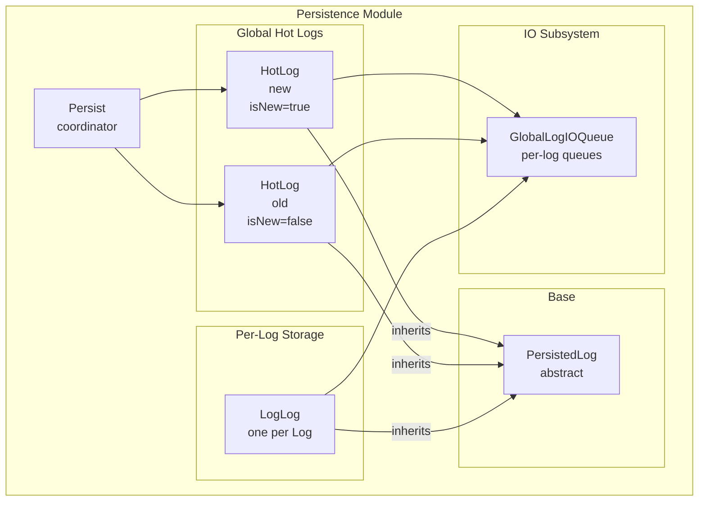
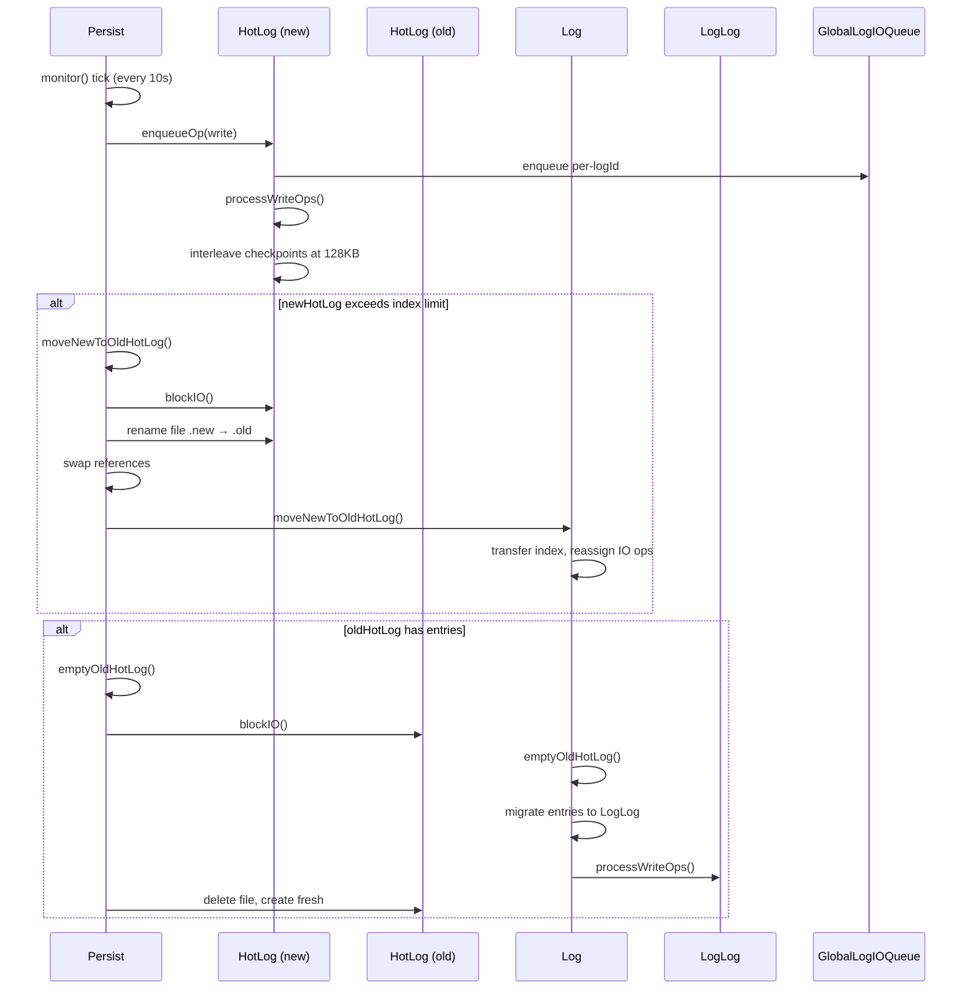

# Persistence Module — PersistModule.spec.md

## 1. Overview

The **Persistence Module** manages all on-disk storage. `Persist` is the top-level coordinator owning two `HotLog` instances (new + old) and orchestrating the hot-log rotation cycle. `PersistedLog` is the base class for file-backed append-only logs, with `HotLog` (global hot log) and `LogLog` (per-log persistent file) as concrete implementations.

**Dependencies:** IO Module (IOQueue, GlobalLogIOQueue, IO operations), Entry Module (entry types, factories, checkpoints), Log Module (Log, LogIndex types)
**Lifecycle stages:** Init (open file, rebuild index) → Accept writes/reads → Block IO → Rotate (move-new-to-old-hot, empty-old-hot-log) → Close

## 2. Component Specifications

| Component | Role | Access Path |
|---|---|---|
| `Persist` | Top-level coordinator — owns HotLog instances, drives rotation cycle | `../persist.ts` |
| `PersistedLog` | Abstract base — file handle pool, IO queue, read/write dispatch | `./persisted-log.ts` |
| `HotLog` | Global hot log (new + old) — `GlobalLogEntry` reads/writes with checkpoint interleaving | `./hot-log.ts` |
| `LogLog` | Per-log persistent file — `LogLogEntry` reads/writes with checkpoint interleaving | `./log-log.ts` |

## 3. System Architecture



## 4. Detailed Data Flow



## 5. Visualization

```html
<!DOCTYPE html>
<html>
<head>
<meta charset="utf-8">
<style>
  body { font-family: monospace; background: #1e1e2e; color: #cdd6f4; margin: 0; }
  #vis { width: 960px; height: 540px; position: relative; }
  .controls { display: flex; gap: 8px; padding: 8px; background: #181825; align-items: center; }
  .controls button { background: #45475a; color: #cdd6f4; border: none; padding: 4px 12px; cursor: pointer; }
  #kf-current, #kf-total { color: #a6adc8; font-size: 12px; min-width: 20px; text-align: center; }
  #frame-label { color: #89b4fa; font-size: 14px; margin-left: auto; }
  .node { position: absolute; border: 2px solid #89b4fa; border-radius: 6px; padding: 8px 12px;
           background: #313244; font-size: 11px; text-align: center; transition: all 0.3s; }
  .node.active { border-color: #a6e3a1; background: #45475a; box-shadow: 0 0 12px #a6e3a180; }
  .edge { position: absolute; height: 2px; background: #585b70; transform-origin: 0 0; }
  .edge.active { background: #a6e3a1; }
  .badge { font-size: 9px; color: #6c7086; margin-top: 2px; }
</style>
</head>
<body>
<div class="controls">
  <button id="play-pause" data-testid="play-pause">⏸</button>
  <span id="kf-current">0</span><span>/</span><span id="kf-total">5</span>
  <input type="range" id="seek" min="0" max="5" value="0" style="flex:1">
  <span id="frame-label">Normal write to new hot log</span>
</div>
<div id="vis"></div>
<script>
(function(){
  const ANIMATION_DURATION_MS = 10000;
  const ANIMATION_KEYFRAMES = [
    { label: "Normal write to new hot log", active: ["P","PN"], edges: ["P-PN"] },
    { label: "New hot log fills → move to old", active: ["P","PN","PO"], edges: ["PN-PO"] },
    { label: "Block new IO, rename file", active: ["PN"], edges: [] },
    { label: "Empty old hot log → LogLog", active: ["PO","L","LL"], edges: ["PO-L","L-LL"] },
    { label: "Delete old file, create fresh", active: ["P","PO"], edges: [] },
  ];
  const nodePositions = { P: [80, 120], PN: [280, 60], PO: [280, 180], L: [480, 120], LL: [680, 120] };

  const vis = document.getElementById('vis');
  Object.entries(nodePositions).forEach(([id, [x, y]]) => {
    const el = document.createElement('div');
    el.className = 'node'; el.id = 'n-' + id;
    el.style.left = x + 'px'; el.style.top = y + 'px';
    el.innerHTML = `<strong>${id}</strong><div class="badge">persist</div>`;
    vis.appendChild(el);
  });

  const edgeDefs = [['P','PN'],['PN','PO'],['PO','L'],['L','LL']];
  edgeDefs.forEach(([from, to]) => {
    const fx = nodePositions[from][0] + 40, fy = nodePositions[from][1] + 20;
    const tx = nodePositions[to][0], ty = nodePositions[to][1] + 20;
    const dx = tx - fx, dy = ty - fy;
    const len = Math.sqrt(dx*dx + dy*dy);
    const el = document.createElement('div');
    el.className = 'edge'; el.id = 'e-' + from + '-' + to;
    el.style.left = fx + 'px'; el.style.top = fy + 'px';
    el.style.width = len + 'px';
    el.style.transform = 'rotate(' + (Math.atan2(dy, dx) * 180 / Math.PI) + 'deg)';
    vis.appendChild(el);
  });

  let currentKf = 0, playing = true, intervalId;
  function jumpToKeyframe(idx) {
    currentKf = Math.max(0, Math.min(idx, ANIMATION_KEYFRAMES.length - 1));
    const kf = ANIMATION_KEYFRAMES[currentKf];
    document.querySelectorAll('.node').forEach(n => n.classList.toggle('active', kf.active.includes(n.id.replace('n-',''))));
    document.querySelectorAll('.edge').forEach(e => e.classList.toggle('active', kf.edges?.includes(e.id.replace('e-',''))));
    document.getElementById('frame-label').textContent = kf.label;
    document.getElementById('kf-current').textContent = currentKf;
    document.getElementById('seek').value = currentKf;
  }
  function resetAnimation() { jumpToKeyframe(0); }
  function getAnimationState() { return { currentKf, playing, total: ANIMATION_KEYFRAMES.length }; }
  function togglePlay() {
    playing = !playing;
    document.getElementById('play-pause').textContent = playing ? '⏸' : '▶';
    if (playing) intervalId = setInterval(() => jumpToKeyframe((currentKf+1) % ANIMATION_KEYFRAMES.length), ANIMATION_DURATION_MS / ANIMATION_KEYFRAMES.length);
    else clearInterval(intervalId);
  }
  document.getElementById('play-pause').addEventListener('click', togglePlay);
  document.getElementById('seek').addEventListener('input', function() { jumpToKeyframe(parseInt(this.value)); });
  document.getElementById('kf-total').textContent = ANIMATION_KEYFRAMES.length - 1;
  jumpToKeyframe(0);
  intervalId = setInterval(() => jumpToKeyframe((currentKf+1) % ANIMATION_KEYFRAMES.length), ANIMATION_DURATION_MS / ANIMATION_KEYFRAMES.length);
  window.__ANIMATION = { ANIMATION_KEYFRAMES, ANIMATION_DURATION_MS, jumpToKeyframe, resetAnimation, getAnimationState };
})();
</script>
</body>
</html>
```

## 6. Testing Requirements

| Method / Constructor | Unit test | Validates |
|---|---|---|
| `Persist.constructor()` | `persist.test.ts` | HotLog instances created |
| `Persist.init()` | same | Both HotLogs initialized, monitor started |
| `Persist.monitor()` | same | Rotation triggers at limits |
| `Persist.globalIndexEntryCounts()` | same | Sum across all logs |
| `Persist.emptyOldHotLog()` | same | IO blocked, entries migrated, file cycled |
| `Persist.moveNewToOldHotLog()` | same | IO blocked, rename, swap, index transfer |
| `PersistedLog.enqueueOp()` | `persisted-log.test.ts` | Op added to queue |
| `PersistedLog.enqueueOps()` | same | Batch enqueue |
| `PersistedLog.blockIO()` / `unblockIO()` | same | IO pause/resume |
| `PersistedLog.processOps()` | same | Read/write split and dispatch |
| `PersistedLog.truncate()` | same | Backup + truncate |
| `PersistedLog.init()` | same | File read, checkpoint parse, index rebuild |
| `PersistedLog.getReadFH()` / `getWriteFH()` | same | File handle pool mgmt |
| `HotLog.constructor()` | `hot-log.test.ts` | File path with isNew flag |
| `HotLog.init()` | same | Index rebuild from file |
| `HotLog.processWriteOps()` | same | Write + checkpoint interleave |
| `HotLog._processReadLogEntry()` | same | Read with CRC validation |
| `HotLog.addEntryToIndex()` | same | Routes to correct log index |
| `LogLog.constructor()` | `log-log.test.ts` | File path = log.filename() |
| `LogLog.init()` | same | Index rebuild with LogLogCheckpoint |
| `LogLog.processWriteOps()` | same | Write + LogLogCheckpoint with lastConfigOffset |
| `LogLog._processReadLogEntry()` | same | Read with CRC validation |

## 7. Source-Test Cross-References

| Source file | Test spec |
|---|---|
| `src/lib/persist.ts` | `src/lib/persist.test.ts` |
| `src/lib/persist/persisted-log.ts` | `src/lib/persist/persisted-log.test.ts` |
| `src/lib/persist/hot-log.ts` | `src/lib/persist/hot-log.test.ts` |
| `src/lib/persist/log-log.ts` | `src/lib/persist/log-log.test.ts` |
