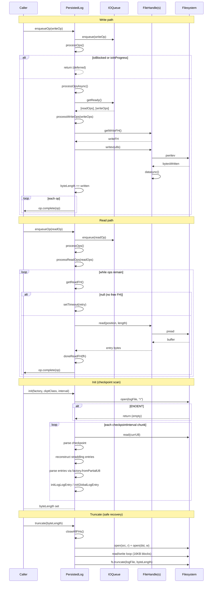

# PersistedLog Specification

**Module: Persistence**

## Overview

`PersistedLog` is the abstract base class for all on-disk log persistence in logsrd. It manages file handles (one write, multiple read), an IO operation queue, checkpoint-aware file initialization, and safe truncation for partial-write recovery. Concrete subclasses `HotLog` and `LogLog` implement the actual read/write logic for the global log and per-log files respectively.

## Component Specifications

```typescript
class PersistedLog {
    logFile: string
    server: Server
    ioQueue: GlobalLogIOQueue | IOQueue
    writeFH: FileHandle | null
    freeReadFhs: FileHandle[]
    openReadFhs: FileHandle[]
    openingReadFhs: number
    maxReadFHs: number
    byteLength: number
    ioBlocked: boolean
    ioInProgress: Promise<void> | null

    constructor(server: Server): PersistedLog

    blockIO(): Promise<void>
    unblockIO(): void
    waitInProgress(): Promise<void>
    closeAllFHs(): Promise<void>

    getReadFH(): FileHandle | null
    closeReadFH(fh: FileHandle): void
    doneReadFH(fh: FileHandle): void
    getWriteFH(): Promise<FileHandle>
    closeWriteFH(): Promise<void>

    enqueueOp(op: IOOperation): void
    enqueueOps(ops: IOOperation[]): void
    processOps(): void
    processOpsAsync(): Promise<void>
    processReadOps(ops: ReadIOOperation[]): Promise<void>
    _processReadOps(ops: ReadIOOperation[], resolve: (value: void | PromiseLike<void>) => void): void
    _processReadOp(op: ReadIOOperation, fh: FileHandle): Promise<void>
    _processReadEntryOp(op: ReadEntryIOOperation, fh: FileHandle): Promise<void>
    _processReadEntriesOp(op: ReadEntriesIOOperation, fh: FileHandle): Promise<void>
    _processReadRangeOp(op: ReadRangeIOOperation, fh: FileHandle): Promise<void>
    _processReadLogEntry(fh: FileHandle, logId: LogId, entryNum: number, offset: number, length: number): Promise<[GlobalLogEntry | LogLogEntry, number]>
    processWriteOps(ops: WriteIOOperation[]): Promise<void>

    truncate(byteLength: number): Promise<void>

    init(logEntryFactory: typeof GlobalLogEntryFactory | typeof LogLogEntryFactory, checkpointClass: typeof GlobalLogCheckpoint | typeof LogLogCheckpoint, checkpointInterval: number): Promise<void>

    initLogLogEntry(entry: LogLogEntry, entryOffset: number): void
    initGlobalLogEntry(entry: GlobalLogEntry, entryOffset: number): void
}
```

### Dependencies

| Dependency | Role |
|---|---|
| `Server` | Top-level server instance providing config and log references |
| `IOQueue` | Sequential read/write queue for a single log file |
| `GlobalLogIOQueue` | Per-log partitioned queue for the global log (HotLog) |
| `IOOperation` | Base operation with promise, order, timing |
| `WriteIOOperation` | Write operation carrying an entry |
| `ReadEntryIOOperation` | Read a single log entry by number |
| `ReadEntriesIOOperation` | Batch-read multiple entries |
| `ReadRangeIOOperation` | Stub for range-based reads (not implemented) |
| `GlobalLogEntryFactory` / `LogLogEntryFactory` | Deserialize raw bytes into entry objects |
| `GlobalLogCheckpoint` / `LogLogCheckpoint` | Verify/reconstruct checkpoint metadata |

## System Architecture

```mermaid
graph TB
    subgraph Client
        C[Caller Code]
    end

    subgraph PersistedLog
        direction TB
        IQ[ioQueue: IOQueue | GlobalLogIOQueue]
        IP[ioInProgress: Promise]
        BLK[ioBlocked: boolean]
        FH[writeFH, openReadFhs, freeReadFhs]

        C -->|enqueueOp / enqueueOps| IQ
        IQ -->|processOps| IP
        BLK -->|blocks| IP

        subgraph Ops[Operation Processing]
            direction LR
            P1[processOpsAsync]
            P2[processReadOps]
            P3[processWriteOps]
            P1 --> P2
            P1 --> P3
        end

        IP --> Ops

        subgraph ReadFH[Read FileHandle Pool]
            R1[getReadFH]
            R2[doneReadFH]
            R3[closeReadFH]
        end

        P2 --> ReadFH

        subgraph WriteFH[Write FileHandle]
            W1[getWriteFH]
            W2[closeWriteFH]
        end

        P3 --> WriteFH
    end

    subgraph Lifecycle
        L1[init: checkpoint-aware scan]
        L2[truncate: safe partial-write recovery]
        L3[blockIO / unblockIO]
    end

    subgraph Concrete[Concrete Subclasses]
        HL[HotLog<br/>global-log read/write]
        LL[LogLog<br/>per-log read/write]
    end

    PersistedLog -->|abstract methods| Concrete
```

## Detailed Data Flow



## Visualization

```html
<!DOCTYPE html>
<html>
<head>
<meta charset="utf-8">
<style>
  body { font-family: system-ui, sans-serif; background: #1e1e2e; color: #cdd6f4; margin: 0; display: flex; flex-direction: column; align-items: center; }
  #toolbar { display: flex; gap: 12px; padding: 12px; align-items: center; flex-wrap: wrap; }
  #toolbar button { background: #45475a; border: none; color: #cdd6f4; padding: 6px 14px; border-radius: 6px; cursor: pointer; font-size: 14px; }
  #toolbar button:hover { background: #585b70; }
  #toolbar input[type="range"] { width: 300px; }
  #kf-display { font-size: 14px; min-width: 120px; text-align: center; }
  #anim-container { position: relative; width: 900px; height: 620px; }
  svg { width: 100%; height: 100%; }
  .legend { display: flex; gap: 20px; font-size: 13px; margin-top: 8px; }
  .legend-item { display: flex; align-items: center; gap: 6px; }
  .legend-dot { width: 14px; height: 14px; border-radius: 4px; }
  .tooltip { position: absolute; background: #313244; color: #cdd6f4; padding: 6px 10px; border-radius: 6px; font-size: 12px; pointer-events: none; opacity: 0; transition: opacity .15s; border: 1px solid #585b70; }
  #verify-badge { margin-left: 12px; padding: 4px 10px; border-radius: 6px; font-size: 12px; background: #45475a; }
  #verify-badge.pass { background: #a6e3a1; color: #1e1e2e; }
  #verify-badge.fail { background: #f38ba8; color: #1e1e2e; }
</style>
</head>
<body>
<div id="toolbar">
  <button id="play-pause" data-testid="play-pause">▶ Play</button>
  <input type="range" id="kf-slider" min="0" max="100" value="0">
  <span id="kf-display">0 / <span id="kf-total">100</span></span>
  <button id="reset-btn">↺ Reset</button>
  <span id="verify-badge">● Verify</span>
</div>
<div id="anim-container"><svg id="svg"></svg></div>
<div class="legend">
  <div class="legend-item"><div class="legend-dot" style="background:#89b4fa"></div> IOQueue</div>
  <div class="legend-item"><div class="legend-dot" style="background:#a6e3a1"></div> Write</div>
  <div class="legend-item"><div class="legend-dot" style="background:#f9e2af"></div> Read</div>
  <div class="legend-item"><div class="legend-dot" style="background:#f38ba8"></div> Block</div>
  <div class="legend-item"><div class="legend-dot" style="background:#cba6f7"></div> Init Scan</div>
</div>
<div class="tooltip" id="tooltip"></div>
<script src="https://d3js.org/d3.v7.min.js"></script>
<script>
(function() {
  const ANIMATION_DURATION_MS = 8000;
  const ANIMATION_KEYFRAMES = 100;

  // Data: sequence of lifecycle states for PersistedLog
  const states = [
    { frame: 0,  label: "Idle",             phase: "idle",      detail: "Waiting for ops" },
    { frame: 8,  label: "Enqueue Write",     phase: "enqueue",   detail: "enqueueOp(writeOp)" },
    { frame: 16, label: "Enqueue Read",      phase: "enqueue",   detail: "enqueueOp(readOp)" },
    { frame: 24, label: "processOps",        phase: "schedule",  detail: "processOpsAsync()" },
    { frame: 32, label: "getReady",          phase: "schedule",  detail: "IOQueue.getReady()" },
    { frame: 40, label: "Write Phase",       phase: "write",     detail: "writev + datasync" },
    { frame: 48, label: "Read Loop Start",   phase: "read",      detail: "getReadFH()" },
    { frame: 56, label: "Read via pread",    phase: "read",      detail: "fh.read(position, length)" },
    { frame: 64, label: "doneReadFH",        phase: "read",      detail: "Return FH to pool" },
    { frame: 72, label: "blockIO",           phase: "block",     detail: "ioBlocked = true" },
    { frame: 80, label: "unblockIO",         phase: "block",     detail: "ioBlocked = false → processOps" },
    { frame: 88, label: "Init Scan",         phase: "init",      detail: "Checkpoint replay" },
    { frame: 100,label: "Complete",          phase: "idle",      detail: "All ops done" },
  ];

  const ANIMATION_VERIFICATION = (kf) => {
    const s = states.find(d => d.frame === kf) || states[states.length-1];
    return { frame: kf, phase: s.phase, label: s.label, ok: kf <= 100 };
  };

  let playing = false;
  let timer = null;
  let currentKf = 0;

  const svg = d3.select("#svg");
  const width = 900, height = 620;
  const tooltip = d3.select("#tooltip");

  const margin = { top: 30, right: 40, bottom: 30, left: 40 };

  function drawFrame(kf) {
    currentKf = kf;
    const kfState = states.reduce((prev, d) => d.frame <= kf ? d : prev, states[0]);
    const frac = kf / 100;

    svg.selectAll("*").remove();

    // Background
    svg.append("rect").attr("width", width).attr("height", height).attr("fill", "#1e1e2e").attr("rx", 12);

    // === Phase timeline ===
    const phases = ["idle", "enqueue", "schedule", "write", "read", "block", "init"];
    const phaseColors = { idle: "#585b70", enqueue: "#89b4fa", schedule: "#74c7ec", write: "#a6e3a1", read: "#f9e2af", block: "#f38ba8", init: "#cba6f7" };
    const laneY = 60;
    const laneH = 30;
    const timelineW = width - margin.left - margin.right;
    const tlX = margin.left;

    phases.forEach((ph, i) => {
      const x = tlX + (i / phases.length) * timelineW;
      const w = timelineW / phases.length;
      const isActive = kfState.phase === ph;
      svg.append("rect")
        .attr("x", x).attr("y", laneY).attr("width", w).attr("height", laneH)
        .attr("fill", isActive ? phaseColors[ph] : "#313244")
        .attr("stroke", "#585b70").attr("stroke-width", 1).attr("rx", 4);
      svg.append("text")
        .attr("x", x + w/2).attr("y", laneY + laneH/2 + 5)
        .attr("text-anchor", "middle").attr("fill", "#cdd6f4").attr("font-size", 11)
        .text(ph);
    });

    // Playhead
    const playX = tlX + frac * timelineW;
    svg.append("line")
      .attr("x1", playX).attr("y1", laneY - 8).attr("x2", playX).attr("y2", laneY + laneH + 8)
      .attr("stroke", "#f5c2e7").attr("stroke-width", 2).attr("stroke-dasharray", "4,2");

    // === Central state diagram ===
    const cx = width / 2, cy = height / 2 + 30;

    // IOQueue block
    const queueEntries = [];
    if (["enqueue","schedule","write","read"].includes(kfState.phase)) queueEntries.push("readOp", "writeOp");
    const queueX = cx - 180, queueY = cy - 60;
    svg.append("rect").attr("x", queueX - 60).attr("y", queueY - 20)
      .attr("width", 140).attr("height", 100)
      .attr("fill", "#313244").attr("stroke", "#89b4fa").attr("stroke-width", 2).attr("rx", 8);
    svg.append("text").attr("x", queueX - 50).attr("y", queueY).attr("fill", "#89b4fa").attr("font-size", 13).attr("font-weight", "bold").text("IOQueue");
    if (queueEntries.length > 0) {
      svg.append("text").attr("x", queueX - 50).attr("y", queueY + 24).attr("fill", "#a6e3a1").attr("font-size", 11).text("▶ writeOp");
      svg.append("text").attr("x", queueX - 50).attr("y", queueY + 44).attr("fill", "#f9e2af").attr("font-size", 11).text("▶ readOp");
    }

    // FileHandle pool
    const fhX = cx + 60, fhY = cy - 80;
    const fhCount = kfState.phase === "read" ? Math.max(0, 2 - Math.floor(frac * 6) % 3) : 2;
    svg.append("rect").attr("x", fhX - 50).attr("y", fhY - 20)
      .attr("width", 120).attr("height", 60 + fhCount * 16)
      .attr("fill", "#313244").attr("stroke", "#a6e3a1").attr("stroke-width", 2).attr("rx", 8);
    svg.append("text").attr("x", fhX - 40).attr("y", fhY).attr("fill", "#a6e3a1").attr("font-size", 13).attr("font-weight", "bold").text("FH Pool");
    for (let i = 0; i < fhCount; i++) {
      svg.append("text").attr("x", fhX - 40).attr("y", fhY + 24 + i * 16).attr("fill", "#cdd6f4").attr("font-size", 10).text(`📄 fd#${i+1}`);
    }

    // Processing arrow
    if (["write","read","schedule"].includes(kfState.phase)) {
      svg.append("line").attr("x1", queueX + 80).attr("y1", queueY + 40)
        .attr("x2", fhX - 50).attr("y2", fhY + 20)
        .attr("stroke", "#f5c2e7").attr("stroke-width", 2).attr("marker-end", "url(#arrow)");
    }

    // Arrow marker
    svg.append("defs").append("marker").attr("id", "arrow").attr("viewBox", "0 0 10 10").attr("refX", 10).attr("refY", 5)
      .attr("markerWidth", 8).attr("markerHeight", 8).attr("orient", "auto")
      .append("path").attr("d", "M 0 0 L 10 5 L 0 10 Z").attr("fill", "#f5c2e7");

    // Block indicator
    if (kfState.phase === "block") {
      svg.append("rect").attr("x", cx - 80).attr("y", cy + 60).attr("width", 160).attr("height", 44)
        .attr("fill", "#f38ba8").attr("opacity", 0.3).attr("rx", 8).attr("stroke", "#f38ba8").attr("stroke-width", 2);
      svg.append("text").attr("x", cx).attr("y", cy + 86).attr("text-anchor", "middle").attr("fill", "#f38ba8").attr("font-size", 14).attr("font-weight", "bold").text("⚠ IO BLOCKED");
    }

    // Init scan bar
    if (kfState.phase === "init") {
      const barW = 300, barH = 20;
      const barX = cx - barW/2, barY = cy + 100;
      svg.append("rect").attr("x", barX).attr("y", barY).attr("width", barW).attr("height", barH)
        .attr("fill", "#313244").attr("rx", 10).attr("stroke", "#cba6f7");
      const scanFrac = Math.min(1, frac * 2 - 0.76);
      svg.append("rect").attr("x", barX).attr("y", barY).attr("width", barW * scanFrac).attr("height", barH)
        .attr("fill", "#cba6f7").attr("rx", 10).attr("opacity", 0.7);
      svg.append("text").attr("x", cx).attr("y", barY + barH/2 + 4).attr("text-anchor", "middle").attr("fill", "#1e1e2e").attr("font-size", 11).attr("font-weight", "bold")
        .text(`Checkpoint Scan ${Math.round(scanFrac * 100)}%`);
    }

    // === Info badge top-right ===
    svg.append("rect").attr("x", width - 210).attr("y", 12).attr("width", 190).attr("height", 34)
      .attr("fill", "#313244").attr("rx", 6);
    svg.append("text").attr("x", width - 200).attr("y", 34).attr("fill", "#cdd6f4").attr("font-size", 13)
      .text(`kf: ${kf}  ${kfState.phase}`);

    // Verify badge
    const v = ANIMATION_VERIFICATION(kf);
    d3.select("#verify-badge")
      .attr("class", v.ok ? "pass" : "fail")
      .text(v.ok ? "● Pass" : "● Fail");

    d3.select("#kf-display").html(`${kf} / <span id="kf-total">${ANIMATION_KEYFRAMES}</span>`);
    d3.select("#kf-slider").property("value", kf);
  }

  function jumpToKeyframe(kf) {
    const clamped = Math.max(0, Math.min(ANIMATION_KEYFRAMES, Math.round(kf)));
    drawFrame(clamped);
  }

  function resetAnimation() {
    if (timer) { clearInterval(timer); timer = null; }
    playing = false;
    d3.select("#play-pause").text("▶ Play");
    jumpToKeyframe(0);
  }

  function getAnimationState() {
    return { playing, currentKf, total: ANIMATION_KEYFRAMES };
  }

  d3.select("#play-pause").on("click", function() {
    if (playing) {
      clearInterval(timer); timer = null;
      playing = false;
      d3.select(this).text("▶ Play");
    } else {
      playing = true;
      d3.select(this).text("⏸ Pause");
      timer = setInterval(() => {
        let next = currentKf + 1;
        if (next > ANIMATION_KEYFRAMES) {
          clearInterval(timer); timer = null;
          playing = false;
          d3.select("#play-pause").text("▶ Play");
          return;
        }
        jumpToKeyframe(next);
      }, ANIMATION_DURATION_MS / ANIMATION_KEYFRAMES);
    }
  });

  d3.select("#kf-slider").on("input", function() {
    if (playing) {
      clearInterval(timer); timer = null;
      playing = false;
      d3.select("#play-pause").text("▶ Play");
    }
    jumpToKeyframe(+this.value);
  });

  d3.select("#reset-btn").on("click", resetAnimation);

  // Hover tooltip
  d3.select("#anim-container").on("mousemove", function(e) {
    const rect = this.getBoundingClientRect();
    const x = e.clientX - rect.left, y = e.clientY - rect.top;
    const kf = Math.round((x / rect.width) * 100);
    if (kf >= 0 && kf <= 100) {
      const s = states.reduce((prev, d) => d.frame <= kf ? d : prev, states[0]);
      tooltip.style("opacity", 1).style("left", (x + 12) + "px").style("top", (y - 30) + "px")
        .html(`<b>${s.label}</b><br/>${s.detail}`);
    } else {
      tooltip.style("opacity", 0);
    }
  }).on("mouseleave", () => tooltip.style("opacity", 0));

  // Initial draw
  jumpToKeyframe(0);
})();
</script>
</body>
</html>
```

### Visualization Keyframe Table

| kf | Phase | Description |
|----|-------|-------------|
| 0 | idle | No operations pending |
| 8 | enqueue | Write operation enqueued |
| 16 | enqueue | Read operation enqueued |
| 24 | schedule | `processOpsAsync()` triggered |
| 32 | schedule | `getReady()` drains queue |
| 40 | write | `writev` + `datasync` executed |
| 48 | read | Read loop: `getReadFH()` |
| 56 | read | `pread` from file |
| 64 | read | `doneReadFH` returns handle |
| 72 | block | `blockIO()` called |
| 80 | unblock | `unblockIO()` resumes processing |
| 88 | init | Checkpoint-based file scan |
| 100 | idle | All operations complete |

## Testing Requirements

| Test Case | Input | Expected Outcome |
|---|---|---|
| `enqueueOp dispatches to processOps` | writeOp or readOp | `processOps` called; op moved to `ioInProgress` |
| `processOps blocked when ioBlocked` | `ioBlocked = true` | Returns immediately, op stays queued |
| `processOps blocked when ioInProgress` | `ioInProgress !== null` | Returns immediately, deferred via setTimeout |
| `processOpsAsync splits read/write` | Mixed queue | `processReadOps` + `processWriteOps` called via Promise.all |
| `_processReadOp dispatches by type` | READ_ENTRY, READ_ENTRIES, READ_RANGE | Correct handler invoked |
| `getReadFH returns free handle` | `freeReadFhs` non-empty | Pops and returns handle |
| `getReadFH opens new handle` | Under limit, no free | `fs.open` called, `openingReadFhs` incremented |
| `getReadFH returns null` | At max open limit | Returns `null` |
| `doneReadFH returns handle to pool` | Used handle | Pushed to `freeReadFhs` |
| `closeReadFH closes and filters` | Handle to close | `fh.close()` called; removed from `openReadFhs` |
| `closeAllFHs closes all handles` | Multiple open FHs | All read + write FHs closed, arrays cleared |
| `blockIO sets flag and awaits ioInProgress` | Not already blocked | `ioBlocked = true`; waits for in-progress |
| `blockIO throws if already blocked` | Already blocked | Throws `Error("IO already blocked")` |
| `unblockIO clears flag and triggers processOps` | Blocked | `ioBlocked = false`; `processOps()` called |
| `unblockIO throws if not blocked` | Not blocked | Throws `Error("IO not blocked")` |
| `truncate copies truncated data to backup` | byteLength > 0 | Backup file created; file truncated |
| `truncate rejects byteLength < 1` | 0 or negative | Throws `Error` |
| `init skips non-existent file` | ENOENT | Returns without populating |
| `init scans checkpoint-aligned chunks` | Valid file with checkpoints | Entries reconstructed; `byteLength` set |
| `init rejects invalid checkpoint` | Corrupt checkpoint data | Throws `Error("Error parsing checkpoint")` |
| `init rejects unverifiable checkpoint` | Checkpoint.verify fails | Throws `Error("Error verifying checkpoint")` |
| `init reconstructs straddling entries` | Entry crosses checkpoint boundary | Stitched from last + curr buffer |
| `initLogLogEntry / initGlobalLogEntry` abstract | Override in subclass | Throws `Error("not implemented")` |
| `enqueueOps batches multiple ops` | Array of ops | Each enqueued; single `processOps` call |
| `waitInProgress awaits current` | `ioInProgress` set | Awaits completion promise |
| Concurrent ops: reads defer when FH exhausted | All FHs busy | `_processReadOps` retries via setTimeout |
| Global order preserved across IOQueue | Ops from different log queues | `getReady` sorts by `order` |

---

## 7. Source-Test Cross-References

### Test Coverage

| Test Spec | Path |
|---|---|
| No test spec | |
