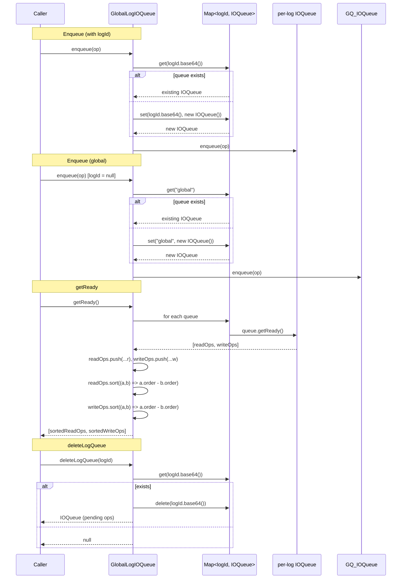

# GlobalLogIOQueue Specification

**Module: IO Operations**

## Overview

`GlobalLogIOQueue` extends the single-queue concept of `IOQueue` by maintaining a per-log partition of queues, keyed by `LogId.base64()`. Operations targeting a specific `logId` are routed to that log's dedicated `IOQueue`, while operations with `logId = null` go to a global fallback queue. `getReady` drains all per-log queues and a global queue, then globally sorts all operations by their `order` property to maintain a total ordering across all partitions. This class is used exclusively by `HotLog`.

## Component Specifications

```typescript
class GlobalLogIOQueue {
    queues: Map<string, IOQueue>

    enqueue(item: IOOperation): void
    deleteLogQueue(logId: LogId): IOQueue | null
    getLogQueue(logId: LogId): IOQueue
    getGlobalQueue(): IOQueue
    getReady(): [ReadIOOperation[], WriteIOOperation[]]
    opPending(): boolean
}
```

### Properties

| Property | Type | Default | Description |
|---|---|---|---|
| `queues` | `Map<string, IOQueue>` | `new Map()` | Map of base64-encoded LogId → per-log IOQueue |

### Routing Logic

```
enqueue(item):
  if item.logId === null → getGlobalQueue().enqueue(item)
  else                   → getLogQueue(item.logId).enqueue(item)
```

### Global Reordering

`getReady()` collects all read and write operations from every per-log queue and the global queue, then sorts each combined array by `order` (the global monotonically increasing sequence number assigned by `IOOperation`). This ensures that even though operations are partitioned by log at enqueue time, they are processed in global submission order.

### Dependencies

| Dependency | Role |
|---|---|
| `IOQueue` | Per-log partition queue |
| `IOOperation` | Base operation (routed by `logId`) |
| `WriteIOOperation` | Write operation type |
| `ReadIOOperation` | Type alias for read operations |
| `LogId` | Log identifier used as partition key via `base64()` |

## System Architecture

```mermaid
graph TB
    subgraph GlobalLogIOQueue
        direction TB
        QM[queues: Map<logId, IOQueue>]

        subgraph Partitions
            GQ[global queue<br/>logId === null]
            LQ1[log queue A]
            LQ2[log queue B]
            LQN[log queue …]
        end

        enqueue -->|logId null| GQ
        enqueue -->|logId set| LQ1
        enqueue -->|logId set| LQ2

        getReady -->|drain all partitions| RD[readOps: ReadIOOperation[]]
        getReady -->|drain all partitions| WR[writeOps: WriteIOOperation[]]
        RD -->|sort by order| RDS[(sorted)]
        WR -->|sort by order| WRS[(sorted)]
    end

    subgraph Consumer
        HL[HotLog.processOpsAsync]
    end

    getReady --> HL
```

## Detailed Data Flow



## Visualization

```html
<!DOCTYPE html>
<html>
<head>
<meta charset="utf-8">
<style>
  body { font-family: system-ui, sans-serif; background: #1e1e2e; color: #cdd6f4; margin: 0; display: flex; flex-direction: column; align-items: center; }
  #toolbar { display: flex; gap: 12px; padding: 12px; align-items: center; flex-wrap: wrap; }
  #toolbar button { background: #45475a; border: none; color: #cdd6f4; padding: 6px 14px; border-radius: 6px; cursor: pointer; font-size: 14px; }
  #toolbar button:hover { background: #585b70; }
  #toolbar input[type="range"] { width: 300px; }
  #kf-display { font-size: 14px; min-width: 120px; text-align: center; }
  #anim-container { position: relative; width: 940px; height: 600px; }
  svg { width: 100%; height: 100%; }
  .legend { display: flex; gap: 20px; font-size: 13px; margin-top: 8px; }
  .legend-item { display: flex; align-items: center; gap: 6px; }
  .legend-dot { width: 14px; height: 14px; border-radius: 4px; }
  .tooltip { position: absolute; background: #313244; color: #cdd6f4; padding: 6px 10px; border-radius: 6px; font-size: 12px; pointer-events: none; opacity: 0; transition: opacity .15s; border: 1px solid #585b70; }
  #verify-badge { margin-left: 12px; padding: 4px 10px; border-radius: 6px; font-size: 12px; background: #45475a; }
  #verify-badge.pass { background: #a6e3a1; color: #1e1e2e; }
  #verify-badge.fail { background: #f38ba8; color: #1e1e2e; }
</style>
</head>
<body>
<div id="toolbar">
  <button id="play-pause" data-testid="play-pause">▶ Play</button>
  <input type="range" id="kf-slider" min="0" max="100" value="0">
  <span id="kf-display">0 / <span id="kf-total">100</span></span>
  <button id="reset-btn">↺ Reset</button>
  <span id="verify-badge">● Verify</span>
</div>
<div id="anim-container"><svg id="svg"></svg></div>
<div class="legend">
  <div class="legend-item"><div class="legend-dot" style="background:#89b4fa"></div> Log Queue A</div>
  <div class="legend-item"><div class="legend-dot" style="background:#a6e3a1"></div> Log Queue B</div>
  <div class="legend-item"><div class="legend-dot" style="background:#f9e2af"></div> Global Queue</div>
  <div class="legend-item"><div class="legend-dot" style="background:#cba6f7"></div> Sorted Output</div>
  <div class="legend-item"><div class="legend-dot" style="background:#f38ba8"></div> Delete Log Queue</div>
</div>
<div class="tooltip" id="tooltip"></div>
<script src="https://d3js.org/d3.v7.min.js"></script>
<script>
(function() {
  const ANIMATION_DURATION_MS = 8000;
  const ANIMATION_KEYFRAMES = 100;

  const states = [
    { frame: 0,  label: "Empty",               phase: "empty",   detail: "No queues" },
    { frame: 8,  label: "Enqueue to Log A",     phase: "enq-a",   detail: "logId=A, order=1" },
    { frame: 16, label: "Enqueue to Log B",     phase: "enq-b",   detail: "logId=B, order=2" },
    { frame: 24, label: "Enqueue Global",       phase: "enq-g",   detail: "logId=null, order=3" },
    { frame: 32, label: "Enqueue to Log A (2)", phase: "enq-a",   detail: "logId=A, order=4" },
    { frame: 40, label: "getReady: drain all",  phase: "drain",   detail: "Iterate all partitions" },
    { frame: 48, label: "Collect readOps",      phase: "collect", detail: "Concatenate from each queue" },
    { frame: 56, label: "Collect writeOps",     phase: "collect", detail: "Concatenate from each queue" },
    { frame: 64, label: "Sort by order",        phase: "sort",    detail: "Global ordering enforced" },
    { frame: 72, label: "Return sorted",        phase: "return",  detail: "[readOps, writeOps] → consumer" },
    { frame: 80, label: "deleteLogQueue(A)",    phase: "delete",  detail: "Remove queue for Log A" },
    { frame: 88, label: "opPending = false",    phase: "pending", detail: "All queues empty" },
    { frame: 100,label: "Done",                 phase: "empty",   detail: "Ready" },
  ];

  const ANIMATION_VERIFICATION = (kf) => {
    const s = states.find(d => d.frame === kf) || states[states.length-1];
    return { frame: kf, phase: s.phase, label: s.label, ok: kf <= 100 };
  };

  let playing = false, timer = null, currentKf = 0;
  const svg = d3.select("#svg");
  const width = 940, height = 600;
  const tooltip = d3.select("#tooltip");

  function drawFrame(kf) {
    currentKf = kf;
    const kfState = states.reduce((prev, d) => d.frame <= kf ? d : prev, states[0]);
    const frac = kf / 100;
    svg.selectAll("*").remove();
    svg.append("rect").attr("width", width).attr("height", height).attr("fill", "#1e1e2e").attr("rx", 12);

    const phases = ["empty","enq-a","enq-b","enq-g","drain","collect","sort","return","delete","pending"];
    const phaseColors = { empty: "#585b70", "enq-a": "#89b4fa", "enq-b": "#a6e3a1", "enq-g": "#f9e2af", drain: "#74c7ec", collect: "#89b4fa", sort: "#cba6f7", return: "#a6e3a1", delete: "#f38ba8", pending: "#f9e2af" };
    const laneY = 40, laneH = 24;
    const timelineW = width - 80, tlX = 40;

    phases.forEach((ph, i) => {
      const x = tlX + (i / phases.length) * timelineW;
      const w = timelineW / phases.length;
      const isActive = kfState.phase === ph;
      svg.append("rect").attr("x", x).attr("y", laneY).attr("width", w).attr("height", laneH)
        .attr("fill", isActive ? phaseColors[ph] : "#313244").attr("stroke", "#585b70").attr("stroke-width", 1).attr("rx", 4);
      svg.append("text").attr("x", x + w/2).attr("y", laneY + laneH/2 + 4)
        .attr("text-anchor", "middle").attr("fill", "#cdd6f4").attr("font-size", 9).text(ph);
    });

    const playX = tlX + frac * timelineW;
    svg.append("line").attr("x1", playX).attr("y1", laneY - 6).attr("x2", playX).attr("y2", laneY + laneH + 6)
      .attr("stroke", "#f5c2e7").attr("stroke-width", 2).attr("stroke-dasharray", "4,2");

    // === Partition visualization ===
    const qy = height / 2 - 40;
    const qw = 200, qh = 150;

    // Log A queue
    const ax = 30;
    svg.append("rect").attr("x", ax).attr("y", qy).attr("width", qw).attr("height", qh)
      .attr("fill", "#1e1e2e").attr("stroke", "#89b4fa").attr("stroke-width", 2).attr("rx", 8);
    svg.append("text").attr("x", ax + qw/2).attr("y", qy + 18).attr("text-anchor", "middle")
      .attr("fill", "#89b4fa").attr("font-size", 11).attr("font-weight", "bold").text("Log A");

    // Log B queue
    const bx = 370;
    svg.append("rect").attr("x", bx).attr("y", qy).attr("width", qw).attr("height", qh)
      .attr("fill", "#1e1e2e").attr("stroke", "#a6e3a1").attr("stroke-width", 2).attr("rx", 8);
    svg.append("text").attr("x", bx + qw/2).attr("y", qy + 18).attr("text-anchor", "middle")
      .attr("fill", "#a6e3a1").attr("font-size", 11).attr("font-weight", "bold").text("Log B");

    // Global queue
    const gx = 710;
    svg.append("rect").attr("x", gx).attr("y", qy).attr("width", qw).attr("height", qh)
      .attr("fill", "#1e1e2e").attr("stroke", "#f9e2af").attr("stroke-width", 2).attr("rx", 8);
    svg.append("text").attr("x", gx + qw/2).attr("y", qy + 18).attr("text-anchor", "middle")
      .attr("fill", "#f9e2af").attr("font-size", 11).attr("font-weight", "bold").text("Global");

    // Determine item counts based on phase
    let aCount = 0, bCount = 0, gCount = 0;
    const drainCollectDelete = ["drain","collect","sort","return","delete"];
    if (["enq-a","enq-b","enq-g"].includes(kfState.phase)) {
      if (kfState.phase === "enq-a") { aCount = kf <= 12 ? 1 : 1; bCount = 0; gCount = 0; }
      if (kfState.phase === "enq-b") { aCount = 1; bCount = 1; gCount = 0; }
      if (kfState.phase === "enq-g") { aCount = 1; bCount = 1; gCount = 1; }
    } else if (kfState.phase === "empty" || kfState.phase === "pending") {
      aCount = 0; bCount = 0; gCount = 0;
    } else if (kfState.phase === "enq-a" && kf > 32) { aCount = 2; bCount = 1; gCount = 1; }
    else if (kfState.phase === "enq-a" && kf <= 32) { aCount = 1; bCount = 0; gCount = 0; }
    else if (drainCollectDelete.includes(kfState.phase)) {
      aCount = kfState.phase === "delete" ? 0 : 2;
      bCount = kfState.phase === "delete" ? 1 : 1;
      gCount = kfState.phase === "delete" ? 0 : 1;
    }

    // Draw items
    function drawItems(ox, count, fill) {
      for (let i = 0; i < Math.min(count, 5); i++) {
        const iy = qy + 30 + i * 22;
        const isProc = drainCollectDelete.includes(kfState.phase) && !(kfState.phase === "delete");
        svg.append("rect").attr("x", ox + 10).attr("y", iy).attr("width", qw - 20).attr("height", 18)
          .attr("fill", isProc ? "#cba6f7" : fill).attr("opacity", isProc ? 0.5 : 0.35).attr("rx", 4);
        svg.append("text").attr("x", ox + qw/2).attr("y", iy + 13).attr("text-anchor", "middle")
          .attr("fill", "#1e1e2e").attr("font-size", 8).text(`op#${i+1}`);
      }
    }
    drawItems(ax, aCount, "#89b4fa");
    drawItems(bx, bCount, "#a6e3a1");
    drawItems(gx, gCount, "#f9e2af");

    // Delete indicator
    if (kfState.phase === "delete") {
      svg.append("line").attr("x1", ax).attr("y1", qy).attr("x2", ax + qw).attr("y2", qy + qh)
        .attr("stroke", "#f38ba8").attr("stroke-width", 3);
      svg.append("line").attr("x1", ax + qw).attr("y1", qy).attr("x2", ax).attr("y2", qy + qh)
        .attr("stroke", "#f38ba8").attr("stroke-width", 3);
      svg.append("text").attr("x", ax + qw/2).attr("y", qy + qh/2 + 4).attr("text-anchor", "middle")
        .attr("fill", "#f38ba8").attr("font-size", 16).attr("font-weight", "bold").text("DELETED");
    }

    // Sort visualization between boxes
    const cx = width / 2;
    if (kfState.phase === "sort") {
      svg.append("rect").attr("x", cx - 80).attr("y", height / 2 + 120).attr("width", 160).attr("height", 36)
        .attr("fill", "#313244").attr("stroke", "#cba6f7").attr("stroke-width", 2).attr("rx", 6);
      svg.append("text").attr("x", cx).attr("y", height / 2 + 142).attr("text-anchor", "middle")
        .attr("fill", "#cba6f7").attr("font-size", 13).attr("font-weight", "bold").text("sort by order ↓");
    }

    if (kfState.phase === "return") {
      svg.append("rect").attr("x", cx - 100).attr("y", height / 2 + 120).attr("width", 200).attr("height", 36)
        .attr("fill", "#313244").attr("stroke", "#a6e3a1").attr("stroke-width", 2).attr("rx", 6);
      svg.append("text").attr("x", cx).attr("y", height / 2 + 142).attr("text-anchor", "middle")
        .attr("fill", "#a6e3a1").attr("font-size", 13).text("→ [readOps, writeOps]");
    }

    // Status
    svg.append("rect").attr("x", cx - 150).attr("y", height - 50).attr("width", 300).attr("height", 30).attr("fill", "#313244").attr("rx", 6);
    const parts = Object.entries({A: aCount, B: bCount, G: gCount}).filter(([_,c]) => c > 0).map(([k,c]) => `${k}:${c}`).join("  ");
    svg.append("text").attr("x", cx).attr("y", height - 30).attr("text-anchor", "middle").attr("fill", "#cdd6f4").attr("font-size", 11).text(parts || "all empty");

    svg.append("rect").attr("x", width - 210).attr("y", 8).attr("width", 190).attr("height", 28).attr("fill", "#313244").attr("rx", 6);
    svg.append("text").attr("x", width - 200).attr("y", 26).attr("fill", "#cdd6f4").attr("font-size", 11).text(`kf: ${kf}  ${kfState.phase}`);

    const v = ANIMATION_VERIFICATION(kf);
    d3.select("#verify-badge").attr("class", v.ok ? "pass" : "fail").text(v.ok ? "● Pass" : "● Fail");
    d3.select("#kf-display").html(`${kf} / <span id="kf-total">${ANIMATION_KEYFRAMES}</span>`);
    d3.select("#kf-slider").property("value", kf);
  }

  function jumpToKeyframe(kf) { drawFrame(Math.max(0, Math.min(ANIMATION_KEYFRAMES, Math.round(kf)))); }
  function resetAnimation() { if (timer) { clearInterval(timer); timer = null; } playing = false; d3.select("#play-pause").text("▶ Play"); jumpToKeyframe(0); }
  function getAnimationState() { return { playing, currentKf, total: ANIMATION_KEYFRAMES }; }

  d3.select("#play-pause").on("click", function() {
    if (playing) { clearInterval(timer); timer = null; playing = false; d3.select(this).text("▶ Play"); }
    else {
      playing = true; d3.select(this).text("⏸ Pause");
      timer = setInterval(() => {
        let next = currentKf + 1;
        if (next > ANIMATION_KEYFRAMES) { clearInterval(timer); timer = null; playing = false; d3.select("#play-pause").text("▶ Play"); return; }
        jumpToKeyframe(next);
      }, ANIMATION_DURATION_MS / ANIMATION_KEYFRAMES);
    }
  });
  d3.select("#kf-slider").on("input", function() {
    if (playing) { clearInterval(timer); timer = null; playing = false; d3.select("#play-pause").text("▶ Play"); }
    jumpToKeyframe(+this.value);
  });
  d3.select("#reset-btn").on("click", resetAnimation);
  d3.select("#anim-container").on("mousemove", function(e) {
    const rect = this.getBoundingClientRect();
    const x = e.clientX - rect.left, y = e.clientY - rect.top;
    const kf = Math.round((x / rect.width) * 100);
    if (kf >= 0 && kf <= 100) {
      const s = states.reduce((prev, d) => d.frame <= kf ? d : prev, states[0]);
      tooltip.style("opacity", 1).style("left", (x + 12) + "px").style("top", (y - 30) + "px").html(`<b>${s.label}</b><br/>${s.detail}`);
    } else tooltip.style("opacity", 0);
  }).on("mouseleave", () => tooltip.style("opacity", 0));
  jumpToKeyframe(0);
})();
</script>
</body>
</html>
```

### Visualization Keyframe Table

| kf | Phase | Description |
|----|-------|-------------|
| 0 | empty | No queues |
| 8 | enq-a | Op enqueued to Log A queue |
| 16 | enq-b | Op enqueued to Log B queue |
| 24 | enq-g | Op enqueued to Global queue |
| 32 | enq-a | Second op enqueued to Log A |
| 40 | drain | Iterate all partitions, drain each |
| 48 | collect | readOps concatenated from all queues |
| 56 | collect | writeOps concatenated from all queues |
| 64 | sort | Both arrays sorted by `order` |
| 72 | return | `[sortedReadOps, sortedWriteOps]` returned |
| 80 | delete | Log A queue deleted |
| 88 | pending | `opPending() = false` |
| 100 | empty | Complete |

## Testing Requirements

| Test Case | Input | Expected Outcome |
|---|---|---|
| `enqueue routes to global queue` | logId = null | Op added to `queues.get("global")` |
| `enqueue routes to log queue` | logId = X | Op added to `queues.get(X.base64())` |
| `enqueue creates log queue lazily` | Non-existent logId | New IOQueue created and stored |
| `enqueue creates global queue lazily` | First null-logId op | New IOQueue created for "global" |
| `getReady drains all partitions` | Ops in multiple queues | All ops collected, queues cleared |
| `getReady sorts readOps by order` | Mixed order across queues | `readOps[i].order ≤ readOps[i+1].order` |
| `getReady sorts writeOps by order` | Mixed order across queues | `writeOps[i].order ≤ writeOps[i+1].order` |
| `getReady returns empty` | No ops anywhere | `[[], []]` |
| `deleteLogQueue returns queue` | Existing logId | Returns IOQueue with pending ops |
| `deleteLogQueue returns null` | Non-existent logId | Returns `null` |
| `deleteLogQueue removes entry` | After deletion | `queues.has(logId.base64()) === false` |
| `getLogQueue creates if missing` | New logId | New IOQueue created and returned |
| `getLogQueue returns existing` | Existing logId | Returns cached IOQueue |
| `getGlobalQueue creates if missing` | First call | New IOQueue for "global" |
| `getGlobalQueue returns existing` | Subsequent call | Returns existing "global" queue |
| `opPending returns true` | At least one queue non-empty | `true` |
| `opPending returns false` | All queues empty | `false` |
| Enqueue to deleted log queue | After deleteLogQueue | New queue created (lazy recreate) |

---

## 7. Source-Test Cross-References

### Test Coverage

| Test Spec | Path |
|---|---|
| GlobalLogIOQueue.test.spec.md | `source/src/lib/persist/io/GlobalLogIOQueue.test.spec.md` |
