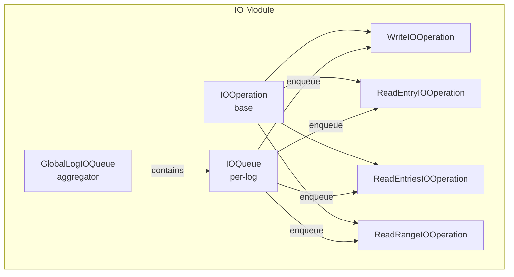
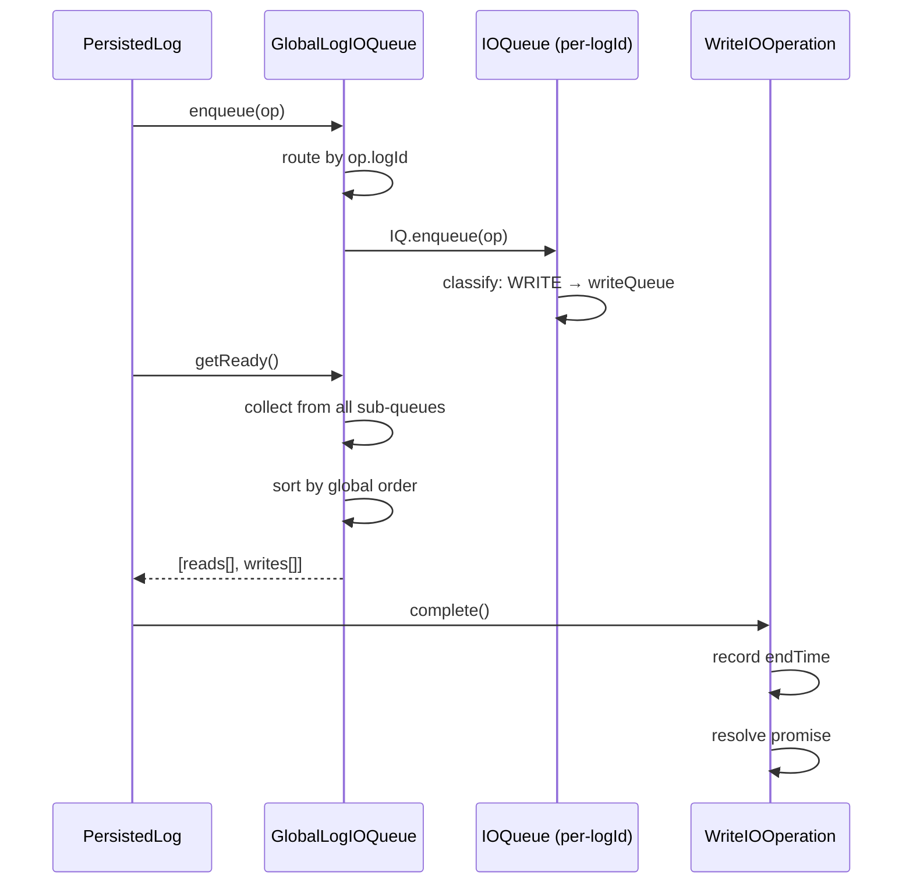

# IO Module — IOModule.spec.md

## 1. Overview

The **IO Module** provides the asynchronous operation queue infrastructure for all file I/O. `IOOperation` is the base class carrying a promise, timing data, and ordering. `IOQueue` manages per-log read/write queues. `GlobalLogIOQueue` is a top-level coordinator that aggregates per-log queues with global monotonic ordering. Concrete operation types carry typed payloads (entry, index, byte buffers).

**Dependencies:** Globals Module (IOOperationType enum)
**Lifecycle stages:** Construct → Enqueue → Process (drain + mark processing) → Complete/CompleteWithError

## 2. Component Specifications

| Component | Role | Access Path |
|---|---|---|
| `IOOperation` | Base class — op type, promise, start/end time, global order | `./io-operation.ts` |
| `IOQueue` | Per-log queue — separate read/write lists, drain | `./io-queue.ts` |
| `GlobalLogIOQueue` | Top-level — per-log sub-queues, global ordering, log queue lifecycle | `./global-log-io-queue.ts` |
| `WriteIOOperation` | Write op wrapping a `GlobalLogEntry`/`LogLogEntry` | `./write-io-operation.ts` |
| `ReadEntryIOOperation` | Read-single op with `LogIndex` + entryNum | `./read-entry-io-operation.ts` |
| `ReadEntriesIOOperation` | Read-multiple op with `LogIndex` + entryNums array | `./read-entries-io-operation.ts` |
| `ReadRangeIOOperation` | Read-range op with raw read descriptors | `./read-range-io-operation.ts` |

## 3. System Architecture



## 4. Detailed Data Flow



## 5. Visualization

```html
<!DOCTYPE html>
<html>
<head>
<meta charset="utf-8">
<style>
  body { font-family: monospace; background: #1e1e2e; color: #cdd6f4; margin: 0; }
  #vis { width: 960px; height: 540px; position: relative; }
  .controls { display: flex; gap: 8px; padding: 8px; background: #181825; align-items: center; }
  .controls button { background: #45475a; color: #cdd6f4; border: none; padding: 4px 12px; cursor: pointer; }
  #kf-current, #kf-total { color: #a6adc8; font-size: 12px; min-width: 20px; text-align: center; }
  #frame-label { color: #89b4fa; font-size: 14px; margin-left: auto; }
  .node { position: absolute; border: 2px solid #89b4fa; border-radius: 6px; padding: 8px 12px;
           background: #313244; font-size: 11px; text-align: center; transition: all 0.3s; }
  .node.active { border-color: #a6e3a1; background: #45475a; box-shadow: 0 0 12px #a6e3a180; }
  .edge { position: absolute; height: 2px; background: #585b70; transform-origin: 0 0; }
  .edge.active { background: #a6e3a1; }
  .badge { font-size: 9px; color: #6c7086; }
</style>
</head>
<body>
<div class="controls">
  <button id="play-pause" data-testid="play-pause">⏸</button>
  <span id="kf-current">0</span><span>/</span><span id="kf-total">4</span>
  <input type="range" id="seek" min="0" max="4" value="0" style="flex:1">
  <span id="frame-label">Enqueue to GlobalLogIOQueue</span>
</div>
<div id="vis"></div>
<script>
(function(){
  const ANIMATION_DURATION_MS = 8000;
  const ANIMATION_KEYFRAMES = [
    { label: "Enqueue to GlobalLogIOQueue", active: ["GLIQ"], edges: [] },
    { label: "Route to per-log IOQueue", active: ["GLIQ","IQ"], edges: ["GLIQ-IQ"] },
    { label: "getReady(): drain + sort", active: ["IQ","WIO","REIO"], edges: ["IQ-WIO","IQ-REIO"] },
    { label: "Complete op, resolve promise", active: ["GLIQ","WIO"], edges: ["GLIQ-WIO"] },
  ];
  const nodePositions = {
    GLIQ: [80, 120], IQ: [300, 120],
    WIO: [540, 60], REIO: [540, 180]
  };

  const vis = document.getElementById('vis');
  Object.entries(nodePositions).forEach(([id, [x, y]]) => {
    const el = document.createElement('div');
    el.className = 'node'; el.id = 'n-' + id;
    el.style.left = x + 'px'; el.style.top = y + 'px';
    el.innerHTML = `<strong>${id}</strong><div class="badge">io</div>`;
    vis.appendChild(el);
  });

  [['GLIQ','IQ'],['IQ','WIO'],['IQ','REIO'],['GLIQ','WIO']].forEach(([from, to]) => {
    const fx = nodePositions[from][0] + 40, fy = nodePositions[from][1] + 20;
    const tx = nodePositions[to][0], ty = nodePositions[to][1] + 20;
    const dx = tx - fx, dy = ty - fy;
    const len = Math.sqrt(dx*dx + dy*dy);
    const el = document.createElement('div');
    el.className = 'edge'; el.id = 'e-' + from + '-' + to;
    el.style.left = fx + 'px'; el.style.top = fy + 'px';
    el.style.width = len + 'px';
    el.style.transform = 'rotate(' + (Math.atan2(dy, dx) * 180 / Math.PI) + 'deg)';
    vis.appendChild(el);
  });

  let currentKf = 0, playing = true, intervalId;
  function jumpToKeyframe(idx) {
    currentKf = Math.max(0, Math.min(idx, ANIMATION_KEYFRAMES.length - 1));
    const kf = ANIMATION_KEYFRAMES[currentKf];
    document.querySelectorAll('.node').forEach(n => n.classList.toggle('active', kf.active.includes(n.id.replace('n-',''))));
    document.querySelectorAll('.edge').forEach(e => e.classList.toggle('active', kf.edges?.includes(e.id.replace('e-',''))));
    document.getElementById('frame-label').textContent = kf.label;
    document.getElementById('kf-current').textContent = currentKf;
    document.getElementById('seek').value = currentKf;
  }
  function resetAnimation() { jumpToKeyframe(0); }
  function getAnimationState() { return { currentKf, playing, total: ANIMATION_KEYFRAMES.length }; }
  function togglePlay() {
    playing = !playing;
    document.getElementById('play-pause').textContent = playing ? '⏸' : '▶';
    if (playing) intervalId = setInterval(() => jumpToKeyframe((currentKf+1) % ANIMATION_KEYFRAMES.length), ANIMATION_DURATION_MS / ANIMATION_KEYFRAMES.length);
    else clearInterval(intervalId);
  }
  document.getElementById('play-pause').addEventListener('click', togglePlay);
  document.getElementById('seek').addEventListener('input', function() { jumpToKeyframe(parseInt(this.value)); });
  document.getElementById('kf-total').textContent = ANIMATION_KEYFRAMES.length - 1;
  jumpToKeyframe(0);
  intervalId = setInterval(() => jumpToKeyframe((currentKf+1) % ANIMATION_KEYFRAMES.length), ANIMATION_DURATION_MS / ANIMATION_KEYFRAMES.length);
  window.__ANIMATION = { ANIMATION_KEYFRAMES, ANIMATION_DURATION_MS, jumpToKeyframe, resetAnimation, getAnimationState };
})();
</script>
</body>
</html>
```

## 6. Testing Requirements

| Method / Constructor | Unit test | Validates |
|---|---|---|
| `IOOperation.constructor()` | `io-operation.test.ts` | Op type, promise created, order assigned |
| `IOOperation.complete()` | same | EndTime set, promise resolved |
| `IOOperation.completeWithError()` | same | Promise rejected |
| `IOQueue.enqueue()` | `io-queue.test.ts` | Write vs read routing |
| `IOQueue.getReady()` | same | Drains both queues, marks processing |
| `IOQueue.drain()` | same | Drains without marking |
| `IOQueue.opPending()` | same | True when ops queued |
| `GlobalLogIOQueue.enqueue()` | `global-log-io-queue.test.ts` | Per-log routing, global queue fallback |
| `GlobalLogIOQueue.getReady()` | same | Collects from all sub-queues, sorted |
| `GlobalLogIOQueue.opPending()` | same | Union of all sub-queues |
| `GlobalLogIOQueue.deleteLogQueue()` | same | Returns queue, removes from map |
| `GlobalLogIOQueue.getLogQueue()` | same | Lazy factory |
| `WriteIOOperation.constructor()` | `write-io-operation.test.ts` | Entry wrapper, op=WRITE |
| `ReadEntryIOOperation.constructor()` | `read-entry-io-operation.test.ts` | Index + entryNum, op=READ_ENTRY |
| `ReadEntriesIOOperation.constructor()` | `read-entries-io-operation.test.ts` | Index + entryNums, op=READ_ENTRIES |
| `ReadRangeIOOperation.constructor()` | `read-range-io-operation.test.ts` | Read descriptors, op=READ_RANGE |

## 7. Source-Test Cross-References

| Source file | Test spec |
|---|---|
| `src/lib/persist/io/io-operation.ts` | `src/lib/persist/io/io-operation.test.ts` |
| `src/lib/persist/io/io-queue.ts` | `src/lib/persist/io/io-queue.test.ts` |
| `src/lib/persist/io/global-log-io-queue.ts` | `src/lib/persist/io/global-log-io-queue.test.ts` |
| `src/lib/persist/io/write-io-operation.ts` | `src/lib/persist/io/write-io-operation.test.ts` |
| `src/lib/persist/io/read-entry-io-operation.ts` | `src/lib/persist/io/read-entry-io-operation.test.ts` |
| `src/lib/persist/io/read-entries-io-operation.ts` | `src/lib/persist/io/read-entries-io-operation.test.ts` |
| `src/lib/persist/io/read-range-io-operation.ts` | `src/lib/persist/io/read-range-io-operation.test.ts` |
