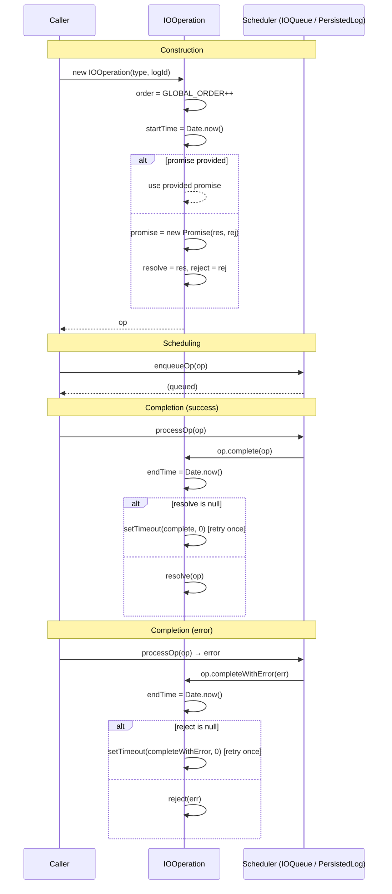

# IOOperation Specification

**Module: IO Operations**

## Overview

`IOOperation` is the base class representing a single I/O operation in the persistence pipeline. It wraps a `Promise` with resolve/reject callbacks, tracks operation timing (`startTime`, `endTime`), enforces global ordering via a monotonically increasing `GLOBAL_ORDER` counter, and provides `complete` / `completeWithError` methods to settle the promise. All concrete operation types (`WriteIOOperation`, `ReadEntryIOOperation`, `ReadEntriesIOOperation`, `ReadRangeIOOperation`) extend this class.

## Component Specifications

```typescript
class IOOperation {
    op: IOOperationType
    logId: LogId | null
    promise: Promise<any>
    resolve: ((op: IOOperation) => void) | null
    reject: ((err?: any) => void) | null
    startTime: number
    endTime: number
    processing: boolean
    order: number

    constructor(
        op: IOOperationType,
        logId?: LogId | null,
        promise?: Promise<any>,
        resolve?: ((op: IOOperation) => void) | null,
        reject?: ((err?: any) => void) | null
    ): IOOperation

    complete(op: IOOperation, retried?: boolean): void
    completeWithError(error: any, retried?: boolean): void
}
```

### Properties

| Property | Type | Description |
|---|---|---|
| `op` | `IOOperationType` | Discriminated union type (WRITE, READ_ENTRY, READ_ENTRIES, READ_RANGE) |
| `logId` | `LogId \| null` | Target log identifier; null for global operations |
| `promise` | `Promise<any>` | Promise that settles when operation completes |
| `resolve` | `((op: IOOperation) => void) \| null` | Promise resolve callback |
| `reject` | `((err?: any) => void) \| null` | Promise reject callback |
| `startTime` | `number` | `Date.now()` at construction |
| `endTime` | `number` | `Date.now()` when `complete` or `completeWithError` is called |
| `processing` | `boolean` | Set to `true` when dequeued for processing |
| `order` | `number` | Global monotonically increasing sequence number |

### Global Order

```typescript
let GLOBAL_ORDER = 0
```

Each `IOOperation` atomically captures `GLOBAL_ORDER++` upon construction, providing a total order across all operation instances regardless of type or origin.

### Dependencies

| Dependency | Role |
|---|---|
| `IOOperationType` | Enum from `../../globals` discriminating operation kinds |
| `LogId` | Log identifier (nullable) |

## System Architecture

```mermaid
graph TB
    subgraph IOOperation
        direction TB
        P[promise: Promise]
        R[resolve: fn]
        RJ[reject: fn]
        T[startTime / endTime]
        O[order: global seq]

        constructor -->|creates| P
        constructor -->|captures| O
        constructor -->|records| T
    end

    subgraph Completion
        complete -->|calls| R
        completeWithError -->|calls| RJ
    end

    subgraph Retry
        complete -.->|resolve null?| retry1[setTimeout retry]
        completeWithError -.->|reject null?| retry2[setTimeout retry]
    end

    subgraph Subclasses
        WO[WriteIOOperation]
        REO[ReadEntryIOOperation]
        RESO[ReadEntriesIOOperation]
        RRO[ReadRangeIOOperation]
    end

    IOOperation --> Subclasses
```

## Detailed Data Flow



## Visualization

```html
<!DOCTYPE html>
<html>
<head>
<meta charset="utf-8">
<style>
  body { font-family: system-ui, sans-serif; background: #1e1e2e; color: #cdd6f4; margin: 0; display: flex; flex-direction: column; align-items: center; }
  #toolbar { display: flex; gap: 12px; padding: 12px; align-items: center; flex-wrap: wrap; }
  #toolbar button { background: #45475a; border: none; color: #cdd6f4; padding: 6px 14px; border-radius: 6px; cursor: pointer; font-size: 14px; }
  #toolbar button:hover { background: #585b70; }
  #toolbar input[type="range"] { width: 300px; }
  #kf-display { font-size: 14px; min-width: 120px; text-align: center; }
  #anim-container { position: relative; width: 900px; height: 520px; }
  svg { width: 100%; height: 100%; }
  .legend { display: flex; gap: 20px; font-size: 13px; margin-top: 8px; }
  .legend-item { display: flex; align-items: center; gap: 6px; }
  .legend-dot { width: 14px; height: 14px; border-radius: 4px; }
  .tooltip { position: absolute; background: #313244; color: #cdd6f4; padding: 6px 10px; border-radius: 6px; font-size: 12px; pointer-events: none; opacity: 0; transition: opacity .15s; border: 1px solid #585b70; }
  #verify-badge { margin-left: 12px; padding: 4px 10px; border-radius: 6px; font-size: 12px; background: #45475a; }
  #verify-badge.pass { background: #a6e3a1; color: #1e1e2e; }
  #verify-badge.fail { background: #f38ba8; color: #1e1e2e; }
  .order-counter { font-family: monospace; font-size: 24px; font-weight: bold; }
</style>
</head>
<body>
<div id="toolbar">
  <button id="play-pause" data-testid="play-pause">▶ Play</button>
  <input type="range" id="kf-slider" min="0" max="100" value="0">
  <span id="kf-display">0 / <span id="kf-total">100</span></span>
  <button id="reset-btn">↺ Reset</button>
  <span id="verify-badge">● Verify</span>
</div>
<div id="anim-container"><svg id="svg"></svg></div>
<div class="legend">
  <div class="legend-item"><div class="legend-dot" style="background:#89b4fa"></div> Constructor</div>
  <div class="legend-item"><div class="legend-dot" style="background:#a6e3a1"></div> Complete (resolve)</div>
  <div class="legend-item"><div class="legend-dot" style="background:#f38ba8"></div> CompleteWithError (reject)</div>
  <div class="legend-item"><div class="legend-dot" style="background:#f9e2af"></div> Retry (setTimeout)</div>
  <div class="legend-item"><div class="legend-dot" style="background:#cba6f7"></div> Promise settled</div>
</div>
<div class="tooltip" id="tooltip"></div>
<script src="https://d3js.org/d3.v7.min.js"></script>
<script>
(function() {
  const ANIMATION_DURATION_MS = 6000;
  const ANIMATION_KEYFRAMES = 100;

  const states = [
    { frame: 0,  label: "Waiting",          phase: "idle",      detail: "No operation yet" },
    { frame: 10, label: "Constructor",      phase: "construct", detail: "new IOOperation(type, logId)" },
    { frame: 18, label: "order = GLOBAL_ORDER++", phase: "order", detail: "Captures global sequence number" },
    { frame: 26, label: "startTime = now",  phase: "start",     detail: "Date.now() recorded" },
    { frame: 34, label: "Promise Created",  phase: "promise",   detail: "new Promise with resolve/reject" },
    { frame: 42, label: "Enqueued",         phase: "enqueue",   detail: "IOQueue.enqueue(op)" },
    { frame: 50, label: "Processing",       phase: "process",   detail: "processing = true" },
    { frame: 58, label: "Complete Success", phase: "complete",  detail: "endTime = now, resolve(op)" },
    { frame: 66, label: "Complete Error",   phase: "reject",    detail: "endTime = now, reject(err)" },
    { frame: 74, label: "Retry (resolve null)",phase: "retry",  detail: "setTimeout → retry once" },
    { frame: 82, label: "Retry (reject null)",phase: "retry",   detail: "setTimeout → retry once" },
    { frame: 90, label: "Promise Settled",  phase: "settled",   detail: "Caller receives value/error" },
    { frame: 100,label: "Done",             phase: "idle",      detail: "Operation lifecycle complete" },
  ];

  const ANIMATION_VERIFICATION = (kf) => {
    const s = states.find(d => d.frame === kf) || states[states.length-1];
    return { frame: kf, phase: s.phase, label: s.label, ok: kf <= 100 };
  };

  let playing = false, timer = null, currentKf = 0;
  const svg = d3.select("#svg");
  const width = 900, height = 520;
  const tooltip = d3.select("#tooltip");

  function drawFrame(kf) {
    currentKf = kf;
    const kfState = states.reduce((prev, d) => d.frame <= kf ? d : prev, states[0]);
    const frac = kf / 100;
    svg.selectAll("*").remove();
    svg.append("rect").attr("width", width).attr("height", height).attr("fill", "#1e1e2e").attr("rx", 12);

    // Phase timeline
    const phases = ["idle","construct","order","start","promise","enqueue","process","complete","reject","retry","settled"];
    const phaseColors = { idle: "#585b70", construct: "#89b4fa", order: "#74c7ec", start: "#f9e2af", promise: "#cba6f7", enqueue: "#89b4fa", process: "#a6e3a1", complete: "#a6e3a1", reject: "#f38ba8", retry: "#f9e2af", settled: "#cba6f7" };
    const laneY = 50, laneH = 24;
    const timelineW = width - 80, tlX = 40;

    phases.forEach((ph, i) => {
      const x = tlX + (i / phases.length) * timelineW;
      const w = timelineW / phases.length;
      const isActive = kfState.phase === ph;
      svg.append("rect").attr("x", x).attr("y", laneY).attr("width", w).attr("height", laneH)
        .attr("fill", isActive ? phaseColors[ph] : "#313244").attr("stroke", "#585b70").attr("stroke-width", 1).attr("rx", 4);
      svg.append("text").attr("x", x + w/2).attr("y", laneY + laneH/2 + 4)
        .attr("text-anchor", "middle").attr("fill", "#cdd6f4").attr("font-size", 9).text(ph);
    });

    const playX = tlX + frac * timelineW;
    svg.append("line").attr("x1", playX).attr("y1", laneY - 6).attr("x2", playX).attr("y2", laneY + laneH + 6)
      .attr("stroke", "#f5c2e7").attr("stroke-width", 2).attr("stroke-dasharray", "4,2");

    // Center: IOOperation lifecycle diagram
    const cx = width / 2, cy = height / 2 + 30;

    // Order counter (large, center-top)
    const orderVal = Math.floor(frac * 42);
    svg.append("text").attr("x", cx).attr("y", cy - 100).attr("text-anchor", "middle")
      .attr("fill", "#f5c2e7").attr("font-size", 36).attr("font-weight", "bold").attr("class", "order-counter")
      .text(`#${orderVal}`);

    // Promise state machine
    const boxes = [
      { x: cx - 220, y: cy - 40, w: 120, h: 36, label: "PENDING", phase: ["construct","order","start","promise","enqueue","process"], fill: "#f9e2af" },
      { x: cx - 60, y: cy - 40, w: 120, h: 36, label: "RESOLVED", phase: ["complete","settled"], fill: "#a6e3a1" },
      { x: cx - 60, y: cy - 40, w: 120, h: 36, label: "REJECTED", phase: ["reject"], fill: "#f38ba8" },
    ];

    boxes.forEach(b => {
      const isActive = b.phase.includes(kfState.phase);
      if (isActive || (b.label === "PENDING" && !["complete","reject","settled","retry"].includes(kfState.phase))) {
        svg.append("rect").attr("x", b.x).attr("y", b.y).attr("width", b.w).attr("height", b.h)
          .attr("fill", b.fill).attr("opacity", isActive ? 0.8 : 0.2).attr("rx", 8);
        svg.append("text").attr("x", b.x + b.w/2).attr("y", b.y + b.h/2 + 5).attr("text-anchor", "middle")
          .attr("fill", "#1e1e2e").attr("font-size", 13).attr("font-weight", "bold").text(b.label);
      }
    });

    // Resolve/Reject arrows
    if (kfState.phase === "complete") {
      svg.append("line").attr("x1", cx - 100).attr("y1", cy - 22).attr("x2", cx - 60).attr("y2", cy - 22)
        .attr("stroke", "#a6e3a1").attr("stroke-width", 2).attr("marker-end", "url(#arrow-green)");
    }
    if (kfState.phase === "reject") {
      svg.append("line").attr("x1", cx - 100).attr("y1", cy - 22).attr("x2", cx - 60).attr("y2", cy - 22)
        .attr("stroke", "#f38ba8").attr("stroke-width", 2).attr("marker-end", "url(#arrow-red)");
    }

    svg.append("defs").append("marker").attr("id", "arrow-green").attr("viewBox", "0 0 10 10").attr("refX", 10).attr("refY", 5)
      .attr("markerWidth", 6).attr("markerHeight", 6).attr("orient", "auto")
      .append("path").attr("d", "M 0 0 L 10 5 L 0 10 Z").attr("fill", "#a6e3a1");
    svg.append("defs").append("marker").attr("id", "arrow-red").attr("viewBox", "0 0 10 10").attr("refX", 10).attr("refY", 5)
      .attr("markerWidth", 6).attr("markerHeight", 6).attr("orient", "auto")
      .append("path").attr("d", "M 0 0 L 10 5 L 0 10 Z").attr("fill", "#f38ba8");

    // Timeline bar showing elapsed time
    const barX = cx - 150, barY = cy + 40, barW = 300, barH = 8;
    svg.append("rect").attr("x", barX).attr("y", barY).attr("width", barW).attr("height", barH)
      .attr("fill", "#313244").attr("rx", 4);
    const elapsed = frac * barW;
    svg.append("rect").attr("x", barX).attr("y", barY).attr("width", elapsed).attr("height", barH)
      .attr("fill", "#89b4fa").attr("rx", 4);
    svg.append("text").attr("x", cx).attr("y", barY + 26).attr("text-anchor", "middle")
      .attr("fill", "#cdd6f4").attr("font-size", 11)
      .text(`startTime → endTime: ${Math.round(frac * 100)}ms`);

    // Retry indicator
    if (kfState.phase === "retry") {
      svg.append("text").attr("x", cx).attr("y", cy - 140).attr("text-anchor", "middle")
        .attr("fill", "#f9e2af").attr("font-size", 14).attr("font-weight", "bold")
        .text("⚠ resolve/reject was null — retrying via setTimeout");
    }

    svg.append("rect").attr("x", width - 210).attr("y", 10).attr("width", 190).attr("height", 30).attr("fill", "#313244").attr("rx", 6);
    svg.append("text").attr("x", width - 200).attr("y", 29).attr("fill", "#cdd6f4").attr("font-size", 12)
      .text(`kf: ${kf}  ${kfState.phase}`);

    const v = ANIMATION_VERIFICATION(kf);
    d3.select("#verify-badge").attr("class", v.ok ? "pass" : "fail").text(v.ok ? "● Pass" : "● Fail");
    d3.select("#kf-display").html(`${kf} / <span id="kf-total">${ANIMATION_KEYFRAMES}</span>`);
    d3.select("#kf-slider").property("value", kf);
  }

  function jumpToKeyframe(kf) { drawFrame(Math.max(0, Math.min(ANIMATION_KEYFRAMES, Math.round(kf)))); }
  function resetAnimation() { if (timer) { clearInterval(timer); timer = null; } playing = false; d3.select("#play-pause").text("▶ Play"); jumpToKeyframe(0); }
  function getAnimationState() { return { playing, currentKf, total: ANIMATION_KEYFRAMES }; }

  d3.select("#play-pause").on("click", function() {
    if (playing) { clearInterval(timer); timer = null; playing = false; d3.select(this).text("▶ Play"); }
    else {
      playing = true; d3.select(this).text("⏸ Pause");
      timer = setInterval(() => {
        let next = currentKf + 1;
        if (next > ANIMATION_KEYFRAMES) { clearInterval(timer); timer = null; playing = false; d3.select("#play-pause").text("▶ Play"); return; }
        jumpToKeyframe(next);
      }, ANIMATION_DURATION_MS / ANIMATION_KEYFRAMES);
    }
  });
  d3.select("#kf-slider").on("input", function() {
    if (playing) { clearInterval(timer); timer = null; playing = false; d3.select("#play-pause").text("▶ Play"); }
    jumpToKeyframe(+this.value);
  });
  d3.select("#reset-btn").on("click", resetAnimation);
  d3.select("#anim-container").on("mousemove", function(e) {
    const rect = this.getBoundingClientRect();
    const x = e.clientX - rect.left, y = e.clientY - rect.top;
    const kf = Math.round((x / rect.width) * 100);
    if (kf >= 0 && kf <= 100) {
      const s = states.reduce((prev, d) => d.frame <= kf ? d : prev, states[0]);
      tooltip.style("opacity", 1).style("left", (x + 12) + "px").style("top", (y - 30) + "px").html(`<b>${s.label}</b><br/>${s.detail}`);
    } else tooltip.style("opacity", 0);
  }).on("mouseleave", () => tooltip.style("opacity", 0));
  jumpToKeyframe(0);
})();
</script>
</body>
</html>
```

### Visualization Keyframe Table

| kf | Phase | Description |
|----|-------|-------------|
| 0 | idle | No operation |
| 10 | construct | `new IOOperation(type, logId)` invoked |
| 18 | order | Atomically captures `GLOBAL_ORDER++` |
| 26 | start | `startTime = Date.now()` recorded |
| 34 | promise | Internal promise created with resolve/reject |
| 42 | enqueue | Operation added to IOQueue |
| 50 | process | `processing = true` set by queue |
| 58 | complete | `complete(op)` → `endTime = now`, `resolve(op)` |
| 66 | reject | `completeWithError(err)` → `endTime = now`, `reject(err)` |
| 74 | retry | resolve was null → setTimeout retry (success path) |
| 82 | retry | reject was null → setTimeout retry (error path) |
| 90 | settled | Caller receives value or error from promise |
| 100 | idle | Lifecycle complete |

## Testing Requirements

| Test Case | Input | Expected Outcome |
|---|---|---|
| `constructor creates promise if not provided` | No promise arg | Internal `new Promise` created; resolve/reject stored |
| `constructor uses provided promise` | Promise object passed | That promise used directly |
| `constructor captures order` | Multiple IOOperation instances | Each gets sequentially increasing `order` |
| `constructor sets startTime` | Any | `startTime` is ≤ `Date.now()` |
| `constructor sets endTime = 0` | Any | `endTime` is 0 initially |
| `complete sets endTime and resolves` | Valid op | `endTime ≥ startTime`; `resolve(op)` called |
| `complete retries if resolve null` | resolve is null | `setTimeout` with `retried=true`, then resolves |
| `complete does not double-retry` | retried=true, still null | Logs error, does not retry again |
| `completeWithError sets endTime and rejects` | Valid error | `endTime ≥ startTime`; `reject(err)` called |
| `completeWithError retries if reject null` | reject is null | `setTimeout` with `retried=true`, then rejects |
| `completeWithError does not double-retry` | retried=true, still null | Logs error, does not retry again |
| `op defaults are correct` | Default params | `logId = null`, `processing = false`, `endTime = 0` |
| Global order monotonic | Consecutive construction | `op1.order < op2.order < op3.order` |

---

## 7. Source-Test Cross-References

### Test Coverage

| Test Spec | Path |
|---|---|
| IOOperation.test.spec.md | `source/src/lib/persist/io/IOOperation.test.spec.md` |
