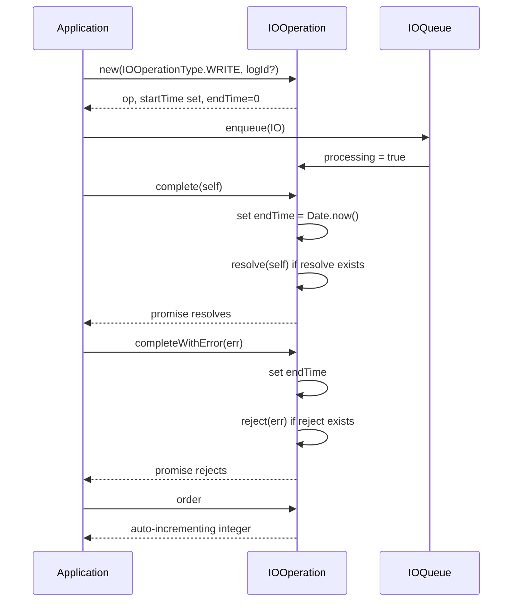

# IOOperation Specification

## 1. Overview

`IOOperation` is the base class for all I/O operations in the persistence layer. It tracks operation type, log association, timing (start/end), processing state, and completion via Promise-based resolve/reject callbacks. Operations are ordered monotonically via a static counter.

## 2. Component Specifications (TypeScript Declarations)

```typescript
class IOOperation {
  op: IOOperationType
  logId: any | null
  startTime: number
  endTime: number
  processing: boolean
  order: number
  promise: Promise<this>

  constructor(
    op: IOOperationType,
    logId?: any | null,
    resolve?: ((value: this) => void) | null,
    reject?: ((reason: any) => void) | null,
    order?: number | null,
  )

  complete(self: this): void
  completeWithError(err: Error): void
}
```

## 3. System Architecture (Mermaid graph TB)

```mermaid
graph TB
    subgraph "IOOperation"
        IO[IOOperation]
        IO --> TYPE[op: IOOperationType]
        IO --> LOG[logId: LogId | null]
        IO --> START[startTime: number]
        IO --> END[endTime: number]
        IO --> PROC[processing: boolean]
        IO --> ORDER[order: number]
    end

    subgraph "Operation Types"
        TYPE --> WR[WRITE]
        TYPE --> RE[READ_ENTRY]
        TYPE --> RES[READ_ENTRIES]
        TYPE --> RR[READ_RANGE]
    end

    subgraph "Subclasses"
        WIO[WriteIOOperation]
        REIO[ReadEntryIOOperation]
        RSIO[ReadEntriesIOOperation]
        RRIO[ReadRangeIOOperation]
        WIO -.-> IO
        REIO -.-> IO
        RSIO -.-> IO
        RRIO -.-> IO
    end
```

## 4. Detailed Data Flow (Mermaid sequenceDiagram)



## 5. Visualization (self-contained D3 HTML)

```html
<!DOCTYPE html>
<html>
<head>
<meta charset="utf-8">
<title>IOOperation Animation</title>
<style>
  body { font-family: system-ui, sans-serif; background: #0d1117; display: flex; flex-direction: column; align-items: center; padding: 2rem; }
  #container { max-width: 960px; width: 100%; }
  svg { display: block; margin: 0 auto; background: #161b22; border-radius: 8px; box-shadow: 0 4px 24px rgba(0,0,0,0.4); }
  .controls { display: flex; gap: 12px; align-items: center; margin-top: 1rem; flex-wrap: wrap; justify-content: center; }
  button { background: #238636; color: #fff; border: none; border-radius: 6px; padding: 8px 20px; font-size: 14px; cursor: pointer; }
  button:hover { background: #2ea043; }
  button:disabled { opacity: 0.5; cursor: not-allowed; }
  label { color: #c9d1d9; font-size: 13px; }
  input[type="range"] { width: 240px; accent-color: #238636; }
  .stats { color: #8b949e; font-size: 12px; margin-top: 0.5rem; display: flex; gap: 1rem; flex-wrap: wrap; justify-content: center; }
  .byte-legend { display: flex; gap: 2px; justify-content: center; flex-wrap: wrap; margin: 0.5rem 0; }
  .legend-item { display: flex; align-items: center; gap: 4px; font-size: 11px; color: #c9d1d9; }
  .legend-swatch { width: 14px; height: 14px; border-radius: 3px; border: 1px solid #30363d; }
  #kf-total { color: #58a6ff; font-weight: 600; }
</style>
</head>
<body>
<div id="container">
  <svg id="vis" width="900" height="400"></svg>
  <div class="controls">
    <button id="play-pause" data-testid="play-pause">▶ Play</button>
    <button id="reset">↺ Reset</button>
    <label>Keyframe <span id="kf-current">0</span>/<span id="kf-total">0</span>
      <input type="range" id="kf-slider" min="0" max="0" value="0" step="1">
    </label>
  </div>
  <div class="stats">
    <span id="state-label">State: <span id="state-value">idle</span></span>
    <span>Phase: <span id="phase-value">—</span></span>
  </div>
  <div class="byte-legend" id="legend"></div>
</div>

<script src="https://d3js.org/d3.v7.min.js"></script>
<script>
(function() {
  const ANIMATION_DURATION_MS = 800;
  const ANIMATION_KEYFRAMES = [
    { label: "Create IOOperation", phase: "create", desc: "Set op type, logId, startTime" },
    { label: "Assign order", phase: "order", desc: "Incrementing static counter" },
    { label: "Enqueue in queue", phase: "queue", desc: "Waiting for processing" },
    { label: "Processing starts", phase: "process", desc: "processing flag set to true" },
    { label: "Complete success", phase: "complete", desc: "set endTime, resolve promise" },
    { label: "Complete error", phase: "error", desc: "set endTime, reject promise" },
  ];
  const ANIMATION_VERIFICATION = [
    "Constructor sets op, logId, startTime, endTime=0, processing=false",
    "order auto-increments across instances",
    "complete() sets endTime and resolves the promise",
    "completeWithError() sets endTime and rejects the promise",
    "complete() with null resolve does not throw (retry path)",
    "completeWithError() with null reject does not throw (retry path)",
  ];

  const LEGEND = [
    { label: "Create", color: "#b2df8a" },
    { label: "Queue", color: "#fdbf6f" },
    { label: "Process", color: "#a6cee3" },
    { label: "Complete", color: "#f781bf" },
    { label: "Error", color: "#fb9a99" },
  ];

  const legendEl = document.getElementById("legend");
  LEGEND.forEach(l => {
    const item = document.createElement("span");
    item.className = "legend-item";
    item.innerHTML = `<span class="legend-swatch" style="background:${l.color}"></span>${l.label}`;
    legendEl.appendChild(item);
  });

  const TOTAL_KF = ANIMATION_KEYFRAMES.length;
  document.getElementById("kf-total").textContent = TOTAL_KF;

  const width = 900, height = 400;
  const svg = d3.select("#vis");

  const infoY = 60;
  svg.append("text")
    .attr("x", width / 2).attr("y", 30)
    .attr("text-anchor", "middle").attr("fill", "#58a6ff")
    .attr("font-size", "18").attr("font-weight", "bold")
    .text("IOOperation Lifecycle");

  svg.append("text")
    .attr("id", "phase-label")
    .attr("x", width / 2).attr("y", infoY)
    .attr("text-anchor", "middle").attr("fill", "#8b949e")
    .attr("font-size", "13")
    .text("Click Play to animate");

  svg.append("text")
    .attr("id", "desc-label")
    .attr("x", width / 2).attr("y", infoY + 20)
    .attr("text-anchor", "middle").attr("fill", "#c9d1d9")
    .attr("font-size", "12")
    .text("");

  const timelineY = height - 60;
  svg.append("text")
    .attr("x", width / 2).attr("y", timelineY - 10)
    .attr("text-anchor", "middle").attr("fill", "#8b949e")
    .attr("font-size", "11")
    .text("Keyframe Timeline");

  const kfBarW = Math.min(700, width - 80);
  const kfBarX = (width - kfBarW) / 2;

  svg.append("rect")
    .attr("x", kfBarX).attr("y", timelineY)
    .attr("width", kfBarW).attr("height", 6).attr("rx", 3)
    .attr("fill", "#30363d");

  svg.append("rect")
    .attr("id", "timeline-progress")
    .attr("x", kfBarX).attr("y", timelineY)
    .attr("width", 0).attr("height", 6).attr("rx", 3)
    .attr("fill", "#238636");

  const kfSpacing = kfBarW / (TOTAL_KF - 1 || 1);
  svg.selectAll("circle.kf-marker")
    .data(d3.range(TOTAL_KF))
    .join("circle")
    .attr("class", "kf-marker")
    .attr("cx", (d, i) => kfBarX + i * kfSpacing)
    .attr("cy", timelineY + 3)
    .attr("r", 5)
    .attr("fill", "#484f58")
    .attr("stroke", "#30363d");

  svg.append("text")
    .attr("id", "kf-label")
    .attr("x", width / 2).attr("y", timelineY + 30)
    .attr("text-anchor", "middle").attr("fill", "#c9d1d9")
    .attr("font-size", "11")
    .text("");

  let currentKF = 0;
  let playing = false;
  let timer = null;
  const state = { keyframe: 0, phase: "idle" };

  function jumpToKeyframe(idx) {
    if (idx < 0) idx = 0;
    if (idx >= TOTAL_KF) { idx = TOTAL_KF - 1; if (playing) stop(); }
    currentKF = idx;
    const kf = ANIMATION_KEYFRAMES[idx];
    if (!kf) return;

    document.getElementById("kf-current").textContent = idx;
    document.getElementById("kf-slider").value = idx;
    document.getElementById("phase-value").textContent = kf.phase;
    document.getElementById("state-value").textContent = idx >= TOTAL_KF - 1 ? "complete" : (playing ? "playing" : "paused");

    svg.select("#phase-label").text(kf.label);
    svg.select("#desc-label").text(kf.desc);

    const progress = idx / (TOTAL_KF - 1);
    svg.select("#timeline-progress").attr("width", progress * kfBarW);

    svg.selectAll("circle.kf-marker")
      .attr("fill", (d, i) => i <= idx ? "#238636" : "#484f58")
      .attr("r", (d, i) => i === idx ? 7 : 5);

    svg.select("#kf-label").text(`${idx}: ${kf.label}`);

    state.keyframe = idx;
    state.phase = kf.phase;
  }

  function resetAnimation() {
    stop();
    jumpToKeyframe(0);
    document.getElementById("state-value").textContent = "idle";
    document.getElementById("phase-value").textContent = "—";
    svg.select("#phase-label").text("Click Play to animate");
    svg.select("#desc-label").text("");
    svg.select("#timeline-progress").attr("width", 0);
    svg.selectAll("circle.kf-marker").attr("fill", "#484f58").attr("r", 5);
    svg.select("#kf-label").text("");
    state.keyframe = 0;
    state.phase = "idle";
  }

  function stop() {
    playing = false;
    if (timer) { clearTimeout(timer); timer = null; }
    const btn = document.getElementById("play-pause");
    btn.textContent = "▶ Play";
    document.getElementById("state-value").textContent = "paused";
  }

  function play() {
    if (currentKF >= TOTAL_KF - 1) { resetAnimation(); }
    playing = true;
    const btn = document.getElementById("play-pause");
    btn.textContent = "⏸ Pause";
    document.getElementById("state-value").textContent = "playing";
    advance();
  }

  function advance() {
    if (!playing) return;
    if (currentKF >= TOTAL_KF - 1) { stop(); return; }
    jumpToKeyframe(currentKF + 1);
    timer = setTimeout(advance, ANIMATION_DURATION_MS / TOTAL_KF);
  }

  function togglePlay() {
    if (playing) { stop(); }
    else { play(); }
  }

  function getAnimationState() {
    return { ...state, isPlaying: playing, totalKeyframes: TOTAL_KF };
  }

  document.getElementById("play-pause").addEventListener("click", togglePlay);
  document.getElementById("reset").addEventListener("click", resetAnimation);
  document.getElementById("kf-slider").addEventListener("input", function() {
    if (playing) stop();
    jumpToKeyframe(parseInt(this.value));
  });

  jumpToKeyframe(0);
  window.ANIMATION_DURATION_MS = ANIMATION_DURATION_MS;
  window.ANIMATION_KEYFRAMES = ANIMATION_KEYFRAMES;
  window.ANIMATION_VERIFICATION = ANIMATION_VERIFICATION;
  window.jumpToKeyframe = jumpToKeyframe;
  window.resetAnimation = resetAnimation;
  window.getAnimationState = getAnimationState;
})();
</script>
</body>
</html>
```

## 6. Testing Requirements

| # | Test | Expected |
|---|------|----------|
| 1 | Create with `IOOperationType.WRITE` | `op` is WRITE, `logId` is null, `startTime` > 0, `endTime` = 0, `processing` = false |
| 2 | Create with `logId` | `op` is READ_ENTRY |
| 3 | `complete()` sets `endTime` | `endTime` > 0 after call |
| 4 | `completeWithError()` rejects promise | Promise rejects with error message "test error" |
| 5 | `order` auto-increments | Second operation has greater order than first |
| 6 | `complete()` with null resolve does not pollute console | Completes without error |
| 7 | `completeWithError()` with null reject does not pollute console | Completes without error |
| 8 | `complete()` resolves promise to self | Promise resolves to the operation instance |
| 9 | `completeWithError()` rejects with given error | Promise rejects with "test error" |

---

## 7. Source-Test Cross-References

### Source Coverage

| Source Spec | Path |
|---|---|
| IOOperation.spec.md | `source/src/lib/persist/io/IOOperation.spec.md` |
