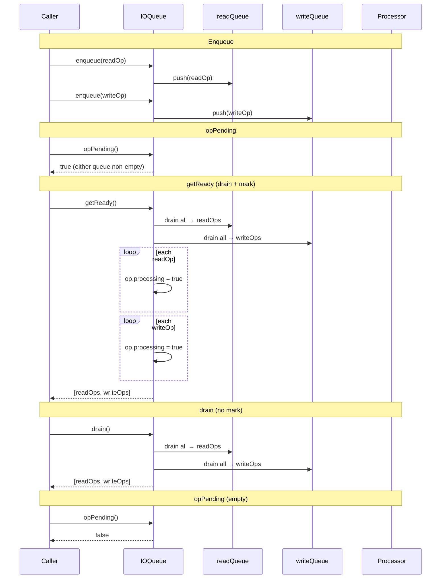

# IOQueue Specification

**Module: IO Operations**

## Overview

`IOQueue` is a simple dual-queue data structure that separates read and write operations. It provides methods to enqueue operations (routing them to the read or write queue based on `IOOperationType`), drain all pending operations, and atomically dequeue all ready operations via `getReady` (which also sets `processing = true` on each operation). This queue is the building block used by both `PersistedLog` (directly) and `GlobalLogIOQueue` (as per-log partition).

## Component Specifications

```typescript
class IOQueue {
    readQueue: ReadIOOperation[]
    writeQueue: WriteIOOperation[]

    constructor(): IOQueue
    getReady(): [ReadIOOperation[], WriteIOOperation[]]
    drain(): [ReadIOOperation[], WriteIOOperation[]]
    opPending(): boolean
    enqueue(op: IOOperation): void
}
```

### Properties

| Property | Type | Default | Description |
|---|---|---|---|
| `readQueue` | `ReadIOOperation[]` | `[]` | Queue of pending read operations |
| `writeQueue` | `WriteIOOperation[]` | `[]` | Queue of pending write operations |

### Routing Logic

```
enqueue(op):
  if op.op === IOOperationType.WRITE → writeQueue.push(op)
  else                                → readQueue.push(op)
```

### Dependencies

| Dependency | Role |
|---|---|
| `IOOperation` | Base operation class |
| `WriteIOOperation` | Write operation (extracts from writeQueue) |
| `ReadIOOperation` | Type alias from `../../globals` for read operations |
| `IOOperationType` | Enum discriminating operation types |

## System Architecture

```mermaid
graph TB
    subgraph IOQueue
        direction TB
        RQ[readQueue: ReadIOOperation[]]
        WQ[writeQueue: WriteIOOperation[]]

        enqueue -->|op.op === WRITE| WQ
        enqueue -->|else| RQ

        getReady -->|drain + mark processing| RQ_out[returns readOps]
        getReady -->|drain + mark processing| WQ_out[returns writeOps]

        drain -->|drain without marking| RQ_d[returns readOps]
        drain -->|drain without marking| WQ_d[returns writeOps]

        opPending -->|check length > 0| pending_bool
    end

    subgraph Consumers
        PL[PersistedLog.processOpsAsync]
        GLQ[GlobalLogIOQueue]
    end

    getReady --> PL
    getReady --> GLQ
```

## Detailed Data Flow



## Visualization

```html
<!DOCTYPE html>
<html>
<head>
<meta charset="utf-8">
<style>
  body { font-family: system-ui, sans-serif; background: #1e1e2e; color: #cdd6f4; margin: 0; display: flex; flex-direction: column; align-items: center; }
  #toolbar { display: flex; gap: 12px; padding: 12px; align-items: center; flex-wrap: wrap; }
  #toolbar button { background: #45475a; border: none; color: #cdd6f4; padding: 6px 14px; border-radius: 6px; cursor: pointer; font-size: 14px; }
  #toolbar button:hover { background: #585b70; }
  #toolbar input[type="range"] { width: 300px; }
  #kf-display { font-size: 14px; min-width: 120px; text-align: center; }
  #anim-container { position: relative; width: 900px; height: 540px; }
  svg { width: 100%; height: 100%; }
  .legend { display: flex; gap: 20px; font-size: 13px; margin-top: 8px; }
  .legend-item { display: flex; align-items: center; gap: 6px; }
  .legend-dot { width: 14px; height: 14px; border-radius: 4px; }
  .tooltip { position: absolute; background: #313244; color: #cdd6f4; padding: 6px 10px; border-radius: 6px; font-size: 12px; pointer-events: none; opacity: 0; transition: opacity .15s; border: 1px solid #585b70; }
  #verify-badge { margin-left: 12px; padding: 4px 10px; border-radius: 6px; font-size: 12px; background: #45475a; }
  #verify-badge.pass { background: #a6e3a1; color: #1e1e2e; }
  #verify-badge.fail { background: #f38ba8; color: #1e1e2e; }
</style>
</head>
<body>
<div id="toolbar">
  <button id="play-pause" data-testid="play-pause">▶ Play</button>
  <input type="range" id="kf-slider" min="0" max="100" value="0">
  <span id="kf-display">0 / <span id="kf-total">100</span></span>
  <button id="reset-btn">↺ Reset</button>
  <span id="verify-badge">● Verify</span>
</div>
<div id="anim-container"><svg id="svg"></svg></div>
<div class="legend">
  <div class="legend-item"><div class="legend-dot" style="background:#89b4fa"></div> Read Queue</div>
  <div class="legend-item"><div class="legend-dot" style="background:#a6e3a1"></div> Write Queue</div>
  <div class="legend-item"><div class="legend-dot" style="background:#f9e2af"></div> Operation</div>
  <div class="legend-item"><div class="legend-dot" style="background:#cba6f7"></div> Processing (marked)</div>
</div>
<div class="tooltip" id="tooltip"></div>
<script src="https://d3js.org/d3.v7.min.js"></script>
<script>
(function() {
  const ANIMATION_DURATION_MS = 6000;
  const ANIMATION_KEYFRAMES = 100;

  const states = [
    { frame: 0,  label: "Empty Queues",       phase: "empty",   detail: "readQueue=[], writeQueue=[]" },
    { frame: 10, label: "Enqueue Write",       phase: "enq-w",   detail: "writeQueue.push(writeOp)" },
    { frame: 18, label: "Enqueue Read",        phase: "enq-r",   detail: "readQueue.push(readOp)" },
    { frame: 26, label: "Enqueue Another Write",phase: "enq-w",  detail: "writeQueue.push(writeOp)" },
    { frame: 34, label: "opPending = true",    phase: "pending", detail: "readQueue.length > 0 || writeQueue.length > 0" },
    { frame: 42, label: "getReady: drain read",phase: "drain-r", detail: "readOps = readQueue; readQueue = []" },
    { frame: 50, label: "getReady: drain write",phase: "drain-w",detail: "writeOps = writeQueue; writeQueue = []" },
    { frame: 58, label: "Mark processing",     phase: "mark",    detail: "op.processing = true for all ops" },
    { frame: 66, label: "Return [readOps, writeOps]", phase: "return", detail: "Processor receives ops" },
    { frame: 74, label: "drain (no mark)",     phase: "drain",   detail: "Clear both queues without marking" },
    { frame: 82, label: "opPending = false",   phase: "pending", detail: "Both queues now empty" },
    { frame: 100,label: "Done",                phase: "empty",   detail: "Ready for new ops" },
  ];

  const ANIMATION_VERIFICATION = (kf) => {
    const s = states.find(d => d.frame === kf) || states[states.length-1];
    return { frame: kf, phase: s.phase, label: s.label, ok: kf <= 100 };
  };

  let playing = false, timer = null, currentKf = 0;
  const svg = d3.select("#svg");
  const width = 900, height = 540;
  const tooltip = d3.select("#tooltip");

  function drawFrame(kf) {
    currentKf = kf;
    const kfState = states.reduce((prev, d) => d.frame <= kf ? d : prev, states[0]);
    const frac = kf / 100;
    svg.selectAll("*").remove();
    svg.append("rect").attr("width", width).attr("height", height).attr("fill", "#1e1e2e").attr("rx", 12);

    // Phase timeline
    const phases = ["empty","enq-w","enq-r","pending","drain-r","drain-w","mark","return","drain"];
    const phaseColors = { empty: "#585b70", "enq-w": "#a6e3a1", "enq-r": "#89b4fa", pending: "#f9e2af", "drain-r": "#89b4fa", "drain-w": "#a6e3a1", mark: "#cba6f7", return: "#a6e3a1", drain: "#f38ba8" };
    const laneY = 40, laneH = 24;
    const timelineW = width - 80, tlX = 40;

    phases.forEach((ph, i) => {
      const x = tlX + (i / phases.length) * timelineW;
      const w = timelineW / phases.length;
      const isActive = kfState.phase === ph;
      svg.append("rect").attr("x", x).attr("y", laneY).attr("width", w).attr("height", laneH)
        .attr("fill", isActive ? phaseColors[ph] : "#313244").attr("stroke", "#585b70").attr("stroke-width", 1).attr("rx", 4);
      svg.append("text").attr("x", x + w/2).attr("y", laneY + laneH/2 + 4)
        .attr("text-anchor", "middle").attr("fill", "#cdd6f4").attr("font-size", 9).text(ph);
    });

    const playX = tlX + frac * timelineW;
    svg.append("line").attr("x1", playX).attr("y1", laneY - 6).attr("x2", playX).attr("y2", laneY + laneH + 6)
      .attr("stroke", "#f5c2e7").attr("stroke-width", 2).attr("stroke-dasharray", "4,2");

    // === Visualize two queues ===
    const qy = height / 2 - 30;
    const qw = 200, qh = 180;

    // Read queue
    const rqx = 120;
    svg.append("rect").attr("x", rqx).attr("y", qy).attr("width", qw).attr("height", qh)
      .attr("fill", "#1e1e2e").attr("stroke", "#89b4fa").attr("stroke-width", 2).attr("rx", 8);
    svg.append("text").attr("x", rqx + qw/2).attr("y", qy + 20).attr("text-anchor", "middle")
      .attr("fill", "#89b4fa").attr("font-size", 13).attr("font-weight", "bold").text("readQueue");

    // Write queue
    const wqx = 580;
    svg.append("rect").attr("x", wqx).attr("y", qy).attr("width", qw).attr("height", qh)
      .attr("fill", "#1e1e2e").attr("stroke", "#a6e3a1").attr("stroke-width", 2).attr("rx", 8);
    svg.append("text").attr("x", wqx + qw/2).attr("y", qy + 20).attr("text-anchor", "middle")
      .attr("fill", "#a6e3a1").attr("font-size", 13).attr("font-weight", "bold").text("writeQueue");

    // Compute item counts based on phase
    let rCount = 0, wCount = 0;
    const enqPhases = ["enq-w","enq-r","pending"];
    const drainPhases = ["drain-r","drain-w","mark","return"];
    if (["empty","drain"].includes(kfState.phase) || (kfState.phase === "return" && frac > 0.66)) { rCount = 0; wCount = 0; }
    else if (kfState.phase === "enq-w") { wCount = kf <= 14 ? 1 : 2; rCount = 0; }
    else if (kfState.phase === "enq-r") { wCount = 1; rCount = 1; }
    else if (kfState.phase === "pending") { rCount = 2; wCount = 2; }
    else if (kfState.phase === "drain-r") { rCount = 0; wCount = 2; }
    else if (kfState.phase === "drain-w") { rCount = 0; wCount = 0; }
    else if (["mark","return"].includes(kfState.phase)) { rCount = 0; wCount = 0; }

    // Draw items in read queue
    for (let i = 0; i < Math.min(rCount, 6); i++) {
      const iy = qy + 34 + i * 22;
      const isProc = drainPhases.includes(kfState.phase);
      svg.append("rect").attr("x", rqx + 10).attr("y", iy).attr("width", qw - 20).attr("height", 18)
        .attr("fill", isProc ? "#cba6f7" : "#89b4fa").attr("opacity", isProc ? 0.6 : 0.4).attr("rx", 4);
      svg.append("text").attr("x", rqx + qw/2).attr("y", iy + 13).attr("text-anchor", "middle")
        .attr("fill", "#1e1e2e").attr("font-size", 9).text(`readOp #${i+1}`);
    }

    // Draw items in write queue
    for (let i = 0; i < Math.min(wCount, 6); i++) {
      const iy = qy + 34 + i * 22;
      const isProc = drainPhases.includes(kfState.phase);
      svg.append("rect").attr("x", wqx + 10).attr("y", iy).attr("width", qw - 20).attr("height", 18)
        .attr("fill", isProc ? "#cba6f7" : "#a6e3a1").attr("opacity", isProc ? 0.6 : 0.4).attr("rx", 4);
      svg.append("text").attr("x", wqx + qw/2).attr("y", iy + 13).attr("text-anchor", "middle")
        .attr("fill", "#1e1e2e").attr("font-size", 9).text(`writeOp #${i+1}`);
    }

    // Labels between queues showing operation
    const cx = width / 2;
    if (kfState.phase === "enq-w") {
      svg.append("text").attr("x", cx).attr("y", qy + qh/2).attr("text-anchor", "middle")
        .attr("fill", "#a6e3a1").attr("font-size", 14).text("← enqueue(writeOp)");
    }
    if (kfState.phase === "enq-r") {
      svg.append("text").attr("x", cx).attr("y", qy + qh/2).attr("text-anchor", "middle")
        .attr("fill", "#89b4fa").attr("font-size", 14).text("← enqueue(readOp)");
    }
    if (kfState.phase === "drain-r") {
      svg.append("path").attr("d", `M ${rqx + qw} ${qy + 30} L ${cx - 20} ${qy + 30} L ${cx - 20} ${qy + qh - 20} L ${cx} ${qy + qh - 20}`)
        .attr("fill", "none").attr("stroke", "#f5c2e7").attr("stroke-width", 2).attr("stroke-dasharray", "5,3");
      svg.append("text").attr("x", cx).attr("y", qy + qh - 10).attr("text-anchor", "middle")
        .attr("fill", "#f5c2e7").attr("font-size", 12).text("draining readOps");
    }
    if (kfState.phase === "drain-w") {
      svg.append("path").attr("d", `M ${wqx} ${qy + 30} L ${cx + 20} ${qy + 30} L ${cx + 20} ${qy + qh - 20} L ${cx} ${qy + qh - 20}`)
        .attr("fill", "none").attr("stroke", "#f5c2e7").attr("stroke-width", 2).attr("stroke-dasharray", "5,3");
      svg.append("text").attr("x", cx).attr("y", qy + qh - 10).attr("text-anchor", "middle")
        .attr("fill", "#f5c2e7").attr("font-size", 12).text("draining writeOps");
    }

    // Status text at bottom
    svg.append("rect").attr("x", cx - 150).attr("y", height - 60).attr("width", 300).attr("height", 36)
      .attr("fill", "#313244").attr("rx", 6);
    svg.append("text").attr("x", cx).attr("y", height - 38).attr("text-anchor", "middle")
      .attr("fill", "#cdd6f4").attr("font-size", 13)
      .text(`readQueue: ${rCount} items  |  writeQueue: ${wCount} items`);

    svg.append("rect").attr("x", width - 210).attr("y", 8).attr("width", 190).attr("height", 28).attr("fill", "#313244").attr("rx", 6);
    svg.append("text").attr("x", width - 200).attr("y", 26).attr("fill", "#cdd6f4").attr("font-size", 11).text(`kf: ${kf}  ${kfState.phase}`);

    const v = ANIMATION_VERIFICATION(kf);
    d3.select("#verify-badge").attr("class", v.ok ? "pass" : "fail").text(v.ok ? "● Pass" : "● Fail");
    d3.select("#kf-display").html(`${kf} / <span id="kf-total">${ANIMATION_KEYFRAMES}</span>`);
    d3.select("#kf-slider").property("value", kf);
  }

  function jumpToKeyframe(kf) { drawFrame(Math.max(0, Math.min(ANIMATION_KEYFRAMES, Math.round(kf)))); }
  function resetAnimation() { if (timer) { clearInterval(timer); timer = null; } playing = false; d3.select("#play-pause").text("▶ Play"); jumpToKeyframe(0); }
  function getAnimationState() { return { playing, currentKf, total: ANIMATION_KEYFRAMES }; }

  d3.select("#play-pause").on("click", function() {
    if (playing) { clearInterval(timer); timer = null; playing = false; d3.select(this).text("▶ Play"); }
    else {
      playing = true; d3.select(this).text("⏸ Pause");
      timer = setInterval(() => {
        let next = currentKf + 1;
        if (next > ANIMATION_KEYFRAMES) { clearInterval(timer); timer = null; playing = false; d3.select("#play-pause").text("▶ Play"); return; }
        jumpToKeyframe(next);
      }, ANIMATION_DURATION_MS / ANIMATION_KEYFRAMES);
    }
  });
  d3.select("#kf-slider").on("input", function() {
    if (playing) { clearInterval(timer); timer = null; playing = false; d3.select("#play-pause").text("▶ Play"); }
    jumpToKeyframe(+this.value);
  });
  d3.select("#reset-btn").on("click", resetAnimation);
  d3.select("#anim-container").on("mousemove", function(e) {
    const rect = this.getBoundingClientRect();
    const x = e.clientX - rect.left, y = e.clientY - rect.top;
    const kf = Math.round((x / rect.width) * 100);
    if (kf >= 0 && kf <= 100) {
      const s = states.reduce((prev, d) => d.frame <= kf ? d : prev, states[0]);
      tooltip.style("opacity", 1).style("left", (x + 12) + "px").style("top", (y - 30) + "px").html(`<b>${s.label}</b><br/>${s.detail}`);
    } else tooltip.style("opacity", 0);
  }).on("mouseleave", () => tooltip.style("opacity", 0));
  jumpToKeyframe(0);
})();
</script>
</body>
</html>
```

### Visualization Keyframe Table

| kf | Phase | Description |
|----|-------|-------------|
| 0 | empty | Both queues empty |
| 10 | enq-w | Write op enqueued |
| 18 | enq-r | Read op enqueued |
| 26 | enq-w | Second write op enqueued |
| 34 | pending | `opPending() = true` |
| 42 | drain-r | readQueue drained, ops captured |
| 50 | drain-w | writeQueue drained, ops captured |
| 58 | mark | `op.processing = true` on all |
| 66 | return | `[readOps, writeOps]` returned |
| 74 | drain | `drain()` clears without marking |
| 82 | pending | Both queues empty, `opPending() = false` |
| 100 | empty | Ready for new operations |

## Testing Requirements

| Test Case | Input | Expected Outcome |
|---|---|---|
| `enqueue routes write` | WriteIOOperation | Pushed to `writeQueue` |
| `enqueue routes read` | ReadIOOperation | Pushed to `readQueue` |
| `enqueue routes unknown as read` | IOOperation with non-WRITE type | Pushed to `readQueue` (else branch) |
| `getReady returns empty` | Both queues empty | `[[], []]` |
| `getReady drains readQueue` | Read ops present | readQueue emptied, ops returned with `processing=true` |
| `getReady drains writeQueue` | Write ops present | writeQueue emptied, ops returned with `processing=true` |
| `getReady marks all ops as processing` | Mixed queue | Every returned op has `processing === true` |
| `drain returns without marking` | Non-empty queue | Queues cleared, `processing` unchanged |
| `opPending returns true` | Non-empty queue | `true` |
| `opPending returns false` | Both queues empty | `false` |
| `enqueue after getReady` | New op after drain | Enqueues into fresh arrays |
| Idempotent drain | Multiple calls | Second call returns `[[], []]` |

---

## 7. Source-Test Cross-References

### Test Coverage

| Test Spec | Path |
|---|---|
| IOQueue.test.spec.md | `source/src/lib/persist/io/IOQueue.test.spec.md` |
