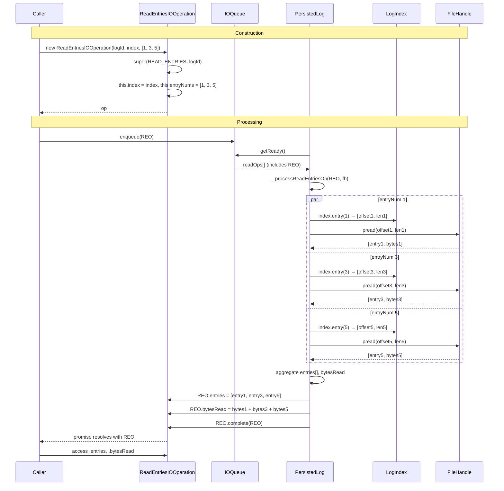

# ReadEntriesIOOperation Specification

**Module: IO Operations**

## Overview

`ReadEntriesIOOperation` extends `IOOperation` to represent a batch read operation that retrieves multiple log entries by a list of entry numbers. It holds a reference to the `LogIndex` and an array of `entryNums`, and outputs an `entries` array and cumulative `bytesRead` upon completion. The processor (`_processReadEntriesOp`) resolves all entries in parallel via `Promise.all`, then sets the results and completes the operation.

## Component Specifications

```typescript
class ReadEntriesIOOperation extends IOOperation {
    index: LogIndex
    entryNums: number[]
    entries: Array<GlobalLogEntry | LogLogEntry> | null
    bytesRead: number

    constructor(logId: LogId, index: LogIndex, entryNums: number[]): ReadEntriesIOOperation
}
```

### Properties

| Property | Type | Default | Description |
|---|---|---|---|
| `index` | `LogIndex` | — | Index to resolve entry offsets/lengths |
| `entryNums` | `number[]` | — | Array of entry numbers to read |
| `entries` | `Array<GlobalLogEntry \| LogLogEntry> \| null` | `null` | Populated by processor on success |
| `bytesRead` | `number` | `0` | Cumulative bytes read from all entries |

### Constructor Behavior

```
super(IOOperationType.READ_ENTRIES, logId)
this.index = index
this.entryNums = entryNums
```

### Processing Flow (in PersistedLog._processReadEntriesOp)

```
entryReads = await Promise.all(
  entryNums.map(entryNum =>
    _processReadLogEntry(fh, logId, ...index.entry(entryNum))
  )
)
entries = []
for ([entry, bytesRead] of entryReads):
    bytesRead += bytesRead
    entries.push(entry)
this.entries = entries
this.bytesRead = bytesRead
this.complete(this)
```

### Dependencies

| Dependency | Role |
|---|---|
| `IOOperation` | Base class providing promise, order, timing |
| `LogIndex` | Index to resolve entry offset & length |
| `LogId` | Log identifier for routing |
| `GlobalLogEntry` / `LogLogEntry` | Entry types produced |
| `IOOperationType` | Enum value `READ_ENTRIES` |

## System Architecture

```mermaid
graph TB
    subgraph ReadEntriesIOOperation
        direction TB
        I[index: LogIndex]
        EN[entryNums: number[]]
        ES[entries: Entry[] | null]
        BR[bytesRead: number]
    end

    IOOperation -->|extends| ReadEntriesIOOperation

    subgraph Processor
        PL[_processReadEntriesOp]
        PAR[Promise.all parallel reads]
        AGG[aggregate entries + bytesRead]
        PL --> PAR
        PAR --> AGG
    end

    subgraph Dependencies
        LI[LogIndex.entry]
        FH[FileHandle]
    end

    AGG --> LI
    AGG --> FH
```

## Detailed Data Flow



## Visualization

```html
<!DOCTYPE html>
<html>
<head>
<meta charset="utf-8">
<style>
  body { font-family: system-ui, sans-serif; background: #1e1e2e; color: #cdd6f4; margin: 0; display: flex; flex-direction: column; align-items: center; }
  #toolbar { display: flex; gap: 12px; padding: 12px; align-items: center; flex-wrap: wrap; }
  #toolbar button { background: #45475a; border: none; color: #cdd6f4; padding: 6px 14px; border-radius: 6px; cursor: pointer; font-size: 14px; }
  #toolbar button:hover { background: #585b70; }
  #toolbar input[type="range"] { width: 300px; }
  #kf-display { font-size: 14px; min-width: 120px; text-align: center; }
  #anim-container { position: relative; width: 900px; height: 560px; }
  svg { width: 100%; height: 100%; }
  .legend { display: flex; gap: 20px; font-size: 13px; margin-top: 8px; }
  .legend-item { display: flex; align-items: center; gap: 6px; }
  .legend-dot { width: 14px; height: 14px; border-radius: 4px; }
  .tooltip { position: absolute; background: #313244; color: #cdd6f4; padding: 6px 10px; border-radius: 6px; font-size: 12px; pointer-events: none; opacity: 0; transition: opacity .15s; border: 1px solid #585b70; }
  #verify-badge { margin-left: 12px; padding: 4px 10px; border-radius: 6px; font-size: 12px; background: #45475a; }
  #verify-badge.pass { background: #a6e3a1; color: #1e1e2e; }
  #verify-badge.fail { background: #f38ba8; color: #1e1e2e; }
</style>
</head>
<body>
<div id="toolbar">
  <button id="play-pause" data-testid="play-pause">▶ Play</button>
  <input type="range" id="kf-slider" min="0" max="100" value="0">
  <span id="kf-display">0 / <span id="kf-total">100</span></span>
  <button id="reset-btn">↺ Reset</button>
  <span id="verify-badge">● Verify</span>
</div>
<div id="anim-container"><svg id="svg"></svg></div>
<div class="legend">
  <div class="legend-item"><div class="legend-dot" style="background:#89b4fa"></div> ReadEntriesIOOperation</div>
  <div class="legend-item"><div class="legend-dot" style="background:#a6e3a1"></div> Parallel Reads</div>
  <div class="legend-item"><div class="legend-dot" style="background:#f9e2af"></div> Aggregation</div>
  <div class="legend-item"><div class="legend-dot" style="background:#cba6f7"></div> Complete</div>
</div>
<div class="tooltip" id="tooltip"></div>
<script src="https://d3js.org/d3.v7.min.js"></script>
<script>
(function() {
  const ANIMATION_DURATION_MS = 6000;
  const ANIMATION_KEYFRAMES = 100;

  const states = [
    { frame: 0,  label: "Ready",             phase: "idle",    detail: "No operation" },
    { frame: 10, label: "Constructor",       phase: "construct", detail: "new ReadEntriesIOOperation(id, index, [nums])" },
    { frame: 20, label: "Enqueued",          phase: "queue",   detail: "Added to readQueue" },
    { frame: 30, label: "Start Parallel Reads",phase: "parallel",detail: "Promise.all(entryNums.map(read))" },
    { frame: 45, label: "Read Entry 0",      phase: "read",    detail: "pread offset[0], length[0]" },
    { frame: 50, label: "Read Entry 1",      phase: "read",    detail: "pread offset[1], length[1]" },
    { frame: 55, label: "Read Entry 2",      phase: "read",    detail: "pread offset[2], length[2]" },
    { frame: 65, label: "Aggregate Results", phase: "aggregate", detail: "entries.push, bytesRead += n" },
    { frame: 75, label: "Set op.entries",    phase: "set",     detail: "this.entries = [e0, e1, e2]" },
    { frame: 85, label: "Set op.bytesRead",  phase: "set",     detail: "this.bytesRead = total" },
    { frame: 95, label: "Complete",          phase: "complete",detail: "op.complete(op) → resolved" },
    { frame: 100,label: "Done",              phase: "idle",    detail: "Caller reads entries[]" },
  ];

  const ANIMATION_VERIFICATION = (kf) => {
    const s = states.find(d => d.frame === kf) || states[states.length-1];
    return { frame: kf, phase: s.phase, label: s.label, ok: kf <= 100 };
  };

  let playing = false, timer = null, currentKf = 0;
  const svg = d3.select("#svg");
  const width = 900, height = 560;
  const tooltip = d3.select("#tooltip");

  function drawFrame(kf) {
    currentKf = kf;
    const kfState = states.reduce((prev, d) => d.frame <= kf ? d : prev, states[0]);
    const frac = kf / 100;
    svg.selectAll("*").remove();
    svg.append("rect").attr("width", width).attr("height", height).attr("fill", "#1e1e2e").attr("rx", 12);

    const phases = ["idle","construct","queue","parallel","read","aggregate","set","complete"];
    const phaseColors = { idle: "#585b70", construct: "#89b4fa", queue: "#a6e3a1", parallel: "#74c7ec", read: "#f9e2af", aggregate: "#a6e3a1", set: "#cba6f7", complete: "#94e2d5" };
    const laneY = 40, laneH = 22;
    const timelineW = width - 80, tlX = 40;

    phases.forEach((ph, i) => {
      const x = tlX + (i / phases.length) * timelineW;
      const w = timelineW / phases.length;
      const isActive = kfState.phase === ph;
      svg.append("rect").attr("x", x).attr("y", laneY).attr("width", w).attr("height", laneH)
        .attr("fill", isActive ? phaseColors[ph] : "#313244").attr("stroke", "#585b70").attr("stroke-width", 1).attr("rx", 4);
      svg.append("text").attr("x", x + w/2).attr("y", laneY + laneH/2 + 4)
        .attr("text-anchor", "middle").attr("fill", "#cdd6f4").attr("font-size", 9).text(ph);
    });

    const playX = tlX + frac * timelineW;
    svg.append("line").attr("x1", playX).attr("y1", laneY - 6).attr("x2", playX).attr("y2", laneY + laneH + 6)
      .attr("stroke", "#f5c2e7").attr("stroke-width", 2).attr("stroke-dasharray", "4,2");

    const cx = width / 2;

    // EntryNums display
    if (kfState.phase !== "idle") {
      svg.append("rect").attr("x", cx - 100).attr("y", 100).attr("width", 200).attr("height", 30)
        .attr("fill", "#313244").attr("rx", 6);
      svg.append("text").attr("x", cx).attr("y", 119).attr("text-anchor", "middle").attr("fill", "#cdd6f4").attr("font-size", 12)
        .text(`entryNums: [1, 5, 12]`);
    }

    // Parallel read lanes
    if (["parallel","read"].includes(kfState.phase)) {
      const lanes = [
        { y: 160, num: 1, active: frac > 0.30 && frac < 0.50 },
        { y: 210, num: 5, active: frac > 0.35 && frac < 0.52 },
        { y: 260, num: 12, active: frac > 0.40 && frac < 0.55 },
      ];
      lanes.forEach((l) => {
        const isActive = l.active || (kfState.phase === "parallel" && frac < 0.45);
        svg.append("rect").attr("x", cx - 130).attr("y", l.y).attr("width", 260).attr("height", 36)
          .attr("fill", l.active ? "#f9e2af" : "#313244").attr("stroke", isActive ? "#f9e2af" : "#585b70").attr("stroke-width", 1.5).attr("rx", 6);
        svg.append("text").attr("x", cx - 110).attr("y", l.y + 22).attr("fill", isActive ? "#1e1e2e" : "#cdd6f4").attr("font-size", 11)
          .text(`📄 entryNum=${l.num}`);
        if (l.active) {
          svg.append("text").attr("x", cx + 60).attr("y", l.y + 22).attr("fill", "#1e1e2e").attr("font-size", 10).attr("font-weight", "bold")
            .text(`← reading`);
        }
      });
      svg.append("text").attr("x", cx + 100).attr("y", 220).attr("fill", "#74c7ec").attr("font-size", 11).attr("font-weight", "bold")
        .text("Promise.all");
    }

    // Aggregation block
    if (["aggregate","set","complete"].includes(kfState.phase)) {
      const ay = 340;
      svg.append("rect").attr("x", cx - 100).attr("y", ay).attr("width", 200).attr("height", 70)
        .attr("fill", "#313244").attr("stroke", "#a6e3a1").attr("stroke-width", 2).attr("rx", 8);
      svg.append("text").attr("x", cx).attr("y", ay + 18).attr("text-anchor", "middle").attr("fill", "#a6e3a1").attr("font-size", 11).attr("font-weight", "bold")
        .text("Aggregation");
      svg.append("text").attr("x", cx).attr("y", ay + 38).attr("text-anchor", "middle").attr("fill", "#cdd6f4").attr("font-size", 10)
        .text(`entries: [e1, e5, e12]`);
      svg.append("text").attr("x", cx).attr("y", ay + 54).attr("text-anchor", "middle").attr("fill", "#f9e2af").attr("font-size", 11).attr("font-weight", "bold")
        .text(`bytesRead: ${Math.round(frac * 768)}`);
    }

    svg.append("rect").attr("x", width - 210).attr("y", 8).attr("width", 190).attr("height", 28).attr("fill", "#313244").attr("rx", 6);
    svg.append("text").attr("x", width - 200).attr("y", 26).attr("fill", "#cdd6f4").attr("font-size", 11).text(`kf: ${kf}  ${kfState.phase}`);

    const v = ANIMATION_VERIFICATION(kf);
    d3.select("#verify-badge").attr("class", v.ok ? "pass" : "fail").text(v.ok ? "● Pass" : "● Fail");
    d3.select("#kf-display").html(`${kf} / <span id="kf-total">${ANIMATION_KEYFRAMES}</span>`);
    d3.select("#kf-slider").property("value", kf);
  }

  function jumpToKeyframe(kf) { drawFrame(Math.max(0, Math.min(ANIMATION_KEYFRAMES, Math.round(kf)))); }
  function resetAnimation() { if (timer) { clearInterval(timer); timer = null; } playing = false; d3.select("#play-pause").text("▶ Play"); jumpToKeyframe(0); }
  function getAnimationState() { return { playing, currentKf, total: ANIMATION_KEYFRAMES }; }

  d3.select("#play-pause").on("click", function() {
    if (playing) { clearInterval(timer); timer = null; playing = false; d3.select(this).text("▶ Play"); }
    else {
      playing = true; d3.select(this).text("⏸ Pause");
      timer = setInterval(() => {
        let next = currentKf + 1;
        if (next > ANIMATION_KEYFRAMES) { clearInterval(timer); timer = null; playing = false; d3.select("#play-pause").text("▶ Play"); return; }
        jumpToKeyframe(next);
      }, ANIMATION_DURATION_MS / ANIMATION_KEYFRAMES);
    }
  });
  d3.select("#kf-slider").on("input", function() {
    if (playing) { clearInterval(timer); timer = null; playing = false; d3.select("#play-pause").text("▶ Play"); }
    jumpToKeyframe(+this.value);
  });
  d3.select("#reset-btn").on("click", resetAnimation);
  d3.select("#anim-container").on("mousemove", function(e) {
    const rect = this.getBoundingClientRect();
    const x = e.clientX - rect.left, y = e.clientY - rect.top;
    const kf = Math.round((x / rect.width) * 100);
    if (kf >= 0 && kf <= 100) {
      const s = states.reduce((prev, d) => d.frame <= kf ? d : prev, states[0]);
      tooltip.style("opacity", 1).style("left", (x + 12) + "px").style("top", (y - 30) + "px").html(`<b>${s.label}</b><br/>${s.detail}`);
    } else tooltip.style("opacity", 0);
  }).on("mouseleave", () => tooltip.style("opacity", 0));
  jumpToKeyframe(0);
})();
</script>
</body>
</html>
```

### Visualization Keyframe Table

| kf | Phase | Description |
|----|-------|-------------|
| 0 | idle | No operation |
| 10 | construct | `new ReadEntriesIOOperation(logId, index, [1, 5, 12])` |
| 20 | queue | Enqueued into readQueue |
| 30 | parallel | `Promise.all(entryNums.map(read))` initiated |
| 45 | read | Parallel read of entry 1 |
| 50 | read | Parallel read of entry 5 |
| 55 | read | Parallel read of entry 12 |
| 65 | aggregate | Merge results into entries[] and bytesRead |
| 75 | set | `this.entries = [e1, e5, e12]` |
| 85 | set | `this.bytesRead = total` |
| 95 | complete | `op.complete(op)` → promise resolved |
| 100 | idle | Done |

## Testing Requirements

| Test Case | Input | Expected Outcome |
|---|---|---|
| `constructor sets op type` | Any | `op === IOOperationType.READ_ENTRIES` |
| `constructor stores index` | LogIndex | `this.index === index` |
| `constructor stores entryNums` | `[1, 5, 12]` | `this.entryNums === [1, 5, 12]` |
| `constructor defaults entries null` | Any | `this.entries === null` |
| `constructor defaults bytesRead` | Any | `this.bytesRead === 0` |
| `processing populates entries` | 3 successful reads | `entries.length === 3` |
| `processing computes cumulative bytesRead` | 3 reads | `bytesRead = sum of each read's bytes` |
| `processing uses Promise.all` | Multiple reads | All reads complete in parallel |
| Empty entryNums list | `[]` | `entries = []`, `bytesRead = 0` |
| One entry fails to read | Partial failure | Promise.all rejects → `completeWithError` |
| `complete propagates to caller` | After set | Promise resolves with this operation |
| Adjacent reads optimization note | TODO comment | Future: combine adjacent reads into single pread |

---

## 7. Source-Test Cross-References

### Test Coverage

| Test Spec | Path |
|---|---|
| ReadEntriesIOOperation.test.spec.md | `source/src/lib/persist/io/ReadEntriesIOOperation.test.spec.md` |
