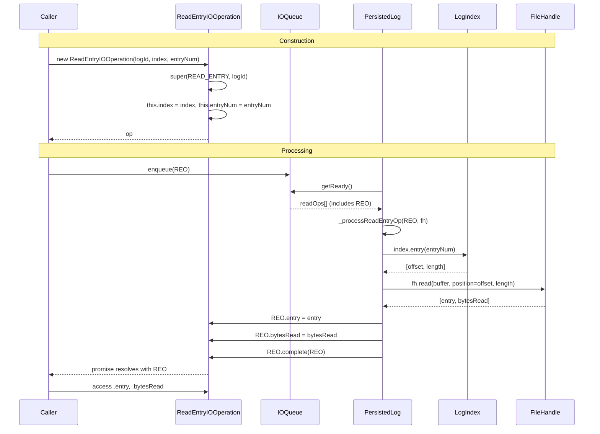

# ReadEntryIOOperation Specification

**Module: IO Operations**

## Overview

`ReadEntryIOOperation` extends `IOOperation` to represent a read operation that retrieves a single log entry by entry number. It holds a reference to the `LogIndex` to resolve the entry's offset and length, the target `entryNum`, and output fields `entry` and `bytesRead` that are populated upon completion. This operation type is dispatched to `_processReadEntryOp` in `PersistedLog`.

## Component Specifications

```typescript
class ReadEntryIOOperation extends IOOperation {
    index: LogIndex
    entryNum: number
    entry: GlobalLogEntry | LogLogEntry | null
    bytesRead: number

    constructor(logId: LogId, index: LogIndex, entryNum: number): ReadEntryIOOperation
}
```

### Properties

| Property | Type | Default | Description |
|---|---|---|---|
| `index` | `LogIndex` | — | Index to resolve entry offset/length |
| `entryNum` | `number` | — | Target entry number to read |
| `entry` | `GlobalLogEntry \| LogLogEntry \| null` | `null` | Populated by processor on success |
| `bytesRead` | `number` | `0` | Number of bytes read from disk |

### Constructor Behavior

```
super(IOOperationType.READ_ENTRY, logId)
this.index = index
this.entryNum = entryNum
```

### Processing Flow (in PersistedLog._processReadEntryOp)

```
offset, length = index.entry(entryNum)
[entry, bytesRead] = fh.read(offset, length) → deserialize
this.entry = entry
this.bytesRead = bytesRead
this.complete(this)
```

### Dependencies

| Dependency | Role |
|---|---|
| `IOOperation` | Base class providing promise, order, timing |
| `LogIndex` | Index to resolve entry offset & length |
| `LogId` | Log identifier for routing |
| `GlobalLogEntry` / `LogLogEntry` | Possible entry types produced |
| `IOOperationType` | Enum value `READ_ENTRY` |

## System Architecture

```mermaid
graph TB
    subgraph ReadEntryIOOperation
        direction TB
        I[index: LogIndex]
        EN[entryNum: number]
        E[entry: GlobalLogEntry | LogLogEntry | null]
        BR[bytesRead: number]
    end

    IOOperation -->|extends| ReadEntryIOOperation

    subgraph Producer
        CL[Caller Code]
    end

    subgraph Consumer
        PL[PersistedLog._processReadEntryOp]
        IDX[LogIndex.entry → offset, length]
        FH[FileHandle.read]
    end

    CL -->|new ReadEntryIOOperation| ReadEntryIOOperation
    ReadEntryIOOperation -->|enqueued → getReady| PL
    PL --> IDX
    IDX --> FH
    FH -->|entry + bytesRead| PL
    PL -->|sets fields + complete| ReadEntryIOOperation
```

## Detailed Data Flow



## Visualization

```html
<!DOCTYPE html>
<html>
<head>
<meta charset="utf-8">
<style>
  body { font-family: system-ui, sans-serif; background: #1e1e2e; color: #cdd6f4; margin: 0; display: flex; flex-direction: column; align-items: center; }
  #toolbar { display: flex; gap: 12px; padding: 12px; align-items: center; flex-wrap: wrap; }
  #toolbar button { background: #45475a; border: none; color: #cdd6f4; padding: 6px 14px; border-radius: 6px; cursor: pointer; font-size: 14px; }
  #toolbar button:hover { background: #585b70; }
  #toolbar input[type="range"] { width: 300px; }
  #kf-display { font-size: 14px; min-width: 120px; text-align: center; }
  #anim-container { position: relative; width: 860px; height: 520px; }
  svg { width: 100%; height: 100%; }
  .legend { display: flex; gap: 20px; font-size: 13px; margin-top: 8px; }
  .legend-item { display: flex; align-items: center; gap: 6px; }
  .legend-dot { width: 14px; height: 14px; border-radius: 4px; }
  .tooltip { position: absolute; background: #313244; color: #cdd6f4; padding: 6px 10px; border-radius: 6px; font-size: 12px; pointer-events: none; opacity: 0; transition: opacity .15s; border: 1px solid #585b70; }
  #verify-badge { margin-left: 12px; padding: 4px 10px; border-radius: 6px; font-size: 12px; background: #45475a; }
  #verify-badge.pass { background: #a6e3a1; color: #1e1e2e; }
  #verify-badge.fail { background: #f38ba8; color: #1e1e2e; }
</style>
</head>
<body>
<div id="toolbar">
  <button id="play-pause" data-testid="play-pause">▶ Play</button>
  <input type="range" id="kf-slider" min="0" max="100" value="0">
  <span id="kf-display">0 / <span id="kf-total">100</span></span>
  <button id="reset-btn">↺ Reset</button>
  <span id="verify-badge">● Verify</span>
</div>
<div id="anim-container"><svg id="svg"></svg></div>
<div class="legend">
  <div class="legend-item"><div class="legend-dot" style="background:#89b4fa"></div> ReadEntryIOOperation</div>
  <div class="legend-item"><div class="legend-dot" style="background:#a6e3a1"></div> LogIndex lookup</div>
  <div class="legend-item"><div class="legend-dot" style="background:#f9e2af"></div> File Read</div>
  <div class="legend-item"><div class="legend-dot" style="background:#cba6f7"></div> Entry + bytesRead</div>
</div>
<div class="tooltip" id="tooltip"></div>
<script src="https://d3js.org/d3.v7.min.js"></script>
<script>
(function() {
  const ANIMATION_DURATION_MS = 5000;
  const ANIMATION_KEYFRAMES = 100;

  const states = [
    { frame: 0,  label: "Ready",           phase: "idle",      detail: "ReadEntryIOOperation not created" },
    { frame: 12, label: "Constructor",     phase: "construct", detail: "new ReadEntryIOOperation(logId, index, entryNum)" },
    { frame: 24, label: "Enqueued",        phase: "queue",     detail: "Added to readQueue" },
    { frame: 36, label: "Index Lookup",    phase: "lookup",    detail: "LogIndex.entry(entryNum) → offset, length" },
    { frame: 48, label: "File Read",       phase: "read",      detail: "pread(offset, length)" },
    { frame: 60, label: "Deserialize",     phase: "deserialize", detail: "Factory.fromU8(buffer)" },
    { frame: 72, label: "Set Fields",      phase: "set",       detail: "op.entry = entry, op.bytesRead = n" },
    { frame: 84, label: "Complete",        phase: "complete",  detail: "op.complete(op) → promise resolved" },
    { frame: 100,label: "Done",            phase: "idle",      detail: "entry and bytesRead available" },
  ];

  const ANIMATION_VERIFICATION = (kf) => {
    const s = states.find(d => d.frame === kf) || states[states.length-1];
    return { frame: kf, phase: s.phase, label: s.label, ok: kf <= 100 };
  };

  let playing = false, timer = null, currentKf = 0;
  const svg = d3.select("#svg");
  const width = 860, height = 520;
  const tooltip = d3.select("#tooltip");

  function drawFrame(kf) {
    currentKf = kf;
    const kfState = states.reduce((prev, d) => d.frame <= kf ? d : prev, states[0]);
    const frac = kf / 100;
    svg.selectAll("*").remove();
    svg.append("rect").attr("width", width).attr("height", height).attr("fill", "#1e1e2e").attr("rx", 12);

    const phases = ["idle","construct","queue","lookup","read","deserialize","set","complete"];
    const phaseColors = { idle: "#585b70", construct: "#89b4fa", queue: "#a6e3a1", lookup: "#74c7ec", read: "#f9e2af", deserialize: "#cba6f7", set: "#a6e3a1", complete: "#94e2d5" };
    const laneY = 40, laneH = 22;
    const timelineW = width - 80, tlX = 40;

    phases.forEach((ph, i) => {
      const x = tlX + (i / phases.length) * timelineW;
      const w = timelineW / phases.length;
      const isActive = kfState.phase === ph;
      svg.append("rect").attr("x", x).attr("y", laneY).attr("width", w).attr("height", laneH)
        .attr("fill", isActive ? phaseColors[ph] : "#313244").attr("stroke", "#585b70").attr("stroke-width", 1).attr("rx", 4);
      svg.append("text").attr("x", x + w/2).attr("y", laneY + laneH/2 + 4)
        .attr("text-anchor", "middle").attr("fill", "#cdd6f4").attr("font-size", 9).text(ph);
    });

    const playX = tlX + frac * timelineW;
    svg.append("line").attr("x1", playX).attr("y1", laneY - 6).attr("x2", playX).attr("y2", laneY + laneH + 6)
      .attr("stroke", "#f5c2e7").attr("stroke-width", 2).attr("stroke-dasharray", "4,2");

    const cx = width / 2;

    // LogIndex lookup block
    if (kfState.phase === "lookup" || kfState.phase === "read") {
      svg.append("rect").attr("x", cx - 100).attr("y", 120).attr("width", 200).attr("height", 50)
        .attr("fill", "#313244").attr("stroke", "#74c7ec").attr("stroke-width", 2).attr("rx", 8);
      svg.append("text").attr("x", cx).attr("y", 140).attr("text-anchor", "middle").attr("fill", "#74c7ec").attr("font-size", 11).attr("font-weight", "bold")
        .text(`LogIndex.entry(${Math.round(frac * 100)})`);
      svg.append("text").attr("x", cx).attr("y", 158).attr("text-anchor", "middle").attr("fill", "#cdd6f4").attr("font-size", 10)
        .text(`→ offset=${Math.round(frac * 4096)}  length=${Math.round(frac * 512 + 128)}`);
    }

    // Entry result block
    if (["set","complete","idle"].includes(kfState.phase) && kf >= 72) {
      svg.append("rect").attr("x", cx - 100).attr("y", 200).attr("width", 200).attr("height", 60)
        .attr("fill", "#313244").attr("stroke", "#cba6f7").attr("stroke-width", 2).attr("rx", 8);
      svg.append("text").attr("x", cx).attr("y", 222).attr("text-anchor", "middle").attr("fill", "#cba6f7").attr("font-size", 11).attr("font-weight", "bold")
        .text("entry = GlobalLogEntry");
      svg.append("text").attr("x", cx).attr("y", 242).attr("text-anchor", "middle").attr("fill", "#f9e2af").attr("font-size", 12).attr("font-weight", "bold")
        .text(`bytesRead: ${Math.round(frac * 512 + 128)}`);
    }

    // File read visualization
    if (kfState.phase === "read") {
      const fhY = 300;
      svg.append("rect").attr("x", cx - 140).attr("y", fhY).attr("width", 280).attr("height", 40)
        .attr("fill", "#313244").attr("stroke", "#f9e2af").attr("stroke-width", 2).attr("rx", 8);
      svg.append("text").attr("x", cx).attr("y", fhY + 16).attr("text-anchor", "middle").attr("fill", "#f9e2af").attr("font-size", 11)
        .text(`📄 fh.read(position=${Math.round(frac * 4096)}, length=${Math.round(frac * 512 + 128)})`);
      // Progress bar
      svg.append("rect").attr("x", cx - 120).attr("y", fhY + 28).attr("width", 240).attr("height", 6)
        .attr("fill", "#45475a").attr("rx", 3);
      svg.append("rect").attr("x", cx - 120).attr("y", fhY + 28).attr("width", 240 * Math.min(1, (frac - 0.48) * 8)).attr("height", 6)
        .attr("fill", "#f9e2af").attr("rx", 3);
    }

    // Promise status
    const py = 410;
    svg.append("rect").attr("x", cx - 150).attr("y", py).attr("width", 300).attr("height", 30)
      .attr("fill", "#313244").attr("rx", 6);
    const pStat = kfState.phase === "complete" ? "RESOLVED ✓" : "PENDING";
    svg.append("text").attr("x", cx).attr("y", py + 20).attr("text-anchor", "middle")
      .attr("fill", kfState.phase === "complete" ? "#a6e3a1" : "#f9e2af").attr("font-size", 13).attr("font-weight", "bold")
      .text(`Promise: ${pStat}`);

    svg.append("rect").attr("x", width - 210).attr("y", 8).attr("width", 190).attr("height", 28).attr("fill", "#313244").attr("rx", 6);
    svg.append("text").attr("x", width - 200).attr("y", 26).attr("fill", "#cdd6f4").attr("font-size", 11).text(`kf: ${kf}  ${kfState.phase}`);

    const v = ANIMATION_VERIFICATION(kf);
    d3.select("#verify-badge").attr("class", v.ok ? "pass" : "fail").text(v.ok ? "● Pass" : "● Fail");
    d3.select("#kf-display").html(`${kf} / <span id="kf-total">${ANIMATION_KEYFRAMES}</span>`);
    d3.select("#kf-slider").property("value", kf);
  }

  function jumpToKeyframe(kf) { drawFrame(Math.max(0, Math.min(ANIMATION_KEYFRAMES, Math.round(kf)))); }
  function resetAnimation() { if (timer) { clearInterval(timer); timer = null; } playing = false; d3.select("#play-pause").text("▶ Play"); jumpToKeyframe(0); }
  function getAnimationState() { return { playing, currentKf, total: ANIMATION_KEYFRAMES }; }

  d3.select("#play-pause").on("click", function() {
    if (playing) { clearInterval(timer); timer = null; playing = false; d3.select(this).text("▶ Play"); }
    else {
      playing = true; d3.select(this).text("⏸ Pause");
      timer = setInterval(() => {
        let next = currentKf + 1;
        if (next > ANIMATION_KEYFRAMES) { clearInterval(timer); timer = null; playing = false; d3.select("#play-pause").text("▶ Play"); return; }
        jumpToKeyframe(next);
      }, ANIMATION_DURATION_MS / ANIMATION_KEYFRAMES);
    }
  });
  d3.select("#kf-slider").on("input", function() {
    if (playing) { clearInterval(timer); timer = null; playing = false; d3.select("#play-pause").text("▶ Play"); }
    jumpToKeyframe(+this.value);
  });
  d3.select("#reset-btn").on("click", resetAnimation);
  d3.select("#anim-container").on("mousemove", function(e) {
    const rect = this.getBoundingClientRect();
    const x = e.clientX - rect.left, y = e.clientY - rect.top;
    const kf = Math.round((x / rect.width) * 100);
    if (kf >= 0 && kf <= 100) {
      const s = states.reduce((prev, d) => d.frame <= kf ? d : prev, states[0]);
      tooltip.style("opacity", 1).style("left", (x + 12) + "px").style("top", (y - 30) + "px").html(`<b>${s.label}</b><br/>${s.detail}`);
    } else tooltip.style("opacity", 0);
  }).on("mouseleave", () => tooltip.style("opacity", 0));
  jumpToKeyframe(0);
})();
</script>
</body>
</html>
```

### Visualization Keyframe Table

| kf | Phase | Description |
|----|-------|-------------|
| 0 | idle | Operation not yet created |
| 12 | construct | `new ReadEntryIOOperation(logId, index, entryNum)` |
| 24 | queue | Enqueued into readQueue |
| 36 | lookup | `LogIndex.entry(entryNum)` → offset, length |
| 48 | read | `pread(offset, length)` from file |
| 60 | deserialize | `Factory.fromU8(buffer)` → entry |
| 72 | set | `op.entry = entry`, `op.bytesRead = n` |
| 84 | complete | `op.complete(op)` → promise resolved |
| 100 | idle | Done, caller reads .entry and .bytesRead |

## Testing Requirements

| Test Case | Input | Expected Outcome |
|---|---|---|
| `constructor sets op type` | Any | `op === IOOperationType.READ_ENTRY` |
| `constructor stores index` | LogIndex instance | `this.index === index` |
| `constructor stores entryNum` | 42 | `this.entryNum === 42` |
| `constructor defaults entry null` | Any | `this.entry === null` |
| `constructor defaults bytesRead` | Any | `this.bytesRead === 0` |
| `processing populates entry` | Successful read | `entry` set to deserialized entry |
| `processing populates bytesRead` | Successful read | `bytesRead` set from read result |
| `complete propagates to caller` | After set | Promise resolves with this operation |
| `completeWithError on read failure` | Read error | Promise rejects with error |
| Index lookup failure | Invalid entryNum | Error propagated upstream |

---

## 7. Source-Test Cross-References

### Test Coverage

| Test Spec | Path |
|---|---|
| ReadEntryIOOperation.test.spec.md | `source/src/lib/persist/io/ReadEntryIOOperation.test.spec.md` |
