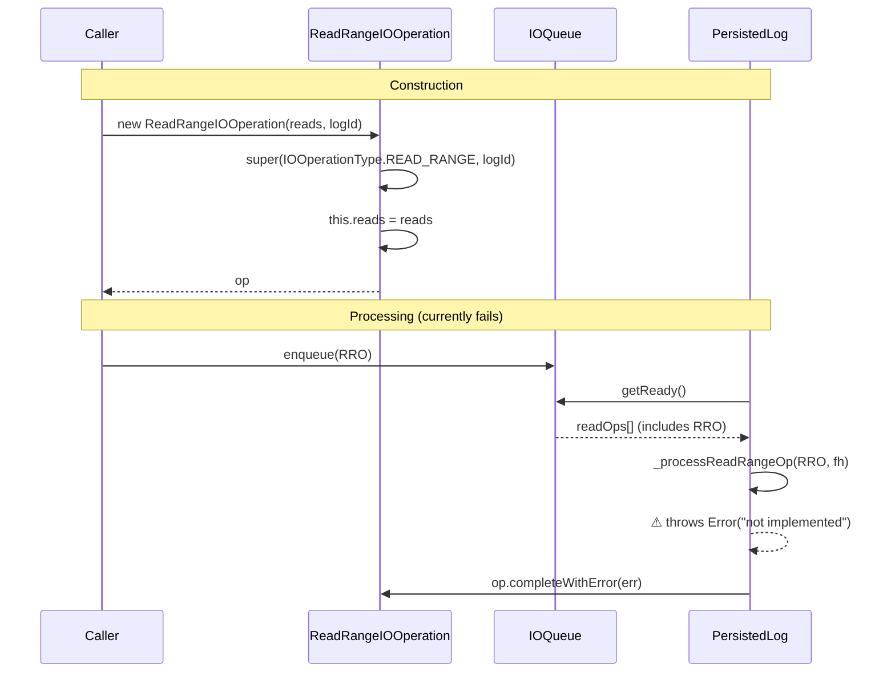

# ReadRangeIOOperation Specification

**Module: IO Operations**

## Overview

`ReadRangeIOOperation` extends `IOOperation` as a stub for range-based read operations. It accepts an array of `reads` (offset/length pairs) and provides `buffers` and `bytesRead` output fields. The `_processReadRangeOp` method in `PersistedLog` currently throws `Error("not implemented")`, making this a placeholder for future functionality. The constructor and completion mechanics are fully functional.

## Component Specifications

```typescript
class ReadRangeIOOperation extends IOOperation {
    reads: number[] | null
    buffers: Uint8Array[]
    bytesRead: number

    constructor(reads?: number[] | null, logId?: LogId | null): ReadRangeIOOperation
}
```

### Properties

| Property | Type | Default | Description |
|---|---|---|---|
| `reads` | `number[] \| null` | `null` | Array of offset/length pairs (not yet specified) |
| `buffers` | `Uint8Array[]` | `[]` | Output buffers populated on completion |
| `bytesRead` | `number` | `0` | Cumulative bytes read |

### Constructor Behavior

```
super(IOOperationType.READ_RANGE, logId)
this.reads = reads
```

### Current Processing Status

```typescript
async _processReadRangeOp(op: ReadRangeIOOperation, fh: FileHandle): Promise<void> {
    throw new Error("not implemented")
}
```

### Dependencies

| Dependency | Role |
|---|---|
| `IOOperation` | Base class providing promise, order, timing |
| `IOOperationType` | Enum value `READ_RANGE` |
| `LogId` | Optional log identifier |

## System Architecture

```mermaid
graph TB
    subgraph ReadRangeIOOperation
        direction TB
        R[reads: number[] | null]
        B[buffers: Uint8Array[]]
        BR[bytesRead: number]
    end

    IOOperation -->|extends| ReadRangeIOOperation

    subgraph Future Implementation
        PL[_processReadRangeOp]
        NI["⚠ NOT IMPLEMENTED (throws Error)"]
        PL --> NI
    end

    subgraph Possible Future Use
        URI[Range-based read from file]
        BATCH[Batch adjacent ranges]
        PL --> URI
        URI --> BATCH
    end
```

## Detailed Data Flow



## Visualization

```html
<!DOCTYPE html>
<html>
<head>
<meta charset="utf-8">
<style>
  body { font-family: system-ui, sans-serif; background: #1e1e2e; color: #cdd6f4; margin: 0; display: flex; flex-direction: column; align-items: center; }
  #toolbar { display: flex; gap: 12px; padding: 12px; align-items: center; flex-wrap: wrap; }
  #toolbar button { background: #45475a; border: none; color: #cdd6f4; padding: 6px 14px; border-radius: 6px; cursor: pointer; font-size: 14px; }
  #toolbar button:hover { background: #585b70; }
  #toolbar input[type="range"] { width: 300px; }
  #kf-display { font-size: 14px; min-width: 120px; text-align: center; }
  #anim-container { position: relative; width: 860px; height: 460px; }
  svg { width: 100%; height: 100%; }
  .legend { display: flex; gap: 20px; font-size: 13px; margin-top: 8px; }
  .legend-item { display: flex; align-items: center; gap: 6px; }
  .legend-dot { width: 14px; height: 14px; border-radius: 4px; }
  .tooltip { position: absolute; background: #313244; color: #cdd6f4; padding: 6px 10px; border-radius: 6px; font-size: 12px; pointer-events: none; opacity: 0; transition: opacity .15s; border: 1px solid #585b70; }
  #verify-badge { margin-left: 12px; padding: 4px 10px; border-radius: 6px; font-size: 12px; background: #45475a; }
  #verify-badge.pass { background: #a6e3a1; color: #1e1e2e; }
  #verify-badge.fail { background: #f38ba8; color: #1e1e2e; }
</style>
</head>
<body>
<div id="toolbar">
  <button id="play-pause" data-testid="play-pause">▶ Play</button>
  <input type="range" id="kf-slider" min="0" max="100" value="0">
  <span id="kf-display">0 / <span id="kf-total">100</span></span>
  <button id="reset-btn">↺ Reset</button>
  <span id="verify-badge">● Verify</span>
</div>
<div id="anim-container"><svg id="svg"></svg></div>
<div class="legend">
  <div class="legend-item"><div class="legend-dot" style="background:#89b4fa"></div> ReadRangeIOOperation</div>
  <div class="legend-item"><div class="legend-dot" style="background:#f38ba8"></div> Not Implemented</div>
  <div class="legend-item"><div class="legend-dot" style="background:#f9e2af"></div> Future</div>
</div>
<div class="tooltip" id="tooltip"></div>
<script src="https://d3js.org/d3.v7.min.js"></script>
<script>
(function() {
  const ANIMATION_DURATION_MS = 4000;
  const ANIMATION_KEYFRAMES = 100;

  const states = [
    { frame: 0,  label: "Ready",             phase: "idle",    detail: "ReadRangeIOOperation available" },
    { frame: 15, label: "Constructor",       phase: "construct", detail: "new ReadRangeIOOperation(reads, logId)" },
    { frame: 30, label: "Enqueued",          phase: "queue",   detail: "Added to readQueue" },
    { frame: 45, label: "Processor Dispatch",phase: "dispatch", detail: "_processReadRangeOp called" },
    { frame: 55, label: "Not Implemented",   phase: "error",   detail: "throws Error('not implemented')" },
    { frame: 70, label: "completeWithError", phase: "reject",  detail: "Promise rejected" },
    { frame: 85, label: "Future: Range Read",phase: "future",  detail: "Placeholder for range-based I/O" },
    { frame: 100,label: "Done",              phase: "idle",    detail: "Stub complete" },
  ];

  const ANIMATION_VERIFICATION = (kf) => {
    const s = states.find(d => d.frame === kf) || states[states.length-1];
    return { frame: kf, phase: s.phase, label: s.label, ok: kf <= 100 };
  };

  let playing = false, timer = null, currentKf = 0;
  const svg = d3.select("#svg");
  const width = 860, height = 460;
  const tooltip = d3.select("#tooltip");

  function drawFrame(kf) {
    currentKf = kf;
    const kfState = states.reduce((prev, d) => d.frame <= kf ? d : prev, states[0]);
    const frac = kf / 100;
    svg.selectAll("*").remove();
    svg.append("rect").attr("width", width).attr("height", height).attr("fill", "#1e1e2e").attr("rx", 12);

    const phases = ["idle","construct","queue","dispatch","error","reject","future"];
    const phaseColors = { idle: "#585b70", construct: "#89b4fa", queue: "#a6e3a1", dispatch: "#f9e2af", error: "#f38ba8", reject: "#f38ba8", future: "#cba6f7" };
    const laneY = 40, laneH = 22;
    const timelineW = width - 80, tlX = 40;

    phases.forEach((ph, i) => {
      const x = tlX + (i / phases.length) * timelineW;
      const w = timelineW / phases.length;
      const isActive = kfState.phase === ph;
      svg.append("rect").attr("x", x).attr("y", laneY).attr("width", w).attr("height", laneH)
        .attr("fill", isActive ? phaseColors[ph] : "#313244").attr("stroke", "#585b70").attr("stroke-width", 1).attr("rx", 4);
      svg.append("text").attr("x", x + w/2).attr("y", laneY + laneH/2 + 4)
        .attr("text-anchor", "middle").attr("fill", "#cdd6f4").attr("font-size", 9).text(ph);
    });

    const playX = tlX + frac * timelineW;
    svg.append("line").attr("x1", playX).attr("y1", laneY - 6).attr("x2", playX).attr("y2", laneY + laneH + 6)
      .attr("stroke", "#f5c2e7").attr("stroke-width", 2).attr("stroke-dasharray", "4,2");

    const cx = width / 2;

    // Not implemented splash
    if (kfState.phase === "error") {
      svg.append("rect").attr("x", cx - 140).attr("y", 140).attr("width", 280).attr("height", 70)
        .attr("fill", "#f38ba8").attr("opacity", 0.2).attr("stroke", "#f38ba8").attr("stroke-width", 3).attr("rx", 12);
      svg.append("text").attr("x", cx).attr("y", 170).attr("text-anchor", "middle").attr("fill", "#f38ba8").attr("font-size", 18).attr("font-weight", "bold")
        .text("⚠ NOT IMPLEMENTED");
      svg.append("text").attr("x", cx).attr("y", 194).attr("text-anchor", "middle").attr("fill", "#f38ba8").attr("font-size", 12)
        .text("_processReadRangeOp throws Error");
    }

    // Future vision
    if (kfState.phase === "future") {
      svg.append("rect").attr("x", cx - 140).attr("y", 130).attr("width", 280).attr("height", 90)
        .attr("fill", "#313244").attr("stroke", "#cba6f7").attr("stroke-width", 2).attr("rx", 8).attr("stroke-dasharray", "6,3");
      svg.append("text").attr("x", cx).attr("y", 155).attr("text-anchor", "middle").attr("fill", "#cba6f7").attr("font-size", 14).attr("font-weight", "bold")
        .text("🔮 Future: Range-Based Read");
      svg.append("text").attr("x", cx).attr("y", 178).attr("text-anchor", "middle").attr("fill", "#cdd6f4").attr("font-size", 11)
        .text("reads: [offset, length, offset, length, ...]");
      svg.append("text").attr("x", cx).attr("y", 198).attr("text-anchor", "middle").attr("fill", "#a6e3a1").attr("font-size", 11)
        .text("buffers: Uint8Array[] bytesRead: number");
    }

    // Default: show the op fields
    if (["idle","construct","queue","dispatch"].includes(kfState.phase)) {
      svg.append("rect").attr("x", cx - 100).attr("y", 160).attr("width", 200).attr("height", 70)
        .attr("fill", "#313244").attr("stroke", "#89b4fa").attr("stroke-width", 2).attr("rx", 8);
      svg.append("text").attr("x", cx).attr("y", 185).attr("text-anchor", "middle").attr("fill", "#89b4fa").attr("font-size", 13).attr("font-weight", "bold")
        .text("ReadRangeIOOperation");
      svg.append("text").attr("x", cx).attr("y", 205).attr("text-anchor", "middle").attr("fill", "#cdd6f4").attr("font-size", 10)
        .text(`reads: ${kfState.phase === "construct" ? "[…]" : "null"}`);
      svg.append("text").attr("x", cx).attr("y", 220).attr("text-anchor", "middle").attr("fill", "#cdd6f4").attr("font-size", 10)
        .text("buffers: []  bytesRead: 0");
    }

    if (kfState.phase === "reject") {
      svg.append("rect").attr("x", cx - 100).attr("y", 270).attr("width", 200).attr("height", 40)
        .attr("fill", "#313244").attr("stroke", "#f38ba8").attr("stroke-width", 2).attr("rx", 6);
      svg.append("text").attr("x", cx).attr("y", 294).attr("text-anchor", "middle").attr("fill", "#f38ba8").attr("font-size", 12).attr("font-weight", "bold")
        .text("Promise rejected");
    }

    svg.append("rect").attr("x", width - 210).attr("y", 8).attr("width", 190).attr("height", 28).attr("fill", "#313244").attr("rx", 6);
    svg.append("text").attr("x", width - 200).attr("y", 26).attr("fill", "#cdd6f4").attr("font-size", 11).text(`kf: ${kf}  ${kfState.phase}`);

    const v = ANIMATION_VERIFICATION(kf);
    d3.select("#verify-badge").attr("class", v.ok ? "pass" : "fail").text(v.ok ? "● Pass" : "● Fail");
    d3.select("#kf-display").html(`${kf} / <span id="kf-total">${ANIMATION_KEYFRAMES}</span>`);
    d3.select("#kf-slider").property("value", kf);
  }

  function jumpToKeyframe(kf) { drawFrame(Math.max(0, Math.min(ANIMATION_KEYFRAMES, Math.round(kf)))); }
  function resetAnimation() { if (timer) { clearInterval(timer); timer = null; } playing = false; d3.select("#play-pause").text("▶ Play"); jumpToKeyframe(0); }
  function getAnimationState() { return { playing, currentKf, total: ANIMATION_KEYFRAMES }; }

  d3.select("#play-pause").on("click", function() {
    if (playing) { clearInterval(timer); timer = null; playing = false; d3.select(this).text("▶ Play"); }
    else {
      playing = true; d3.select(this).text("⏸ Pause");
      timer = setInterval(() => {
        let next = currentKf + 1;
        if (next > ANIMATION_KEYFRAMES) { clearInterval(timer); timer = null; playing = false; d3.select("#play-pause").text("▶ Play"); return; }
        jumpToKeyframe(next);
      }, ANIMATION_DURATION_MS / ANIMATION_KEYFRAMES);
    }
  });
  d3.select("#kf-slider").on("input", function() {
    if (playing) { clearInterval(timer); timer = null; playing = false; d3.select("#play-pause").text("▶ Play"); }
    jumpToKeyframe(+this.value);
  });
  d3.select("#reset-btn").on("click", resetAnimation);
  d3.select("#anim-container").on("mousemove", function(e) {
    const rect = this.getBoundingClientRect();
    const x = e.clientX - rect.left, y = e.clientY - rect.top;
    const kf = Math.round((x / rect.width) * 100);
    if (kf >= 0 && kf <= 100) {
      const s = states.reduce((prev, d) => d.frame <= kf ? d : prev, states[0]);
      tooltip.style("opacity", 1).style("left", (x + 12) + "px").style("top", (y - 30) + "px").html(`<b>${s.label}</b><br/>${s.detail}`);
    } else tooltip.style("opacity", 0);
  }).on("mouseleave", () => tooltip.style("opacity", 0));
  jumpToKeyframe(0);
})();
</script>
</body>
</html>
```

### Visualization Keyframe Table

| kf | Phase | Description |
|----|-------|-------------|
| 0 | idle | Operation stub available |
| 15 | construct | `new ReadRangeIOOperation(reads, logId)` |
| 30 | queue | Enqueued into readQueue |
| 45 | dispatch | `_processReadRangeOp` dispatcher called |
| 55 | error | Throws `Error("not implemented")` |
| 70 | reject | `completeWithError(err)` → promise rejected |
| 85 | future | Placeholder for range-based batch reads |
| 100 | idle | Complete |

## Testing Requirements

| Test Case | Input | Expected Outcome |
|---|---|---|
| `constructor sets op type` | Any | `op === IOOperationType.READ_RANGE` |
| `constructor stores reads` | `[0, 1024, 2048, 512]` | `this.reads === [0, 1024, 2048, 512]` |
| `constructor defaults reads null` | Not provided | `this.reads === null` |
| `constructor defaults buffers` | Any | `this.buffers === []` |
| `constructor defaults bytesRead` | Any | `this.bytesRead === 0` |
| `_processReadRangeOp throws not implemented` | Any op, any fh | Throws `Error("not implemented")` |
| Error propagation via completeWithError | Error thrown | `op.reject` called with the error |
| Full IOOperation lifecycle works | read: range | order, promise, timing all functional |
| Stub recognized by _processReadOp | READ_RANGE | Dispatched to _processReadRangeOp |

---

## 7. Source-Test Cross-References

### Test Coverage

| Test Spec | Path |
|---|---|
| ReadRangeIOOperation.test.spec.md | `source/src/lib/persist/io/ReadRangeIOOperation.test.spec.md` |
