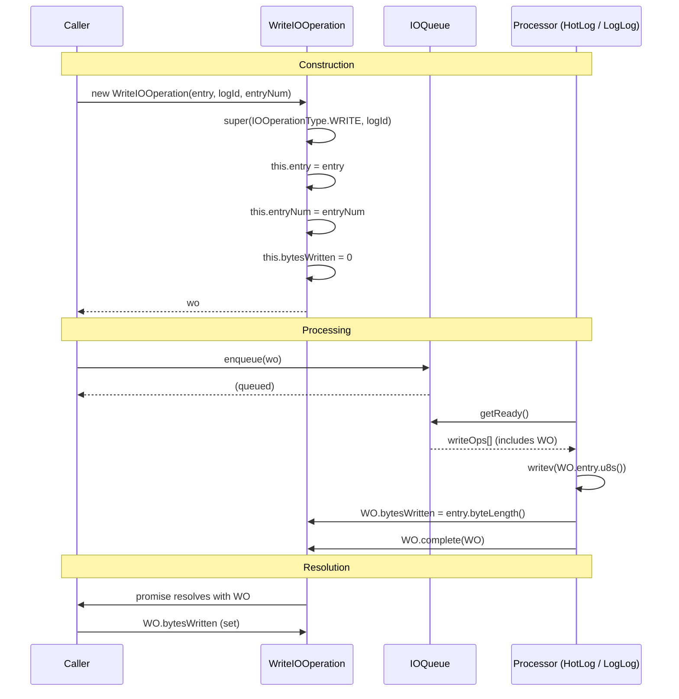

# WriteIOOperation Specification

**Module: IO Operations**

## Overview

`WriteIOOperation` extends `IOOperation` to represent a write operation carrying a `GlobalLogEntry` or `LogLogEntry` to be persisted to disk. It records the target `entryNum` (when known) and the number of `bytesWritten` after the write completes. This operation is always routed to the write queue in `IOQueue`.

## Component Specifications

```typescript
class WriteIOOperation extends IOOperation {
    entry: GlobalLogEntry | LogLogEntry
    entryNum: number | null
    bytesWritten: number

    constructor(
        entry: GlobalLogEntry | LogLogEntry,
        logId?: LogId | null,
        entryNum?: number | null
    ): WriteIOOperation
}
```

### Properties

| Property | Type | Default | Description |
|---|---|---|---|
| `entry` | `GlobalLogEntry \| LogLogEntry` | — | The entry to be written to disk |
| `entryNum` | `number \| null` | `null` | Optional entry number for the write |
| `bytesWritten` | `number` | `0` | Set by the processor after successful write |

### Constructor Behavior

```
super(IOOperationType.WRITE, logId)
this.entry = entry
this.entryNum = entryNum
```

### Dependencies

| Dependency | Role |
|---|---|
| `IOOperation` | Base class providing promise, order, timing |
| `GlobalLogEntry` | Entry type for the global log |
| `LogLogEntry` | Entry type for the per-log file |
| `IOOperationType` | Enum value `WRITE` |
| `LogId` | Optional log identifier for routing |

## System Architecture

```mermaid
graph TB
    subgraph WriteIOOperation
        direction TB
        E[entry: GlobalLogEntry | LogLogEntry]
        EN[entryNum: number | null]
        BW[bytesWritten: number]
        OP[op: IOOperationType.WRITE]
    end

    IOOperation -->|extends| WriteIOOperation

    subgraph Producers
        GL[GlobalLog → creates WriteIOOperation]
        LL[LogLog → creates WriteIOOperation]
    end

    subgraph Consumers
        HL[HotLog.processWriteOps]
        LL2[LogLog.processWriteOps]
    end

    GL -->|new WriteIOOperation| WriteIOOperation
    LL -->|new WriteIOOperation| WriteIOOperation
    WriteIOOperation -->|enqueued → processed| HL
    WriteIOOperation -->|enqueued → processed| LL2
```

## Detailed Data Flow



## Visualization

```html
<!DOCTYPE html>
<html>
<head>
<meta charset="utf-8">
<style>
  body { font-family: system-ui, sans-serif; background: #1e1e2e; color: #cdd6f4; margin: 0; display: flex; flex-direction: column; align-items: center; }
  #toolbar { display: flex; gap: 12px; padding: 12px; align-items: center; flex-wrap: wrap; }
  #toolbar button { background: #45475a; border: none; color: #cdd6f4; padding: 6px 14px; border-radius: 6px; cursor: pointer; font-size: 14px; }
  #toolbar button:hover { background: #585b70; }
  #toolbar input[type="range"] { width: 300px; }
  #kf-display { font-size: 14px; min-width: 120px; text-align: center; }
  #anim-container { position: relative; width: 860px; height: 500px; }
  svg { width: 100%; height: 100%; }
  .legend { display: flex; gap: 20px; font-size: 13px; margin-top: 8px; }
  .legend-item { display: flex; align-items: center; gap: 6px; }
  .legend-dot { width: 14px; height: 14px; border-radius: 4px; }
  .tooltip { position: absolute; background: #313244; color: #cdd6f4; padding: 6px 10px; border-radius: 6px; font-size: 12px; pointer-events: none; opacity: 0; transition: opacity .15s; border: 1px solid #585b70; }
  #verify-badge { margin-left: 12px; padding: 4px 10px; border-radius: 6px; font-size: 12px; background: #45475a; }
  #verify-badge.pass { background: #a6e3a1; color: #1e1e2e; }
  #verify-badge.fail { background: #f38ba8; color: #1e1e2e; }
</style>
</head>
<body>
<div id="toolbar">
  <button id="play-pause" data-testid="play-pause">▶ Play</button>
  <input type="range" id="kf-slider" min="0" max="100" value="0">
  <span id="kf-display">0 / <span id="kf-total">100</span></span>
  <button id="reset-btn">↺ Reset</button>
  <span id="verify-badge">● Verify</span>
</div>
<div id="anim-container"><svg id="svg"></svg></div>
<div class="legend">
  <div class="legend-item"><div class="legend-dot" style="background:#89b4fa"></div> WriteIOOperation</div>
  <div class="legend-item"><div class="legend-dot" style="background:#a6e3a1"></div> Entry Data</div>
  <div class="legend-item"><div class="legend-dot" style="background:#f9e2af"></div> bytesWritten</div>
</div>
<div class="tooltip" id="tooltip"></div>
<script src="https://d3js.org/d3.v7.min.js"></script>
<script>
(function() {
  const ANIMATION_DURATION_MS = 5000;
  const ANIMATION_KEYFRAMES = 100;

  const states = [
    { frame: 0,  label: "Ready",          phase: "idle",    detail: "WriteIOOperation not yet created" },
    { frame: 15, label: "Constructor",    phase: "construct", detail: "new WriteIOOperation(entry, logId)" },
    { frame: 30, label: "Enqueued",       phase: "queue",   detail: "Added to writeQueue" },
    { frame: 45, label: "Processing",     phase: "process", detail: "writev assembling entry u8s" },
    { frame: 60, label: "Writing to Disk",phase: "write",   detail: "writev + datasync" },
    { frame: 75, label: "Set bytesWritten",phase: "complete",detail: "bytesWritten = entry.byteLength()" },
    { frame: 90, label: "Resolved",       phase: "resolve", detail: "op.complete(op) → promise settled" },
    { frame: 100,label: "Done",           phase: "idle",    detail: "bytesWritten available" },
  ];

  const ANIMATION_VERIFICATION = (kf) => {
    const s = states.find(d => d.frame === kf) || states[states.length-1];
    return { frame: kf, phase: s.phase, label: s.label, ok: kf <= 100 };
  };

  let playing = false, timer = null, currentKf = 0;
  const svg = d3.select("#svg");
  const width = 860, height = 500;
  const tooltip = d3.select("#tooltip");

  function drawFrame(kf) {
    currentKf = kf;
    const kfState = states.reduce((prev, d) => d.frame <= kf ? d : prev, states[0]);
    const frac = kf / 100;
    svg.selectAll("*").remove();
    svg.append("rect").attr("width", width).attr("height", height).attr("fill", "#1e1e2e").attr("rx", 12);

    const phases = ["idle","construct","queue","process","write","complete","resolve"];
    const phaseColors = { idle: "#585b70", construct: "#89b4fa", queue: "#a6e3a1", process: "#f9e2af", write: "#94e2d5", complete: "#cba6f7", resolve: "#a6e3a1" };
    const laneY = 40, laneH = 22;
    const timelineW = width - 80, tlX = 40;

    phases.forEach((ph, i) => {
      const x = tlX + (i / phases.length) * timelineW;
      const w = timelineW / phases.length;
      const isActive = kfState.phase === ph;
      svg.append("rect").attr("x", x).attr("y", laneY).attr("width", w).attr("height", laneH)
        .attr("fill", isActive ? phaseColors[ph] : "#313244").attr("stroke", "#585b70").attr("stroke-width", 1).attr("rx", 4);
      svg.append("text").attr("x", x + w/2).attr("y", laneY + laneH/2 + 4)
        .attr("text-anchor", "middle").attr("fill", "#cdd6f4").attr("font-size", 9).text(ph);
    });

    const playX = tlX + frac * timelineW;
    svg.append("line").attr("x1", playX).attr("y1", laneY - 6).attr("x2", playX).attr("y2", laneY + laneH + 6)
      .attr("stroke", "#f5c2e7").attr("stroke-width", 2).attr("stroke-dasharray", "4,2");

    const cx = width / 2;

    // Entry data block
    if (kfState.phase !== "idle") {
      const ey = 120;
      svg.append("rect").attr("x", cx - 120).attr("y", ey).attr("width", 240).attr("height", 50)
        .attr("fill", "#313244").attr("stroke", "#a6e3a1").attr("stroke-width", 2).attr("rx", 8);
      svg.append("text").attr("x", cx).attr("y", ey + 20).attr("text-anchor", "middle").attr("fill", "#a6e3a1").attr("font-size", 11).attr("font-weight", "bold")
        .text(kfState.phase === "construct" ? "Entry (not yet set)" : `entry: ${kfState.phase === "write" ? "GlobalLogEntry" : "LogLogEntry"}`);
      if (["process","write","complete","resolve"].includes(kfState.phase)) {
        svg.append("text").attr("x", cx).attr("y", ey + 38).attr("text-anchor", "middle").attr("fill", "#cdd6f4").attr("font-size", 10)
          .text(`entryNum: ${kf <= 60 ? "null" : "42"}  |  byteLength: ${Math.round(frac * 256)}`);
      }
    }

    // bytesWritten counter
    const by = 250;
    const writtenVal = kfState.phase === "complete" || kfState.phase === "resolve" ? Math.round(frac * 256) : 0;
    svg.append("rect").attr("x", cx - 100).attr("y", by).attr("width", 200).attr("height", 60)
      .attr("fill", "#1e1e2e").attr("stroke", "#f9e2af").attr("stroke-width", 2).attr("rx", 8);
    svg.append("text").attr("x", cx).attr("y", by + 24).attr("text-anchor", "middle").attr("fill", "#f9e2af").attr("font-size", 12).attr("font-weight", "bold")
      .text("bytesWritten");
    svg.append("text").attr("x", cx).attr("y", by + 48).attr("text-anchor", "middle").attr("fill", "#cdd6f4").attr("font-size", 22).attr("font-weight", "bold")
      .text(writtenVal.toString());

    // Promise status bar
    const py = 380;
    svg.append("rect").attr("x", cx - 150).attr("y", py).attr("width", 300).attr("height", 30)
      .attr("fill", "#313244").attr("rx", 6);
    const pStat = kfState.phase === "resolve" ? "RESOLVED ✓" : (kfState.phase === "write" || kfState.phase === "complete" ? "PENDING (processing)" : "PENDING");
    svg.append("text").attr("x", cx).attr("y", py + 20).attr("text-anchor", "middle")
      .attr("fill", kfState.phase === "resolve" ? "#a6e3a1" : "#f9e2af").attr("font-size", 13).attr("font-weight", "bold")
      .text(`Promise: ${pStat}`);

    svg.append("rect").attr("x", width - 210).attr("y", 8).attr("width", 190).attr("height", 28).attr("fill", "#313244").attr("rx", 6);
    svg.append("text").attr("x", width - 200).attr("y", 26).attr("fill", "#cdd6f4").attr("font-size", 11).text(`kf: ${kf}  ${kfState.phase}`);

    const v = ANIMATION_VERIFICATION(kf);
    d3.select("#verify-badge").attr("class", v.ok ? "pass" : "fail").text(v.ok ? "● Pass" : "● Fail");
    d3.select("#kf-display").html(`${kf} / <span id="kf-total">${ANIMATION_KEYFRAMES}</span>`);
    d3.select("#kf-slider").property("value", kf);
  }

  function jumpToKeyframe(kf) { drawFrame(Math.max(0, Math.min(ANIMATION_KEYFRAMES, Math.round(kf)))); }
  function resetAnimation() { if (timer) { clearInterval(timer); timer = null; } playing = false; d3.select("#play-pause").text("▶ Play"); jumpToKeyframe(0); }
  function getAnimationState() { return { playing, currentKf, total: ANIMATION_KEYFRAMES }; }

  d3.select("#play-pause").on("click", function() {
    if (playing) { clearInterval(timer); timer = null; playing = false; d3.select(this).text("▶ Play"); }
    else {
      playing = true; d3.select(this).text("⏸ Pause");
      timer = setInterval(() => {
        let next = currentKf + 1;
        if (next > ANIMATION_KEYFRAMES) { clearInterval(timer); timer = null; playing = false; d3.select("#play-pause").text("▶ Play"); return; }
        jumpToKeyframe(next);
      }, ANIMATION_DURATION_MS / ANIMATION_KEYFRAMES);
    }
  });
  d3.select("#kf-slider").on("input", function() {
    if (playing) { clearInterval(timer); timer = null; playing = false; d3.select("#play-pause").text("▶ Play"); }
    jumpToKeyframe(+this.value);
  });
  d3.select("#reset-btn").on("click", resetAnimation);
  d3.select("#anim-container").on("mousemove", function(e) {
    const rect = this.getBoundingClientRect();
    const x = e.clientX - rect.left, y = e.clientY - rect.top;
    const kf = Math.round((x / rect.width) * 100);
    if (kf >= 0 && kf <= 100) {
      const s = states.reduce((prev, d) => d.frame <= kf ? d : prev, states[0]);
      tooltip.style("opacity", 1).style("left", (x + 12) + "px").style("top", (y - 30) + "px").html(`<b>${s.label}</b><br/>${s.detail}`);
    } else tooltip.style("opacity", 0);
  }).on("mouseleave", () => tooltip.style("opacity", 0));
  jumpToKeyframe(0);
})();
</script>
</body>
</html>
```

### Visualization Keyframe Table

| kf | Phase | Description |
|----|-------|-------------|
| 0 | idle | Operation not yet created |
| 15 | construct | `new WriteIOOperation(entry, logId)` |
| 30 | queue | Enqueued into writeQueue |
| 45 | process | Processor assembles u8s for writev |
| 60 | write | writev + datasync executed |
| 75 | complete | `bytesWritten = entry.byteLength()` |
| 90 | resolve | `op.complete(op)` → promise resolved |
| 100 | idle | Done |

## Testing Requirements

| Test Case | Input | Expected Outcome |
|---|---|---|
| `constructor sets op type` | Any entry | `op === IOOperationType.WRITE` |
| `constructor stores entry` | GlobalLogEntry | `this.entry === entry` |
| `constructor stores entryNum` | 42 | `this.entryNum === 42` |
| `constructor defaults entryNum null` | Not provided | `this.entryNum === null` |
| `constructor defaults bytesWritten` | Any | `this.bytesWritten === 0` |
| `bytesWritten set by processor` | Written to 256 | `bytesWritten === 256` |
| `complete propagates to caller` | After write | Promise resolves with `WriteIOOperation` |
| `completeWithError on write failure` | Error from disk | Promise rejects with error |
| Works with both entry types | GlobalLogEntry or LogLogEntry | Both accepted via union type |

---

## 7. Source-Test Cross-References

### Test Coverage

| Test Spec | Path |
|---|---|
| WriteIOOperation.test.spec.md | `source/src/lib/persist/io/WriteIOOperation.test.spec.md` |
