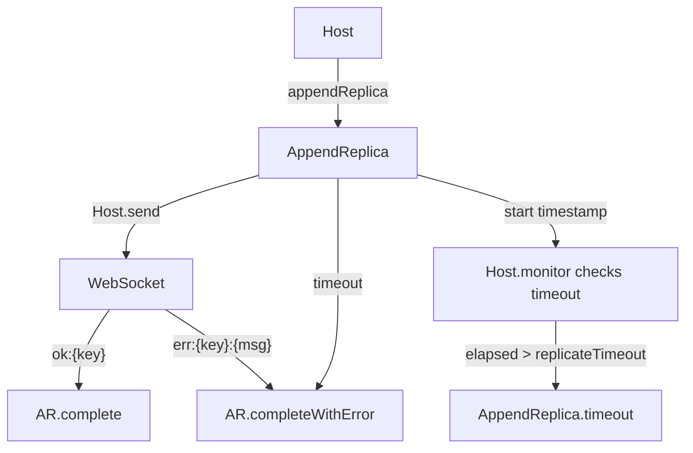
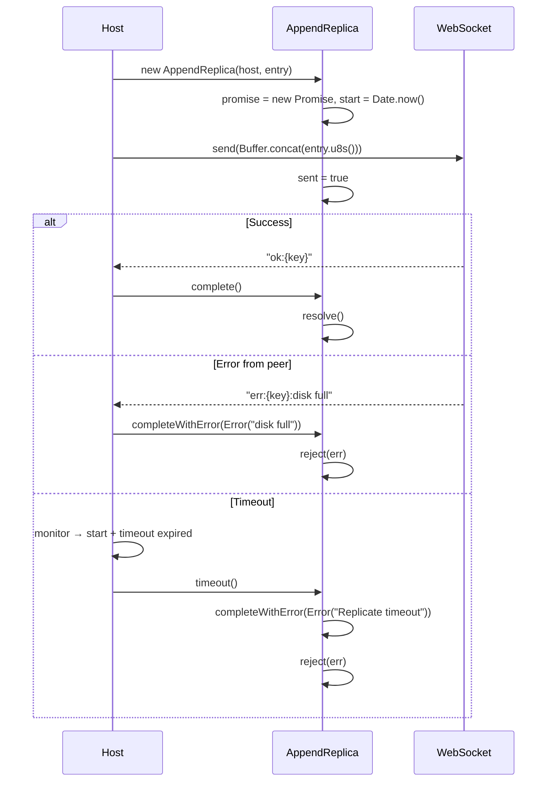

# AppendReplica Spec

**Module: Replication**

## Overview

Represents a single pending replication operation to a remote peer. Holds a reference to the `Host`, the `GlobalLogEntry`, and a `Promise` that resolves on `"ok:{key}"` or rejects on `"err:{key}:{msg}"` or timeout. The `sent` flag prevents duplicate sends.

## Component Specifications

```typescript
class AppendReplica {
    host: Host
    entry: GlobalLogEntry
    promise: Promise<void>
    resolve: (() => void) | null
    reject: ((err: any) => void) | null
    sent: boolean        // true after binary payload has been sent over WS
    start: number        // Date.now() timestamp of creation
}
```

## System Architecture



## Detailed Data Flow



## Visualization

```html
<div id="appendreplica-viz"></div>
<script src="https://d3js.org/d3.v7.min.js"></script>
<script>
(function() {
    const ANIMATION_DURATION_MS = 3500;
    const ANIMATION_KEYFRAMES = [
        { label: "Created", sent: false, resolved: false, rejected: false, timedOut: false },
        { label: "Sent", sent: true, resolved: false, rejected: false, timedOut: false },
        { label: "Waiting...", sent: true, resolved: false, rejected: false, timedOut: false },
        { label: "Ok: Resolved", sent: true, resolved: true, rejected: false, timedOut: false },
        { label: "Reset for next", sent: false, resolved: false, rejected: false, timedOut: false },
    ];
    const ERROR_KEYFRAMES = [
        { label: "Created", sent: false, resolved: false, rejected: false, timedOut: false },
        { label: "Sent", sent: true, resolved: false, rejected: false, timedOut: false },
        { label: "Err: Rejected", sent: true, resolved: false, rejected: true, timedOut: false },
    ];
    const TIMEOUT_KEYFRAMES = [
        { label: "Created", sent: false, resolved: false, rejected: false, timedOut: false },
        { label: "Sent", sent: true, resolved: false, rejected: false, timedOut: false },
        { label: "Waiting...", sent: true, resolved: false, rejected: false, timedOut: false },
        { label: "Timeout!", sent: true, resolved: false, rejected: false, timedOut: true },
    ];
    let currentFrame = 0;
    let animationId = null;
    let isPlaying = false;
    let currentSet = ANIMATION_KEYFRAMES;

    const container = d3.select("#appendreplica-viz");
    container.html("");

    const svg = container.append("svg").attr("width", 600).attr("height", 200);

    // State machine visual
    const states = [
        { label: "pending", x: 30 },
        { label: "sent", x: 160 },
        { label: "resolved", x: 290 },
        { label: "rejected", x: 420 },
    ];

    states.forEach(s => {
        const g = svg.append("g").attr("transform", `translate(${s.x}, 60)`);
        g.append("rect").attr("class", `state-${s.label}`).attr("width", 110).attr("height", 50)
            .attr("rx", 8).attr("fill", "#f5f5f5").attr("stroke", "#999").attr("stroke-width", 2);
        g.append("text").attr("x", 55).attr("y", 30).attr("text-anchor", "middle")
            .attr("font-size", "12").attr("font-weight", "bold").text(s.label);
    });

    // Arrows
    svg.append("text").attr("x", 142).attr("y", 85).attr("font-size", "16").attr("fill", "#999").text("→");
    svg.append("text").attr("x", 272).attr("y", 85).attr("font-size", "16").attr("fill", "#4caf50").text("→");
    svg.append("text").attr("x", 272).attr("y", 68).attr("font-size", "12").attr("fill", "#f44336").text("→");
    svg.append("text").attr("x", 395).attr("y", 85).attr("font-size", "16").attr("fill", "#f44336").text("→");

    // Status text
    svg.append("text").attr("class", "status-text").attr("x", 300).attr("y", 170)
        .attr("text-anchor", "middle").attr("font-size", "14").attr("font-weight", "bold").attr("fill", "#333");

    // Mode buttons
    const modeControls = container.append("div").style("margin-top","5px");
    modeControls.append("button").text("Success Path").style("margin-right","5px").on("click", () => {
        currentSet = ANIMATION_KEYFRAMES;
        jumpToKeyframe(0);
    });
    modeControls.append("button").text("Error Path").style("margin-right","5px").on("click", () => {
        currentSet = ERROR_KEYFRAMES;
        jumpToKeyframe(0);
    });
    modeControls.append("button").text("Timeout Path").on("click", () => {
        currentSet = TIMEOUT_KEYFRAMES;
        jumpToKeyframe(0);
    });

    // Controls
    const controls = container.append("div").style("margin-top","5px");
    controls.append("button").attr("data-testid","play-pause").text("▶ Play").on("click", togglePlay);
    controls.append("span").style("margin-left","10px").text("Frame: ");
    controls.append("span").attr("id","kf-total").text("0 / 4");
    controls.append("input").attr("type","range").attr("min",0).attr("max",currentSet.length-1).attr("value",0)
        .style("width","300px").style("margin-left","10px").on("input", function() { jumpToKeyframe(+this.value); });

    function update(kf) {
        const activeState = kf.resolved ? "resolved" : kf.rejected ? "rejected" : kf.timedOut ? "rejected" : kf.sent ? "sent" : "pending";
        states.forEach(s => {
            const isActive = s.label === activeState;
            const color = isActive ? (s.label === "resolved" ? "#4caf50" : s.label === "rejected" ? "#f44336" : "#ff9800") : "#f5f5f5";
            svg.select(`rect.state-${s.label}`).attr("fill", color).attr("stroke", isActive ? "#333" : "#999");
        });

        const msg = kf.resolved ? "✓ Resolved successfully" : kf.rejected ? "✗ Rejected with error" : kf.timedOut ? "⏱ Timed out" : kf.sent ? "Sent, waiting..." : "Created, not sent";
        svg.select("text.status-text").text(msg);
        d3.select("#kf-total").text(`${kf.label} (${currentFrame} / ${currentSet.length-1})`);
    }

    function togglePlay() {
        isPlaying = !isPlaying;
        d3.select("[data-testid=play-pause]").text(isPlaying ? "⏸ Pause" : "▶ Play");
        if (isPlaying) {
            animationId = setInterval(() => {
                currentFrame = (currentFrame + 1) % currentSet.length;
                update(currentSet[currentFrame]);
                d3.select("input[type=range]").attr("max", currentSet.length-1).property("value", currentFrame);
            }, ANIMATION_DURATION_MS / currentSet.length);
        } else if (animationId) {
            clearInterval(animationId);
            animationId = null;
        }
    }

    function jumpToKeyframe(frame) {
        if (isPlaying) togglePlay();
        currentFrame = frame;
        update(currentSet[frame]);
        d3.select("input[type=range]").attr("max", currentSet.length-1).property("value", frame);
    }

    function resetAnimation() {
        if (isPlaying) togglePlay();
        jumpToKeyframe(0);
    }

    function getAnimationState() {
        return { currentFrame, totalFrames: currentSet.length, isPlaying, keyframe: currentSet[currentFrame] };
    }

    update(currentSet[0]);
    setTimeout(() => console.log("ANIMATION_VERIFICATION: AppendReplica viz loaded, 3 paths, ready"), 100);
})();
</script>
```

## Testing Requirements

| # | Test Case | Input | Expected |
|---|-----------|-------|----------|
| 1 | Constructor initializes | `new AppendReplica(host, entry)` | `sent=false`, `start` set, promise pending |
| 2 | complete resolves | `complete()` called | Promise resolves |
| 3 | completeWithError rejects | `completeWithError(Error("fail"))` | Promise rejects with Error("fail") |
| 4 | complete — null resolve retries | resolve null, first attempt | setTimeout → retry `complete(true)` |
| 5 | completeWithError — null reject retries | reject null, first attempt | setTimeout → retry `completeWithError(err, true)` |
| 6 | timeout creates error | `timeout()` | Calls `completeWithError(Error("Replicate timeout"))` |

---

## 7. Source-Test Cross-References

### Test Coverage

| Test Spec | Path |
|---|---|
| AppendReplica.test.spec.md | `source/src/lib/replicate/AppendReplica.test.spec.md` |
