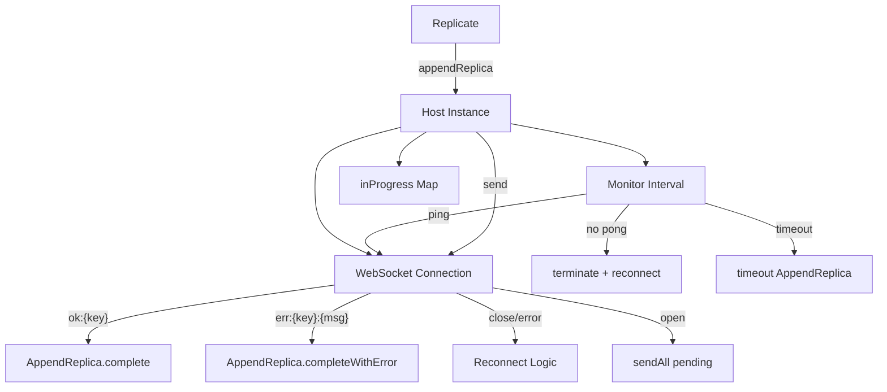
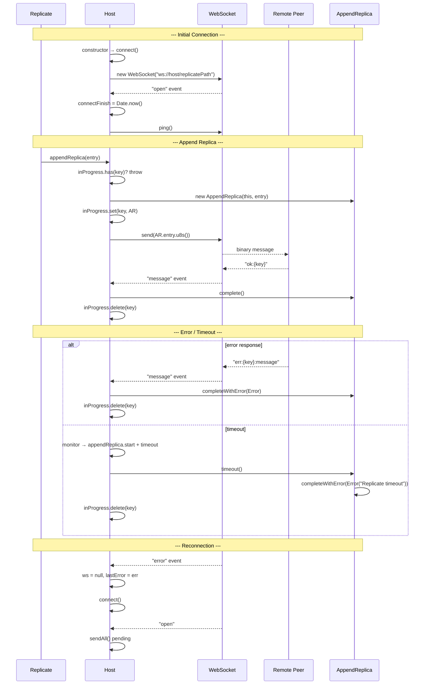

# Host Spec

**Module: Replication**

## Overview

Manages a single WebSocket connection to a remote peer for log replication. On construction, initiates a WebSocket connection and starts a periodic monitor (ping/pong + reconnect logic). Tracks in-progress `AppendReplica` operations in a `Map<entryKey, AppendReplica>`. Handles incoming messages: `"ok:{key}"` resolves, `"err:{key}:{msg}"` rejects. Implements reconnection with timeout and dead peer detection.

## Component Specifications

```typescript
class Host {
    host: string
    replicate: Replicate
    ws: WebSocket | null
    lastError: Error | null
    connectStart: number | null
    connectFinish: number | null
    lastPing: number | null
    lastPong: number | null
    inProgress: Map<string, AppendReplica>
}
```

## System Architecture



## Detailed Data Flow



## Visualization

```html
<div id="host-viz"></div>
<script src="https://d3js.org/d3.v7.min.js"></script>
<script>
(function() {
    const ANIMATION_DURATION_MS = 4500;
    const ANIMATION_KEYFRAMES = [
        { label: "Connecting", wsState: "connecting", inProgress: 0, lastPing: null, lastPong: null },
        { label: "Connected", wsState: "open", inProgress: 0, lastPing: 0, lastPong: 0 },
        { label: "Append #1 Sent", wsState: "open", inProgress: 1, lastPing: 1, lastPong: 1 },
        { label: "Append #1 OK", wsState: "open", inProgress: 0, lastPing: 2, lastPong: 2 },
        { label: "Append #2 Error", wsState: "open", inProgress: 0, lastPing: 3, lastPong: 3 },
        { label: "WS Error", wsState: "disconnected", inProgress: 0, lastPing: null, lastPong: null },
        { label: "Reconnecting", wsState: "connecting", inProgress: 0, lastPing: null, lastPong: null },
    ];
    let currentFrame = 0;
    let animationId = null;
    let isPlaying = false;

    const container = d3.select("#host-viz");
    container.html("");

    const svg = container.append("svg").attr("width", 650).attr("height", 230);

    // WS Status indicator
    const wsG = svg.append("g").attr("transform", "translate(20, 20)");
    wsG.append("circle").attr("class", "ws-indicator").attr("r", 10).attr("fill", "#f44336");
    wsG.append("text").attr("class", "ws-status").attr("x", 20).attr("y", 5)
        .attr("font-size", "14").attr("font-weight", "bold").attr("fill", "#333").text("disconnected");

    // Ping/Pong
    const pingG = svg.append("g").attr("transform", "translate(20, 55)");
    pingG.append("text").attr("font-size", "12").attr("fill", "#666").text("Ping: ");
    pingG.append("text").attr("class", "ping-text").attr("x", 50).attr("y", 12).attr("font-size", "12").text("-");
    pingG.append("text").attr("x", 120).attr("y", 12).attr("font-size", "12").attr("fill", "#666").text("Pong: ");
    pingG.append("text").attr("class", "pong-text").attr("x", 165).attr("y", 12").attr("font-size", "12").text("-");

    // In-Progress queue
    const ipG = svg.append("g").attr("transform", "translate(280, 55)");
    ipG.append("text").attr("font-size", "12").attr("fill", "#666").text("In-Progress: ");
    ipG.append("text").attr("class", "ip-count").attr("x", 90).attr("y", 12).attr("font-size", "12").attr("font-weight", "bold").text("0");

    // Queue blocks
    const blockG = svg.append("g").attr("transform", "translate(20, 90)");

    // Message log
    const logG = svg.append("g").attr("transform", "translate(20, 130)");
    logG.append("rect").attr("width", 600).attr("height", 60).attr("rx", 4)
        .attr("fill", "#fafafa").attr("stroke", "#ddd");
    logG.append("text").attr("class", "msg-log").attr("x", 10).attr("y", 20)
        .attr("font-size", "11").attr("fill", "#333");

    // Frame label
    svg.append("text").attr("class", "frame-label").attr("x", 325).attr("y", 215)
        .attr("text-anchor", "middle").attr("font-size", "14").attr("fill", "#333");

    // Controls
    const controls = container.append("div").style("margin-top","10px");
    controls.append("button").attr("data-testid","play-pause").text("▶ Play").on("click", togglePlay);
    controls.append("span").style("margin-left","10px").text("Frame: ");
    controls.append("span").attr("id","kf-total").text("0 / 6");
    controls.append("input").attr("type","range").attr("min",0).attr("max",ANIMATION_KEYFRAMES.length-1).attr("value",0)
        .style("width","300px").style("margin-left","10px").on("input", function() { jumpToKeyframe(+this.value); });

    const msgMap = {
        "connecting": "Connecting to remote peer...",
        "open": "WebSocket open, ready",
        "disconnected": "Disconnected (error)",
    };

    function update(kf) {
        const stateColors = { connecting: "#ff9800", open: "#4caf50", disconnected: "#f44336" };
        svg.select("circle.ws-indicator").attr("fill", stateColors[kf.wsState] || "#999");
        svg.select("text.ws-status").text(kf.wsState);
        svg.select("text.ping-text").text(kf.lastPing !== null ? `#${kf.lastPing}` : "-");
        svg.select("text.pong-text").text(kf.lastPong !== null ? `#${kf.lastPong}` : "-");
        svg.select("text.ip-count").text(kf.inProgress);
        svg.select("text.msg-log").text(msgMap[kf.wsState] || "");
        svg.select("text.frame-label").text(kf.label);
        d3.select("#kf-total").text(`${kf.label} (${currentFrame} / ${ANIMATION_KEYFRAMES.length-1})`);
    }

    function togglePlay() {
        isPlaying = !isPlaying;
        d3.select("[data-testid=play-pause]").text(isPlaying ? "⏸ Pause" : "▶ Play");
        if (isPlaying) {
            animationId = setInterval(() => {
                currentFrame = (currentFrame + 1) % ANIMATION_KEYFRAMES.length;
                update(ANIMATION_KEYFRAMES[currentFrame]);
                d3.select("input[type=range]").property("value", currentFrame);
            }, ANIMATION_DURATION_MS / ANIMATION_KEYFRAMES.length);
        } else if (animationId) {
            clearInterval(animationId);
            animationId = null;
        }
    }

    function jumpToKeyframe(frame) {
        if (isPlaying) togglePlay();
        currentFrame = frame;
        update(ANIMATION_KEYFRAMES[frame]);
        d3.select("input[type=range]").property("value", frame);
    }

    function resetAnimation() {
        if (isPlaying) togglePlay();
        jumpToKeyframe(0);
    }

    function getAnimationState() {
        return { currentFrame, totalFrames: ANIMATION_KEYFRAMES.length, isPlaying, keyframe: ANIMATION_KEYFRAMES[currentFrame] };
    }

    update(ANIMATION_KEYFRAMES[0]);
    setTimeout(() => console.log("ANIMATION_VERIFICATION: Host viz loaded, 7 keyframes, ready"), 100);
})();
</script>
```

## Testing Requirements

| # | Test Case | Input | Expected |
|---|-----------|-------|----------|
| 1 | Constructor connects | `new Host(replicate, "peer:8080")` | `ws !== null`, `connectStart` set |
| 2 | Constructor starts monitor | Constructor | `setInterval` for monitor configured |
| 3 | appendReplica — new key | Entry with unique key | AppendReplica created, inProgress.set, send called |
| 4 | appendReplica — duplicate key | Same entry key called again | Throws `Error("appendReplica in progress")` |
| 5 | WS "open" — sends pending | inProgress has entries | `sendAll()` called for each |
| 6 | WS "message" — "ok:{key}" | `"ok:entryKey"` | AppendReplica.complete(), inProgress.delete |
| 7 | WS "message" — "err:{key}:{msg}" | `"err:entryKey:disk full"` | AppendReplica.completeWithError, inProgress.delete |
| 8 | WS "message" — unknown key | `"ok:nonexistent"` | Logs error, no crash |
| 9 | WS "error" — auto reconnect | Connection refused | ws=null, connectStart set, connect() called |
| 10 | Monitor — no pong | ping sent, no pong back within interval | `ws.terminate()`, ws=null, connect() |
| 11 | Monitor — connect timeout | `now - connectStart > replicateTimeout` | `ws.terminate()`, ws=null, connect() |
| 12 | Monitor — append timeout | AppendReplica.start older than timeout | `appendReplica.timeout()`, inProgress.delete |
| 13 | send — already sent | `appendReplica.sent === true` | No-op |
| 14 | send — no websocket | `ws === null` | `connect()` called, returns |
| 15 | send — WS not open | `readyState !== OPEN` | No-op, waits for `sendAll` |

---

## 7. Source-Test Cross-References

### Test Coverage

| Test Spec | Path |
|---|---|
| Host.test.spec.md | `source/src/lib/replicate/Host.test.spec.md` |
