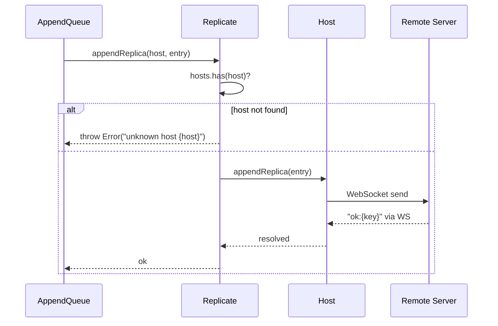

# Replicate Spec

**Module: Replication**

## Overview

Replication coordinator. On construction, creates a `Host` instance for every configured peer (excluding self). Exposes `appendReplica(host, entry)` which delegates to the appropriate `Host.appendReplica()` for WebSocket-based transport. Skips unknown hosts with an error.

## Component Specifications

```typescript
class Replicate {
    server: Server
    hosts: Map<string, Host>   // host address → Host instance
}
```

## System Architecture

```mermaid
graph TB
    AQ[AppendQueue] -->|appendReplica(host, entry)| R[Replicate]
    R -->|lookup host| Hosts[hosts Map]
    Hosts -->|found| H1[Host A]
    Hosts -->|found| H2[Host B]
    Hosts -->|not found| Error[throw Error]
    H1 -->|WS send| Remote[Remote Server]
    H2 -->|WS send| Remote
    R -->|constructor| Init[Create Host for each config.host != self]
    Init --> H1
    Init --> H2
```

## Detailed Data Flow



## Visualization

```html
<div id="replicate-viz"></div>
<script src="https://d3js.org/d3.v7.min.js"></script>
<script>
(function() {
    const ANIMATION_DURATION_MS = 3500;
    const ANIMATION_KEYFRAMES = [
        { label: "Init: 2 peers", peerCount: 2, connected: 0, replicating: false },
        { label: "Connect Peer A", peerCount: 2, connected: 1, replicating: false },
        { label: "Connect Peer B", peerCount: 2, connected: 2, replicating: false },
        { label: "Replicate Entry", peerCount: 2, connected: 2, replicating: true },
        { label: "Replication Complete", peerCount: 2, connected: 2, replicating: false },
    ];
    let currentFrame = 0;
    let animationId = null;
    let isPlaying = false;

    const container = d3.select("#replicate-viz");
    container.html("");

    const svg = container.append("svg").attr("width", 650).attr("height", 220);

    // Local server
    const localG = svg.append("g").attr("transform", "translate(30, 70)");
    localG.append("rect").attr("width", 140).attr("height", 60).attr("rx", 8)
        .attr("fill", "#e3f2fd").attr("stroke", "#2196f3").attr("stroke-width", 2);
    localG.append("text").attr("x", 70).attr("y", 35).attr("text-anchor", "middle")
        .attr("font-size", "13").attr("font-weight", "bold").attr("fill", "#1565c0").text("Local Server");

    // Peers
    const peerPos = [[320, 40], [320, 130]];
    const peerLabels = ["Peer A", "Peer B"];
    const peerGs = peerPos.map(([x, y], i) => {
        const g = svg.append("g").attr("transform", `translate(${x}, ${y})`);
        g.append("rect").attr("class", `peer-rect-${i}`).attr("width", 130).attr("height", 50).attr("rx", 8)
            .attr("fill", "#f5f5f5").attr("stroke", "#999").attr("stroke-width", 2);
        g.append("text").attr("class", `peer-label-${i}`).attr("x", 65).attr("y", 30)
            .attr("text-anchor", "middle").attr("font-size", "12").attr("font-weight", "bold")
            .attr("fill", "#666").text(peerLabels[i]);
        // Status
        g.append("text").attr("class", `peer-status-${i}`).attr("x", 65).attr("y", 47)
            .attr("text-anchor", "middle").attr("font-size", "10").attr("fill", "#999").text("disconnected");
        // Arrow line
        svg.append("line").attr("class", `arrow-${i}`).attr("x1", 170).attr("y1", y + 25)
            .attr("x2", 320).attr("y2", y + 25).attr("stroke", "#ccc").attr("stroke-width", 2)
            .attr("marker-end", "url(#arrowhead)");
        return g;
    });

    // Arrow marker
    svg.append("defs").append("marker").attr("id", "arrowhead").attr("viewBox", "0 0 10 10")
        .attr("refX", 8).attr("refY", 5).attr("markerWidth", 6).attr("markerHeight", 6)
        .attr("orient", "auto").append("path").attr("d", "M 0 0 L 10 5 L 0 10 z").attr("fill", "#999");

    // Frame label
    svg.append("text").attr("class", "frame-label").attr("x", 325).attr("y", 200)
        .attr("text-anchor", "middle").attr("font-size", "14").attr("fill", "#333");

    // Controls
    const controls = container.append("div").style("margin-top","10px");
    controls.append("button").attr("data-testid","play-pause").text("▶ Play").on("click", togglePlay);
    controls.append("span").style("margin-left","10px").text("Frame: ");
    controls.append("span").attr("id","kf-total").text("0 / 4");
    controls.append("input").attr("type","range").attr("min",0).attr("max",ANIMATION_KEYFRAMES.length-1).attr("value",0)
        .style("width","300px").style("margin-left","10px").on("input", function() { jumpToKeyframe(+this.value); });

    function update(kf) {
        for (let i = 0; i < 2; i++) {
            const connected = i < kf.connected;
            svg.select(`rect.peer-rect-${i}`)
                .attr("fill", connected ? "#e8f5e9" : "#f5f5f5")
                .attr("stroke", connected ? "#4caf50" : "#999");
            svg.select(`text.peer-status-${i}`)
                .text(connected ? (kf.replicating ? "replicating..." : "connected") : "disconnected")
                .attr("fill", connected ? "#4caf50" : "#999");
            svg.select(`line.arrow-${i}`).attr("stroke", connected ? "#4caf50" : "#ccc");
        }
        svg.select("text.frame-label").text(kf.label);
        d3.select("#kf-total").text(`${kf.label} (${currentFrame} / ${ANIMATION_KEYFRAMES.length-1})`);
    }

    function togglePlay() {
        isPlaying = !isPlaying;
        d3.select("[data-testid=play-pause]").text(isPlaying ? "⏸ Pause" : "▶ Play");
        if (isPlaying) {
            animationId = setInterval(() => {
                currentFrame = (currentFrame + 1) % ANIMATION_KEYFRAMES.length;
                update(ANIMATION_KEYFRAMES[currentFrame]);
                d3.select("input[type=range]").property("value", currentFrame);
            }, ANIMATION_DURATION_MS / ANIMATION_KEYFRAMES.length);
        } else if (animationId) {
            clearInterval(animationId);
            animationId = null;
        }
    }

    function jumpToKeyframe(frame) {
        if (isPlaying) togglePlay();
        currentFrame = frame;
        update(ANIMATION_KEYFRAMES[frame]);
        d3.select("input[type=range]").property("value", frame);
    }

    function resetAnimation() {
        if (isPlaying) togglePlay();
        jumpToKeyframe(0);
    }

    function getAnimationState() {
        return { currentFrame, totalFrames: ANIMATION_KEYFRAMES.length, isPlaying, keyframe: ANIMATION_KEYFRAMES[currentFrame] };
    }

    update(ANIMATION_KEYFRAMES[0]);
    setTimeout(() => console.log("ANIMATION_VERIFICATION: Replicate viz loaded, 5 keyframes, ready"), 100);
})();
</script>
```

## Testing Requirements

| # | Test Case | Input | Expected |
|---|-----------|-------|----------|
| 1 | Construction skips self | `config.host="A"`, `config.hosts=["A","B","C"]` | Hosts for B and C only (2 entries) |
| 2 | appendReplica — known host | Host B configured | Delegates to `Host.appendReplica` |
| 3 | appendReplica — unknown host | `host="unknown"` | Throws `Error("unknown host unknown")` |

---

## 7. Source-Test Cross-References

### Test Coverage

| Test Spec | Path |
|---|---|
| Replicate.test.spec.md | `source/src/lib/replicate/Replicate.test.spec.md` |
