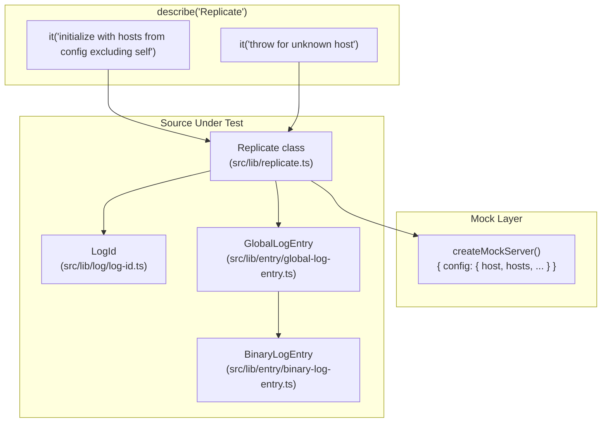
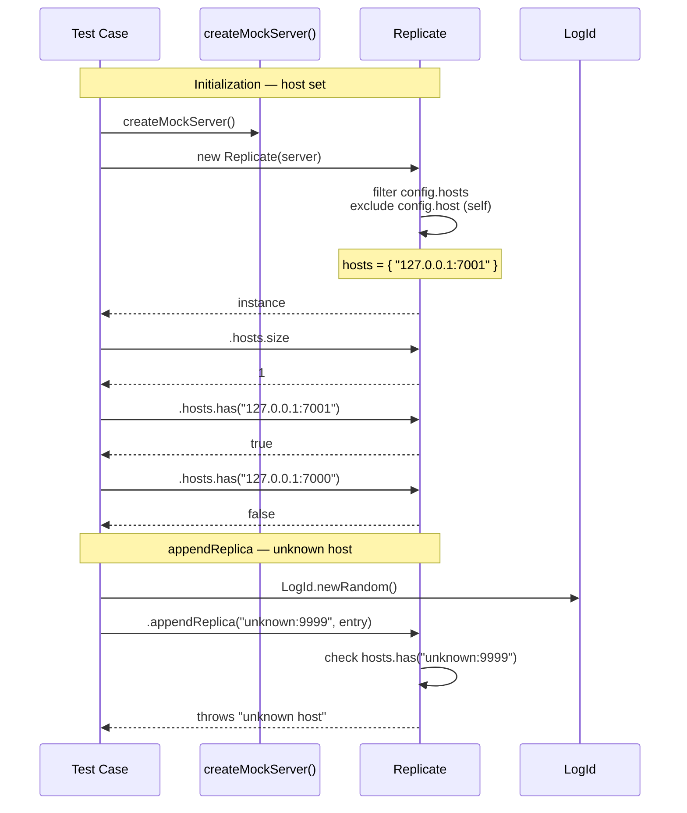

# Replicate — Test Specification

## Overview

Tests the `Replicate` class (`src/lib/replicate.ts`) which handles cross-host log replication — computing the set of peer hosts (excluding self) from the server config, and dispatching entries to remote replicas. The test suite validates the host-set construction logic and the error path when an unknown host is targeted.

## Component Specifications

| Pattern | Details |
|---|---|
| **Framework** | `@jest/globals` (`describe`/`it`/`expect`/`jest`) |
| **Server mock** | `createMockServer()` — returns `{ config: { host, hosts, hostMonitorInterval, replicatePath, replicateTimeout, secret } }` with two hosts in the list (self + one peer) |
| **Entry types used** | `GlobalLogEntry` wrapping `BinaryLogEntry` |
| **Source under test** | `src/lib/replicate.ts` |
| **Dependencies** | `GlobalLogEntry` (`src/lib/entry/global-log-entry.ts`), `BinaryLogEntry` (`src/lib/entry/binary-log-entry.ts`), `LogId` (`src/lib/log/log-id.ts`) |

## System Architecture



## Detailed Data Flow



## Visualization

```d3
<svg id="replicate-spec-viz" width="800" height="500" viewBox="0 0 800 500" xmlns="http://www.w3.org/2000/svg">
  <style>
    .bar { fill: #2980b9; transition: all 200ms; }
    .bar-error { fill: #c0392b; }
    .axis text { font-family: monospace; font-size: 10px; fill: #666; }
    .axis line, .axis path { stroke: #ccc; stroke-width: 1; }
    .kf-marker { fill: #16a085; }
    .kf-label { font-family: monospace; font-size: 10px; fill: #16a085; text-anchor: middle; }
    .control-btn { font-family: monospace; font-size: 12px; cursor: pointer; fill: #fff; stroke: #2980b9; stroke-width: 1.5; rx: 4; ry: 4; }
    .control-btn:hover { fill: #eaf2f8; }
    .control-text { font-family: monospace; font-size: 11px; text-anchor: middle; fill: #2980b9; cursor: pointer; user-select: none; }
    #kf-info text { font-family: monospace; font-size: 10px; fill: #555; }
    .node-peer { fill: #2980b9; stroke: #1a5276; stroke-width: 2; }
    .node-self { fill: #bdc3c7; stroke: #95a5a6; stroke-width: 2; }
    .node-unknown { fill: #c0392b; stroke: #922b21; stroke-width: 2; }
    .edge { stroke: #7f8c8d; stroke-width: 1.5; stroke-dasharray: 4,3; }
  </style>

  <g transform="translate(60,20)">
    <text x="340" y="18" font-family="monospace" font-size="14" font-weight="bold" text-anchor="middle" fill="#222">Replicate Test — Host Set &amp; Error Path</text>
    <text x="340" y="34" font-family="monospace" font-size="11" text-anchor="middle" fill="#888">2 keyframes across replicate lifecycle</text>

    <g class="axis" transform="translate(0,380)">
      <line x1="0" y1="0" x2="680" y2="0"/>
      <text x="170" y="14" text-anchor="middle">kf0 — init host set</text>
      <text x="510" y="14" text-anchor="middle">kf1 — unknown host error</text>
    </g>

    <g class="axis" transform="translate(0,0)">
      <line x1="0" y1="0" x2="0" y2="380"/>
      <text x="-8" y="380" text-anchor="end">0</text>
      <text x="-8" y="140" text-anchor="end">ERR</text>
    </g>

    <!-- kf0 diagram: host topology -->
    <g data-kf="0">
      <!-- self -->
      <circle class="node-self" cx="140" cy="220" r="40"/>
      <text x="140" y="216" font-family="monospace" font-size="9" fill="#555" text-anchor="middle">127.0.0.1</text>
      <text x="140" y="228" font-family="monospace" font-size="9" fill="#555" text-anchor="middle">:7000</text>
      <text x="140" y="244" font-family="monospace" font-size="8" fill="#999" text-anchor="middle">(self / excluded)</text>

      <!-- peer -->
      <circle class="node-peer" cx="280" cy="160" r="40"/>
      <text x="280" y="156" font-family="monospace" font-size="9" fill="#fff" text-anchor="middle">127.0.0.1</text>
      <text x="280" y="168" font-family="monospace" font-size="9" fill="#fff" text-anchor="middle">:7001</text>
      <text x="280" y="184" font-family="monospace" font-size="8" fill="#aed6f1" text-anchor="middle">(in hosts set)</text>

      <line class="edge" x1="180" y1="220" x2="240" y2="180"/>
      <text x="210" y="206" font-family="monospace" font-size="8" fill="#7f8c8d" text-anchor="middle">replicate</text>

      <!-- result box -->
      <rect x="100" y="300" width="180" height="50" rx="4" fill="#2980b9" opacity="0.15"/>
      <text x="190" y="320" font-family="monospace" font-size="10" fill="#2980b9" text-anchor="middle">hosts.size = 1</text>
      <text x="190" y="336" font-family="monospace" font-size="9" fill="#2980b9" text-anchor="middle">has(":7001")=true</text>
    </g>

    <!-- kf1 diagram: error path -->
    <g data-kf="0">
      <circle class="node-unknown" cx="450" cy="180" r="40" data-kf="0"/>
      <text x="450" y="176" font-family="monospace" font-size="9" fill="#fff" text-anchor="middle">unknown</text>
      <text x="450" y="188" font-family="monospace" font-size="9" fill="#fff" text-anchor="middle">:9999</text>
      <text x="450" y="204" font-family="monospace" font-size="8" fill="#f1948a" text-anchor="middle">(not in hosts)</text>

      <line class="edge" x1="320" y1="220" x2="410" y2="200" data-kf="0"/>

      <rect x="380" y="280" width="140" height="50" rx="4" fill="#c0392b" opacity="0.15"/>
      <text x="450" y="300" font-family="monospace" font-size="10" fill="#c0392b" text-anchor="middle">throws</text>
      <text x="450" y="316" font-family="monospace" font-size="9" fill="#c0392b" text-anchor="middle">"unknown host"</text>
    </g>

    <!-- kf markers -->
    <g>
      <circle class="kf-marker" cx="190" cy="380" r="4"/>
      <text class="kf-label" x="190" y="394">kf0</text>
      <circle class="kf-marker" cx="520" cy="380" r="4"/>
      <text class="kf-label" x="520" y="394">kf1</text>
    </g>

    <!-- legend -->
    <g transform="translate(0,430)">
      <circle class="node-peer" cx="8" cy="8" r="8"/>
      <text x="20" y="12" font-family="monospace" font-size="10" fill="#555">peer host (included)</text>
      <circle class="node-self" cx="180" cy="8" r="8"/>
      <text x="192" y="12" font-family="monospace" font-size="10" fill="#555">self host (excluded)</text>
      <circle class="node-unknown" cx="350" cy="8" r="8"/>
      <text x="362" y="12" font-family="monospace" font-size="10" fill="#555">unknown (error)</text>
    </g>

    <!-- controls -->
    <g transform="translate(240,465)">
      <rect class="control-btn" x="0" y="0" width="50" height="22" data-testid="play-pause"/>
      <text class="control-text" x="25" y="15" data-testid="play-pause">▶</text>
      <rect class="control-btn" x="60" y="0" width="70" height="22" id="reset-btn"/>
      <text class="control-text" x="95" y="15" id="reset-btn">↺ reset</text>
      <rect class="control-btn" x="140" y="0" width="36" height="22" id="kf-prev"/>
      <text class="control-text" x="158" y="15" id="kf-prev">◀</text>
      <rect class="control-btn" x="186" y="0" width="36" height="22" id="kf-next"/>
      <text class="control-text" x="204" y="15" id="kf-next">▶</text>
    </g>

    <g id="kf-info" transform="translate(490,468)">
      <text>KF: <tspan id="kf-current">0</tspan> / <tspan id="kf-total">1</tspan></text>
    </g>
  </g>
</svg>
<script>
  (function() {
    const ANIMATION_DURATION_MS = 500;
    const ANIMATION_KEYFRAMES = 2;
    var ANIMATION_VERIFICATION = { ran: false };
    var animFrame = null;
    var currentKF = 0;
    var playing = false;
    var animationState = 'idle';

    function getAnimationState() { return animationState; }

    function jumpToKeyframe(kf) {
      if (kf < 0 || kf >= ANIMATION_KEYFRAMES) return;
      currentKF = kf;
      document.querySelectorAll('[data-kf]').forEach(function(el) {
        var kfVal = parseInt(el.getAttribute('data-kf'));
        if (kfVal <= currentKF) {
          el.style.opacity = '';
        } else {
          el.style.opacity = '0.05';
        }
      });
      document.getElementById('kf-current').textContent = currentKF;
      ANIMATION_VERIFICATION.ran = true;
      ANIMATION_VERIFICATION.lastKF = currentKF;
    }

    function resetAnimation() {
      playing = false;
      animationState = 'idle';
      document.querySelector('[data-testid="play-pause"]').textContent = '▶';
      if (animFrame) { clearInterval(animFrame); animFrame = null; }
      jumpToKeyframe(0);
    }

    jumpToKeyframe(0);

    document.querySelector('[data-testid="play-pause"]').addEventListener('click', function() {
      if (playing) {
        playing = false;
        animationState = 'paused';
        this.textContent = '▶';
        if (animFrame) { clearInterval(animFrame); animFrame = null; }
      } else {
        playing = true;
        animationState = 'playing';
        this.textContent = '⏸';
        animFrame = setInterval(function() {
          if (currentKF < ANIMATION_KEYFRAMES - 1) {
            jumpToKeyframe(currentKF + 1);
          } else {
            playing = false;
            animationState = 'idle';
            clearInterval(animFrame);
            animFrame = null;
            document.querySelector('[data-testid="play-pause"]').textContent = '▶';
          }
        }, ANIMATION_DURATION_MS);
      }
    });

    document.getElementById('reset-btn').addEventListener('click', resetAnimation);

    document.getElementById('kf-prev').addEventListener('click', function() {
      if (playing) return;
      jumpToKeyframe(currentKF - 1);
    });

    document.getElementById('kf-next').addEventListener('click', function() {
      if (playing) return;
      jumpToKeyframe(currentKF + 1);
    });
  })();
</script>
```

## Testing Requirements

| # | Requirement | How verified |
|---|---|---|
| 1 | Constructor filters out the local host from the peer set | Assert `hosts.size === 1` when config has 2 entries (self + peer) |
| 2 | Peer host appears in `hosts` | Assert `hosts.has("127.0.0.1:7001") === true` |
| 3 | Self host is excluded from `hosts` | Assert `hosts.has("127.0.0.1:7000") === false` |
| 4 | `appendReplica` throws for a host not in the peer set | Assert `expect(...).rejects.toThrow("unknown host")` |

---

## 7. Source-Test Cross-References

### Source Coverage

| Source Spec | Path |
|---|---|
| Replicate.spec.md | `source/src/lib/replicate/Replicate.spec.md` |
