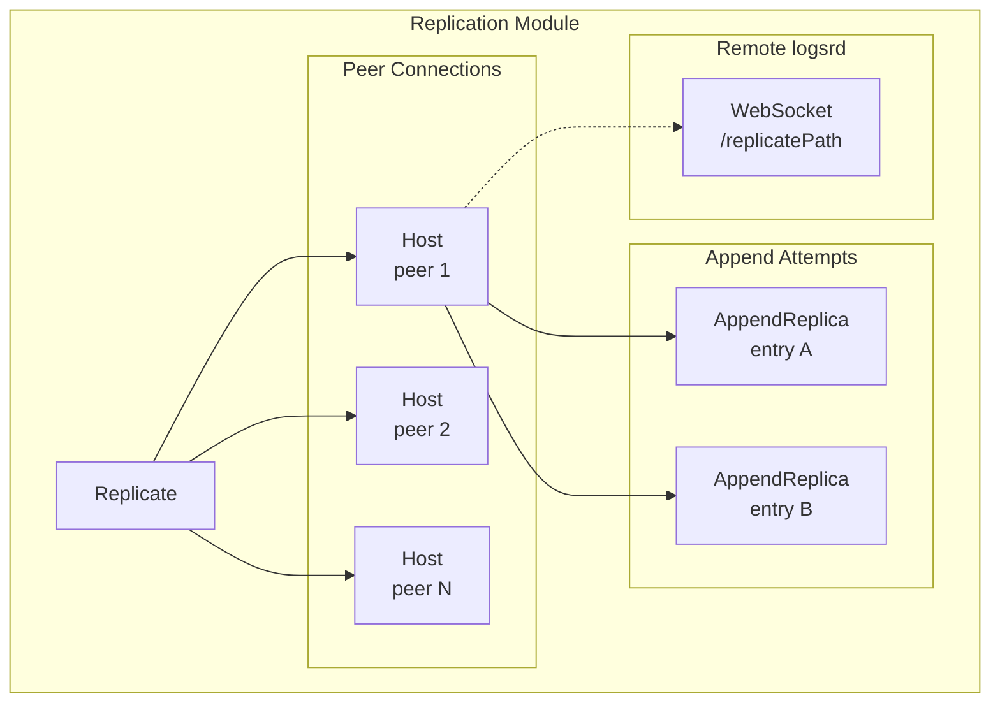

# Replication Module — ReplicateModule.spec.md

## 1. Overview

The **Replication Module** implements the WebSocket-based replication protocol between logsrd peers. `Replicate` manages a map of peer `Host` connections. Each `Host` maintains a persistent WebSocket connection to a remote host, sending binary `GlobalLogEntry` data with automatic reconnection and timeout handling. `AppendReplica` wraps a single replication attempt with a promise and timeout timer.

**Dependencies:** Entry Module (GlobalLogEntry), Server Module (Server for config)
**Lifecycle stages:** Replicate.constructor (create Hosts) → Host.connect (WebSocket handshake) → Host.appendReplica (send entry) → AppendReplica.complete / .timeout

## 2. Component Specifications

| Component | Role | Access Path |
|---|---|---|
| `Replicate` | Top-level — Host map, append dispatch | `../replicate.ts` |
| `Host` | Per-peer WebSocket client — connect, monitor, send | `./host.ts` |
| `AppendReplica` | Single replication attempt — promise + timeout | `./append-replica.ts` |

## 3. System Architecture



## 4. Detailed Data Flow

```mermaid
sequenceDiagram
    participant R as Replicate
    participant H as Host
    participant AR as AppendReplica
    participant Remote as Remote Host
    participant Timer as Timeout Timer

    R->>H: appendReplica(entry)
    H->>H: check inProgress map
    H->>AR: new AppendReplica(host, entry)
    H->>H: inProgress.set(key, AR)

    alt WebSocket open
        H->>H: send(AR)
        H->>Remote: binary WebSocket message
        Remote-->>H: (ack received via close)
    else WebSocket closed
        H->>H: connect()
        H->>H: queue sendAll()
    end

    H->>Timer: start (REPLICATE_TIMEOUT)

    alt success
        Remote-->>H: WebSocket message/close
        H->>AR: complete()
        AR->>AR: resolve promise
    alt timeout
        Timer->>AR: timeout()
        AR->>AR: completeWithError(err)
    end

    H->>H: inProgress.delete(key)
    R-->>R: promise resolves/rejects
```

## 5. Visualization

```html
<!DOCTYPE html>
<html>
<head>
<meta charset="utf-8">
<style>
  body { font-family: monospace; background: #1e1e2e; color: #cdd6f4; margin: 0; }
  #vis { width: 960px; height: 540px; position: relative; }
  .controls { display: flex; gap: 8px; padding: 8px; background: #181825; align-items: center; }
  .controls button { background: #45475a; color: #cdd6f4; border: none; padding: 4px 12px; cursor: pointer; }
  #kf-current, #kf-total { color: #a6adc8; font-size: 12px; min-width: 20px; text-align: center; }
  #frame-label { color: #89b4fa; font-size: 14px; margin-left: auto; }
  .node { position: absolute; border: 2px solid #89b4fa; border-radius: 6px; padding: 8px 12px;
           background: #313244; font-size: 11px; text-align: center; transition: all 0.3s; }
  .node.active { border-color: #a6e3a1; background: #45475a; box-shadow: 0 0 12px #a6e3a180; }
  .edge { position: absolute; height: 2px; background: #585b70; transform-origin: 0 0; }
  .edge.active { background: #a6e3a1; }
  .badge { font-size: 9px; color: #6c7086; }
</style>
</head>
<body>
<div class="controls">
  <button id="play-pause" data-testid="play-pause">⏸</button>
  <span id="kf-current">0</span><span>/</span><span id="kf-total">4</span>
  <input type="range" id="seek" min="0" max="4" value="0" style="flex:1">
  <span id="frame-label">Create AppendReplica</span>
</div>
<div id="vis"></div>
<script>
(function(){
  const ANIMATION_DURATION_MS = 8000;
  const ANIMATION_KEYFRAMES = [
    { label: "Create AppendReplica", active: ["R","AR"], edges: ["R-AR"] },
    { label: "Send via WebSocket", active: ["Host","AR","Remote"], edges: ["AR-Host","Host-Remote"] },
    { label: "Wait for ack / timeout", active: ["AR","Timer"], edges: ["AR-Timer"] },
    { label: "Resolve / reject promise", active: ["AR","R"], edges: ["AR-R"] },
  ];
  const nodePositions = {
    R: [80, 120], AR: [280, 60],
    Host: [280, 180], Remote: [520, 120],
    Timer: [520, 260]
  };

  const vis = document.getElementById('vis');
  Object.entries(nodePositions).forEach(([id, [x, y]]) => {
    const el = document.createElement('div');
    el.className = 'node'; el.id = 'n-' + id;
    el.style.left = x + 'px'; el.style.top = y + 'px';
    el.innerHTML = `<strong>${id}</strong><div class="badge">replicate</div>`;
    vis.appendChild(el);
  });

  [['R','AR'],['AR','Host'],['Host','Remote'],['AR','Timer'],['AR','R']].forEach(([from, to]) => {
    const fx = nodePositions[from][0] + 40, fy = nodePositions[from][1] + 20;
    const tx = nodePositions[to][0], ty = nodePositions[to][1] + 20;
    const dx = tx - fx, dy = ty - fy;
    const len = Math.sqrt(dx*dx + dy*dy);
    const el = document.createElement('div');
    el.className = 'edge'; el.id = 'e-' + from + '-' + to;
    el.style.left = fx + 'px'; el.style.top = fy + 'px';
    el.style.width = len + 'px';
    el.style.transform = 'rotate(' + (Math.atan2(dy, dx) * 180 / Math.PI) + 'deg)';
    vis.appendChild(el);
  });

  let currentKf = 0, playing = true, intervalId;
  function jumpToKeyframe(idx) {
    currentKf = Math.max(0, Math.min(idx, ANIMATION_KEYFRAMES.length - 1));
    const kf = ANIMATION_KEYFRAMES[currentKf];
    document.querySelectorAll('.node').forEach(n => n.classList.toggle('active', kf.active.includes(n.id.replace('n-',''))));
    document.querySelectorAll('.edge').forEach(e => e.classList.toggle('active', kf.edges?.includes(e.id.replace('e-',''))));
    document.getElementById('frame-label').textContent = kf.label;
    document.getElementById('kf-current').textContent = currentKf;
    document.getElementById('seek').value = currentKf;
  }
  function resetAnimation() { jumpToKeyframe(0); }
  function getAnimationState() { return { currentKf, playing, total: ANIMATION_KEYFRAMES.length }; }
  function togglePlay() {
    playing = !playing;
    document.getElementById('play-pause').textContent = playing ? '⏸' : '▶';
    if (playing) intervalId = setInterval(() => jumpToKeyframe((currentKf+1) % ANIMATION_KEYFRAMES.length), ANIMATION_DURATION_MS / ANIMATION_KEYFRAMES.length);
    else clearInterval(intervalId);
  }
  document.getElementById('play-pause').addEventListener('click', togglePlay);
  document.getElementById('seek').addEventListener('input', function() { jumpToKeyframe(parseInt(this.value)); });
  document.getElementById('kf-total').textContent = ANIMATION_KEYFRAMES.length - 1;
  jumpToKeyframe(0);
  intervalId = setInterval(() => jumpToKeyframe((currentKf+1) % ANIMATION_KEYFRAMES.length), ANIMATION_DURATION_MS / ANIMATION_KEYFRAMES.length);
  window.__ANIMATION = { ANIMATION_KEYFRAMES, ANIMATION_DURATION_MS, jumpToKeyframe, resetAnimation, getAnimationState };
})();
</script>
</body>
</html>
```

## 6. Testing Requirements

| Method / Constructor | Unit test | Validates |
|---|---|---|
| `Replicate.constructor()` | `replicate.test.ts` | Host connections for each peer |
| `Replicate.appendReplica()` | same | Delegates to Host |
| `Host.constructor()` | `host.test.ts` | Connection initiated, monitor started |
| `Host.connect()` | same | WebSocket handshake with secret header |
| `Host.appendReplica()` | same | Duplicate check, AppendReplica created |
| `Host.send()` | same | Binary message sent |
| `Host.sendAll()` | same | All pending AppendReplicas sent |
| `Host.monitor()` | same | Ping, timeout, reconnection |
| `AppendReplica.constructor()` | `append-replica.test.ts` | Entry wrapped, promise created |
| `AppendReplica.complete()` | same | Promise resolved |
| `AppendReplica.completeWithError()` | same | Promise rejected |
| `AppendReplica.timeout()` | same | Calls completeWithError |

## 7. Source-Test Cross-References

| Source file | Test spec |
|---|---|
| `src/lib/replicate.ts` | `src/lib/replicate.test.ts` |
| `src/lib/replicate/host.ts` | `src/lib/replicate/host.test.ts` |
| `src/lib/replicate/append-replica.ts` | `src/lib/replicate/append-replica.test.ts` |
